## 8/17(월) - Python 시작

#### Python 언어의 특징

-----

> Python 언어의 장점

- 코드의 단순성과 표준성

  구문이 간단하고 규칙적이며 서술문들은 줄로 끝나고, 블록 구조는 들여쓰기로 나타낸다. 파이썬 프로그램은 마치 실행 가능한 의사-코드처럼 보인다.

- 이식성이 좋다

  플랫폼에 독립적이며 모든 os 환경에 연동되면서 다른 언어와 연동해서 사용한다. 파이썬 소스가 공개되어 있어 작성한 모든 파이썬 프로그램은 어떤 수정 없이도 파이썬이 동작하는 모든 플랫폼 위에서 동작할 수 있다.

- 객체 지향 언어

  데이터를 가지는 속성과 기능을 수행하는 메소드인 '객체'로 구성된다.

- 확장 가능한 라이브러리

  파이썬은 방대한 표준 라이브러리를 제공한다. 정규 표현식, 자동 문서 생성, 유닛 테스트, 쓰레딩, 데이터베이스, 웹 브라우저, CGI, FTP, 전자메일, XML, XML-RPC, HTML, WAV파일, 암호화 알고리즘, GUI 등이 있으며, 여러 시스템 관련 기능들 또한 포함되어 있다.

  

> Python 언어의 단점

- 파이썬은 GIL(Global Interpreter Lock)이라는 치명적인 단점을 가진다. GIL은 스레드로부터 안전하지 않은 코드를 다른 스레드와 공유하면서 충돌되는 상황을 방지하기 위한 배타적 잠금을 말한다. 파이썬은 기본적으로 단일 스레드로 연동되며 파이썬 인터프리터 프로세스에서 실행된다. Threading 모듈을 사용하여 멀티 스레드로 실행할 경우, 스레드 스케줄링할 때 GIL을 사용하게 되는데 GIL이 적용된 스레드만 실행할 수 있다. 즉, GIL을 취득하고 있는 하나의 스레드만 Python의 코드를 실행하거나 Python의 객체를 조작할 수 있다.

> 파이썬 설치

- https://www.python.org/downloads/

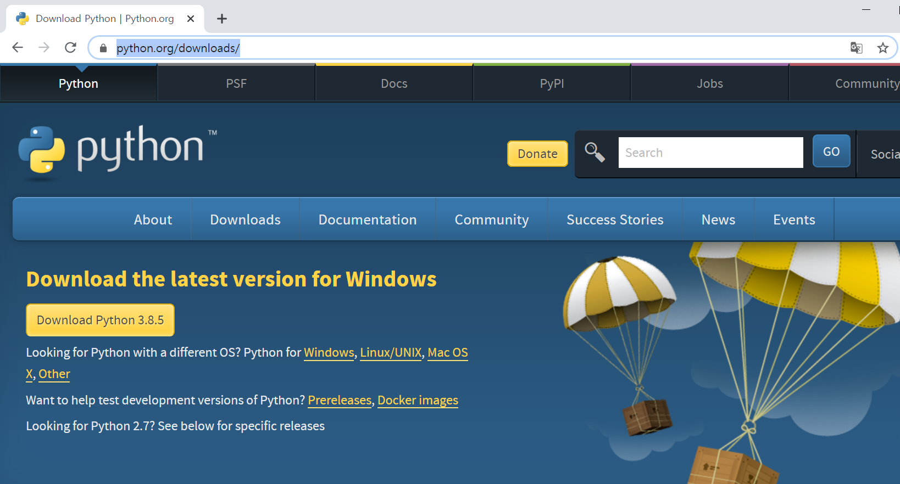

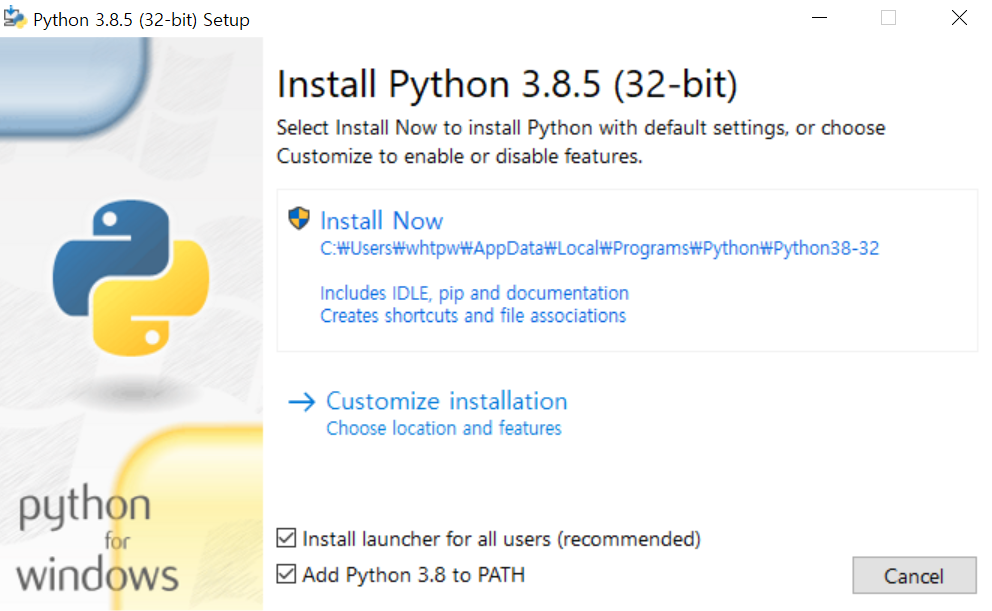

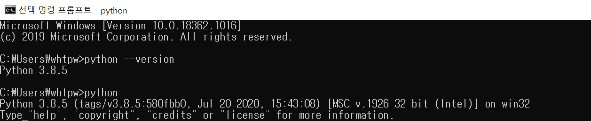

-------------

#### Python 구문과 실행

----------

> 파이썬 프레임워크

- 파이썬은 클래스 추상화와 함수형 추상화를 제공하는 객체 지향 언어이자 함수형 프로그래밍 언어로 코루틴(Coroutinue)를 지원하는 언어이다.
- c언어 등에서 일반적으로 사용하는 함수는 시작할 때 진입하는 지점이 하나 존재하고 함수가 모두 실행되거나, return 구문에 의해서 종료되는 지점을 설정할 수 있다.
- 이러한 함수를 서브루틴(Subroutine)이라 부르는데, 코루틴(Coroutinue)은 이를 더 일반화한 개념으로 진입하는 지점까지 여러 개를 가질 수 있는 함수를 의미

> Visual Studio Code

- Visual Studio Code 설치 https://code.visualstudio.com/

- 폰트 설치 https://github.com/naver/d2codingfont/releases/tag/VER1.3.2

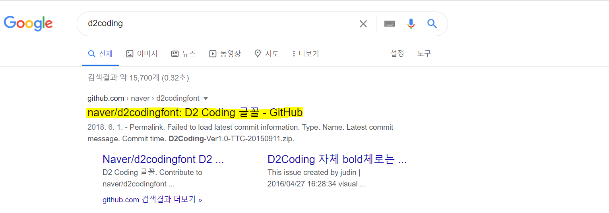

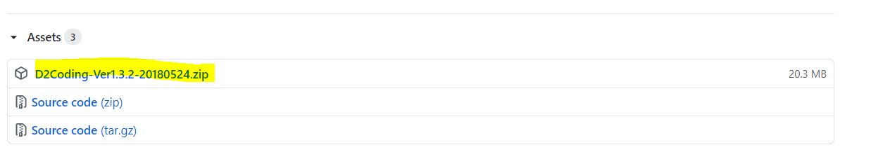

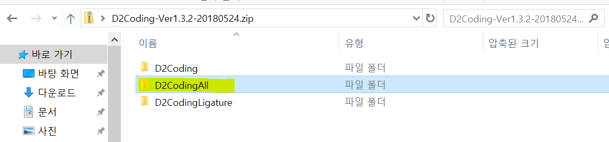

- 설치 클릭

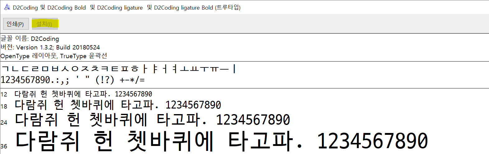

- 작업영역 추가(GettingStartPython) : 내문서에 폴더 생성

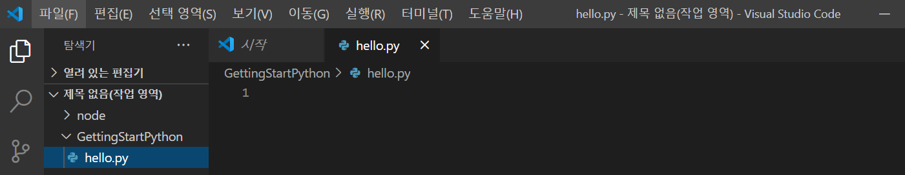

- 설치(Python Extension)

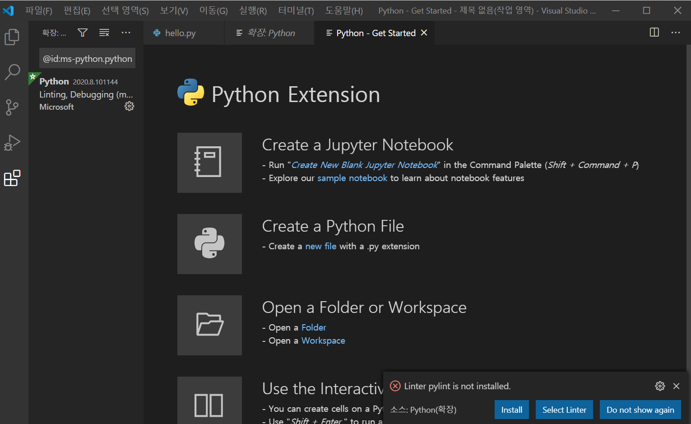

- 실행

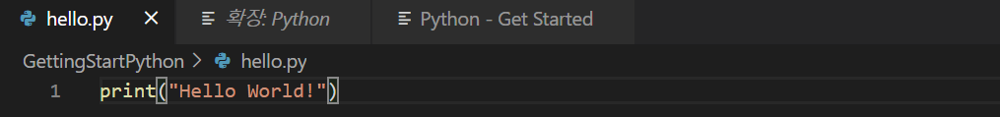

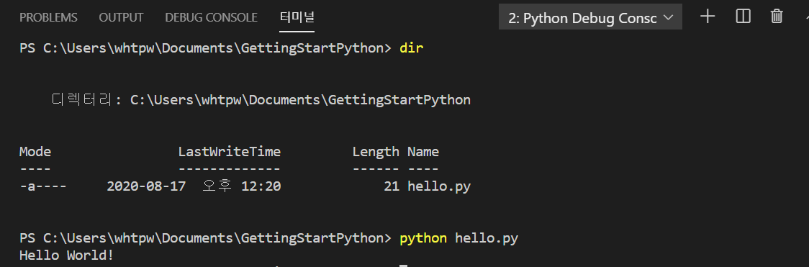

- 글꼴변경

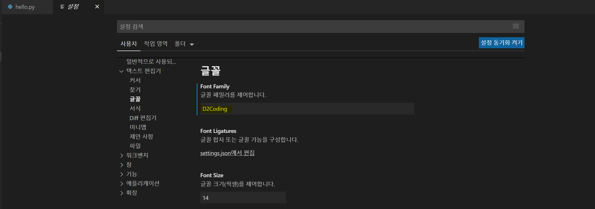

------------

#### 자료형과 기본 연산자

-------

> 식별자와 키워드

- 식별자를 선언하는 규칙
  - 영문자 또는 언더스코어로 시작한다.
  - 문장부호는 사용하지 않는다.
  - 대소문자를 구분한다.
  - 단일 언더스코어로 시작하는 식별자는 private이라는 의미이다.
  - 두 개 언더스코어(__)로 시작하는 식별자는 강한 프라이빗(strong private)이라는 의미이다.
  - 두 개 언더스코어로 끝나는 식별자는 언어에 의해 정의된 특별한 이름을 의미한다.

- 키워드(파이썬에서 사용되는 예약어) 목록

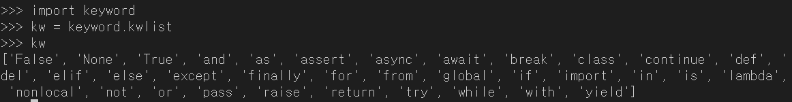

> 변수와 기본 자료형

- 변수의 특징
  - 숫자 값, 문자열 값 또는 클래스의 객체를 나타낸다.
  - 변수에 저장되는 값, 즉 리터럴 상수는 변경할 수 있지만 변수 이름은 그대로 유지된다.
  - 데이터 형식은 무엇보다도 응용 프로그램이 실행될 대 값을 저장하기 위해 할당해야하는 정확한 메모리 양을 지정한다.

- swap (x,y의 값 바꾸기)

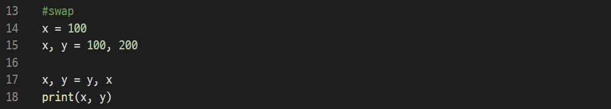

> 데이터 타입

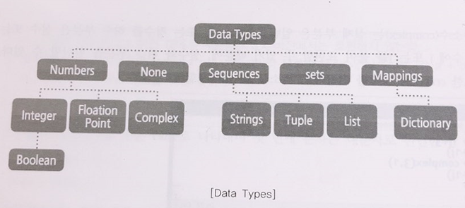

- 파이썬의 Numbers
  - int(signed integers) : 소숫점 없는 정수를 관리하며 양수와 음수를 처리한다.
  - float(floating point real values) : 정수를 제외한 실수와 지수형을 처리한다.
  - complex(complex numbers) : 수보다 넓은 범위인 복소수를 처리하며 복소수의 모양 그대로 실수부와 허수부로 입력해주면 complex형으로 처리한다.
  - bool : True or False로 나타내며 첫 번째 문자는 대문자로 선언한다.

- 파이썬에서는 2진, 8진, 16진수도 사용할 수 있으며 값을 선언할 때 접두어를 지정해서 사용한다.

| Number System | Prefix       |
| ------------- | ------------ |
| Binary        | '0b' or '0B' |
| Octal         | '0o' or '0O' |
| Hexadecimal   | '0x' or '0X' |

- 파이썬의 Strings
  - 단일 인용부호(') 사용: 싱글 쿼터를 이용하여 문자열을 감싸서 지정하면 모든 공백문자, 즉 띄어쓰기나 탭 등은 입력한 그대로 유지된다.
  - 이중 인용부호(") 사용: 문자열에 단일 인용부호가 포함될 때 문자열을 이중 인용부호로 감싸서 선언한다.
  - '\'(역슬래시)를 사용: 단일 인용부호나 다중인용부호를 문자열에 포함시킬 수 있는 또 다른 방법으로 '\'를 사용한다. (문자로 인식)
  - """로 사용: 다중 인용 부호를 세 개 연속으로 하용하면 한 줄 이상의 문자열을 캡처하듯 출력한다.

-------------

#### 연산자

-----------

> 산술연산자

| 산술 연산자 |                             설명                             |
| :---------: | :----------------------------------------------------------: |
|      =      |     오른쪽의 피연산자의 값을 왼쪽의 피연산자에 대입한다.     |
|      +      |         왼쪽의 피연산자에 오른쪽의 피연산자를 더함.          |
|      -      |         왼쪽의 피연산자에서 오른쪽의 피연산자를 뺌.          |
|      *      |         왼쪽의 피연산자에 오른쪽의 피연산자를 곱함.          |
|      /      |         왼쪽의 피연산자를 오른쪽의 피연산자로 나눔.          |
|      %      | 왼쪽의 피연산자를 오른쪽의 피연산자로 나눈 후, 그 나머지를 반환함. |
|     **      |                           거듭제곱                           |
|     //      |  Floor Division-나누고 몫과 소숫점 이하는 버림(ex. 10//3=3)  |

> 관계 연산자

| 관계 연산자 |                             설명                             |
| :---------: | :----------------------------------------------------------: |
|     ==      |   왼쪽의 피연산자와 오른쪽의 피연산자가 같으면 1을 반환함.   |
|     !=      | 왼쪽의 피연산자와 오른쪽의 피연산자가 같지 않으면 1을 반환함. |
|      >      |   왼쪽의 피연산자가 오른쪽의 피연산자보다 크면 1을 반환함.   |
|     >=      | 왼쪽의 피연산자가 오른쪽의 피연산자보다 크거나 같으면 1을 반환함. |
|      <      |  왼쪽의 피연산자가 오른쪽의 피연산자보다 작으면 1을 반환함.  |
|     <=      | 왼쪽의 피연산자가 오른쪽의 피연산자보다 작거나 같으면 1을 반환함. |

> 논리연산자

| 논리 연산자 |                             설명                             |
| :---------: | :----------------------------------------------------------: |
|     &&      |       논리식이 모두 참이면 1을 반환함. (논리 AND 연산)       |
|    \|\|     |   논리식 중에서 하나라도 참이면 1을 반환함. (논리 OR 연산)   |
|      !      | 논리식의 결과가 참이면 0을, 거짓이면 1을 반환함. (논리 NOT 연산) |

> 비트연산자

| 비트  연산자 |                             설명                             |
| :---------------: | :----------------------------------------------------------: |
|         &         |    대응되는 비트가 모두 1이면 1을 반환함. (비트 AND 연산)    |
|        \|         | 대응되는 비트 중에서 하나라도 1이면 1을 반환함. (비트 OR 연산) |
|         ^         |   대응되는 비트가 서로 다르면 1을 반환함. (비트 XOR 연산)    |
|         ~         | 비트를 1이면 0으로, 0이면 1로 반전시킴. (비트 NOT 연산, 1의 보수) |
|        <<         | 지정한 수만큼 비트들을 전부 왼쪽으로 이동시킴. (left shift 연산) |
|        >>         | 부호를 유지하면서 지정한 수만큼 비트를 전부 오른쪽으로 이동시킴.  (right shift 연산) |

> 대입연산자

| 대입  연산자 |                             설명                             |
| :---------------: | :----------------------------------------------------------: |
|         =         |        왼쪽의 피연산자에 오른쪽의 피연산자를 대입함.         |
|        +=         | 왼쪽의 피연산자에 오른쪽의 피연산자를 더한 후,  그 결괏값을 왼쪽의 피연산자에 대입함. |
|        -=         | 왼쪽의 피연산자에서 오른쪽의 피연산자를 뺀 후,  그 결괏값을 왼쪽의 피연산자에 대입함. |
|        *=         | 왼쪽의 피연산자에 오른쪽의 피연산자를 곱한 후,  그 결괏값을 왼쪽의 피연산자에 대입함. |
|        /=         | 왼쪽의 피연산자를 오른쪽의 피연산자로 나눈 후,  그 결괏값을 왼쪽의 피연산자에 대입함. |
|        %=         | 왼쪽의 피연산자를 오른쪽의 피연산자로 나눈 후,  그 나머지를 왼쪽의 피연산자에 대입함. |

> 기타 연산자

| 기타 연산자 | 설명                                                       |
| ----------- | ---------------------------------------------------------- |
| is          | 비교하는 객체의 주소가 같으면 True, 다르면 False를 리턴    |
| is not      | 비교하는 객체의 주소가 다르면 True, 같으면 False를 리턴    |
| in          | 값이 in 다음 연속항목에 있는지의 여부를 True, False로 리턴 |
| not in      | 값이 in 다음 연속항목에 없는지 여부를 True, False로 리턴   |

> 연산자 우선 순위

| 우선 순위 | 연산자                                          | 설명                                                 |
| -------------- | ----------------------------------------------- | ---------------------------------------------------- |
| 1              | (값...), [값...], {키: 값...}, {값...}          | 튜플, 리스트, 딕셔너리, 세트 생성                    |
| 2              | x[인덱스], x[인덱스:인덱스], x(인수...), x.속성 | 리스트(튜플) 첨자, 슬라이싱, 함수 호출, 속성 참조    |
| 3              | await x                                         | await 표현식                                         |
| 4              | **                                              | 거듭제곱                                             |
| 5              | +x, -x, ~x                                      | 단항 덧셈(양의 부호), 단항 뺄셈(음의 부호), 비트 NOT |
| 6              | *, @, /, //, %                                  | 곱셈, 행렬 곱셈, 나눗셈, 버림 나눗셈, 나머지         |
| 7              | +, -                                            | 덧셈, 뺄셈                                           |
| 8              | <<, >>                                          | 비트 시프트                                          |
| 9              | &                                               | 비트 AND                                             |
| 10             | ^                                               | 비트 XOR                                             |
| 11             | \|                                              | 비트 OR                                              |
| 12             | in, not in, is, is not, <, <=, >, >=, !=, ==    | 포함 연산자, 객체 비교 연산자, 비교 연산자           |
| 13             | not x                                           | 논리 NOT                                             |
| 14             | and                                             | 논리 AND                                             |
| 15             | or                                              | 논리 OR                                              |
| 16             | if else                                         | 조건부 표현식                                        |
| 17             | lambda                                          | 람다 표현식                                          |

- 객체의 주소

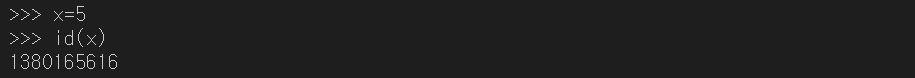

--------

#### Sequences

-------

> String(문자열)과 인덱싱 그리고 슬라이싱

- 파이썬의 Sequences란 ?

  - 문자열, 수치 등을 관리하는 기본 자료형을 말하며 종류로는 Stirng, Tuples, Lists 등이 있다.
  - 배열 형식: 문자열, 수치 등을 나열해서 관리하는 배열형식
  - 인덱싱(Indexing): 배열로 저장된 형식을 취하기 때문에 인덱싱(indexing)을 이용하여 저장된 자료의 위치를 참조해서 활용할 수 있다.
  - 슬라이싱(Slicing): 특정구간의 자료를 리턴할 수 있는 슬라이싱 기능을 가진다.
  - 연결과 반복: 자료를 연결하거나 반복할 수 있는 '+', '*' 연산자를 이용할 수 있다.

  

- 문자열의 인덱싱

  - 문자열은 각 한 문자씩을 인덱스를 가지고 0부터 나열형으로 관리되며 역순으로는 -(음수) 값을 가진 인덱스로 맵핑된다.

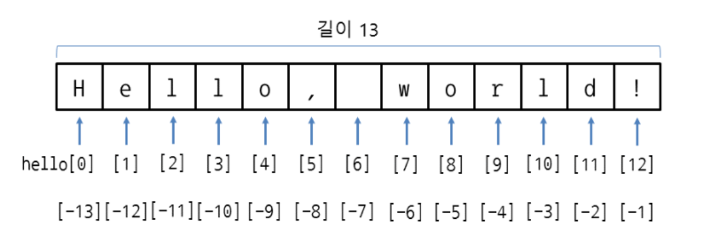

- 문자열의 슬라이싱

  -  [인덱스 시작 : 인덱스 끝 : 스텝]을 명시하게 되면 범위에 맞는 값을 잘라서 리턴하며 단계를 지정하는 스텝 기능까지 가진다.

    | 표현식      | 설명                                                         |
    | ----------- | ------------------------------------------------------------ |
    | a + b       | 문자열 a와 문자열 b를 연결                                   |
    | a * n       | 문자열 a를 n번 반복                                          |
    | [n]         | 문자열 a 중 n번째 문자를 리턴                                |
    | [n : m]     | 문자열 a 중 n번째부터 m번째까지의 문자열을 리턴한다.         |
    | [n :]       | 문자열 a 중 n번째부터 끝까지 문자열을 리턴한다.              |
    | [:m]        | 문자열 a 중 -번째부터 m번째까지의 문자열을 리턴한다.         |
    | [n : m : s] | 문자열 a 중 n번째부터 m번째까지의 문자열을 5개 건너 띄고 리턴한다. |

  - 마지막 인덱스는 포함하지 않는다. (인덱스 시작 <= index < 인덱스 끝)

  

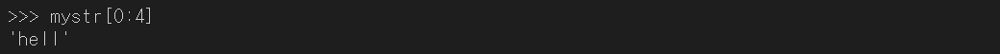

  

> immutable vs mutable

mutable은 값이 변한다는 뜻이고, immutable은 값이 변하지 않는다는 의미이다.

- immutable
  - number,string, tuple
- mutable
  - list, Dictionary

> greedy evaluation vs lazy evaluation

- 문자열의 반복과 합치기

mystring = "Hello World!"

| 표현 식                                    | 결과                      | 설명                           |
| ------------------------------------------ | ------------------------- | ------------------------------ |
| len(mystring)                              | 12                        | 문자열 개수를 리턴             |
| "hello"+"world"                            | "helloworld"              | 문자열을 합해서 리턴           |
| "%s world"%"hello"                         | "hello world"             | 문자열 자리 수 포맷을 지정     |
| "world" == "hello" "world" == "world" | 0 or False 1 or True | 두 문자열이 같은지 여부를 리턴 |
| "a" < "b"  "b" < "a"                  | 1 or True 0 or False | 두 문자가 같은지 여부를 리턴   |

- String의 함수

| 문자열 함수         | 기능                                                       |
| ------------------- | ---------------------------------------------------------- |
| format()            | 문자열 내용을 위한 포맷팅 수행                             |
| lower(), casefold() | 대문자를 소문자로 변환 후 리턴                             |
| upper()             | 소문자를 대문자로 변환 후 리턴                             |
| swapcase()          | 대문자는 소문자로, 소문자는 대문자로 변환 후 리턴          |
| title()             | 모든 단어의 첫 문자만 대문자로 변환 후 리턴                |
| capitalize()        | 문자열의 첫 글자만 대문자로 나머지는 소문자로 변환 후 리턴 |
| islower()           | 모든 문자가 소문자이면 True 리턴                           |
| isupper()           | 모든 문자가 대문자이면 True 리턴                           |
| count(str)          | str이 포함된 개수를 리턴                                   |
| find(str)           | str의 첫 위치를 리턴(없다면 -1을 리턴)                     |
| index(str)          | str의 첫 위치를 리턴(없다면 예외 발생)                     |
| join(str)           | str을 객체문자열의 각 문자 사이에 대입                     |
| lsrtip()            | 좌측 공백을 지운 후 리턴                                   |
| rstrip()            | 우측 공백을 지운 후 리턴                                   |
| strip()             | 양쪽의 공백을 지운 후 리턴                                 |
| center(n[,str])     | 크기 n의 문자열의 중앙에 원 문자열을 정렬 후 리턴          |
| ljust(n[,str])      | 크기 n의 문자열의 왼쪽에 원 문자열을 정렬 후 리턴          |
| rjust(n[,str])      | 크기 n의 문자열의 오른쪽에 원 문자열을 정렬 후 리턴        |
| replace(str1,str2)  | 문자열의 str1을 str2로 변경 후 리턴                        |
| split()             | 공백문자를 기분으로 나누어서 리스트에 저장 후 리턴         |
| split(sep)          | sep(문자열)을 기준으로 나누어 리스트에 저장 후 리턴        |
| isalnum()           | 모든 문자가 알파벳 혹은 숫자(alphanumeric)이면 True 리턴   |
| isalpha()           | 모든 문자가 알파벳이면 True 리턴                           |
| isidentifier()      | 문자열이 식별자의 조건에 맞다면 True 리턴                  |
| isdecimal()         | 십진 정수이면 True 리턴                                    |
| isdigit()           | 모든 문자가 0에서 9가지의 숫자이면 True 리턴               |
| isnumeric()         | 모든 문자가 0에서 9가지의 숫자이면 True 리턴               |

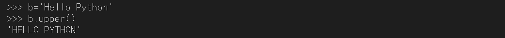

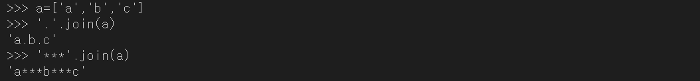

