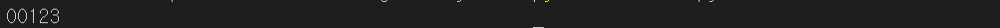
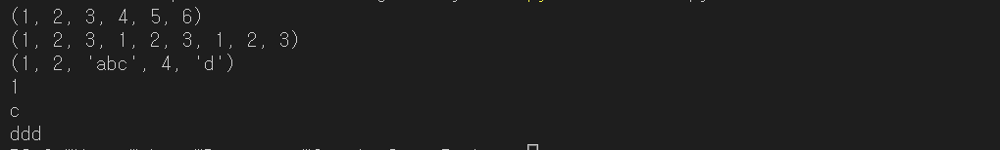
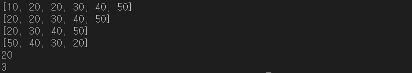
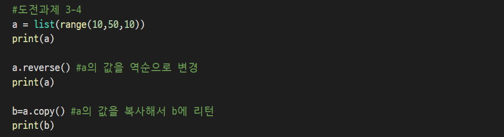
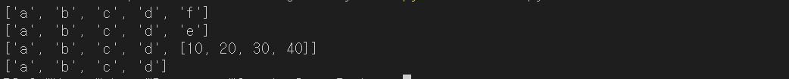
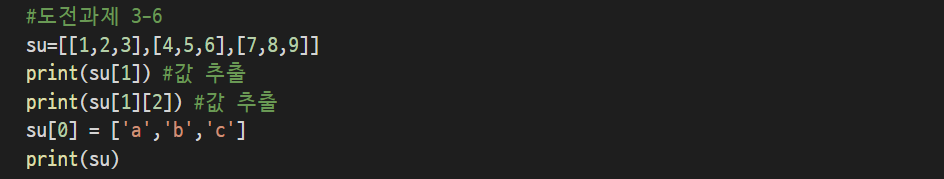

## 8/18(화) 

#### Sequences

------------

- 예제





-------------

> 튜플(Tuple)

괄호 (...) 안에서 요소를 나열해 놓은 것을 튜플이라고 한다. 숫자와 문자를 함께 관리하는 자료형으로 값의 시퀀스이다. 단, 지정된 값을 변경할 수 없다.(리스트와의 차이)


 => t1[0]=2는 불가


- 튜플의 인덱싱

  ()안에 혼합형 자료형을 콤마(,)로 구분해서 값을 대입하여 사용하며 0부터 인덱스로 관리된다. 튜플은 3가지 행태를 가진다.

  - Case 1 : 기본튜플 
    - my_tuple=()처럼 빈 튜플을 의미한 괄호를 선언하고 타입함수를 이용해서 자료형 타입을 보면 튜플이라고 리턴하는 것을 확인할 수 있다.
  - Case 2 : 혼합형 튜플
    - my_tuple02=(1, "Hello", 3, 4)처럼 자료를 정수 문자열 숫자를 연이어서 저장할 수 있는 것을 확인할 수 있다.
  - Case 3 : nested 튜플
    - 튜플 안에 또 다른 튜플로 관리되는 것으로 네스티드 튜플을 말하며 my_tuple03=("파이썬", (8,4,6),(1,2,3))처럼 선언된다. 


- 튜플 리스트로 변환


- 예제


=>error


> 튜플의 슬라이싱

- 튜플 t5 만들기


- 인덱싱과 슬라이싱의 차이


- 예제





> 리스트(List)

리스트는 파이썬의 시퀀스 구현 중에 가장 많이 사용하는 자료형으로 인덱스, 슬라이싱, 매트릭스, 병합 및 반복연산자, 함수를 이용하여 대괄호로 나열된 여러 개의 데이터를 감싸여 저장 및 관리를 한다.


- 리스트의 인덱싱
  - Case 1 : 기본 리스트
    - my_list=[]처럼 빈 리스트를 의미한 대괄호를 선언하고 타입함수를 이용해서 자료형 타입을 보면 리스트라고 리턴하는 것을 확인할 수 있다.
  - Case 2 : 혼합형 리스트
    - my_list02=[1,2,"345"]처럼 서넝ㄴ되어 자료를 정수, 문자열을 연이어서 저장할 수 잇는 것을 확인할 수 있다.
  - Case 3 : 매트릭스 리스트
    - my_list03=[[1,2],(3,4,5),[6,7,8]]라고 선언하게 되면 my_list03라는 변수에 혼합형인 리스트 [1,2]를 인덱스 0번지에 튜플(3,4,5)를 인덱스 1번지에 리스트 [6,7,8]은 인덱스 2번지에 대입해서 매트릭스 구조로 연동할 수 있다.


- 리스트의 함수 

| 리스트의 함수          | 설명                              |
| ---------------------- | --------------------------------- |
| cmp(list1, list2)      | list를 비교해서 리턴              |
| len(list)              | 리스트의 크기(요소의 개수)를 리턴 |
| max(list)              | 리스트에서 가장 큰 값을 리턴      |
| min(list)              | 리스트에서 가장 작은 값을 리턴    |
| list.append(obj)       | list에 obj를 추가                 |
| list.count(obj)        | list에 obj의 개수를 리턴          |
| list.extend(seq)       | list에 seq를 추가                 |
| list.index(obj)        | obj의 색인 값을 리턴              |
| list.insert(index,obj) | index색인 위치에 obj를 삽입       |
| list.pop(obj=list-1)   | list의 마지막에 잇는 요소를 리턴  |
| list.remove(obj)       | list에서 obj를 제거               |
| list.reverse()         | list를 역순으로 재배치            |
| list.sort()            | list를 정렬                       |





--------

#### Dictionary & Set

------

> 딕셔너리(Dictionary)

- 딕셔너리를 정렬되지 않은(unordered) 키-값의 쌍(key-value)이다.
- 딕셔너리에 새로운 key값을 입력할 때 반드시 key값에 해당하는 value도 함께 입력해야 한다.
- value값은 변경 가능하지만 key값은 변경 불가
- key를 호출하면 value를 리턴하는 구조를 가진다.
- 딕셔너리는 대소문자를 구분한다.


- 데이터베이스 연동의 속상이 다음과 같이 저장되어 있다면 딕셔너리를 이용해서 선언과 출력은 아래와 같이 할 수 있다.

| 속성 | 값       |
| ---- | -------- |
| id   | Dominica |
| Pw   | a1234\|  |
| db   | Oracle   |


- 딕셔너리의 key는 그 안에서 유일한 값이어야 한다. 이미 존재하는 key에 value를 할말하면 이전 value를 덮어 씌우며 새로운 key-value 쌍을 언제든지 추가할 수 있다.


- 딕셔너리의 주요 함수

| Dictionary의 함수 | 설명                                             |
| ----------------- | ------------------------------------------------ |
| keys()            | key들을 모아놓은 리스트를 리턴                   |
| values()          | value들을 모아놓은 리스트를 리턴                 |
| items()           | 쌍의 튜플을 모아놓은 리스트를 리턴               |
| clear()           | 모든 내용을 삭제                                 |
| get(key)          | 지정된 key의 value를 리턴                        |
| has_key(key)      | 해당하는 key가 있는지 조사하여 참, 거짓으로 리턴 |


- get을 사용하면 존재하지 않은 key값이라도 error가 뜨지 않음


- EX. 글자수 세기


> set

파이썬에서 {}안에 저장된 자료를 집합연산을 통해 자료를 추출하고 싶을 때 사용하는 자료형이다. 셋(set)는 고유한 목록을 처리한다. 세트끼리 뺄셈, OR, AND, XOR 연산이 가능하다.

- set은 중복되지 않는 요소들의 모임을 가진 집합으로 임의의 순서를 가진다.
- 공집합은 {}가 아닌 set() 함수로 만든다.({}는 딕셔너리)
- 선언은 set()의 ()안에 자료를 넣거나 tuple은 () list[]로 데이터를 입력한다.
- 집합 연산인 차집합, 교집합, 합집합, 대칭차집합(symmetric difference) 연산을 지원한다.


- set의 주요 함수

| set의 함수                        | 설명                                                         |
| --------------------------------- | ------------------------------------------------------------ |
| s.union(t)                        | s와 t의 합집합(s \| t)                                       |
| s.intersection(t)                 | s와 t의 교집합(s & t)                                        |
| difference(t)                     | s와 t의 차집합(s - t)                                        |
| s.symmetric_difference(t)         | s와 t의 배타집합(s ^ t)                                      |
| s.copy()                          | s를 얕은 복사                                                |
| s.update(t)                       | s와 t의 합집합을 s에 저장(s \|= t)                           |
| s.difference_update(t)            | s와 t의 교집합을 s에 ㅓㅈ장(s &= t)                          |
| s.symmertric_difference_update(t) | s와 t의 차집합을 s에 저장(s -= t)                            |
| s.add(x)                          | 요소 x를 s에 추가                                            |
| s.remove(x)                       | 요소 x를 s에서 삭제, 없으면 KeyError 예외 발생               |
| s.discard(x)                      | 요소 x가 있다면 s에서 삭제                                   |
| s.pop()                           | s에서 임의의 요소를 하나 리턴하고 집합에서는 삭제, 빈 집합이면 KeyError 예외 발생 |
| s.clear()                         | 집합 s의 모든 요소 삭제                                      |


> list(), set(), tuple()의 형 변환


- 예제 75p











---------------

#### 표준 입력과 출력

---------

> 표준 출력 함수 _ print()


> 출력 서식을 이용한 포매팅(formatting)

파이썬의 print()함수에서는 포맷팅을 이용하여 출력할 자료형 또는 자릿수를 지정하여 출력할 때 원하는 포맷을 이용할 수 있다.


- 포매팅에 매치될 데이터 타입은 다음과 같이 키워드로 제공된다.

| 키워드     | 설명                                                         |
| ---------- | ------------------------------------------------------------ |
| %d 또는 %i | 10진수                                                       |
| %o         | 8진수                                                        |
| %x 또는 %X | 16진수                                                       |
| %e 또는 %E | 부동 소숫점 지수 형식(소문자)                                |
| %f 또는 %F | 실수                                                         |
| %g 또는 %G | 지수가 정밀보다 초과 -4 이하의 경우 "F 그렇지 않으면" 를 표시 |
| %c         | 단일문자(정수 또는 단일 문자열을 허용)                       |
| %r         | 문자열(repr()의 결과 값)                                     |
| %s         | 문자열(str()의 결과 값)                                      |
| %%         | %를 출력                                                     |


> format() 함수를 이용한 출력 포맷팅

- s는 출력할 문자열과 포매터이고 format()함수의 () 안에는 포매터에 매치된 값들을 나열하거나, 키와 값을 지정해서 호출할 수도 있다는 의미를 가진다.

```
S.format(*args,**kwargs)

[매개인자]
- args: 포매터에 매치된 값들을 나열
- **kwargs: 키와 값을 지정해서 호출할 수도 있다는 의미를 가진다.
```


- 포맷서식 중 다음과 같이 연산자를 이용하여 포맷 터의 정렬을 할 수 있다.

| 연산자 | 의미                                                         |
| ------ | ------------------------------------------------------------ |
| '<'    | 지정된 출력 크기 내에서 왼쪽으로 정렬된다.                   |
| '>'    | 지정된 출력 크기 내에서 오른쪽으로 정렬된다.                 |
| '^'    | 지정된 출력 크기 내에서 가운데 정렬된다.                     |
| '0'    | ('0')를 출력한다.<br />{: 06d}에 27을 매치하면 값은 000027이 리턴되어 출력한다. |
| .      | 수치를 세 자리마다 표현할 때 사용된다.                       |


- 예제


> 표준입력

- input() 함수가 실행되면 입력 창에서 커서(cursor)를 깜빡이며 사용자 입력을 기다린다.
- 사용자가 입력 창에 원하는 문자열을 입력하고 리턴(return) 키를 누른다.
- 사용자 입력을 문자열로 내준다.


------------

정규식

-------

> 파이썬의 정규식(Regular Expressions)

정규 표현 식은 축약된 문법으로 기술된 문자열 패턴으로 다음과 같이 제공된다.

| 메타 문자 | 설명                                                         |
| --------- | ------------------------------------------------------------ |
| .         | 개행 문자를 제외한 문자 1자와 매치됨<br />re.DORALL이 설정되어 있으면, 개행을 포함한 문자 1자를 나타냄 |
| ^         | 문자열의 시작과 매치됨<br />re.MULTILINE이 설정되어 있으면 매 라인마다 매치됨 |
| $         | 문자열의 마지막과 매치됨<br />re.MULTILINE이 설정되어 있으면 매 라인마다 매치됨 |
| []        | 문자의 집합을 나타냄<br />예를 들어 [abcd]의 경우 'a', 'b', 'c', 'd' 중 한 문자와 매치됨 |
| \|        | 'A\|B'와 같은 경우 'A' 혹은 'B'를 나타냄(OR연산)             |
| *         | 문자가 0회 이상 반복됨을 나타냄                              |
| +         | 문자가 1회 혹은 1회 이상 반복됨을 나타냄                     |
| ?         | 문자가 0회 혹은 1회 반복됨을 나타냄                          |
| {m}       | 문자가  m회 반복됨을 나타냄                                  |
| {m,n}     | 문자가 m회부터 n회 까지 반복되는 모든 경우를 나타냄          |
| {m,}      | 문자가 m회부터 무한 반복되는 모든 경우를 나타냄              |


- 파이썬에서 정규식을 사용하여 문자열 검색, 치환 등을 수행하려면 re모듈을 import하여야 한다.
- dir을 통하여 symbol을 확인할 수 있다.


- 파이썬의 정규식 패턴은 쉘 에서 확인 된 re모듈에서 제공되는 다음과 같은 주요 함수를 통해 사용 된다. 공통적으로 사용된 pattern은 앞에서 설명한 정규표현식이 사용되며, string에는 검색대상 문자열이 온다.

| 함수명                                 | 설명                                                         |
| -------------------------------------- | ------------------------------------------------------------ |
| re.search(pattern, string[,flags])     | string전체에 대해서 pattern이 존재하는지 검사하여 MatchObject 인스턴스를 리턴 |
| re.match(pattern,string[,flags])       | string 시작부분부터 pattern이 존재하는지 검사하여 MatchObject 인스턴스를 리턴 |
| re.split(pattern, string[,maxsplit=0]) | pattern을 구분 자로 string을 분리하여 리스트로 리턴          |
| re.findall(pattern, string[,flags])    | stirng에서 pattern과 매치되는 모든 경우를 찾아 리스트로 리턴 |
| re.finditer(pattern, string[,flags])   | string에서 pattern과 일치하는 결과에 대한 이터레이터 객체를 리턴 |
| re.sub(pattern, repl, string[,count])  | string에서 pattern과 일치하는 부분에 대하여 repl로 교체하여 결과 문자열을 리턴 |
| re.subn(pattern,repl,string[,count])   | re.sub()함수와 동일하게 동작하나, 결과(결과문, 매치횟수)를 튜플로 리턴 |
| re.escape(string)                      | 영문자, 숫자가 아닌 문자에 대하여 백 슬러시 문자를 추가함. 메타문자를 포함한 문자열을 정규식으로 변경할 수 있음 |
| re.compile(pattern,[flags])            | pattern을 컴파일 하여 '정규 표현식 객체(regular expression object)'를 리턴 |


> re모듈의 함수 활용_search, math 함수

- re모듈에는 문자열 검색을 위한 re.search(pattern, string[,flags])와 re.match(pattern, string[,flags]) 함수가 있다. 
- 두 함수의 공통점은 두 함수 모두 첫 인자로 찾고자 하는 패턴을, 두 번째 인자로 검색대상 문자열을 받아들인다.
- 두 함수의 차이점은 re.match()함수의 경우 대상 문자열의 시작부터 검색을 하지만, re.search()함수는 대상문자열 전체에 대하여 검색을 수행한다는 것이다.


- 정규식을 이용한 문자열 매치를 출력한 예


=> 함수를 수행하면 Match객체가 반환되고, 만약 검색 결과 일치하는 문자열이 없는 경우, 두 함수 모두 None을 반환


- Match객체는 match(), search()의 수행결과로 생성되며, 검색된 결과를 효율적으로 처리할 수 있는 기능을 제공한다. Match객체가 지원하는 함수(메소드)와 속성은 아래와 같다. 

| 함수                | 설명                                                         |
| ------------------- | ------------------------------------------------------------ |
| group([group1,...]) | 입력 받은 인덱스에 해당하는 매치된 문자열 결과의 부분 집합을 리턴, 인덱스가 '0'이거나 입력되지 않은 경우 전체 매치 문자열을 리턴 |
| groups()            | 매치된 결과를 튜플 형태로 리턴                               |
| groupdict()         | 이름이 붙어진 매치 결과를 사전형태로 리턴                    |
| start([group])      | 매치된 결과 문자열의 시작 인덱스를 리턴 인자로 부분 집합의 번호나 명시된 이름이 전달된 경우, 그에 해당하는 시작 인덱스를 리턴 |
| end([group])        | 매치된 결과 문자열의 종료 인덱스를 리턴 <br />인자로 부분 집합의 번호나 명시된 이름이 전달된 경우, 그에 해당하는 종료인덱스를 리턴 |
| 속성                | 설명                                                         |
| pos                 | 원본 문자열에서 검색을 시작하는 위치                         |
| endpos              | 원본 문자열에서 검색을 종료하는 위치                         |
| lastindex           | 매치된 결과 집합에서 마지막 인덱스 번호를 리턴<br />일치된 결과가 없는 경우 None을 리턴 |
| lastgroup           | 매치된 결과 집합에서 마지막으로 일치한 이름을 리턴<br />정규식의 매치 조건에 이름이 지정되지 않았거나 일치된 결과가 없는 경우에는 None을 리턴 |
| string              | 매치의 대상이 되는 원본 문자열                               |


- 이스케이프 문자열

| 종류     | 설명                                                         |
| -------- | ------------------------------------------------------------ |
| \w       | 유니코드인 경우 숫자, 밑줄을 포함하는 모든 언어의 표현 가능한 문자, '[a-zA-Z0-9_]'와 동일함 |
| \W       | j유니코드인 경우 숫자, 밑줄과 표현 가능한 문자를 제외한 나머지 문자, '[ ^ a-zA-Z0-9_]'와 동일함 |
| \d       | 유니코드인 경우 [0-9]를 포함하는 모든 숫자임.<br />[0-9]와 동일함 |
| \D       | 유니코드인 경우 숫자를 제외한 모든 문자<br />[ ^0-9]와 동일함 |
| \s       | 유니코드인 경우 [\t\n\r\f\v]를 포함하는 공백문자<br />[\t\n\r\f\v]와 동일함 |
| \S       | 유니코드인 경우 공백문자를 제외한 모든 문자 [ ^\t\n\r\f\v]와 동일함 |
| \b       | 단어의 시작과 끝의 빈 공백                                   |
| \B       | 단어의 시작과 끝이 아닌 빈 공백                              |
| \ \      | 역슬래시 문자 자체를 의미                                    |
| \ [숫자] | 지정된 숫자만큼 일치하는 문자열을 의미                       |
| \A       | 문자열의 시작                                                |
| \Z       | 문자열의 끝                                                  |


- 예제
- 유니코드인 경우 숫자, 밑줄을 포함하는 모든 언어의 표현 가능한문자를 \w로 지정해서 찾아 매치결과를 리턴받는다.


- 패턴과 Match를 이용하게 되면 다음과 같이 수치를 리턴할 수 있다.


- match()와 search()의 비교 
- 검색의 대상이 되는 문자열에 공백이 있는 경우나 키워드와 일치하는 문자열이 대상 문자열의 중간 이후에 존재하는 경우, re.match() 함수는 검색하지 못하는 것을 알 수 있다.


> re모듈의 함수 활용_ findall, sub 함수

- re.findall() 함수는 검색 문자열에서 패턴과 매칭되는 모든 경우를 찾아 리스트로 리턴한다.
- 만약 매치되는 문자열이 없는 경우, 빈 리스트를 리턴한다.


- 예제


> re.compile(pattern,[flags])

- compile()함수는 자주 사용하는 패턴을 등록해서 사용하며 플래그를 이욯하여 매치를 간략하게 해주는 기능을 가진다.

| 플래그        | 설명                                                         |
| ------------- | ------------------------------------------------------------ |
| I, IGNORECATE | 대, 소문자를 구별하지 않는다.                                |
| L, LOCATE     | \w, \W, \b, \B를 현재 로케 일에 영향을 받게 한다.            |
| M, MULTILINE  | ^가 문자열의 맨 처음, 각 라인의 맨 처음과 매치된다.<br />$는 문자열의 맨 끝, 각 라인의 맨 끝과 매치 |
| S, UNICODE    | \w, \W, \b, \B가 유니코드 문자 특성에 의존하게 한다.         |
| X, VERBOSE    | 정규식 안의 공백은 무시된다.                                 |


- 예제


- python 정규식은 확장 기법을 지원하고 있다. 확장 기법은 (?...)로 나타낸다. ? 다음에 오는 문자 기능을 결정한다.

| 표기법            | 설명                                                 |
| ----------------- | ---------------------------------------------------- |
| (? : ...)         | 정규 표현식을 그룹화하여 일치하는 문자열은 제외한다. |
| (? = ...)         | 정규 표현식 위치 지정                                |
| (?! ...)          | 정규 표현식의 부정에 의한 위치 지정                  |
| (? P < name> ...) | 그룹 이름 name을 지정                                |
| (? P = name)      | 그룹 name을 지정해서 참조                            |


- (?: ...)는 정규식을 그룹화하지만 일치하는 문자열은 저장하지 않는다. 


- 예제


