## 8/19(수) 

#### 조건문

-----------

> if문

```
[형식]
if 조건문 : statement1
```


- 예제

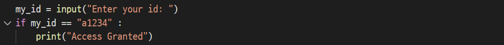


> if~ else문

```
[형식]
if 조건문 :
	True의 경우 수행할 문장(statement1)
else :
	False의 경우 수행할 문장(statement2)
```


- 예제

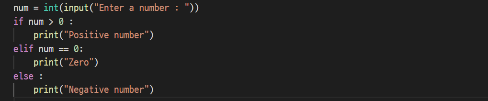

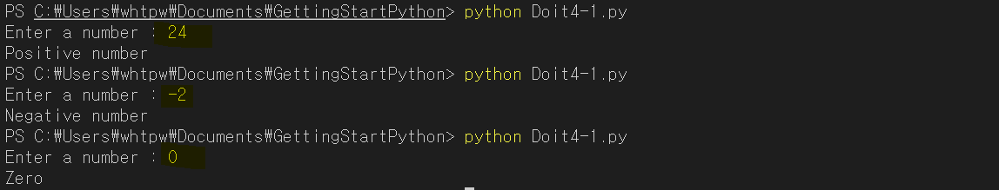


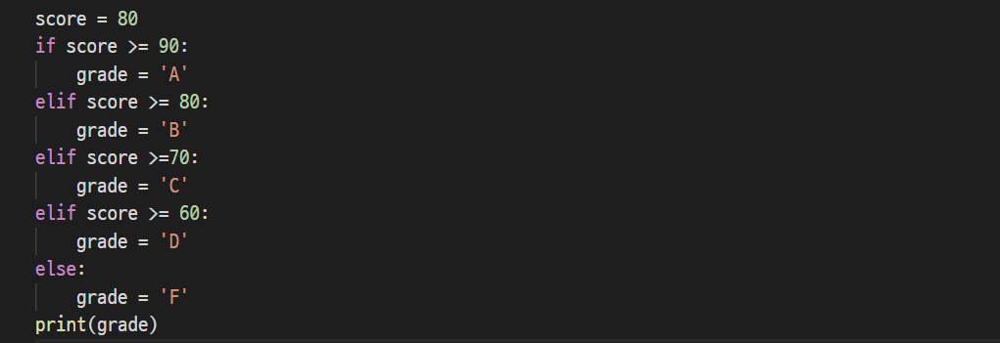


------

#### 반복문

--------

> while문

- 조건문을 비교해서 조건을 만족하는 경우에는 문장을 수행하고 조건을 만족하지 않으면 while문을 빠져나온다.

```
[형식]
while 조건문 :
	명령문
else : 
	False 명령
```


- 예제

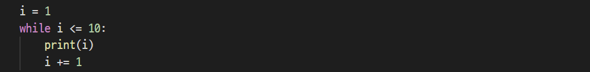

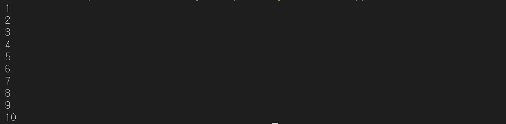


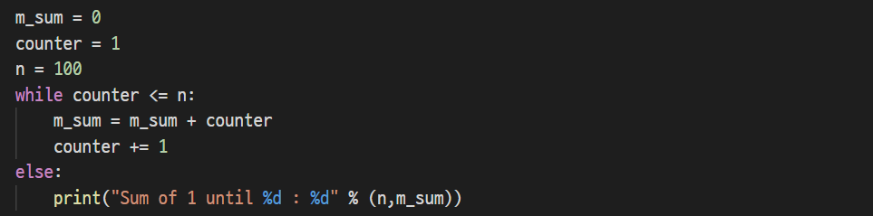


> for문

- 조건에 의한 일정한 문장을 반복 수행하는 for문은 반복을 수행할 횟수가 결정된 경우의 프로그램에 주로 사용되는 제어문이다. 

```
[형식]
for 변수 in 순서형 자료 :
	명령
else : 
	False 명령
```


- 예제

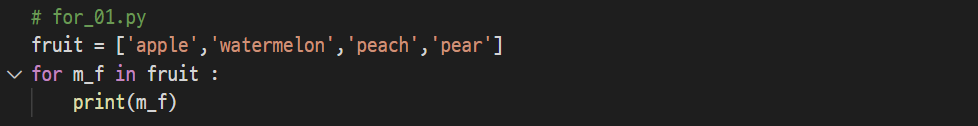

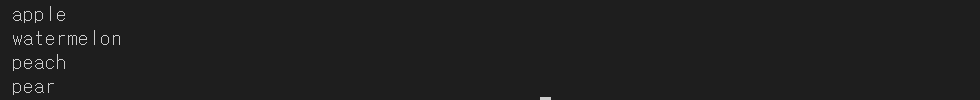


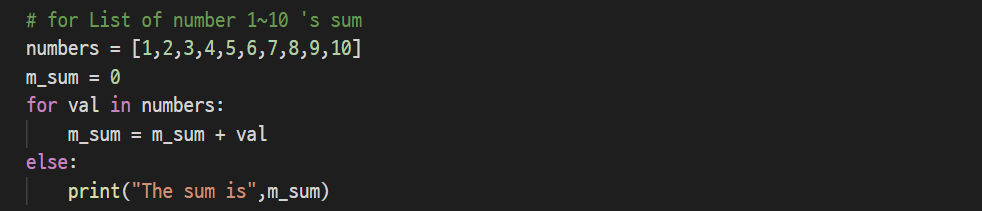


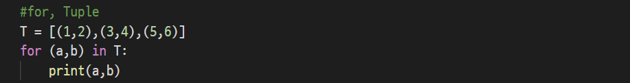

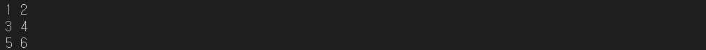


> range() 함수

- range(start, stop, step, size) 함수는 숫자 범위에 대하여 반복을 하거나 특정한 범위의 숫자를 나열하도록 해주는 특별한 함수이다.


- 예제

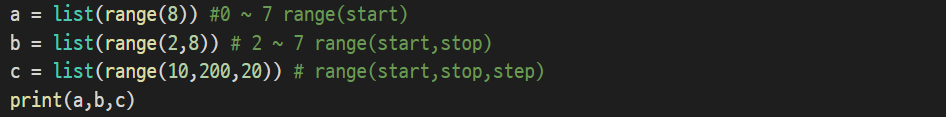

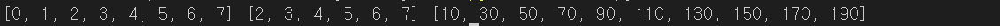


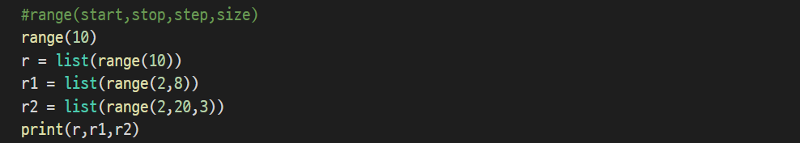


> 반복문과 함께 쓰는 enumerate(), zip() 함수와 items() 메소드

- enumerate() 함수는 인덱스 값과 인덱스에 해당하는 값인 value를 동시에 저장할 수 있는 for문을 좀 더 효율적으로 사용하기 위한 파이썬 함수이다.
- enumerate([시퀀스 타입 객체],[시작값=0])의 형식을 가지며 시퀀스 타입 객체는 이터레이션이 가능한 객체가 입력되고 시작 값은 입력 시 해당 수부터 증가하며, 입력하지 않았을 때 기본값을 0을 지정


- 예제

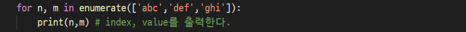

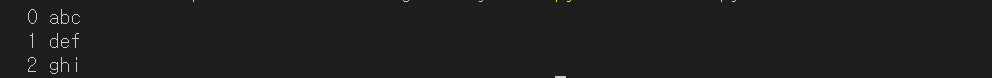


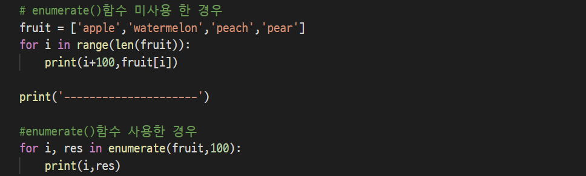

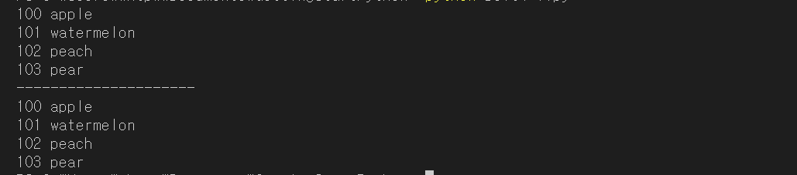


- zip() 함수는 매개인자로 여러 목록을 받아 각 목록의 요소를 튜플에 담아 그것을 목록에 저장하고 리턴한다. 여러 목록을 묶어서 사용하는 경우 zip() 함수는 매우 편리하다.


- 예제

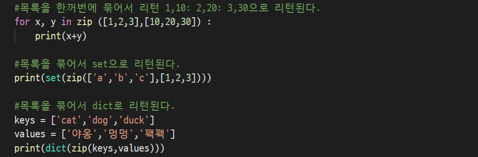

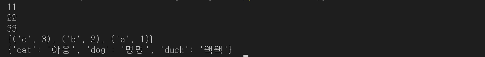


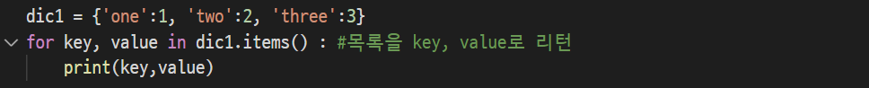

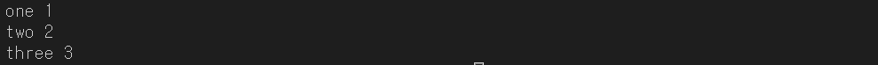


---------

#### 흐름 제어문

--------

> break문

- break문은 for문, while문 등 반복 Loop문을 빠져 나오는데 사용하는 구문으로 한 번에 가장 가까운 하나의 Loop를 벗어날 때 사용한다. 무기한 반복 루프에서 불리언 태그로 루프를 멈출 수 있지만 내장된 break문을 사용하면 더 편리하다.

```
[형식]
while True : 
	if 조건문 : 
		break
	else :
		명령문
```


- 예제

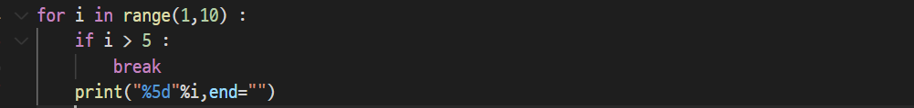


> continue문

- continue문은 for문,while문의 조건부로 제어를 옮기는데 사용하는 구문으로 지정된 반복문의 다음 번 루프의 내용을 실행하도록 시도하는 명령문이다. 


- 예제

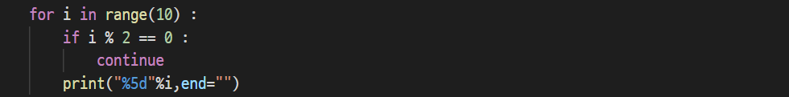


> 다중 for문과 다중 if문

```
[형식]

for 변수 in 리스트 : #outter for
	for 변수 in 리스트 : #inner for
		명령
```


- 예제

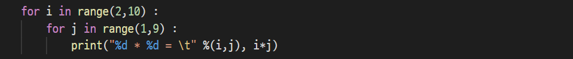

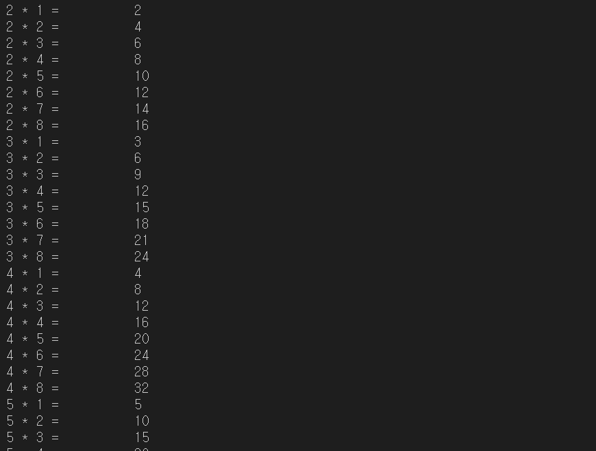


> 도전과제 138p


----------

#### 함수

------

> 함수(Function)란?

- 함수란 여러 개의 실행 문을 하나로 묶은 모듈을 의미하며 특정한 명령을 수행하는 하나의 독립된 프로그램이다.
- 함수는 파이썬의 데이터 형과 흐름제어를 알고 특정한 작업을 수행하도록 설계된 독립적인 프로그램(조각)으로 모듈화를 기본으로 한다.
- 모듈화란 특정 기능 부분을 실행 블록으로 만들고 여러 실행 블록을 연결하여 프로그래밍하는 형태를 의미한다. 파이썬 함수의 모듈화란? python에서 모듈은 별도의 파일에 정의된 함수와 데이터를 말한다. 


> 함수의 특징

- 수행할 명령 또는 복잡한 연산 등을 그룹으로 만들어 새로운 함수로 선언한 후 함수명을 호출해서 명령 실행, 디버그, 오류 수정 등을 쉽게 할 수 있다.
- 함수는 반복 코드를 제거해서 프로그램을 작고 콤팩트 하게 만든다.
- 긴 프로그램을 함수로 나누어 작성하는 것은 작은 부분에서 버그를 수정할 수 있게하고, 이를 조합해서 전체적으로 동작하는 프로그램을 만들 수 있다.


> 함수의 종류

| 함수의 종류              | 의미                                                         |
| ------------------------ | ------------------------------------------------------------ |
| 라이브러리 함수          | 표준함수 또는 내장함수라고 부르며 시스템에서 미리 작성해 놓은 함수를 의미한다. 삼각함수, 지수함수, 날짜 정보함수, 파일함수, 데이터베이스 함수 등을 말한다. |
| 사용자 정의 함수         | 프로그램 안에서 필요한 기능들을 사용자가 직접 만들어서 사용하는 함수를 말한다. |
| Built-in 함수, 기본 함수 | python 설치 시 기본적으로 제공하는 함수를 말하며 print(), type() 등의 함수를 말한다. |

```
#형식

def functionname(parameters) :	#함수의 선언은 def로 시작된다. 
	"function_docstring"	#함수의 명령 즉, 본체 부분은 반드시
	function_suite			def의 첫 글자 시작 위치보다 들여써야 한다.
	return [expression]
```


- 예제
- if __name__ == "__main" : 는 만일 이 파일이 인터프리터에 의해서 실행되는 경우란 뜻을 가지며 프로그램의 실행 시작인 진입점을 의마한다. 다른 프로그램에서 import를 학 되면 수행되지 않는 부분이기도 한다.

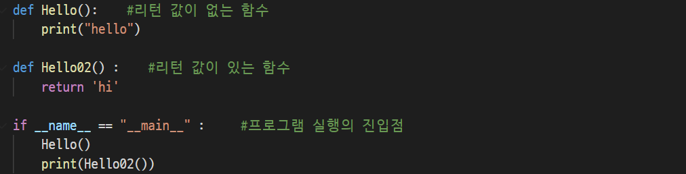

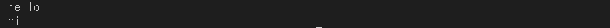


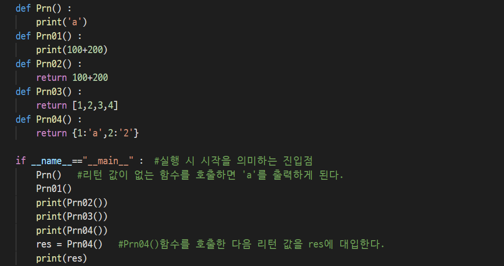

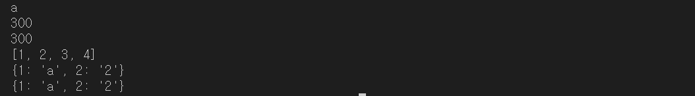


> 함수의 매개인자(Function parameter)

- argument들은 위치나 parameter이름으로 전달될 수 있다.
- 함수(function) parameter들에 기본 값들을 제공할 수 있다.
- 함수(function)는 argument들을 tuple들에 수집할 수 있도록 하여 정해지지 않은 숫자의 argument들을 받을 수 있는 함수(function)를 정의할 수 있게 해준다.
- 함수(function)는 argument들을 dictionary들에 수집할 수 있도록 하여 정해지지 않은 숫자의 parameter이름으로, 전달되는 argument들을 받을 수 있는 함수(function)를 정의할 수 있게 해준다.


- 예제

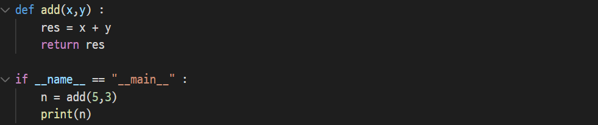


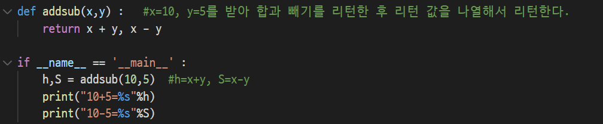

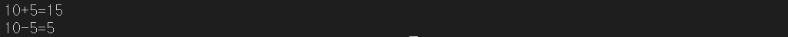


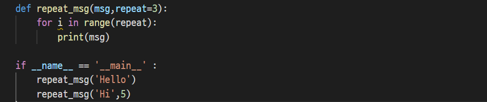

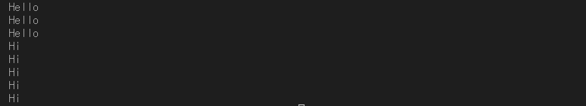


- 키워드를 파라미터에 주는 경우는 함수를 정의 시 파라미터 변수에 Asterisk(*)를 붙이게 되면 순서 있는 나열형 목록을 대입할 수 있게 된다. 함수를 호출할 때 콤마로 구분된 입력 인자를 개수에 상관없이 사용할 수 있으며 함수 내부에서는 이들 인자들을 요소로 갖는 튜플이 변수 args로넘어도게 된다. 즉, type(args)은 tuple이다.

```
def test01(a,*b) : #정상
def test02(a,*b,c) : #오류-가변 인자 뒤에 일반 인자가 올 수 없음
def test03(*a,*b) : #오류-가변 인자는 하나만 사용 가능
def test04(a,b,*c) : #정상
```

- 만약 함수 선언 시 파라미터에(**변수) 와 같은 형태의 인자가 있다면 변수는 딕셔너리 형태로 키워드 인자들 중에서 일반 인자가 아닌 것들을 넘겨 받는다. 만약 가변 개수 인자( *변수)와 혼용하는 경우에는 반드시 가변 변수 뒤에 와야한다.

- 다음과 같이 my_f 함수를 선언할 수 있다. 반드시 일반 인자(a), 가변 개수 인자(*args), 키워드 인자(**kwarg)의 순으로 나열되어야 함을 주의하자

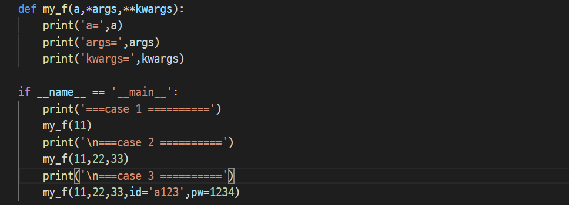

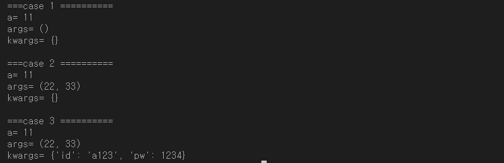


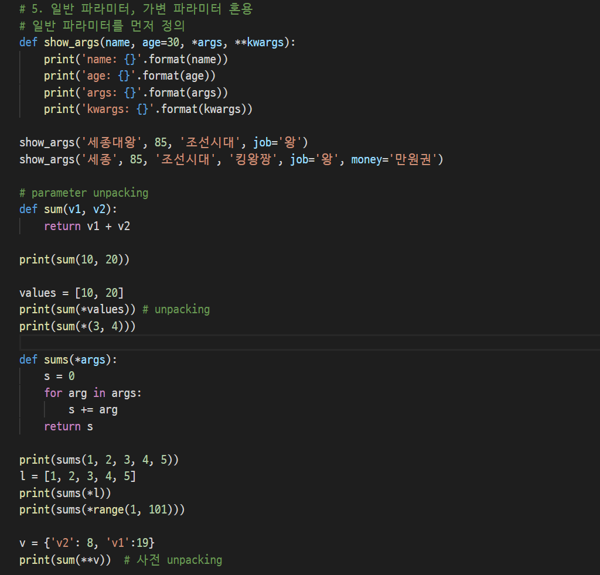

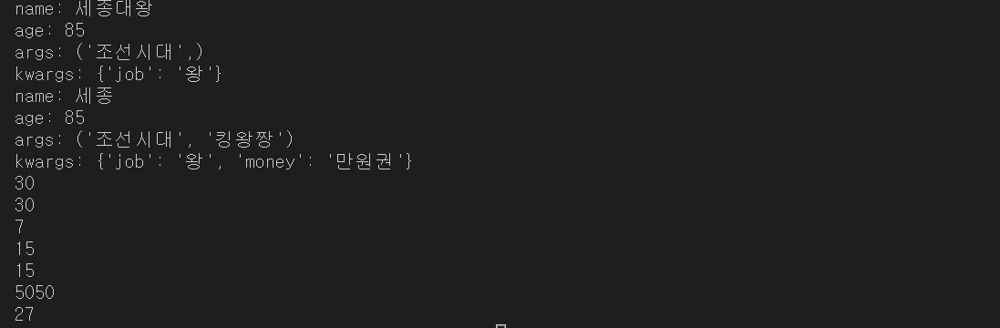


> 람다함수(lambda)와 고차함수(high-order function)

- 람다함수(lambda)
  - 익명함수라고 말하며 함수의 이름이 없는 함수로 파이썬에서는 lambda라는 키워드로 익명 함수를 정의할 수 있다.
  - 비교적 간단한 기능의 함수가 컨테이너의 요소로 들어가는 경우 혹은 다른 함수의 인자로 함수를 넘겨줄 필요가 있을 때 사용되며 한 줄로 푯되는 함수로 정의된다.
  - 람다 함수는 filter(), map(), reduce() 등의 함수와 함께 유용하게 사용된다.

```
[표현]
lambda 인자1, 인자2, ... : 표현식
```


- 일반 함수를 람다로 변환

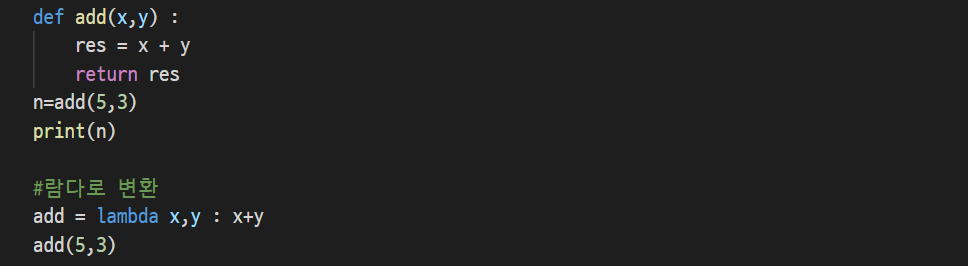


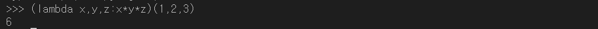


- 파이썬 고차함수(high-order function)
  - 고차함수는 전달인자로 다른 함수를 받는 함수를 말하며 함수를 매개인자로 넘길 수 있을 뿐만 아니라, 다른 함수의 결과 값으로 반환 가능하게 하는 함수를 말한다. 
  - 파이썬의 고차 함수는 filter, map, reduce 등의 함수가 있으며 데이터를 대용량 분산처리를 구현하는데 유용하게 사용된다.


- filter(function, list)
  - 함수와 리스트를 매개인자로 받아서 리스트의 값이 하나씩 함수에 인수로 전달되어 조건에 맞는 결과인 True 되는 반환 값만을 따로 모아서 리스트의 형태로 반환하는 함수
- 예제

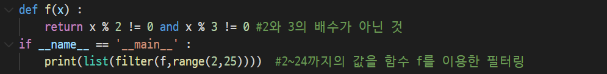

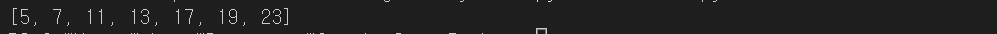


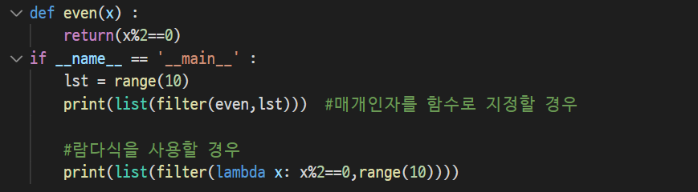

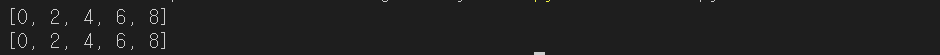


- map(function,seq) 함수
  - 함수와 시퀀스 자료형(리스트, 튜플, 문자열)을 입력받아서 시퀀스 자료형의 각각의 요소가 함수의 입력으로 들어간 다음 나오는 출력 값을 묶어서 리스트로 돌려주는 함수이다.


- 함수의 매개인자로 나열형 값을 대입해서 그 결과를 리턴

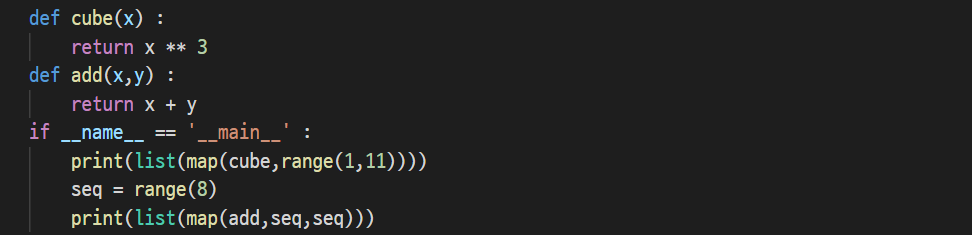

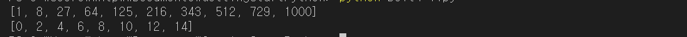


- 1, 2, 3의 배수의 값을 리턴하는 다양한 방법

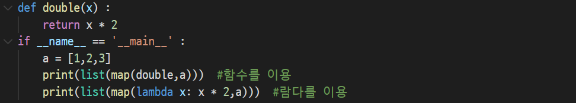

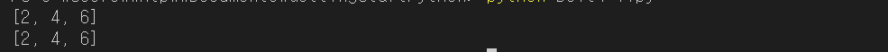


- reduce(function,seq) 함수
  - 매개인자로 함수와 나열된 값의 시퀀스의 두 값을 받아 시퀀스의 나열된 처음 두 항목을 가지고 연산을 한 후, 그 결과값을 그 다음 항목과 계속 연산하여 하나의 값을 반환한다.
  - 만약 시퀀스에 한 항목만 있으면 그 한 항목을 반환하고 빈 시퀀스에 대해서는 예외(exception) 상황이 발생한다.


- 1~10까지 합을 출력하는 코드
- reduce함수는 모듈 객체이므로 import 문장을 선언하고 모듈에 정의된 값들을 접근할 수 있도록 하고 from functools import 구문을 선언 후 호출한다.

