## 8/22(토) 

#### datetime 모듈

-------------------

- 파이썬에서 시간을 관리하는 모듈은 datatime 모듈이며 다음과 같이 모듈 안에 시간과 날짜를 관리하는 클래스를 포함한다.

| 날짜시간 관련 클래스    | 의미                                                         |
| ----------------------- | ------------------------------------------------------------ |
| classdatetime.date      | 일반적으로 사용되는 그레고리안 달력의 년, 월, 일을 나타냄    |
| classdatetime.time      | 시간을 시, 분, 초, 마이크로 초, 시간대로 나타낸다.           |
| classdatetime.datetime  | date클래스와 time 클래스의 조합으로 년, 월, 일, 시, 분, 초, 마이크로 초, 시간대 정보를 나타낸다. |
| classdatetime.timedelta | 두 날짜 또는 시간 사이의 기간을 표현한다.                    |


> data 클래스

- 일반적으로 사용되는 년, 월, 일로 표기되는 현재 그레고리안 달력의 날짜를 표현한다.
- 숫자로 년, 월, 일을 입력 받아서 date객체를 생성하며 만약 입력된 인자가 아래의 조건을 따르지 않는 경우, ValueError가 발생한다.

```python
[형식]
datetime.date(year, month, day)
	매개인자의 범위
		datetime.MINYEAR(1) <= year <= datetime.MAXYEAR(9999)
		1 <= month <= 12
		1 <= day <= 해당 월의 날짜
```


- 주요 클래스와 메소드 속성은 다음과 같다.

| 클래스 메소드                  | 설명                                                         |
| ------------------------------ | ------------------------------------------------------------ |
| date.fromtimestamp(timestamp)  | 타임스탬프 값을 인자로 받아서 date 객체를 리턴               |
| date.fromordinal(ordinal)      | 1년1월1일 이후로 누적된 날짜로부터 date 객체를 리턴          |
| date.today()                   | 현재 시스템의 오늘 날짜 date 객체를 리턴                     |
| date.replace(year, month, day) | 입력된 인자로 변경된 date 객체를 리턴                        |
| date.timetuple()               | date객체의 값을 time, struct_time 시퀀스 객체에 할당.<br />해당되는 정보가 없는 시, 분, 초는 '0'으로 초기화 |
| date.toordinal()               | 1년 1월 1일 이후로 date객체까지 누적된 날짜를 리턴           |
| date.weekday()                 | 요일을 정수로 반환하여 리턴(ex : 월요일=0, 일요일=6)<br />(ex. date(2011,12,24).weekday()==5) |
| date.isoweekday()              | date.weekday()와 동일하나 월요일=1 ~ 일요일=7로 나타냄<br />(ex. date(2011,12,24),isoweekday()==6) |

| 속성       | 설명                                 |
| ---------- | ------------------------------------ |
| date.year  | 년도(읽기 전용)                      |
| date.month | 월(읽기 전용)                        |
| date.day   | 일(읽기 전용)                        |
| date.max   | date 객체의 최댓값(9999년 12월 31일) |
| date.min   | date 객체의 최솟값(1년 1월 1일)      |

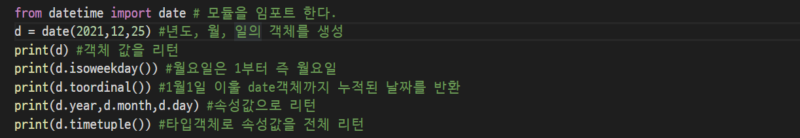

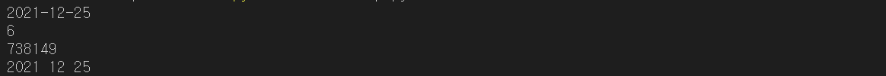


- 그 외 date 객체의 출력 형태를 변경하는 메소드도 제공된다.

| 메소드                    | 설명                                                         |
| ------------------------- | ------------------------------------------------------------ |
| isoformat()               | date객체의 정보를 'YYYY-MM-DD' 형태의 문자열로 리턴          |
| ctime()                   | date 객체의 정보를 'Sun Mar 15 00:00:00 2009' 형태의 문자열로 리턴. 시, 분, 초에 대한 정보는 '0'으로 초기화 |
| strftime(format[,t])      | 지정된 포맷에(struct_time) 맘춰 date 객체의 정보를 문자열로 리턴 |
| strptime(string[,format]) | 문자열을 struct_time객체로 변환                              |

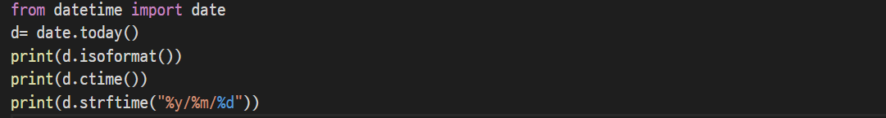


> time 클래스

| 속성             | 설명                                                         |
| ---------------- | ------------------------------------------------------------ |
| time.hour        | 시(0~23, 읽기 전용)                                          |
| time.minute      | 분(0~59, 읽기 전용)                                          |
| time.second      | 초(0~59, 읽기 전용)                                          |
| time.microsecond | 마이크로초(0~999999, 읽기 전용)                              |
| time.min         | time 객체가 표현할 수 있는 최솟값을 리턴<br />(time(0, 0, 0, 0)) |
| time.max         | time 객체가 표현할 수 있는 최댓값을 리턴<br />(time(23, 59, 59, 999999)) |

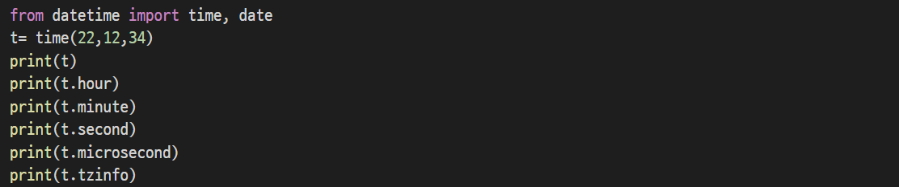

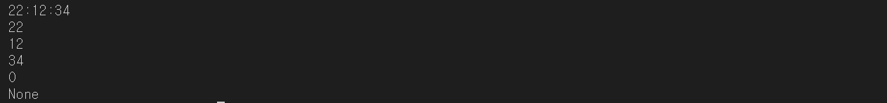


> calenda 모듈

| 메소드                                 | 설명                                                         |
| -------------------------------------- | ------------------------------------------------------------ |
| calendar.calendar(년도, W=2, L=1, C=6) | 년도와, 열의 여백(W), 행의 여백을 지정하면 해당 년도의 달력이 출력된다. |
| calendar.firstweekday()                | 각 주에 시작하는 평일을 리턴한다.                            |
| calendar.setfirstweekday(weekday)      | 각 주에 시작하는 평일을 리턴한다.                            |
| calendar.isleap(year)                  | 년도가 윤년의 경우는 true를 리턴, 그렇지 않으면 false를 리턴한다. |
| calendar.leapdays(y1,y2)               | y1년도와 y2년도 사이의 지정된 범위에서 윤년의 개수를 리턴한다. |
| calendar.month(year,month,w=2,l=1)     | 년도, 월일을 대입하게 되면 해당 년도의 달을 열의 여백(W), 행의 여백(I)을 지정한 대로 출력한다. |
| calendar.monthcalendar(year,month)     | 연도, 월을 대입하게 되면 해당 연도의 달을 지정한대로 출력한다. |
| calendar.monthrange(year,month)        | 지정된 연도와 월의 첫 번째 날의 요일을 리턴한다.             |
| calendar.prcal(year,w=2,l=1,c=6)       | 지정된 연도를 열의 여백과 행의 여백, 컬럼의 여백을 지정해서 출력한다. |
| calendar.weekday(년도, 월, 일)         | 0(일요일)~6(토요일)로 요일을 리턴한다.                       |

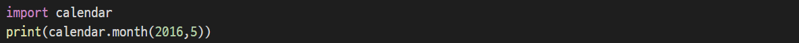


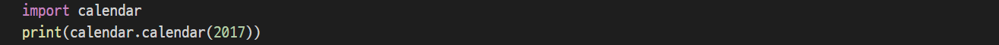

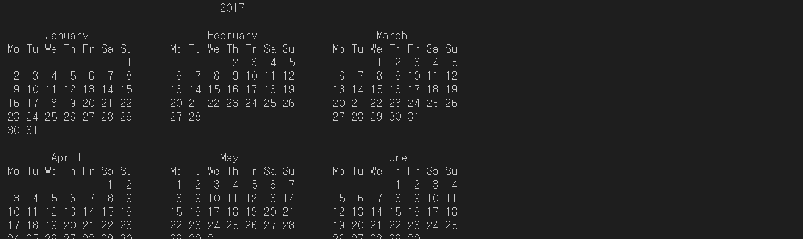


---------------

Os 모듈

-----------

> Os모듈

- 파이썬의 OS모듈은 사용하고 있는 운영체제의 값을 구현하는 클래스와 메소드들을 제공한다.

| 메소드                 | 설명                                                         |
| ---------------------- | ------------------------------------------------------------ |
| os.getcwd()            | 현재 작업 디렉토리 리턴                                      |
| os.chdir(path)         | path로 작업 디렉토리 변경                                    |
| os.access(path,mode)   | < path >에 대해서 < mode>의 작업이 가능한지 True/False로 리턴 |
| os.listdir(path)       | 현재 작업 디렉토리의 파일과 디렉토리를 리스트로 리턴         |
| os.mkdir(path, mode)   | < path>에 해당하는 디렉토리 생성                             |
| os.makedirs(path,mode) | < path>에 해당하는 경로를 서브 디렉토리까지 생성             |
| os.remove(path)        | < path> 파일을 삭제                                          |
| os.unlink(path)        | < path> 파일을 삭제                                          |
| os.rmdir(path)         | < path> 디렉토리 삭제, 단 비어있어야 한다.                   |
| os.rename(src,dst)     | 파일이나 디렉토리 이름 변경 또는 이동                        |
| os.renames(src,dst)    | 서브 디렉토리까지 포함. 즉, 필요 시 디렉토리를 자동 생성     |
| os.stat(path)          | < path> 경로에 해당하는 다양한 정보를 얻어옴                 |

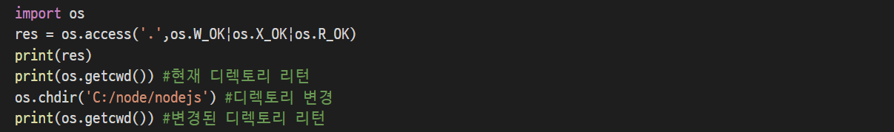

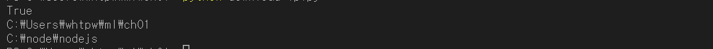


- 디렉토리를 만들고 삭제하는 코드

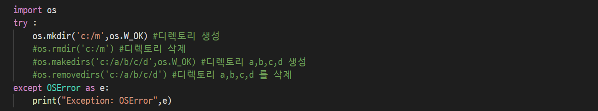

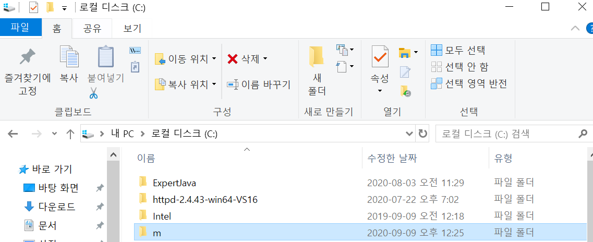


> os.path 모듈

- os.path는 파일 경로를 생성 및 수정하고, 파일 정보를 쉽게 다를 수 있게 해주는 모듈로 파이썬에서 파일 입출력 시에 파일의 경로를 지정할 때 유용하게 사용한다.

| 메소드                          | 설명                                                         |
| ------------------------------- | ------------------------------------------------------------ |
| os.path.abspath(path)           | 현재 경로를 Prefix로 하여 입력 받은 경로를 절대경로로 바꿔서 리턴 |
| os.path.basename(path)          | 입력 받은 경로의 기본 이름(base name)을 리턴                 |
| os.path.commonprefix(path_list) | 입력 받은 path_list로부터 공통적인 Prefix를 추출해서 리턴    |
| os.path.dirname(path)           | 입력 받은 파일/디렉토리의 경로를 리턴                        |
| os.path.exists(path)            | 입력 받은 경로가 존재하면 True를 리턴하고, 존재하지 않는 경우는 False를 리턴 |
| os.path.expanduser(path)        | 입력 받은 경로 안의 "~"를 현재 사용자 디렉토리의 절대경로로 리턴 |
| os.path.expandvars(path)        | path안에 환경변수가 있을 때 확장                             |
| os.path.getatime(path)          | 입력 받은 경로에 대한 최근 접근 시간을 리턴                  |
| os.path.getmtime(path)          | 입력 받은 경로에 대한 최근 변경 시간을 리턴                  |
| os.path.getctime(path)          | 입력 받은 경로에 대한 생성시간을 리턴                        |
| os.path.getsize(path)           | 입력 받은 경로에 대한 바이트 단위의 파일크기를 리턴          |
| os.path.isfile(path)            | 경로가 파일인지 유무를 검사하여 True/False로 리턴            |
| os.path.isdir(path)             | 경로가 디렉토리인지 유무를 True/False로 리턴                 |
| os.path.split(path)             | 입력 받은 경로를 디렉토리 부분과 파일 부분으로 나눈다.       |
| os.path.splitdrive(path)        | 입력 받은 경로를 드라이브 부분과 나머지 부분으로 나눈다.     |
| os.path.splittext(path)         | 입력 받은 경로를 확장자 부분과 그 외의 부분으로 나눈다.      |


- 지정된 디렉토리가 가진 하위 목록과 파일의 크기 및 사이즈, 생성 시간을 출력 하는 코드

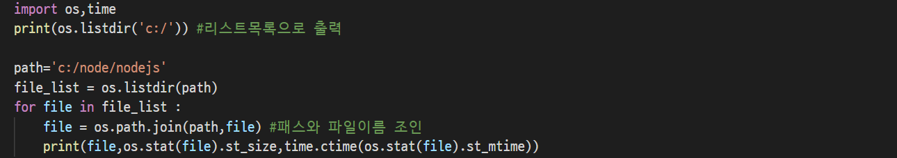

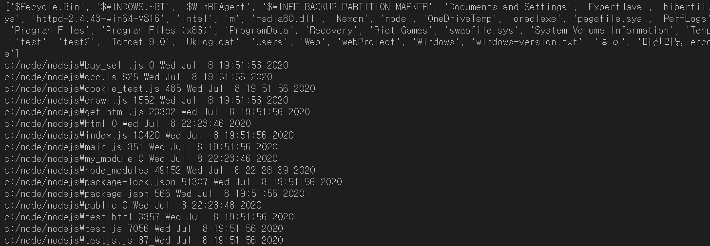


- 지정된 경로를 구성요소로 분할

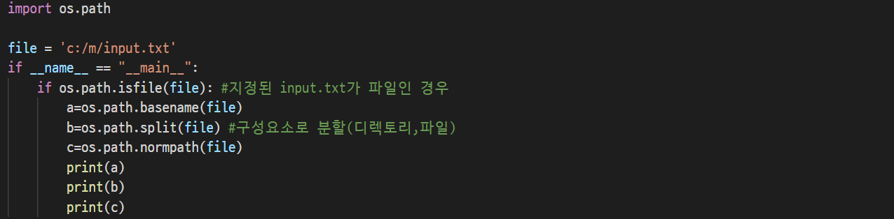

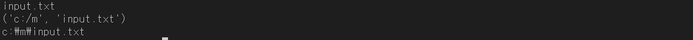


---------

#### 파일 입출력

-----------

> 파일 입출력

- 파일에 쓰기 즉, 파일에 입력을 하려면 내용을 쓸 파일대상과 속성을 지정하면서 호출하는 open()이라는 메소드를 사용한다.

```
[형식]
파일객체 = open(file,mode)
```

- 여기서 open 메소드의 file은 경로를 포함한 파일 대상을 입력한다.

```python
f = open("a.txt") #텍스트 읽기 모드	
f = open("a.txt",'w') #텍스트 쓰기 모드
f = open("apple.bmp",'r+b') #바이너리 읽기 쓰기 모드
f = open("a.txt",encoding='utf-8') #텍스트 읽기 모드와 인코딩 try 구문과 함께 사용한다.
```


- mode는 파일의 속성을 말하며 속성은 다음과 같다.

| 모드 | 설명                 |
| ---- | -------------------- |
| r    | 읽기 모드(default)   |
| r+   | 읽기 + 쓰기 모드     |
| w    | 쓰기모드             |
| a    | 쓰기 + 이어쓰기 모드 |
| t    | 텍스트 모드(default) |
| b    | 바이너리 모드        |


- 두 개의 파일에 문자열을 저장

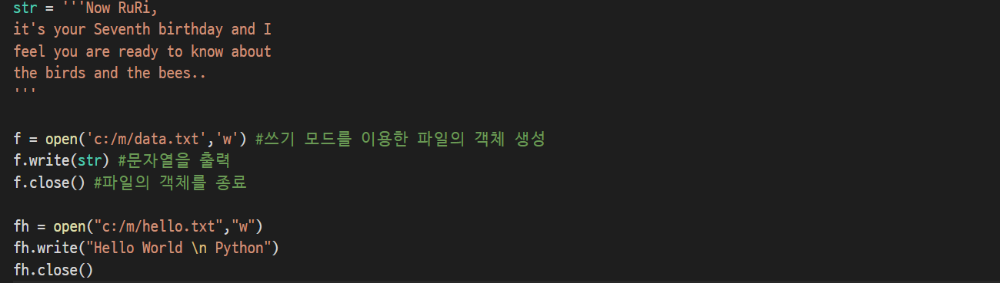

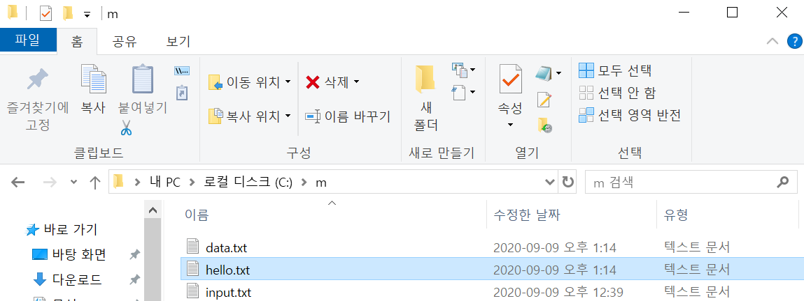


- 파일의 내용을 전체 문자열로 읽어와서 화면에 출력하는 코드

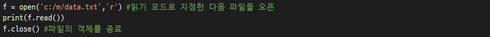

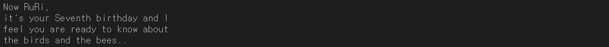


- 단순히 파일의 끝에 데이터를 추가한다면 open의 두 번째 매개인자의 모드를 'a' 또는 'a+'를 지정한다. 파일이 없는 경우는 새롭게 만들어진다.

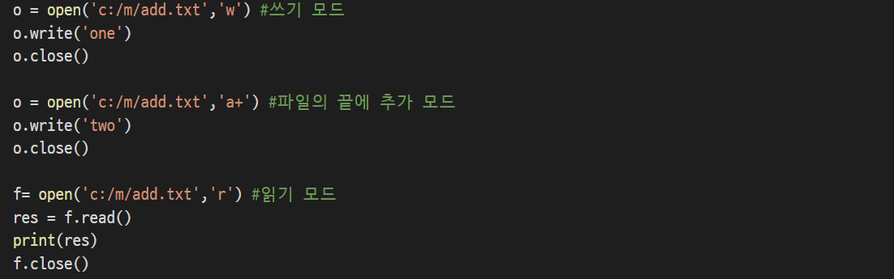


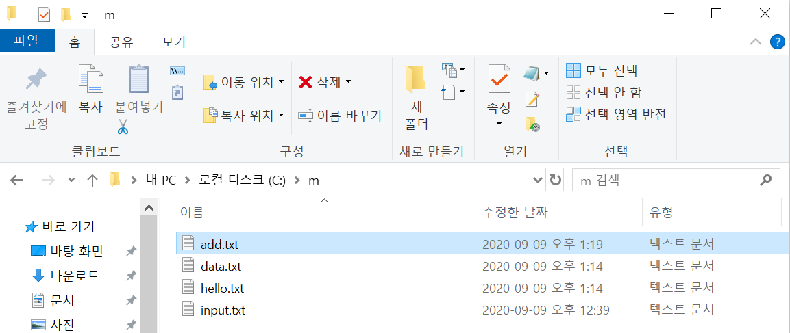


-----------

#### 피클(pickle)

--------

- 파이썬에서는 프로그램이 종료된 후에도 사용한 데이터를 프로그램에서 재사용할 수 있도록 지속(Persistence)모듈을 제공한다.

- 피클이란 파이썬의 지속 모듈 중의 하나로 임의의 파이썬 객체를 저장하는 가장 일반화된 모듈이다. 파이썬의 지속 모듈 중 대표적인 모듈은 pickle 모듈 이외에도 다음과 같은 모듈을 가진다.

  - DBM 관련 모듈

    데이터를 DBM 형식으로  파일에 기록하며 anydbm, dbm, gdbm, dbhash, dumbdbm등 시스템에 따라서 관련된 다양한 모듈들이 제공된다. anydbm 모듈을 사용하면 시스템에서 사용 가능한 모듈 중 DBM 호환 가능한 최적의 모듈을 찾아준다. 사전 자료형을 쓰는 법과 동일한 인터페이스를 제공하며 키와 값은 모두 문자열이어야 한다.

  - marshal 모듈

    파이썬의 기본 객체(None, 수치형, 문자열, 튜플, 리스트, 사전 및 코드 객체)를 이진 포맷으로 저장하는 모듈이다. 재귀적인 사전이나 리스트를 처리할 수 없고 주로 .pyc 파일의 컴파일 된 코드를 읽는데 사용된다. 일반 객체 입/출력은 pickle 모듈을 사용해야 한다.

  - shelve 모듈

    사전 자료형으로 자료를 접근할 수 있도록 한 것은 anybm과 동일하나, 차이점은 임의으이 파이썬 객체가 값(value)으로 사용될 수 있다. 값으로 임의의 객체가 저장될 수 있으며 내부에서 사전형 인터페이스를 위해서 anydbm 모듈을 사용하고 객체 저장을 위해서 cPickle 모듈(pickle의 C버전)을 이용한다.

- pickle 모듈의 작업을 피클링이라고 한다. 피클링을 이용하면 기본 자료형 이외의 복잡한 자료형을 텍스트 형태로 혹은 이진 파일 형태로 변환하여 저장하거나 네트워크를 통해 다른 시스템으로 전달 가능하며 다시 원래의 객체 형태로 복원 가능하게 된다.


