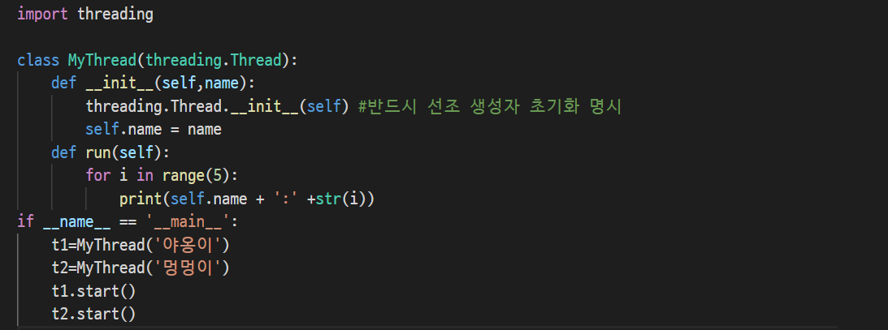

## 8/24(월)  - 미완성 -396까지

#### 파이썬의 스레딩(Threading)

--------

> Single Thread와 Multi Thread

- Single Thread란 프로그램의 흐름이 단일로 이루어지는 프로그램을 말한다. 일반적으로 클래스 내부에 main() 메소드 하나를 가지는 형태의 프로그램이 대부분 Single Thread 프로그램이다.
- Multi Thread란 운영체제에서 실행중인 하나의 프로그램인 프로세스 내에서 실행되는 세부 작업 단위를 말하며 하나의 프로세스에서 여러 개의 스레드가 병행적으로 처리되는 것을 멀티 스레드라고 한다.
- 프로세스는 완전히 구별되는 별개의 프로그램이 수행되는 과정을 표현하는 단위이다. 스레드는 단일 프로세스 내에서 병행적으로 운영되는 함수 크기의 실행단위이다.
- 스레드와 프로세스는 서로 다르다. 프로세스가 서로 완전히 독립적으로 수행되는 것이라면, 한 프로그램 내의 스레드들은 서로 완전히 독립적이 아니어서 어떤 변수나 파일을 스레드들이 서로 공유하도록 하기에 편리하다.


> 스레드 생성

- 파이썬의 스레드 모듈은 threading이다. threading을 사용할 수 없는 상황에서는  dummy_threading을 제공한다. threading은 Thread, Lock, RLock, Condition, Semaphore, Event, Timer등의 객체를 가진다.
- threading모듈의 공통 메소드

| 메소드             | 설명                                                         |
| ------------------ | ------------------------------------------------------------ |
| active_count()     | 실행 중인 thread 객체의 수를 리턴하며 enumerate()의 목록 리턴 길이와 동일하다. |
| current_thread()   | 현재 실행 중인 프로세스의 스레드를 지원하는 Thread 오브젝트를 리턴한다. |
| get_ident()        | 현재 스레드의 '스레드 ID'를 리턴한다.                        |
| enumerate()        | 현재 실행 중인 Thread 객체 모든 목록을 리턴하며 목록에는 데몬 스레드(daemonic thread) current_thread() 의 생성 더미 스레드 객체 그리고 메인 스레드를 가진다. |
| main_thread()      | main Tread 오브젝트를 리턴하며 메인 스레드는 Python 인터프리터가 시작된 스레드를 말한다. |
| settrace(func)     | threading 모듈을 사용하여 시작한 모든 스레드에 추적 기능을 설정한다. |
| setprofile(func)   | threading 모듈을 사용하여 시작한 모든 스레드 프로파일 기능을 설정한다. |
| stack_size([size]) | 새 스레드를 만들 때 스레드 스택 크기를 리턴한다. 옵션 size는 0 또는 32,768(32KiB) 이상의 양의 정수이다. |
| TIMEOUT_MAX        | 블록 함수(Lock.acquire(), RLock.acquire(), Condition.wait() 등)의 timeout 인수에 허용되는 최댓값을 리턴 |


- 파이썬에서 스레드를 생성하는 방법은 2가지이다.
  - threading Thread의 생성자로 호출 할 객체를 전달하는 방법
  - threading Thread의 서브 클래스를 만들고 run() 메소드를 오버라이드(Override) 하는 방법


- Thread 객체의 생성자

```python
class threading.Thread(group = None, target = None, name = None, args = (), 
kwargs = {}, *, daemon = None)

<매개인수 목록>
- group은 None이어야 하며 미래 ThreadGroup 클래스가 구현될 때 확장을 위해 예약 된 인수이다.
- target은 run() 메소드에 의해 시작되는 호출 가능한 객체이다.
- name은 스레드의 이름이며 명시하지 않을 때는 기본적으로 N을 작은 10진수로 "Thread-N"형식으 고유한 이름을 생성한다.
- args는 target을 호출할 때 인수이며 타입은 튜플이다.
- kwargs는 target을 호출할 때 키워드 인수이다.
- daemon는 스레드가 데몬 여부를 명시적으로 설정(None이 아닌 경우), None의 경우(디폴트) 데몬 속성은 현재 스레드에서 상속된다.
```


- 주요 메소드

| 메소드                 | 설명                                                         |
| ---------------------- | ------------------------------------------------------------ |
| start()                | 스레드를 실행한다.                                           |
| run()                  | 스레드를 실행할 코드를 작성하며 서브 클래스에서 오버라이드 할 수 있다. |
| join(timeout=None)     | 스레드가 종료될 때까지 기다리며 timeout값을 부동 소숫점으로 지정할 경우 is_alive()를 호출하여 생존 유무를 확인한다. |
| getName()              | 스레드의 이름을 리턴                                         |
| setName(name)          | 스레드의 이름을 지정                                         |
| ident                  | 스레드가 식별자이며 스레드가 시작되지 않으면 None이다.       |
| is_alive()             | thread가 생존하고 있는지 유무를 True/False로 리턴            |
| daemon 또는 isDaemon() | daemon thread 또는 (True) 여부 (False)를 나타내는 부울 값이다. 데몬스레드를 지정하는 setDaemon()도 있다. |


- 스레드 생성시 첫 번째 호출 가능 개체를 전달하는 방법도 다양하게 사용할 수 있다. 
- 생성자로 객체를 전달하는 경우, 스레드의 이름을 주고 생성하는 경우, 스레드를 여러 개 생성하는 경우, 인수를 전달하여 스레드를 생성하는 경우 등이다.
- 다음은 생성자로 객체를 전달하는 경우이다. 실행하는 코드를 함수로 작성한 후 Thread(target=Mythread)의 target로 전달해서 함수를 실행시킨다.


- 이번에는 두 번째 생성하는 방법으로 Thread를 상속받아 run() 메소드를 재정의하여 스레드를 생성한 후 start()로 실행하는 코드이다.




- 이번에는 Thread객체 생성자의 매개인자로 스레드 대상, 스레드 이름, 타켓을 호출할 때의 인수 등을 전달함과 동시에 여러 개의 스레드를 실행시키는 코드이다. 결과는 실행할 때마다 프로세스에 따라 다르게 나올 수 있다.


> 데몬 스레드

- 데몬 스레드란 자신의 작업을 실행하는 스레드와는 다르게 다른 스레드로부터 요청을 받아 특정 서비스를 수행하는 작업을 하는 스레드를 말한다.
- 그렇기 때문에 시스템이 살아있는 동안 계속 그 시스템과 생명 주기를 같이 하도록 되어 있으며 모든 서비스 요청을 수행해 주어야 하기 때문에 무한 루프로 둔다.
- 데몬 스레드는 메인 스레드를 포함한 남아있는 thread가 daemon thread만으로 되어있을 때 python 프로그램을 강제 종료시킨다. 
- setDaemon()은 메인 스레드가 종료 될 때 같이 종료되거나 메인 스레드문이 종료 되어도 스레드는 계속 실행하도록 지정하는 True/False로 값을 지정하게 된다.
- 다음은 데몬스레드가 강제 종료되어 0을 리턴하는 것을 확인할 수 있다.
- 민일 t.setDaemon(False)로 주면 메인 스레드가 종료되어도 스레드가 실행되기 때문에 0~99가 수행된다.


- 다음은 time 모듈을 이용해서 데몬 스레드가 다른 스레드와 종료되는 시간을 sleep(1)이란 메소드를 통해 지정된 시간만큼 수행하고 멈추는 것을 확인하는 코드이다. range(20000000): 정도의 수치를 크게 지정하면 수행 시간 동안만 출력되는 코드를 확인할 수 있다.


> join(timeout = None) 메소드

- join 메소드는 스레드가 종료 될 때까지 기다린다. join()메소드를 호출 한 스레드가 정상적으로 종료 또는 처리되지 않는 예외에 의해 종료하거나 옵션 제한이 발생할 때까지 메소드 호출 스레드를 차단한다.
- 즉, join 메소드는 데몬 스레드가 종료될 때까지 기다리는 메소드로 timeout값을 부동 소숫점으로 지정할 경우 is_alive()를 호출하여 생존 유무를 확인한다. 
- 다음은 스레드를 생성하여 join메소드를 호출한 다음 메인 스레드가 차단되어 데몬 스레드가 종료될 때까지 기다리도록 했다. 만일 join()을 주석처리하게 되면 0을 리턴하게 된다.


- t.join 메소드 시간 초과 인수를 설정하고 데몬 스레드가 종료 될 때까지 기다리지 않고 타임 아웃된다. isAlive 메소드를 통해 스레드가 살아있는지 확인하고 살아있다면 시간을 지정한 join메소드를 호출한다. 10000까지의 카운트 도중에 스레드가 종료된다. 시간만큼 수행하는 결과를 확인할 수 있다.


- 여러 개의 스레드를 동시에 실행시켜 모니터링을 하는 코드를 다음과 같이 작성해보자. 스레드가 여러 개 시작했을 때 모두 끝날 때까지 스레드를 모니터링 하는 threading, enumerate 메소드는 실행 중인 스레드의 목록을 반환한다. 메인 스레드도 대상이 되므로 if t is main_thread: continue 문을 이용해서 목록에서 제거한 후 출력한다.


> threading.Timer

- 클래스는 일정 시간 경과 후에 수행되는 실행 즉 타이머 실행을 표현한다. Timer는 Thread의 서브 클래스이며 스레드의 start() 메소드를 호출하면 스레드로 작동하기 시작한다. 
- cancel() 메소드를 호출하면 타이머를 중지할 수 있으며 타이머가 활동을 수행할 때까지의 대기 시간은 사용자가 지정한 대기시간과 정확하게 일치한다.
- 생성자의 형식은 다음과 같다. interval의 지정된 시간이 경과한 후 args 인수와 kwargs 키워드를 사용하여 함수를 실행할 타이머를 생성한다.

```python
threading.Timer(interval, function, args=None, kwargs = None)	
```

- 다음 코드를 실행하게 되면 5초 후에 Thread_Test가 실행된다. 만일 주석을 풀게 되면 5초 후에 스레드를 시작하도록 하고, 2초 후에 cancel() 메소드가 호출되어 스레드를 취소한다.


- 다음 코드는 타이머를 이용해서 일정 시간 동안 스레드를 수행하도록 한 코드이다. 강제로 종료하지 않으면 명령이 계속 반복되어 출력된다.


> 스레드 간에 Event 객체를 사용하여 동기화

- 이벤트가 발생할 때까지 스레드를 대기시키고 다른 스레드에서 이벤트를 발생시키면 대기 스레드가 활성화되는 실행을 연동하는 클래스이다.
- 이벤트 객체는 내부 플래그로 관리하며 이 플래그는 set() 메소드를 이벤트가 발생하거나 만료될 때까지 현재 스레드를 대기시키고 wait() 메소드로 이벤트를 발생시켜 대기스레드를 재개시킨다. Event를 반복 사용하는 경우에는 clear() 메소드를 호출하여 이벤트를클리어 시킨다.

| 메소드             | 설명                                                         |
| ------------------ | ------------------------------------------------------------ |
| threading.Event()  | 이벤트 객체를 생성                                           |
| is_set()           | 내부 플래그의 값이 true인 경우에만 true를 리턴               |
| set()              | 내부 플래그의 값을 true로 설명하며 대기중인 모든 스레드를 실행시킨다. 일단 플래그가 true가 되면 스레드가 wait()를 호출해도 스레드가 실행된다. |
| clear()            | 내부 플래그의 값을 false로 다시 설정한다. set()를 호출하여 다시 내부 플래그의 값을 true로 설정 될 때까지 wait()를 호출한 스레드는 차단하도록 한다. |
| wait(timeout=None) | 내부 플래그의 값이 true가 될 때까지 블록 상태로 wait() 처리에 들어간 시점에서 내부 플래그의 값이 true이면 즉시 처리를 리턴하고 그렇지 않은 경우 다른 스레드가 set()를 호출하여 플래그 값을 true로 설정하거나 옵션의 타임 아웃이 발생할 때까지 블록상태로 대기한다. |


- 예제


---------

#### 파이썬의 네트워크

-----

> 파이썬의 Tcp 소켓 모듈

- 파이썬에는 소켓(sockets)이라고 불리는 내장 지원 모듈이 있다. 파이썬 프로그램에서 소켓 모듈을 통해서 네트워크 연결을 하고, 데이터 검색을 매우 용이하게 한다.
- 포켓 모듈의 주요 메소드는 다음과 같다.

| 메소드     | 설명                                                         |
| ---------- | ------------------------------------------------------------ |
| bind()     | 소켓에 주소를 바인드한다.                                    |
| listen()   | TCP listener 설정하고 시작한다.                              |
| accept()   | TCP 클라이언트 연결을 수동적으로 받아들이고 연결이 도착할 때까지 기다린다. |
| connet()   | TCP 서버연결을 능동적으로 초기화한다.                        |
| recv()     | TCP 메시지를 수신한다.                                       |
| end()      | TCP 메시지를 전송한다.                                       |
| recvfrom() | UDP 메시지를 수신한다.                                       |
| sendto()   | UDP 메시지를 전송한다.                                       |
| close()    | 소켓을 종료한다.                                             |


> 파이썬의 Tcp 통신 (366)

- 응용 프로그램에서 소켓을 통하여 목적지 호스트와 연결을 요구하거나 패킷을 송수신할 때 해당 소켓을 사용하게 되며 TCP는 출발점과 도착점을 연결하는 하나의 연결통로를 설정하고 계속 그 통로를 통해 데이터를 전송하거나 받게 되는데 마치 전화선이 양 상대방에 연결되는 것과 같다.
- 두 개의 소켓이 연결되는 방식
  - 서버에서 접속을 기다리는 소켓을 하나 만든다. 접속을 기다리는 소켓을 서버 소켓이라고 하며 서버 소켓은 접속을 기다린다.
  - 주소 소켓 결합은 서버의 주소(IP주소, 포트 번호)를 생성된 소켓과 결합하는 것으로 socket.bind(address) 메소드로 구현한다. 이때 address는 파이썬의 튜플 형식으로 ip, port를 가진다.
  - socket.listen(backlog)메소드를 이용하여 클라이언트로부터 연결 요청 대기한다. 이때 backlog는 허용되는 최대 요청 수이다.
  - socket.accept() 메소드를 이용하여 클라이언트의 연결 요청을 수락한다. accept() 메소드는 클라이언트와 통신을 위한 새로운 연결 소켓과 클라이언트의 주소를 리턴하게 되면서 수락한다.
  - Send()를 통해 클라이언트에게 데이터를 전달한다.
  - Receive()를 통해 클라이언트에게 데이터를 전달받는다.


- 서버 소켓 프로그램이다. 소켓 프로그램을 이용하여 서버를 작성할 때는 클라이언트가 접속할 수 있도록 서버의 주소와 포트를 이용하여 소켓을 생성한다.

  <서버> 


​	<클라이언트>


