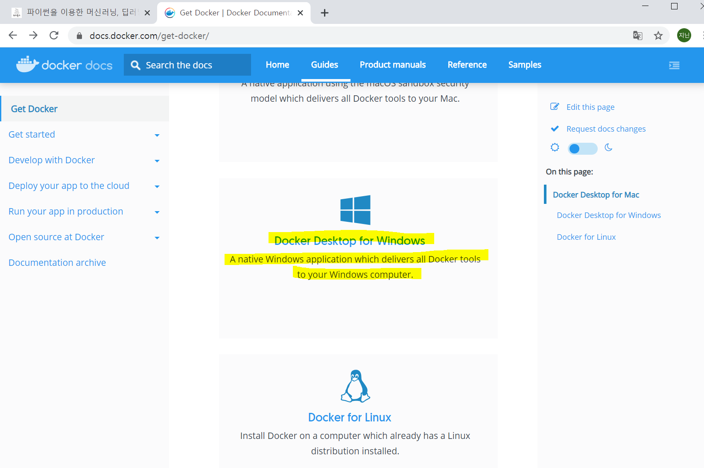

## 8/25(화)   

#### sqlite3 모듈

--------

> sqlite3란?

- SQLite(http://www.sqlite.org/)는 오프라인에서 응용 프로그램과 함께 사용하는 경량의 임베디드 데이터베이스이다. 
- SQLite의 장점
  - 작은 크기와 간결함으로 로컬에서의 간단한 DB 구성에 사용된다.
  - 크로스 플랫폼이며 트랜잭션을 지원한다.
  - 오픈소스 프로젝트로 개발 비용이 절감된다.
  - 서버를 포함한 네트워크 구성이 필요없다.
- SQLite의 단점
  - DB엔진 자체가 호스트 프로그램에 임베딩 되는 스타일이므로 호스트 프로그램이 DB처리에 대한 모든 부하를 안을 수 있다.


> SQLite의 구문

- 테이블 생성 

```sql
create table myproject(
	name text primary key,
	description text,
	deadline date
);
```

- 질의(myproject의 내용 출력)

```sql
select * from myproject;
select * from myproject where name = 'Y';
```

- 데이터 추가

```SQL
insert into myproject(name) values('A');
insert into myproject values('B','JAVA','2016-03-24');
```

- 데이터 수정

```sql
update myproject set name = 'C' where name = 'Y'
```

- 데이터 삭제

```sql
delete from myproject where name = 'C'
```

- 테이블 삭제

```sql
drop table myproject;
```


> 파이썬의 sqlite3 모듈

- 파이썬에서 sqlite3은 pysqlite 모듈을 통해서 제공된다.
- sqlite3 모듈에는 데이터베이스 연결(connect)과 전역으로 사용되는 메소드들로 제공된다.

| 주요 메소드                                                  | 설명                                                         |
| ------------------------------------------------------------ | ------------------------------------------------------------ |
| connect(database[,timeout, isolation_level,detect_typ,factory]) | SQLite DB에 연결하고 연결된 Connection객체를 리턴한다.       |
| complete_statement(sql)                                      | 세미콜론으로 끝나는 SQL문장에 대해서 True를 리턴한다.        |
| register_adapter(type, callable)                             | 사용자정의 파이썬 자료형을 SQLite에서 사용하도록 등록한다. callable은 변환을 수행하는 함수로 1개의 인자를 받아서 파이썬에서 처리 가능한 자료형으로 리턴한다. |
| register_converter(typename, callable)                       | SQLite에 저장된 자료를 사용자정의 자료형으로 변환하는 함수를 등록한다. typename은 SQLite에서 내부적으로 사용될 자료형의 이름이고, callable은 변환을 위해 사용되는 함수이다. |


----------------

## 머신러닝, 딥러닝 실전 개발 입문

#### 서문

--------

> 세팅

- https://wikibook.co.kr/pyml-rev/ 에서 예제 파일 압축 해제 (예제 데이터)

- Docker 설치하기 :

  < window pro >  https://docs.docker.com/get-docker/




  	< window home > https://github.com/docker/toolbox/releases


- Window PowerShell 열기 (docker 설치 확인)


- 실행 중인 것을 보여줌


- 방금 전까지 실행했던 컨테이너의 정보 표시


- ubuntu 실행 : 뒤에 버전을 적지 않으면 가장 최신 버전으로 실행


- 확인 후 빠져나오기


- 확인


- commit (복사는 우클릭) : 새로운 이미지 생성


- 이미지 생성 확인


- 새로운 이미지 실행 

docker run -it mlearn:init

- 

docker attach 35

- 확인

docker ps -a 

- 재 시작 (hello world)


- 이미지 지우기 (hello-world 삭제)

docker rmi bf

- 삭제 확인

docker images

docker ps -a


- 호스트 OS의 홈 폴더 마운트하기 (test폴더 생성)


- 이미지 삭제


- 전부 삭제


---------------------

#### 파이썬 + Anaconda 환경준비

-------------

> 필요한 라이브러리 설치하기

- 새로운 컨테이너 시작(ml 폴더 생성)


- 우분트용 패키지 관리 툴 업데이트


- install


> ptenv 설치하기


- 환경변수 수정
  - apt-get install vim
  - vi ~/.bashrc

export PYENV_ROOT="${HOME}/.pyenv"
if [ -d "${PYENV_ROOT}" ]; then
export PATH=${PYENV_ROOT}/bin:$PATH
eval "$(pyenv init -)"
fi


> pyenv를 사용해서 아나콘다 설치


> pip 업데이트


> hyper-v 설치(하진 않음)

https://forbes.tistory.com/542


> Visual Studio Codo


------

#### 1-1 데이터 다운로드 하기

------

> urllib.request를 이용한 다운로드


- 실행코드 작성


- 실행


- 결과 


> urlopen()으로 파일에 저장하는 방법

- request.urlopen()을 사용하면 곧바로 파일이 저장되는 것이 아니라 데이터를 파이썬 메모리 위에 올릴 수 있다. 


- 실행


> 클라이언트 접속 정보 출력해보기

- ip주소, userAgent 등의 클라이언트 접속 정보를 출력하는 'IP'확인 'API'에 접근해서 정보를 추출


