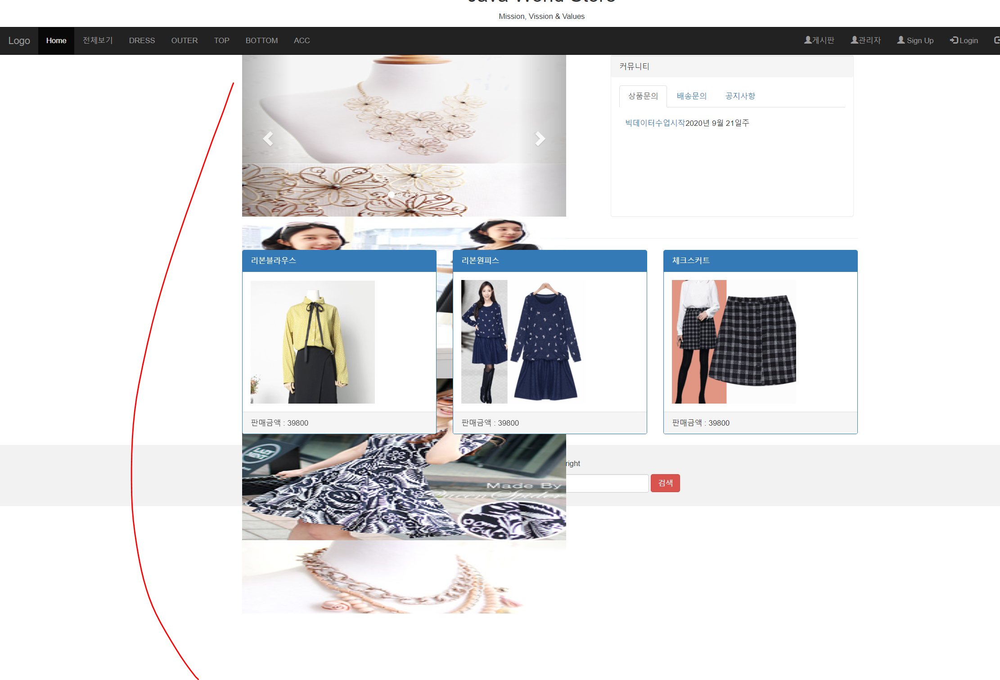
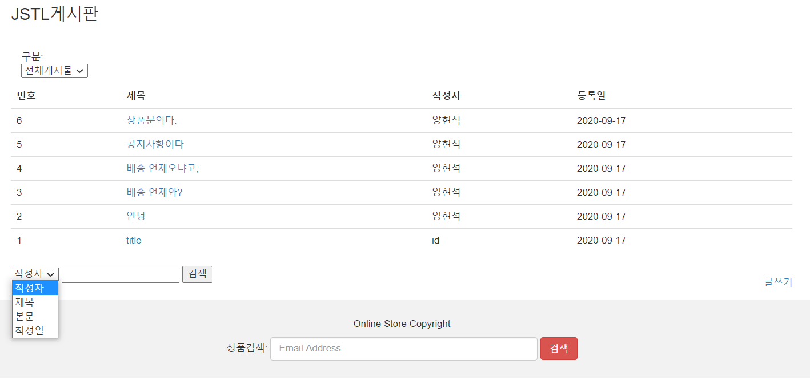

## 9/18(금)

#### Maven기반 Spring 프로젝트 구성

--------

> 쇼핑몰 프로젝트

- 인기 상품 top4 구하는 쿼리문(project.xml)
  - <![CDATA[(쿼리문)]] >을 사용하면 코드 그대로 사용 가능(<=)

```xml
<select id="hitproduct" resultType="product">
	<![CDATA[select p.*, sort_table.sumqty from tb_product p , (select prd_no, sum(qty) 	as sumqty from tb_order_product GROUP by prd_no order by sumqty desc) sort_table
	where p.prd_no = sort_table.prd_no and ROWNUM <=4
	]]>
</select>
```


- 최신 상품 top3 구하는 쿼리문(project.xml)

```xml
<select id="newproduct" resultType="product">
	<![CDATA[select * from (select tb_product.*, rank() over(order by reg_dtm desc) 			myrank from tb_product) rank_table where myrank <= 3
	]]>
</select>
```


- Wrapper for slides(content.jsp)

  - 최신 상품 top3을 띄우기 위한 작업 
  - (문제) 사진이 한 번에 띄어짐

  ```xml
  <!-- Wrapper for slides (hit)-->
  					
  	<div class="carousel-inner" role="listbox">
  		<c:forEach var="hit" items="${prdhit}">
  		<div class="item active">
  			
  		</div>
  		</c:forEach>
  	</div>
  ```

  

  - (해결방안)
    - 첫 번째 제품은 item active로 걸고 나머지는 item으로 걸어줘야 한다.
    - varStatus="mystatus"  : mystatus는 변수명

  ```xml
  <!-- Wrapper for slides (hit)-->
  					
  	<div class="carousel-inner" role="listbox">
  		<c:forEach var="hit" items="${prdhit}" varStatus="mystatus">		
  		<c:choose>
  			<c:when test="${mystatus.index==0}">
  				<div class="item active">
  					
  				</div>
  			</c:when>
  			<c:otherwise>
  				<div class="item">
  					
  				</div>
  			</c:otherwise>
  		</c:choose>	
  		</c:forEach>
  	</div>
  ```

  

- (cf)  <c:foreach items=”${items}” var=”item” varStatus=”status”>

| < c:foreach > 태그 상태 속성 | 설명                        |
| ---------------------------- | --------------------------- |
| ${status.current}            | 현재 아이템                 |
| ${status.index}              | 0부터의 순서                |
| ${status.count}              | 1부터의 순서                |
| ${status.first}              | 현재 루프가 처음인지 반환   |
| ${status.last}               | 현재 루프가 마지막인지 반환 |
| ${status.begin}              | 시작값                      |
| ${status.end}                | 끝값                        |
| ${status.step}               | 증가값                      |


- dynamicsearch(검색)




> mybatis에서 동적SQL 처리

- board.xml
  - sysdate는 눈에 보이지 않지만 시분초까지 나타나 있기에 같은 날짜라도 '=' 를 사용하면 나오지 않을 수 있다.
  - write_date은 string으로 들어오기 때문에 to_date를 이용해 date type으로 변경해준다.

```xml
<select id="dynamicsearch" parameterType="Map" resultType="board">
	select * from board 
	<where>
		<if test="tag=='id' and search !=''">
			id like '%' || #{search} || '%'
		</if>
		<if test="tag=='title' and search !=''">
			title like '%' || #{search} || '%'
		</if>
		<if test="tag=='content' and search !=''">
			content like '%' || #{search} || '%'
		</if>
		<if test="tag=='write_date' and search !=''">
			<![CDATA[
				to_date(write_date) <= #{search}
			]]>
		</if>
	</where>
</select>
```


- MybatisBoardDAOImpl.java

```java
public List<BoardDTO> dynamicSearch(String tag, String search) {
	Map<String,String> map = new HashMap<String, String>();
	map.put("tag", tag);
	map.put("search", search);
	return sqlSession.selectList("kr.encore.bigdataShop.board.dynamicsearch",map);
}
```


> 파일 업로드 

- 파일업로드를 사용하기 위해서 view는 반드시 post 방식을 사용

- spring-config.xml 설정 파일

```xml
<!-- ======================파일업로드============================ -->
	<beans:bean id="filterMultipartResolver"
			class="org.springframework.web.multipart.commons.CommonsMultipartResolver">
		<beans:property name="maxUploadSize" value="4000000"/>	
	</beans:bean>
```


- pom.xml

```xml
<!-- 파일업로드 -->
	<dependency>
		<groupId>commons-fileupload</groupId>
		<artifactId>commons-fileupload</artifactId>
		<version>1.2</version>
	</dependency>
	<dependency>
		<groupId>commons-io</groupId>
		<artifactId>commons-io</artifactId>
		<version>1.4</version>
	</dependency>
```


- FileUploadLogic.java (파일 업로드 수행 코드)
  - MultipartFile: 파일 하나 
  - getBytes : 파일 하나를 byte 변환

```java
package kr.encore.bigdataShop.board;

import java.io.File;
import java.io.FileOutputStream;
import java.io.IOException;

import org.springframework.stereotype.Service;
import org.springframework.web.multipart.MultipartFile;


@Service
public class FileUploadLogic {
	FileOutputStream fos;
	public void upload(MultipartFile file,String path,String fileName){
		try {
			byte[] data = file.getBytes();
			fos = 
			new FileOutputStream(path+File.separator+fileName);
			fos.write(data);
		} catch (IOException e) {
			// TODO Auto-generated catch block
			e.printStackTrace();
		}finally{
			try {
				if(fos!=null)fos.close();
			} catch (IOException e) {
				// TODO Auto-generated catch block
				e.printStackTrace();
			}
		}
	}
}
```


- 업로드 되는 폴더 생성 (upload 폴더)
- controller.java

```java
//파일업로드, 다중행 insert, 트랜잭션
	@RequestMapping("/board/user/insert.do")
	public String write(BoardDTO board, HttpServletRequest req) throws Exception{
		System.out.println("controller =>"+board);
		//파일 업로드를 하기 위해서 MultipartFile객체를 업로드 하는 로직
		//=> mybatis에서 insert할 데이터 포맷으로 변경
		MultipartFile[] files = board.getFiles();
		
		//업로드할 파일의 정보 
		ArrayList<String> filelist = new ArrayList<String>();
		
		//1. 서버가 인식하는 저장위치, 파일, MultipartFile 객체 정보를 FileUploadLogic로 전달
		String path = WebUtils.getRealPath(req.getSession().getServletContext(), "/WEB-INF/upload");
		
		System.out.println("path==>"+path);
		
		//2. FileUploadLogic 객체의 기능을 호출하며 파일 업로드 처리 
		//사용자가 업로드한 파일(files)의 개수만큼 작업
		for (int i = 0; i < files.length; i++) {
			//파일명 추출
			String fileName = files[i].getOriginalFilename();
			if(fileName.length()!=0) {
				//파일명을 ArrayList에 추가
				filelist.add(fileName);
				//업로드
				uploadService.upload(files[i], path, fileName);
			}
		}
		
		//3. BoardService의 insert 호출하여 전달
		int result = service.insert(board,filelist);
		
		System.err.println(result+"개 삽입 성공");
		return "redirect:/board/list.do?category=all";
	}
```

- 쿼리문

```xml
<insert id="fileinsert" parameterType="Map" >
	insert all
	<foreach collection="filelist" item="file" separator=" ">
		into board_file values(board_seq.currval,#{file})
	</foreach>
	select * from dual
</insert>
```


- upload 폴더 위치 : C:\stswork\.metadata\.plugins\org.eclipse.wst.server.core\tmp0\wtpwebapps\bigdataShop\WEB-INF\upload


