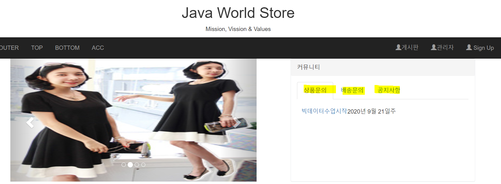

## 9/20(월)

#### Maven기반 Spring 프로젝트 구성

--------

> JSON

- 생성된 JSON이나 텍스트의 형태로 작성된 JSON에 대해서 Validation을 하고 싶을때 사용할 수 있는 사이트

  https://jsonlint.com/

- JSON dependency
  
  - db에서 조회한 데이터를 json array로 자동으로 변환

```xml
<dependency>
	<groupId>com.fasterxml.jackson.core</groupId>
	<artifactId>jackson-core</artifactId>
	<version>2.4.6</version>
</dependency>
<dependency>
	<groupId>com.fasterxml.jackson.core</groupId>
	<artifactId>jackson-databind</artifactId>
	<version>2.4.6</version>
</dependency>
```


- 비동기 방식으로 데이터 띄우기 




- BoardController.java

```java
//게시글 검색 - 동적변경(tag가 변경)
	@RequestMapping("/board/search.do")
	public ModelAndView list(String tag, String search) { //뷰로 데이터 넘겨줘야하면 modelandview
		List<BoardDTO> result = service.dynamicSearch(tag, search);
		ModelAndView mav = new ModelAndView();
		//사용자가 선택한 category정보를 view단으로 넘겨주기 위해 공유
		mav.addObject("boardlist",result);
		mav.setViewName("board/list");
		return mav;
	}
```


- content.jsp
  - li 모두한테 걸어줌(each를 사용하여 반복작업) : each를 사용하지 않으면 li하나하나 걸어줘야함

```jsp
<script type="text/javascript">
	$(document).ready(function () {
		//id 속성이 boardCategory로 정의된 ul안의 모든 li태그에 이벤트를 설정
		$("#boardCategory>li").each(function() {
			$(this).click(function(){
				//alert("선택됨")
				//현재 선택한 li가 활성화 되도록 기존에 설정된 class 속성을 지우고
				//현재 선택된 li의 class속성을 active로 설정
				$("#boardCategory>li").removeAttr("class");
				$(this).attr("class","active");
				category = $(this).text();
				//alert(category)
				//현재 선택한 li가 click되면 ajax요청할 수 있도록 처리
				
				/*
					<ajax함수의 매개변수>
					url: ajax 요청할 path(Controller에 RequestMapping한 path)
					type: 요청방식 - post, get
					data: ajax 요청하며 서버쪽으로 넘길 파라미터 리스트(파라미터가 여러 개인 경우 json객체로 만들어 넘긴다.)
					success: ajax 요청이 성공했을 때 실행할 함수를 정의(함수명만 명시해도 됨)
							아래와 같은 형식으로 함수를 정의하는데 jquery 내부에서 
							서버에서 전달받은 json객체를 파싱해서 data변수에 전달함 
							=>function(data){
								//ajax요청으로 받은 데이터를 원하는 위치에 출력하는 작업을 수행
							}
					error: ajax요청이 실패했을 때 실행될 함수를 정의
							아래와 같은 형식으로 정의, 에러원인, ajax 요청객체 등이
							function의 파라미터로 전달
							function(a,b,c){
						
							}
				*/
				$.ajax({
					url: "/bigdataShop/board/ajax_boardlist.do" ,
					type: "get",
					data:  {
								"category" : category
							},
					success: function(data){ //익명으로 함수 생성
						//alert(data[0].title);
						//ajax통신으로 전달받은 데이터를 view에 적절하게 출력
						//mydatalist라는 id로 정의된 엘리먼트의 하위로 추가 
						/* 
						<tr>
							<td class="boardContent" style="width:120px"><a href="/bigdataShop/board/read.do?board_no=${board.board_no}&state=READ">${board.title}</a></td>
							<td class="boardDate" style="">${board.write_date}</td>
						</tr>
						*/
						mydata = ""; //json 객체의 데이터를 추가할 변수 
						for (var i = 0; i < data.length; i++) {
							mydata = mydata + "<tr>"
								+"<td class='boardContent' style='width:120px'><a href='/bigdataShop/board/read.do?board_no="+data[i].board_no+"&state=READ'>"+data[i].title+"</a></td>"
								+"<td class='boardDate' style=''>"+data[i].write_date+"</td>"
						}
						//alert(mydata);
						$("#mydatalist").empty(); //mydatalist의 하위엘리먼트 삭제
						$("#mydatalist").append(mydata); //mydatalist에 child 추가 
					},
					error: function(a,b,c){ //ajax 실패시 원인
						alert(c);
					}
				})
				
			});
		})
	});
</script>
```

```jsp
<div class="panel-body">
	<ul class="nav nav-tabs" id="boardCategory">
		<li class="active"><a href="#">상품문의</a></li>
		<li><a href="#">배송문의</a></li>
		<li><a href="#">공지사항</a></li>
	</ul>
	<div id="boardMain" style="padding-top: 20px; padding-left: 10px;width: 550px;height: 150px">
		<table id="mydatalist">
			<c:forEach var="board" items="${boardlist}">
			<tr>
				<td class="boardContent" style="width:120px"><a href="/bigdataShop/board/read.do?board_no=${board.board_no}&state=READ">${board.title}</a></td>
				<td class="boardDate" style="">${board.write_date}</td>
			</tr>
			</c:forEach>
		</table>		
    </div>
</div>
```


- IndexController.java

```java
package main;

import java.util.List;

import org.springframework.beans.factory.annotation.Autowired;
import org.springframework.stereotype.Controller;
import org.springframework.web.bind.annotation.RequestMapping;
import org.springframework.web.servlet.ModelAndView;

import kr.encore.bigdataShop.board.BoardDTO;
import kr.encore.bigdataShop.board.BoardService;
import kr.encore.bigdataShop.product.ProductService;
import kr.encore.bigdataShop.product.ProductVO;

@Controller
public class IndexController {
	
	@Autowired
	ProductService service; //히트상품, new상품 
	@Autowired
	BoardService boardService; //상품문의 관련 게시물
	
	@RequestMapping("/index.do")
	public ModelAndView index() {
		//service의 hitproduct()와 newproduct()를 호출해서
		//결과를 content.jsp로 넘긴다.
		
		ModelAndView mav = new ModelAndView();
		List<ProductVO> prdnew = service.newproduct();
		List<ProductVO> prdhit = service.hitproduct();
		
		List<BoardDTO> boardlist = boardService.boardList("상품문의");
		mav.addObject("boardlist", boardlist);
		
		mav.addObject("prdnew", prdnew);
		mav.addObject("prdhit", prdhit);
		mav.setViewName("index");
		return mav;
	}
}
```


---------

#### 트랜잭션

--------------

> 트랜잭션 처리

- TransactionBasicTest.java

```java
package transaction;

import java.sql.Connection;
import java.sql.DriverManager;
import java.sql.PreparedStatement;
import java.sql.SQLException;

public class TransactionBasicTest {
	public static void main(String[] args) {
			String url = "jdbc:oracle:thin:@127.0.0.1:1521:xe";
			String user = "encore";
			String password = "encore";
			String sql ="";
			Connection con =null;
			PreparedStatement ptmt =null;
		
			//현재 상태 값을 저장할 boolean변수 선언
			//정상 완료가 되면 state는 true, 비정상 완료 시 state는 false
			boolean state = false;
			try{
				Class.forName("oracle.jdbc.driver.OracleDriver");
				con = DriverManager.getConnection(url, user, password);
		
				//java program안에서 auto commit을 해제 - 수동 설정
				//con.setAutoCommit(false); 트랜잭션의 시작을 인식
				con.setAutoCommit(false);
				
				sql = "insert into emp 					                      									values('1','1111','111','111',sysdate,'1111',1000,'1111')";
				ptmt = con.prepareStatement(sql);
				ptmt.executeUpdate();
				
			
				sql = "insert into emp 																			values('2','2222','2222','2222',sysdate,'2222',1000,'2222')";

				ptmt = con.prepareStatement(sql);
				ptmt.executeUpdate();
				
				sql = "insert into emp 																			values('3','3333','3333','3333',sysdate,'3333',1000,'3333'";

				ptmt = con.prepareStatement(sql);
				ptmt.executeUpdate();
				
				state = true;
				
			}catch(ClassNotFoundException e){
				e.printStackTrace();
			}catch(SQLException e){
				e.printStackTrace();
			}finally{
				//state 값에 따라서 정상처리 or 비정상처리를 실행할 수 있도록 구현
					try {
						if(state) {//정상처리
							con.commit();//db의 모든 작업을 commit한다.
						}else {
							con.rollback();//db의 모든 작업을 취소한다.
						} 
					}catch (SQLException e) {
						e.printStackTrace();
					}
			 }
		}
}
```


------------

#### AOP

----------------

> AOP

- 관점지향 프로그래밍
- 핵심기능과 공통기능을 각각의 코드로 구현한 후 필요한 곳에서 적절하게 조합해서 완성된 코드로 실행되도록 하는 프로그래밍 기법


> 용어

- core concern(핵심기능) - 비지니스로직(주업무)

- cross-cutting concern(공통기능) - 부가기능(보조업무)

  => 로깅, 트랜잭션 처리, 자원처리, 보안처리...

- code

  - core concern 구현된 객체

- advice

  - cross-cutting concern이 구현된 객체
  
- joinPoint

  - code와 advice를 연결할 수 있도록 도와주는 설정정보 즉, advice를 적용할 지점에 대한 정보 (메소드 호출, 필드값을 변경...)

- Point-cut

  - joinPoint의 부분집합으로 실제 advice가 적용되는 joinpoint를 의미

  - aop를 적용할 조건을 의미한다. - 표현식으로 정의

  - [형식]

    execution(패키지정보 클래스정보 메소드정보 매개변수정보)

    - *: 모든 것을 의미
    - .. : 매개변수가 있거나 없거나 
    - execution(public void set*(..)) : return 타입이 void이고 파라미터가 0개 이상 메소드는 set으로 시작하는 메소드
    - execution(* encore.bigdataShop.board.*. *())  : encore.bigdataShop.board 패키지의 파라미터가 없는 모든 메소드를 의미 
    - execution(* encore.bigdataShop.board..*. *()) : encore.bigdataShop.board 패키지와 하위패키지의 파라미터가 없는 모든 메소드를 의미 
    - ex) UserDAO 클래스의 get으로 시작하는 메소드가 호출 전에 공통 모듈을 실행 

- weaving

  - code, advice, point-cut을 조합해서 어플리케이션이 적절하게 실행될 수 있도록 

  


