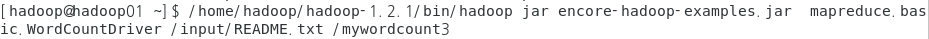

## 9/25(금)

#### 파일 읽고 쓰기

--------

**이클립스에서 폴더 작성하기 **

- 자바 프로젝트 생성 
  - 이클립스에서 맵리듀스를 작성할 프로젝트를 생성


- Ant를 이용한 빌드 파일
  - clean-lib / clean-src: 파일을 지우는 작업 수행
  - build-lib : jar파일 생성 (basedir에 있는 파일을 묶어서 jar로 만들어 build)


- hdfs.exam 패키지 생성 후 HDFSTest01.java 클래스 생성


> 이클립스에서 하둡 실행하기

- remote system explore Hadoop 계정으로 로그인


- hadoop-core-1.2.1.jar 파일 복사 


- Local 아무 폴더에 붙여넣기


- spring으로 이동하여 Build Path


- add External JARs... (hadoop-core-1.2.1.jar 추가)


- conf 패키지에 있는 파일들이 설정정보에 대한 작업을 할 수 있도록 도와주는 역할을 한다.


- HDFSTest01.java - output

```java
package hdfs.exam;

import java.io.IOException;

import org.apache.hadoop.conf.Configuration;
import org.apache.hadoop.fs.FSDataOutputStream;
import org.apache.hadoop.fs.FileSystem;
import org.apache.hadoop.fs.Path;

public class HDFSTest01 {

/*
 * hdfs(하둡의 분산 파일 시스템)를 제어 - hadoop API로 제어
 * api를 이용해서 hdfs에 파일을 생성하는 예제
 * 사용자가 정의한 경로에 텍스트 파일을 생성하는 작업을 실행
 * 
 */
	public static void main(String[] args) {
		//1. hdfs를 제어하기 위해서 설정파일에 정의된 내용을 api내부에서 접근할 수 있어야 한다.
		//	- 내부적으로 설정정보를 접근할 수 있도록 설정정보를 모델링한 객체를 생성
		Configuration conf = new Configuration();
		
		//2. hdfs를 모델링해놓은 객체 - hdfs를 접급할 수 있도록 객체를 생성해야 한다.
		FileSystem hdfs = null;
		
		//3. hdfs로 출력할 수 있는 기능을 갖고 있는 출력 스트림
		//	- FileWriter fw = null;과 동일한 작업
		FSDataOutputStream hdfsout = null;
		
		//싱글톤 패턴(객체를 하나만 생성) 사용 
		try {
			hdfs = FileSystem.get(conf);
			
			//3. hdfs의 경로를 인식하는 객체를 이용해서 출력할 파일이 저장될 경로를 정의
			//	=> 실행할 때 파일 경로를 명령문으로 입력받아서 사용할 수 있도록 명령행 매개변수로 등록
			Path path = new Path(args[0]);
			
			//4. hdfs의 파일을 저장하게 만들면 된다.
			hdfsout = hdfs.create(path); //fw = new FileWriter("파일명"); 과 동일한 작업
			hdfsout.writeUTF(args[1]); //명령행 매개변수로 입력한 문자열을 파일에 쓰기
		} catch (IOException e) {
			e.printStackTrace();
		}
		
	}

}
```


> 패키징 작업

- xml파일 실행 - ant 실행


- 실행하면 빌드 폴더 생성


- remote system - jar copy


- 붙여넣기


- copy 확인


- jar  파일 실행하기
  - jar : 파일을 실행하는 명령어
  - 메인매소드를 가지고 있는 어플리케이션 명 추가


- 에러 input 폴더가 이미 있어서 발생


- 파일명 수정


- 확인 - hadoop01:50070
  - output이 실행됨


- input 실행하기
  - 사용자가 지정한 경로에 저장된 파일의 내용을 읽어서 콘솔에 저장

```java
package hdfs.exam;

import java.io.IOException;

import org.apache.hadoop.conf.Configuration;
import org.apache.hadoop.fs.FSDataInputStream;
import org.apache.hadoop.fs.FSDataOutputStream;
import org.apache.hadoop.fs.FileSystem;
import org.apache.hadoop.fs.Path;

public class HDFSTest02 {

/*
 * hdfs(하둡의 분산 파일 시스템)를 제어 - hadoop API로 제어
 * api를 이용해서 hdfs에 파일을 생성하는 예제
 * 사용자가 지정한 경로에 저장된 파일의 내용을 읽어서 콘솔에 출력
 * 
 */
	public static void main(String[] args) {
		//1. hdfs를 제어하기 위해서 설정파일에 정의된 내용을 api내부에서 접근할 수 있어야 한다.
		//	- 내부적으로 설정정보를 접근할 수 있도록 설정정보를 모델링한 객체를 생성
		Configuration conf = new Configuration();
		
		//2. hdfs를 모델링해놓은 객체 - hdfs를 접급할 수 있도록 객체를 생성해야 한다.
		FileSystem hdfs = null;
		
		//3. hdfs에 저장된 입력데이터를 읽을 수 있는 스트림
		//	- FileReader fw = null;과 동일한 작업
		FSDataInputStream hdfsin = null;
		
		//싱글톤 패턴(객체를 하나만 생성) 사용 
		try {
			hdfs = FileSystem.get(conf);
			
			//3. hdfs의 경로를 인식하는 객체를 이용해서 출력할 파일이 저장될 경로를 정의
			//	=> 실행할 때 파일 경로를 명령문으로 입력받아서 사용할 수 있도록 명령행 매개변수로 등록
			Path path = new Path(args[0]);
			
			//4. hdfs의 파일을 저장하게 만들면 된다.
			hdfsin = hdfs.open(path); //fw = new FileReader("파일명"); 과 동일한 작업
			String data = hdfsin.readUTF();
			System.out.println("hdfs에서 읽은 데이터 : "+data);
		} catch (IOException e) {
			e.printStackTrace();
		}
		
	}

}
```


- Mission
  - HDFSFileCopy.java
    - 지정한 경로의 파일을 읽어서
    - 지정한 경로로 복사하기
    - 명령행 매개변수를 이용


- HDFSFileCopy.java

```java
package hdfs.exam;

import java.io.IOException;

import org.apache.hadoop.conf.Configuration;
import org.apache.hadoop.fs.FSDataInputStream;
import org.apache.hadoop.fs.FSDataOutputStream;
import org.apache.hadoop.fs.FileSystem;
import org.apache.hadoop.fs.Path;

public class HDFSFileCopy {

	public static void main(String[] args) {
		Configuration conf = new Configuration();
		FileSystem hdfs = null;
		
		FSDataInputStream hdfsin = null;
		FSDataOutputStream hdfsout = null;
		
		try {
			hdfs = FileSystem.get(conf);
			//원본 파일 경로
			Path oripath = new Path(args[0]);
			//복사될 파일 경로
			Path copypath = new Path(args[1]);
			
			hdfsin = hdfs.open(oripath);
			String data = hdfsin.readUTF();
			
			hdfsout = hdfs.create(copypath);
			hdfsout.writeUTF(data);
			
		} catch (IOException e) {
			e.printStackTrace();
		}
	}
}
```


- input_test의 있는 내용을 복사하여 copy_test 텍스트 파일을 생성하여 내용 복사


- 결과 확인


- /input/README.txt 파일 읽기
  - HDFSFileCopy02.java

```java
package hdfs.exam;

import java.io.IOException;

import org.apache.hadoop.conf.Configuration;
import org.apache.hadoop.fs.FSDataInputStream;
import org.apache.hadoop.fs.FSDataOutputStream;
import org.apache.hadoop.fs.FileSystem;
import org.apache.hadoop.fs.Path;

public class HDFSFileCopy02 {

	public static void main(String[] args) {
		Configuration conf = new Configuration();
		FileSystem hdfs = null;
		
		FSDataInputStream hdfsin = null;
		FSDataOutputStream hdfsout = null;
		
		try {
			hdfs = FileSystem.get(conf);
			//원본 파일 경로
			Path oripath = new Path(args[0]);
			//복사될 파일 경로
			Path copypath = new Path(args[1]);
			
			hdfsin = hdfs.open(oripath);
			hdfsout = hdfs.create(copypath);

			while(true) {
				int data = hdfsin.read(); //바이트 단위로 읽음
				if(data==-1) {
					break;
				}
				System.out.println((char)data);
				hdfsout.write((char)data);
			}
			
			
		} catch (IOException e) {
			e.printStackTrace();
		}finally {
			try {
				if(hdfsout != null) hdfsout.close();
			}catch (IOException e) {
				e.printStackTrace();
			}
		}
	}

}

```


- copy


- 확인


---------

#### Hadoop Mapreduce 활용

---------------

> wordcount 만들기 

- mapreduce

  0. mapreduce의 사용

     1) 활용도가 높은 분야

     - 병령도가 높은 단순작업
     - 대량의 이미지 포멧을 다른 포멧으로 변환하는 작업
     - 대량의 텍스트 파일에서 특정 단어가 나타난 파일만 찾는 작업
   - 로그분서
     - 머신러닝을 위한 데이터 생성 및 학습

     2) mapreduce의 사용 부적합 분야

     - real time의 데이터 처리
   - 반복실행이 필요한 작업 : shuffle단계에서 오버헤드가 크다.
  

  
1. MapReduce프레임워크 내부에서 사용되는 데이터 타입
  
   분산환경에서 처리되므로 데이터 타입이 일반 자바에서 사용하는 기본 데이터 타입이 아니라 하둡 내부에서 작성된 인터페이스(Writable)를 상속하는 특별한 클래스타입이어야 한다.
  
   		- int : IntWritable
     		- long : LongWritable
   		- String : Text
  
   
  
2. 기본 작업
  
   1) Mapper
  
    - Mapper를 상속하여 작성
  
      : Mapper<KEYIN, VALUEIN, KEYOUT, VALUEOUT>
  
         	* KEYIN : mapper에 input되는 데이터의 key타입(byte offset이나 라인넘버로 생각)
  
      ​			 => 라인넘버가 long타입
  
      ​	   * VALUEIN : mapper에 input되는 데이터의 value타입
  
      ​	   * KEYOUT : mapper에 output되는 데이터의 key타입
  
      ​	   * VALUEOUT : mapper에 output되는 데이터의 value타입 (매퍼거치고 나면 무조건 1이므로 상수로 정의하는 작업을 실행해야함 - int)
  
   	- map 메소드 오버라이딩
  
   ​			protected void map(key, value, context 객체){
  
   ​			// key: 입력키
  
   ​			// value: 입력 데이터
  
   ​			// context 객체 : hadoop MapReduce 프레임워크 내부에서 통신을 담당하는 객체
  
​									맵리듀스가 통신하면서 맵의 출력 데이터를 기록하고 맵의 출력데이터를       									Shuffle하기 위해서 내보내는 작업을 수행.
  
​									메시지 갱신, 처리, 프레임워크 내부에서 통신할 때 필요한 여러가지 기본작업을 									처리하는 객체
  
​				}
  
- 2) reducer
  
  - 집계작업
  
     - reducer를 상속 
  
     - 리듀서에 전달된 입력값과 value를 활용해서 집계할 수 있도록 코드를 작성
  
     - reduce 메소드를 오버라이딩
  
     - protected void reduce(key, value, context 객체){
  
       ​	//reduce메소드에 전달되는 key의 타입, value 타입
  
       ​	//book, [1,1,1,1,1,1..]
  
       ​	key : Text
  
       ​	value : Iterable 타입
  
  ​	
  
  }
  
- 3) Driver
  
    - 맵리듀스를 실행하기 위한 처리를 정의하는 클래스
  
      1) 맵리듀스를 실행하기 위한 job을 생성 
  
      2) job을 처리할 실제 클래스에 대한 정보를 정의(Mapper, Reducer, Driver)
  
      3) input 데이터와 output데이터의 포멧을 정의(hdfs에 텍스트 파일의 형태로 input/output이 들어감)
  
      4) 리듀서의 출력데이터에 대한 key와 value의 타입을 명시
  
      5) hdfs에 저장된 파일을 읽어오고 처리결과를 저장할 수 있도록 path정보를 설정
  
      6) 1번부터 5번까지의 설정한 내용을 기반으로 실제 job이 실행될 수 있도록 명령
  
    - 
  
  


- 프로젝트 생성(java project)


- Bulid Path 


- ladd external jars...


- hadoop-core-1.2.1-jar파일 추가


- apply


- WordCountMapper.java (mapper)

```java
package mapreduce.basic;

import java.io.IOException;
import java.util.StringTokenizer;

import org.apache.hadoop.io.IntWritable;
import org.apache.hadoop.io.LongWritable;
import org.apache.hadoop.io.Text;
import org.apache.hadoop.mapreduce.Mapper;

public class WordCountMapper extends Mapper<LongWritable, Text, Text, IntWritable>{
	
	//map 메소드의 실행 결과 중 map의 output value를 저장할 변수
	private final static IntWritable one = new IntWritable();
	private Text OutputKeys = new Text(); //만든 변수명 : map메소드 실행 결과 중 key를 저장할 변수 
	@Override					//mapper class안에 정의되어 있는 inner class(context)
	protected void map(LongWritable key, Text value, Mapper<LongWritable, Text, Text, IntWritable>.Context context)
			throws IOException, InterruptedException {
		//value에 한 라인에 해당하는 문장이 전달된다. ex) read a book
		StringTokenizer st = new StringTokenizer(value.toString()); //구분자를 정해주지 않으면 space를 구분자로 사용(default)
		while(st.hasMoreElements()) { //토큰(구분자로 나눈 글자)이 있으면 true 없으면 false를 return
			String token = st.nextToken();
			OutputKeys.set(token); //분리한 단어를 outputKey라는 Text타입의 변수에 세팅
			//context객체에 값을 세팅
			context.write(OutputKeys, one);
		}
	}	
}
```


- WordCountReducer(reducer) 
  - mapper에서 나눈 글자를 같은 글자끼리 합쳐서 sum하는 작업

```java
package mapreduce.basic;

import java.io.IOException;

import org.apache.hadoop.io.IntWritable;
import org.apache.hadoop.io.Text;
import org.apache.hadoop.mapreduce.Reducer;

//book , [1,1,1,1...]
//a, [1,1,1,1...]
public class WordCountReducer extends Reducer<Text, IntWritable, Text, IntWritable>{

	//결과값을 저장할 변수
	private IntWritable resultVal = new IntWritable();
	@Override
	protected void reduce(Text key, Iterable<IntWritable> values,
			Reducer<Text, IntWritable, Text, IntWritable>.Context context)
			throws IOException, InterruptedException {
		int sum = 0;
		
		//합산하는 작업
		for(IntWritable value : values) {
			sum = sum + value.get();	
		}
		resultVal.set(sum) ; //더한 결과를 resultValue에 세팅
		//reduce의 실행결과를 context에 저장
		context.write(key, resultVal);	
	}
}
```


- WordCountDriver.java (Driver 실행)

```java
package mapreduce.basic;

import org.apache.hadoop.conf.Configuration;
import org.apache.hadoop.fs.Path;
import org.apache.hadoop.io.IntWritable;
import org.apache.hadoop.io.Text;
import org.apache.hadoop.mapreduce.Job;
import org.apache.hadoop.mapreduce.lib.input.FileInputFormat;
import org.apache.hadoop.mapreduce.lib.input.TextInputFormat;
import org.apache.hadoop.mapreduce.lib.output.FileOutputFormat;
import org.apache.hadoop.mapreduce.lib.output.TextOutputFormat;

public class WordCountDriver {
	public static void main(String[] args) throws Exception {
		//1.맵리듀스를 실행하기 위한 job을 생성 
		Configuration conf = new Configuration();
		//conf 뒤에는 실행할 job의 이름 
		Job job = new Job(conf,"mywordcout");
		
		//2. job을 처리할 실제 클래스에 대한 정보를 정의(Mapper, Reducer, Driver)
		job.setMapperClass(WordCountMapper.class);
		job.setReducerClass(WordCountReducer.class);
		job.setJarByClass(WordCountDriver.class); //드라이버 클래스
		
		//3. input 데이터와 output데이터의 포멧을 정의(hdfs에 텍스트 파일의 형태로 input/output이 들어감)
		job.setInputFormatClass(TextInputFormat.class);
		job.setOutputFormatClass(TextOutputFormat.class);
		
		//4. 리듀서의 출력데이터에 대한 key와 value의 타입을 명시
		job.setOutputKeyClass(Text.class);  //실제 클래스 정보를 매칭시키기 위해 .class
		job.setOutputValueClass(IntWritable.class); 
		
		//5. hdfs에 저장된 파일을 읽어오고 처리결과를 저장할 수 있도록 path정보를 설정
		FileInputFormat.addInputPath(job, new Path(args[0]));
		FileOutputFormat.setOutputPath(job, new Path(args[1]));
		
		//6. 1번부터 5번까지의 설정한 내용을 기반으로 실제 job이 실행될 수 있도록 명령
		job.waitForCompletion(true);
		
	}
}
```


- build.xml 실행 - build system explore - 하둡에 jar파일 넣기
- 실행




- mission key값이 5글자 이상인 것만 결과로 출력

```java
package mapreduce.basic;

import java.io.IOException;
import java.util.StringTokenizer;

import org.apache.hadoop.io.IntWritable;
import org.apache.hadoop.io.LongWritable;
import org.apache.hadoop.io.Text;
import org.apache.hadoop.mapreduce.Mapper;

public class WordCountMapper extends Mapper<LongWritable, Text, Text, IntWritable>{
	
	//map 메소드의 실행 결과 중 map의 output value를 저장할 변수
	private final static IntWritable one = new IntWritable(1);
	private Text OutputKeys = new Text(); //만든 변수명 : map메소드 실행 결과 중 key를 저장할 변수 
	@Override					//mapper class안에 정의되어 있는 inner class(context)
	protected void map(LongWritable key, Text value, Mapper<LongWritable, Text, Text, IntWritable>.Context context)
			throws IOException, InterruptedException {
		//value에 한 라인에 해당하는 문장이 전달된다. ex) read a book
		StringTokenizer st = new StringTokenizer(value.toString()); //구분자를 정해주지 않으면 space를 구분자로 사용(default)
		while(st.hasMoreElements()) { //토큰이 있으면 true 없으면 false를 return
			String token = st.nextToken();
			if(token.length()>=5) {
				OutputKeys.set(token); //분리한 단어를 outputKey라는 Text타입의 변수에 세팅
				//context객체에 값을 세팅
				context.write(OutputKeys, one);
			}
			
		}
	}	
}
```

