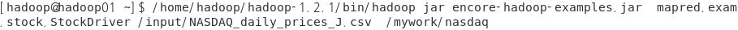

## 9/28(월)

#### mapreduce 기본연습

--------

> 예제1

1. 첨부 파일을 HDFS의 input폴더를 작성하고 put한 후 작업합니다.

​    출력결과 :/mywork/nasdaq

​    패키지명 : mapred.exam.stock

​    StockMapper.java, StockReducer,StockDriver.java


​	exchange => 거래구분

​	stock_symbol =>주식종목명(약칭)

​	date => 거래일자

​	stock_price_open => 시가

​	stock_price_high =>최고가

​	stock_price_low =>최저가

​	stock_price_close => 종가

​	stock_volume =>거래량

​	stock_price_adj_close =>조정금액


​	[문제] 상승마감한 것들이 년도별로 몇 건인지 조회하세요

​	[결과]


- 하둡에서 파일 다운로드(이클립스)


- input 폴더에 파일 넣기


- 패키지, class 생성


- StockMapper.java

```java
package mapred.exam.stock;

import java.io.IOException;

import org.apache.hadoop.io.IntWritable;
import org.apache.hadoop.io.LongWritable;
import org.apache.hadoop.io.Text;
import org.apache.hadoop.mapreduce.Mapper;

public class StockMapper extends Mapper<LongWritable, Text, Text, IntWritable>{
	private final static IntWritable one = new IntWritable(1);
	private Text outputKey = new Text();
	
	@Override
	protected void map(LongWritable key, Text value, Mapper<LongWritable, Text, Text, IntWritable>.Context context)
			throws IOException, InterruptedException {
		
		if(key.get()>0) { //제목행을 제외하고 작업을 수행하겠다는 의미
			String[] line = value.toString().split(","); //string 상태
			if(line!=null && line.length>0) {
				//연도 데이터를 output data의 키로 설정
				outputKey.set(line[2].substring(0,4));
				
				//상승마감을 판단해서 값을 추출(종가 - 시가)
				float resultValue = Float.parseFloat(line[6]) -
									Float.parseFloat(line[3]);
				
				if(resultValue > 0) { //상승마감 상태  - shuffle단으로 내보내기
					context.write(outputKey, one);	
				}
			}
		}
	}
}
```


- StockReducer.java

```java
package mapred.exam.stock;


import java.io.IOException;

import org.apache.hadoop.io.IntWritable;
import org.apache.hadoop.io.Text;
import org.apache.hadoop.mapreduce.Reducer;

//book , [1,1,1,1...]
//a, [1,1,1,1...]
public class StockReducer extends Reducer<Text, IntWritable, Text, IntWritable>{

	//결과값을 저장할 변수
	private IntWritable resultVal = new IntWritable();
	@Override
	protected void reduce(Text key, Iterable<IntWritable> values,
			Reducer<Text, IntWritable, Text, IntWritable>.Context context)
			throws IOException, InterruptedException {
		int sum = 0;
		
		//합산하는 작업
		for(IntWritable value : values) {
			sum = sum + value.get();	
		}
		resultVal.set(sum) ; //더한 결과를 resultValue에 세팅
		//reduce의 실행결과를 context에 저장
		context.write(key, resultVal);	
	}
}
```


- StockDriver.java

```java
package mapred.exam.stock;

import org.apache.hadoop.conf.Configuration;
import org.apache.hadoop.fs.Path;
import org.apache.hadoop.io.IntWritable;
import org.apache.hadoop.io.Text;
import org.apache.hadoop.mapreduce.Job;
import org.apache.hadoop.mapreduce.lib.input.FileInputFormat;
import org.apache.hadoop.mapreduce.lib.input.TextInputFormat;
import org.apache.hadoop.mapreduce.lib.output.FileOutputFormat;
import org.apache.hadoop.mapreduce.lib.output.TextOutputFormat;

public class StockDriver {
	public static void main(String[] args) throws Exception {
		//1.맵리듀스를 실행하기 위한 job을 생성 
		Configuration conf = new Configuration();
		//conf 뒤에는 실행할 job의 이름 
		Job job = new Job(conf,"stock");
		
		//2. job을 처리할 실제 클래스에 대한 정보를 정의(Mapper, Reducer, Driver)
		job.setMapperClass(StockMapper.class);
		job.setReducerClass(StockReducer.class);
		job.setJarByClass(StockDriver.class); //드라이버 클래스
		
		//3. input 데이터와 output데이터의 포멧을 정의(hdfs에 텍스트 파일의 형태로 input/output이 들어감)
		job.setInputFormatClass(TextInputFormat.class);
		job.setOutputFormatClass(TextOutputFormat.class);
		
		//4. 리듀서의 출력데이터에 대한 key와 value의 타입을 명시
		job.setOutputKeyClass(Text.class);  //실제 클래스 정보를 매칭시키기 위해 .class
		job.setOutputValueClass(IntWritable.class); 
		
		//5. hdfs에 저장된 파일을 읽어오고 처리결과를 저장할 수 있도록 path정보를 설정
		FileInputFormat.addInputPath(job, new Path(args[0]));
		FileOutputFormat.setOutputPath(job, new Path(args[1]));
		
		//6. 1번부터 5번까지의 설정한 내용을 기반으로 실제 job이 실행될 수 있도록 명령
		job.waitForCompletion(true);
		
	}
}
```


- jar 파일 하둡에 넣기


- jar 파일 실행




- 결과


- cf) 파일 지우기
  - myword로 시작하는 모든 폴더 지우기


> 예제 2

- 파일 다운로드

https://dataverse.harvard.edu/dataset.xhtml?persistentId=doi:10.7910/DVN/HG7NV7


- 데이터에 대한 정리

http://stat-computing.org/dataexpo/2009/the-data.html


[문제]

**HDFS경로**

**입력 : /input/1987.csv**

**출력 : /mywork/air_result_1**

**=> hdfs에 디렉토리가 없으면 디렉토리를 만들고 작업합니다.**

**에 접속하여 1987년 데이터를 월별로 항공 출발 지연 데이터가 몇 건인지 구하세요. AirMapper, AirReducer, AirDriver(mapred.exam.air)**

[결과]


- 파일 하둡에 넣기


- input 폴더로 이동


- 패키지 생성


- AirMapper.java

```
package mapred.exam.air;

import java.io.IOException;

import org.apache.hadoop.io.IntWritable;
import org.apache.hadoop.io.LongWritable;
import org.apache.hadoop.io.Text;
import org.apache.hadoop.mapreduce.Mapper;

public class AirMapper extends Mapper<LongWritable, Text, Text, IntWritable>{
	private final static IntWritable one = new IntWritable(1);
	private Text outputKey = new Text();
	
	@Override
	protected void map(LongWritable key, Text value, Mapper<LongWritable, Text, Text, IntWritable>.Context context)
			throws IOException, InterruptedException {
		if(key.get()>0) { //제목행을 제외하고 작업을 수행
			String[] line = value.toString().split(",");
			if(line!=null && line.length > 0) {

				if(! line[15].equals("NA")) {
					//월 데이터를 output data의 키로 설정
					outputKey.set(line[1]);
					//항공 출별 지연 데이터
					int resultValut = Integer.parseInt(line[15]);
					if(resultValut>0) {
						context.write(outputKey, one);
					}
				}
				
			}
		}
	}
}
```


- AirReducer.java

```
package mapred.exam.air;

import java.io.IOException;

import org.apache.hadoop.io.IntWritable;
import org.apache.hadoop.io.Text;
import org.apache.hadoop.mapreduce.Reducer;

public class AirReducer extends Reducer<Text, IntWritable, Text, IntWritable>{
	
	private IntWritable resultVal = new IntWritable();
	
	@Override
	protected void reduce(Text key, Iterable<IntWritable> values,
			Reducer<Text, IntWritable, Text, IntWritable>.Context context) 
			throws IOException, InterruptedException {
		int sum = 0;
		
		//합산하는 작업
		for(IntWritable value : values) {
			sum = sum + value.get();
		}
		resultVal.set(sum); 
		context.write(key, resultVal);
	}	
}
```


- AirDriver.java

```
package mapred.exam.air;


import org.apache.hadoop.conf.Configuration;
import org.apache.hadoop.fs.Path;
import org.apache.hadoop.io.IntWritable;
import org.apache.hadoop.io.Text;
import org.apache.hadoop.mapreduce.Job;
import org.apache.hadoop.mapreduce.lib.input.FileInputFormat;
import org.apache.hadoop.mapreduce.lib.input.TextInputFormat;
import org.apache.hadoop.mapreduce.lib.output.FileOutputFormat;
import org.apache.hadoop.mapreduce.lib.output.TextOutputFormat;

public class AirDriver {
	public static void main(String[] args) throws Exception {
		//1.맵리듀스를 실행하기 위한 job을 생성 
		Configuration conf = new Configuration();
		//conf 뒤에는 실행할 job의 이름 
		Job job = new Job(conf,"air");
		
		//2. job을 처리할 실제 클래스에 대한 정보를 정의(Mapper, Reducer, Driver)
		job.setMapperClass(AirMapper.class);
		job.setReducerClass(AirReducer.class);
		job.setJarByClass(AirDriver.class); //드라이버 클래스
		
		//3. input 데이터와 output데이터의 포멧을 정의(hdfs에 텍스트 파일의 형태로 input/output이 들어감)
		job.setInputFormatClass(TextInputFormat.class);
		job.setOutputFormatClass(TextOutputFormat.class);
		
		//4. 리듀서의 출력데이터에 대한 key와 value의 타입을 명시
		job.setOutputKeyClass(Text.class);  //실제 클래스 정보를 매칭시키기 위해 .class
		job.setOutputValueClass(IntWritable.class); 
		
		//5. hdfs에 저장된 파일을 읽어오고 처리결과를 저장할 수 있도록 path정보를 설정
		FileInputFormat.addInputPath(job, new Path(args[0]));
		FileOutputFormat.setOutputPath(job, new Path(args[1]));
		
		//6. 1번부터 5번까지의 설정한 내용을 기반으로 실제 job이 실행될 수 있도록 명령
		job.waitForCompletion(true);
		
	}
}
```


- jar 파일 하둡에 넣기


- 실행


- 결과


------------------

#### Advanced mapreduce

-------------

- 프로젝트 생성(AdvancedMapreduceTest - java project)
  - mapreduce.exam.option.stock 패키지 생성 (안의 내용은 mapred.exam.stock의 내용 복사)
  - build.xml파일 복사


- Build Path - Configure Build Path


- add External JARs... - hadoop-core-1.2.1 jar 파일 추가


> 사용자 정의 옵션 활용


1. GevericOptionParser 활용

- hadoop을 실행할 때 - D옵션과 함께 속성 = 속성값을 입력하면 Mapper에서 이 정보를 사용할 수 있도록 정의

  1) mapper 작성

  - mapper가 실행될 때 한 번 만 실행되는 메소드
  - 하둡을 실행할 때 -D옵션과 함께 입력한 속성명을 지정하면 입력했던 속성값을 추출할 수 있다.
  - Configuration객체를 이용해서 작업


- StockOptionMapper.java에서 override
  - 주어진 옵션값에 따라 수행되는 mapper가 달라짐


- setup 메소드 선택


- StockOptionMapper.jvav

```java
package mapreduce.exam.option.stock;

import java.io.IOException;

import org.apache.hadoop.io.IntWritable;
import org.apache.hadoop.io.LongWritable;
import org.apache.hadoop.io.Text;
import org.apache.hadoop.mapreduce.Mapper;

public class StockOptionMapper extends Mapper<LongWritable, Text, Text, IntWritable>{
	private final static IntWritable one = new IntWritable(1);
	private Text outputKey = new Text();
	
	private String jobType; //하둡실행할 때 입력한 옵션값
	
	@Override
	protected void setup(Mapper<LongWritable, Text, Text, IntWritable>.Context context)
			throws IOException, InterruptedException {
		
		//context.getConfiguration().get("옵션명"); -D옵션과 같이 입력하는 옵션명(옵션값과 같은 이름으로 주지 않아도 된다)
		jobType = context.getConfiguration().get("jobType");
		
	}

	@Override
	protected void map(LongWritable key, Text value, Mapper<LongWritable, Text, Text, IntWritable>.Context context)
			throws IOException, InterruptedException {
		
		if(key.get()>0) { //제목행을 제외하고 작업을 수행하겠다는 의미
			String[] line = value.toString().split(","); //string 상태
			if(line!=null && line.length>0) {
				
				
				//연도 데이터를 output data의 키로 설정
				outputKey.set(line[2].substring(0,4));
				
				// 상승마감
				if(jobType.equals("up")) {
					//상승마감을 판단해서 값을 추출(종가 - 시가)
					float resultValue = Float.parseFloat(line[6]) -
										Float.parseFloat(line[3]);
					if(resultValue > 0) { //상승마감 상태  - shuffle단으로 내보내기
						context.write(outputKey, one);
					}
					
				}else if(jobType.equals("down")) {
					//하락마감
					float resultValue = Float.parseFloat(line[6]) -
										Float.parseFloat(line[3]);
					
					if(resultValue < 0) { //하락마감 상태  - shuffle단으로 내보내기
						context.write(outputKey, one);
					}
				}//else if
			} //if(line)
		}
	}
}
```


