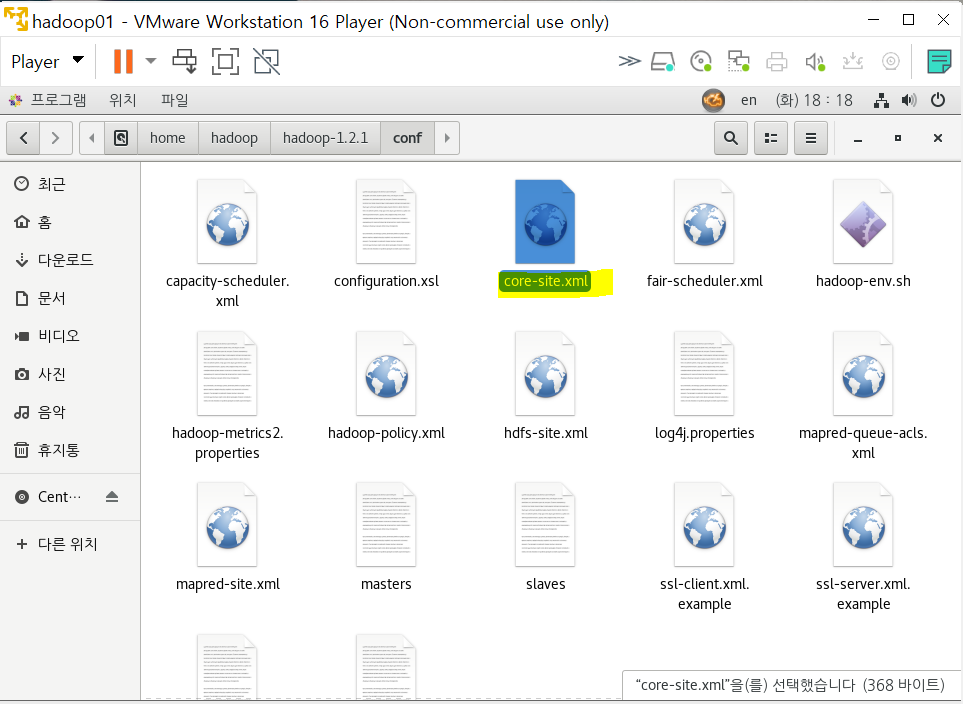
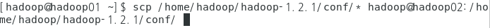
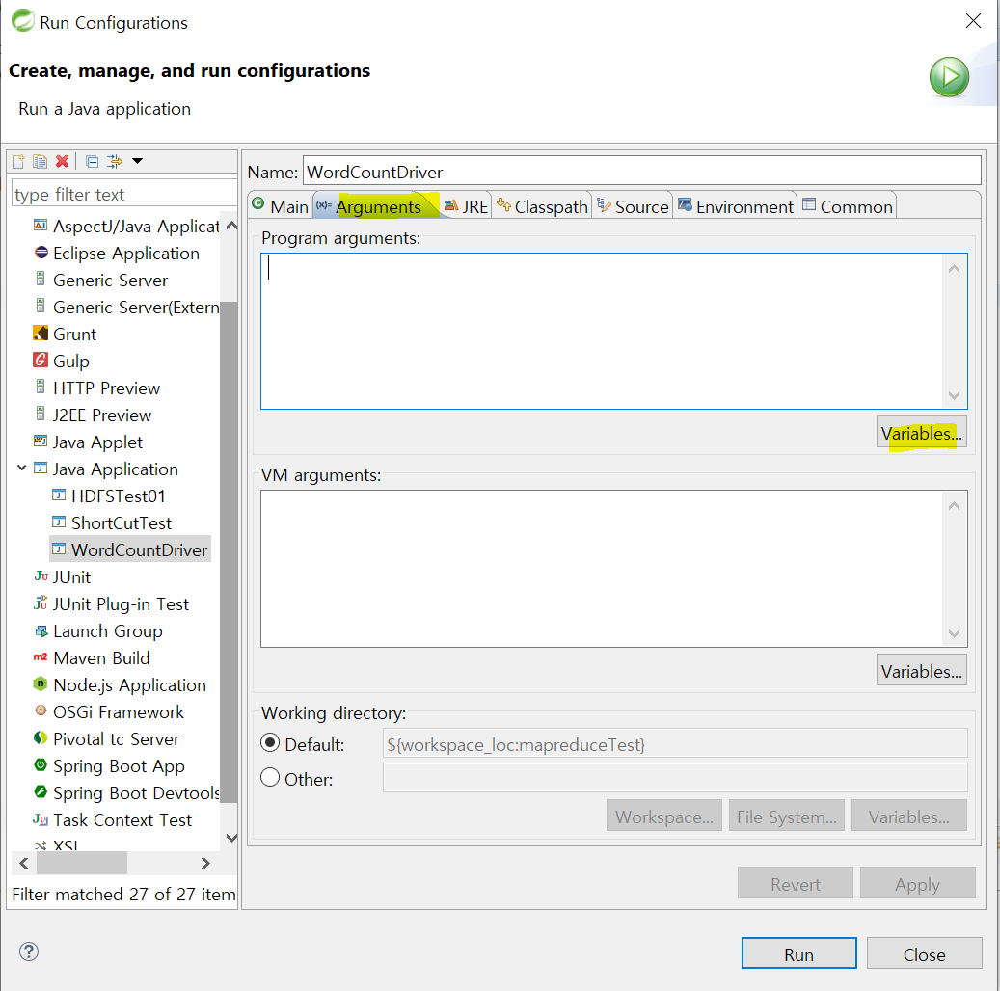
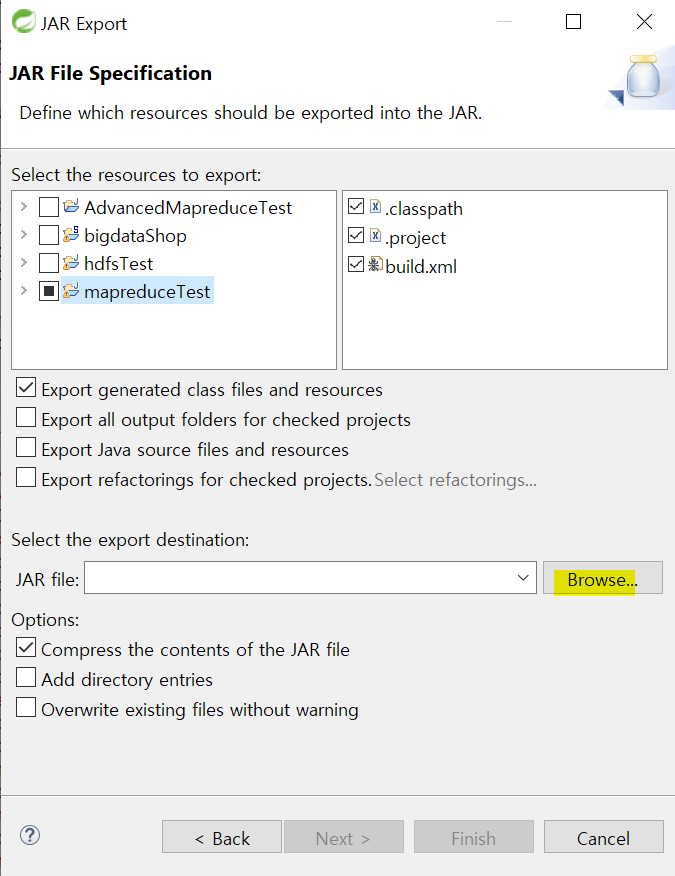
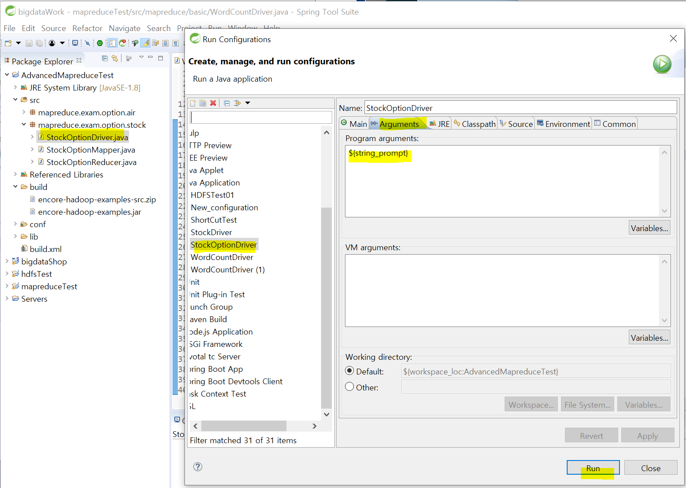

## 9/29(화)

#### 이클립스에서 바로 하둡 실행하기

--------

> 하둡 설정 변경

- 하둡 stop - core-site.xml 




- hdfs.site.xml 설정
  - hostname에서 ip주소로 변경 
  - <name>dfs.permissions</name> : 권한을 false로 설정


- mapred-site.xml 설정 변경
  - jobtraker의 
  - mapreduce.jobtracker.staging.root.dir : 외부에서 접근할 수 있는 폴더 설정 
  - <value>/</value> : root부터 접근 허용 


- 다른 머신에 copy
  - 02, 03, 04 모두




- hadoop start


- 하둡 제대로 켜져있는지 확인


> 이클립스 실행

- mapreduceTest 프로젝트에 conf, lib 폴더 생성
  - 하둡을 실행할 때 필요한 library와 설정정보 저장할 폴더 생성


- 하둡에 있는 library copy


- mapreduceTest 프로젝트 lib에 paste


- 하둡에 있는 conf 폴더의 설정 파일 copy


- mapreduceTest 프로젝트 conf에 paste


> library 등록

- Build Path - Configure Bulid Path


- lib의 library모두  추가 


- Add Class Folder - conf 폴더 선택


- 에러 해결을 위하여 빌드패스 들어가기 


- txt 파일 삭제 


> 명령행 매개변수 등록

- WordCountDriver.java 선택하고 run Configurations


- 더블클릭하면 wordcount가 생성


- Arguments




- 


- 


- input path와 output path를 줘야함
  - input 밑의 readme.txt


- 에러발생
  - input path does not exist
  - path를 지정하지 않으면 /user/whtpw/input/README.txt에 들어감(window의 기본 경로)


- 경로 수정(Run As - 1 Java Application)


- 절대경로로 설정해야 한다.


- 에러 발생
  - 내부적으로 jar파일을 인식하는데 jar파일을 build에 만들어 놓기만 했지 프로젝트에 인식시키는 작업을 하지 않음


- 에러 해결 - 내부에서 jar파일을 인식시켜야함 
  - 내부에서 자르파일 인식하려


- Java - Jar file 선택


- jar파일 경로 설정
  - Browse 선택




- workspace의 mapreduceTest 프로젝트로 들어가서 mapred-exam 설정


- finish


- 빌드패스 들어가서 add External JARs - 생성된 jar파일 추가


- 생성된 jar 파일 add to build path


- wordcount는 이미 존재하는 이름이므로 wordcont2로 실행


- 결과 확인


> Mission StockOptionDriver 실행


- lib, conf 추가


- 빌드패스에서 conf, library 추가


- run configurations




- jar 파일 export 수행 (export - java - jar file)


- 생성된 jar파일 add to build path


- run - 옵션 설정


- 결과 확인


---------------

#### MutipleOutputs (다중출력) 

----------

> MutipleOutputs 

- 다중출력 

- 구분값에 따라서 여러 개의 결과 파일을 출력할 때 사용

- GenericOptionParser의 -D옵션에 정의한 구분속성에 따라서 각각의 output파일이 생성될 수 있도록 작업

- 수정 부분

  1. Mapper

  - GenericOptionParser테스트할 때와 동이랗게 구현 단, 각각의 작업을 구분할 수 있도록 outputkey에 구분 문자열을 추가하는 작업 수행

  2. Reducer

  - mapper가 보내오는 출력 데이터에서 구분자 별로 개별 output파일이 생성될 수 있도록 처리
  - setup메소드 : 리듀서가 처음 실행될 때 한 번만 실행되는 메소드 (MultipleOutputs를 선언하고 생성할 수 있도록 처리)
  - reduce메소드 : MultipleOutputs객체의 write를 호출해서 정의해 놓은 구분 문자열(up, down, equal)별로 각각 출력할 수 있도록 구현 
  - cleanup메소드 : 리듀서 작업이 종료될 때 호출되는 메소드 (반드시 MultipleOutputs객체를 종료해야함)  

  

  3.  Driver

  - MultipleOutputs로 출력될 경로를 정의해 준다.

  - 모든 path에 prefix로 구분 문자열(up,down,equal)이 연결될 수 있도록 처리

    


- mapreduce.exam.option.stock 복사


- 이름 변경


- StockMultiMapper.java

```java
package mapreduce.exam.multioutput.stock;

import java.io.IOException;

import org.apache.hadoop.io.IntWritable;
import org.apache.hadoop.io.LongWritable;
import org.apache.hadoop.io.Text;
import org.apache.hadoop.mapreduce.Mapper;

public class StockMultiMapper extends Mapper<LongWritable, Text, Text, IntWritable>{
	private final static IntWritable one = new IntWritable(1);
	private Text outputKey = new Text();
	


	@Override
	protected void map(LongWritable key, Text value, Mapper<LongWritable, Text, Text, IntWritable>.Context context)
			throws IOException, InterruptedException {
		
		if(key.get()>0) { //제목행을 제외하고 작업을 수행하겠다는 의미
			String[] line = value.toString().split(","); //string 상태
			String year = line[2].substring(0, 4);
			
			//종가 - 시가
			float resultValue = Float.parseFloat(line[6]) - Float.parseFloat(line[3]);
			if(resultValue>0) { //상승마감
				outputKey.set("up,"+year);
				context.write(outputKey, one);
			}else if(resultValue<0) {  //하락마감
				outputKey.set("down,"+year);
				context.write(outputKey, one);
			}else if(resultValue==0) {  //동일
				outputKey.set("equal,"+year);
				context.write(outputKey, one);
			}
			
		}
	}
}
```


- StockMultiReducer.java

```java
package mapreduce.exam.multioutput.stock;


import java.io.IOException;

import org.apache.hadoop.io.IntWritable;
import org.apache.hadoop.io.Text;
import org.apache.hadoop.mapreduce.Reducer;
import org.apache.hadoop.mapreduce.lib.output.MultipleOutputs;

//book , [1,1,1,1...]
//a, [1,1,1,1...]
public class StockMultiReducer extends Reducer<Text, IntWritable, Text, IntWritable>{

	private IntWritable resultVal = new IntWritable(); //결과값을 저장할 변수 
	private Text resultKey = new Text();  //결과키를 저장할 변수
	private MultipleOutputs<Text, IntWritable> multiOut ;
	
	
	//setup
	@Override
	protected void setup(Reducer<Text, IntWritable, Text, IntWritable>.Context context)
			throws IOException, InterruptedException {
		//MultipleOutputs 개체를 생성하는 작업
		multiOut = new MultipleOutputs<Text,IntWritable>(context);
	}
	
	//cleanup 리듀서 작업이 종료될 때 호출
	@Override
	protected void cleanup(Reducer<Text, IntWritable, Text, IntWritable>.Context context)
			throws IOException, InterruptedException {
		//생성 해제
		multiOut.close();
	}
	
	
	@Override				//key: up,1987로 넘어옴
	protected void reduce(Text key, Iterable<IntWritable> values,
			Reducer<Text, IntWritable, Text, IntWritable>.Context context)
			throws IOException, InterruptedException {
		//1. Mapper에서 전달받은 key에서 구분자(",")를 기준으로 분리(구분값,key)하는 작업
		//											구분값 = up, down, equal
		String[] keyarr = key.toString().split(",");
		resultKey.set(keyarr[1]); //연도 데이터를 key로 정의 
		
		//2. ketarr[0]에 저장된 각 구분값을 기준으로 처리하는 작업
		if(keyarr[0].equals("up")) {
			int sum = 0;
			for(IntWritable value : values) {
				sum = sum + value.get();
			}
			resultVal.set(sum);
			//MultipleOutputs를 이용하여 출력처리를 할 것이므로 Context 객체의 write를 호출하지 않고
			//Multipleputs의  write를 이용하여 결과를 넘긴다.
			multiOut.write("up", resultKey, resultVal);
			
		}else if(keyarr[0].equals("down")) {
			int sum = 0;
			for(IntWritable value : values) {
				sum = sum + value.get();	
			}
			resultVal.set(sum);
			multiOut.write("down", resultKey, resultVal);
			
		}else if(keyarr[0].equals("equal")) { 
			int sum = 0;
			for(IntWritable value : values) {
				sum = sum+value.get();
			}
			resultVal.set(sum);
			multiOut.write("equal", resultKey, resultVal);
		}
		
		int sum = 0;
		
		//합산하는 작업
		for(IntWritable value : values) {
			sum = sum + value.get();	
		}
		resultVal.set(sum) ; //더한 결과를 resultValue에 세팅
		//reduce의 실행결과를 context에 저장
		context.write(key, resultVal);	
	}
	

}

```


- StockMultiDriver.java

```java
package mapreduce.exam.multioutput.stock;

import org.apache.hadoop.conf.Configuration;
import org.apache.hadoop.conf.Configured;
import org.apache.hadoop.fs.Path;
import org.apache.hadoop.io.IntWritable;
import org.apache.hadoop.io.Text;
import org.apache.hadoop.mapreduce.Job;
import org.apache.hadoop.mapreduce.lib.input.FileInputFormat;
import org.apache.hadoop.mapreduce.lib.input.TextInputFormat;
import org.apache.hadoop.mapreduce.lib.output.FileOutputFormat;
import org.apache.hadoop.mapreduce.lib.output.MultipleOutputs;
import org.apache.hadoop.mapreduce.lib.output.TextOutputFormat;
import org.apache.hadoop.util.GenericOptionsParser;
import org.apache.hadoop.util.Tool;
import org.apache.hadoop.util.ToolRunner;

public class StockMultiDriver extends Configured implements Tool{
   @Override
   public int run(String[] optionlist) throws Exception {
      // 1. 사용자가 입력한 옵션을 처리하기 위해서 GenericOptionParser객체를 활용
      GenericOptionsParser optionParser = 
            new GenericOptionsParser(getConf(), optionlist);
      
      // optionlist에 포함된 -D옵션 이외에 사용자가 입력한 명령행 매개변수와 나머지 공통옵션들은
      // 따로 분리하는 작업을 해야 한다. jobType은 mapper로 전달할 옵션이고 inputpath와
      // outputpath는 일반 매개변수로 처리
      // GenericOptionsParser의 getRemainingArgs메소드를 호출하면 공통옵션과
      // 사용자가 입력한 매개변수를 따로 분리해서 리턴
      // otherArgs : 아래와 같은 옵션과 같이 입력하지 않은 명령형 매개변수
      // -D : 사용자가 입력한 값을 mapper에 전달
      // -fs 
      // -conf
      // -files...
      String[] otherArgs = optionParser.getRemainingArgs();

      // 2. job생성
      Job job = new Job(getConf(), "multiOut_stock");
      job.setMapperClass(StockMultiMapper.class);
      job.setReducerClass(StockMultiReducer.class);
      job.setJarByClass(StockMultiDriver.class);
      
      // 3. input, output 포맷정의
      job.setInputFormatClass(TextInputFormat.class);
      job.setOutputFormatClass(TextOutputFormat.class);
      
      // 4. 리듀서의 출력데이터 key, value의 타입
      job.setOutputKeyClass(Text.class);
      job.setOutputValueClass(IntWritable.class);
      
      // 5. hdfs에 저장된 파일을 읽고 처리결과를 저장할 수 있도록 path정의
      FileInputFormat.addInputPath(job, new Path(otherArgs[0]));
      FileOutputFormat.setOutputPath(job, new Path(otherArgs[1]));
      
      //6. output 파일을 세 개 생성할 것이므로 MultipleOutputs 객체를 통해 output이 되도록 설정
      MultipleOutputs.addNamedOutput(job, "up", TextOutputFormat.class, Text.class, IntWritable.class);
      MultipleOutputs.addNamedOutput(job, "down", TextOutputFormat.class, Text.class, IntWritable.class);
      MultipleOutputs.addNamedOutput(job, "equal", TextOutputFormat.class, Text.class, IntWritable.class);
      
      job.waitForCompletion(true);
      return 0;
   }
   
   public static void main(String[] args) throws Exception {
      ToolRunner.run(new Configuration(), new StockMultiDriver(), args);
   }
}
```


- 명령행 매개변수 등록
  - StockMultiDriver.java 선택한 후 Run - Run Configurations


- StockMultiDriver에 ${string_prompt} 추가


- 프로젝트 Build Path - Configure Build Path


- 기존에 있던 jar파일 삭제 


- packge Explorer에서도 기존의 jar파일 삭제 


> jar파일 export 

- 프로젝트에서 오른쪽버튼 - export 


- java - jar파일 


- browse 클릭


- workSpace에 jar파일 생성


- 새로 생성된 jar 파일 Add to Build path


- StockMultiDriver.java 실행


- 경로 설정
  - 분석 파일 존재 경로, output 결과 경로 


- 결과 확인


- down option 결과


