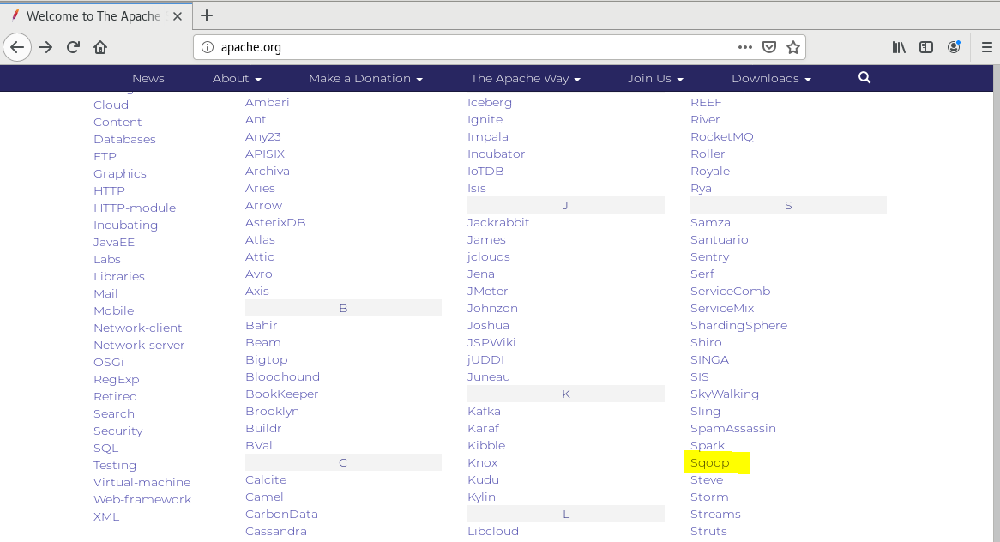
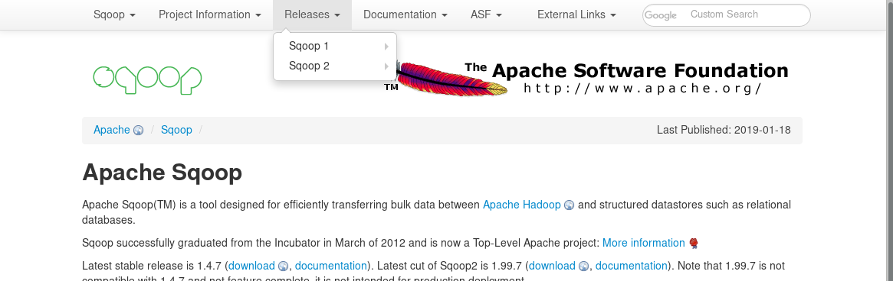
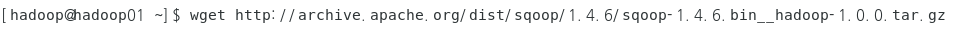
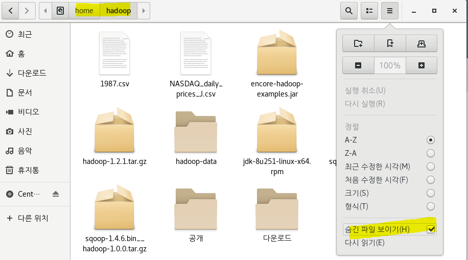
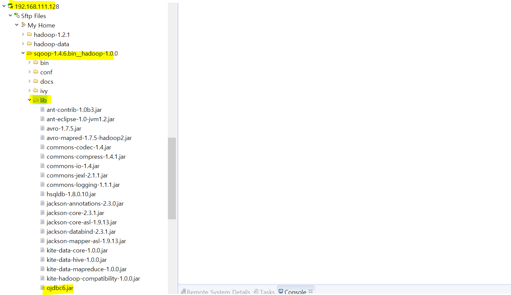
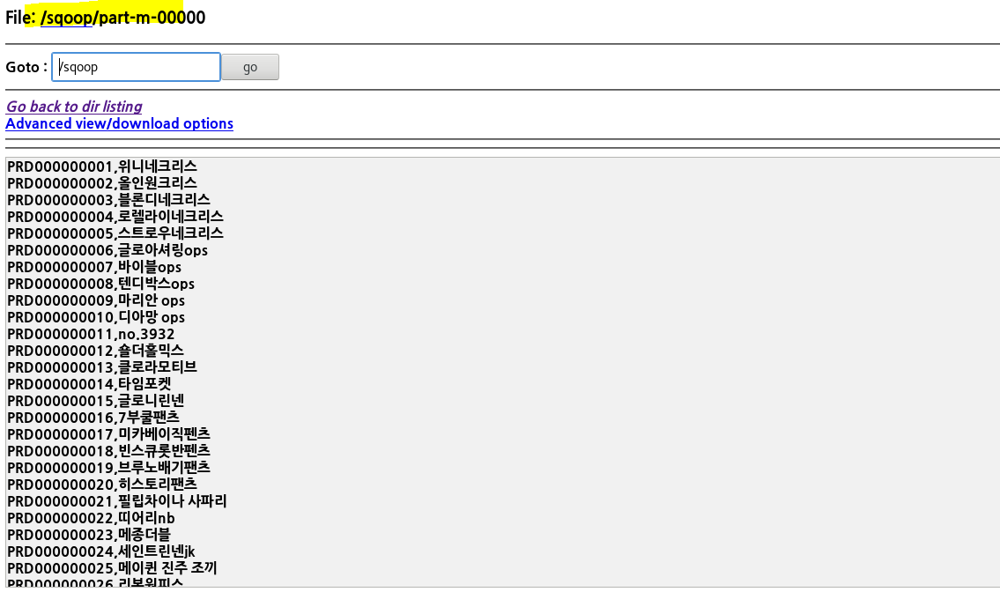
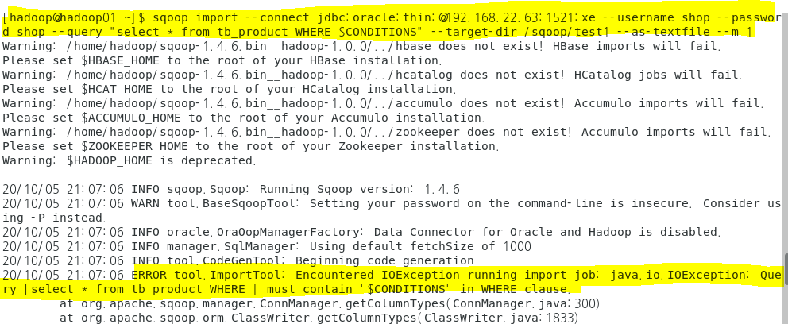
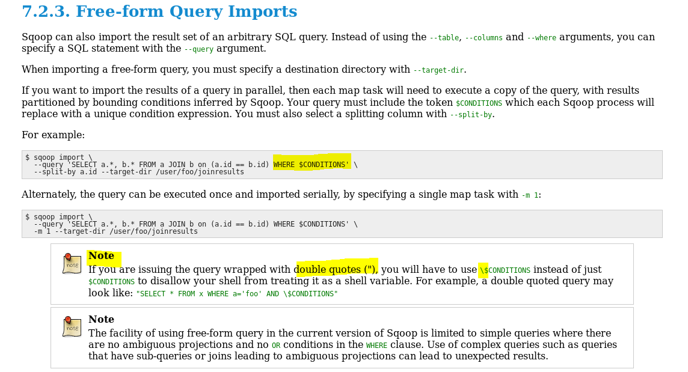
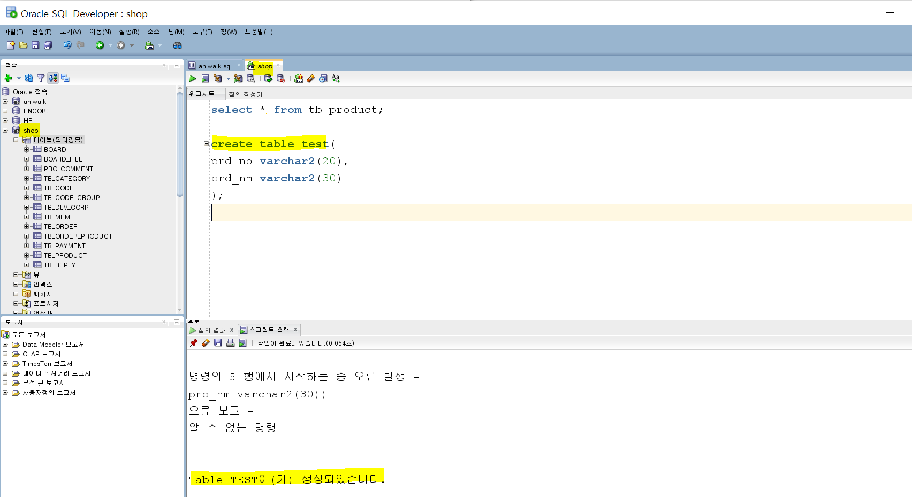

## 10/05(월)

#### sqoop 사용 RDBM 접속

--------

> sqoop

- sqoop은 Apache Hadoop과 RDBMS사이에 data를 효율적으로 이동할 수 있도록 지원되는 도구
- sql to hadoop의 약자

>sqoop 다운로드

- 하둡에서 apache.org 접속 - sqoop 선택 

- releases - sqoop1 - 1.4.6 클릭

- 오른쪽 버튼 - 링크주소 복사
  - http://archive.apache.org/dist/sqoop/1.4.6/

- 다운로드

- 압축풀기

> 환경설정

- 리눅스 설정파일
  - shell(bash)설정
    - /etc/profile : 리눅스가 부팅 시 적용되는 파일(root의 영역)
    - /home/사용자계정/.bash_profile : 사용자가 로그인을 할 때 로드되는 파일
    - /home/사용자계정/.bashrc : 이미 로그인한 상태에서 터미널을 열면 실행되는 파일

- .bashrc에 설정정보 추가(환경변수 추가)

- 설정파일 실행

> 오라클과 연동

- 스쿱이 사용하는 내부라이브러리에 오라클드라이버를 넣는다. - 연결
  - ojdbc6.jar copy

- lib폴더에 paste

- 오라클과 연결 확인
  - ip는 window의 ip로 넣기

- 조건절 추가 

> 오라클 데이터를 hdfs에 적재하기(import)

- 명령어: sqoop import  사용
- 옵션: 
  - connet: 오라클 연결 문자열
  - username: 접속계정
  - password: 접속 비밀번호
  - table: 테이블 명
  - columns: "컬럼명,컬럼명..."
  - target-dir: hdfs의 위치 
  - m: 실행할 mapreduce 개수
  - as-textfile: 텍스트파일 유형

- 실행 명령문  (줄바꿈할 때 ' \ '(원화)) => 데이터 조회할 때 테이블과 컬럼명을 명시

  - sqoop import \   

    ​		--connect  jdbc:oracle:thin:@192.168.22.63:1521:xe \

    ​		--username shop \

    ​		--password shop \

    ​		--table tb_product \

    ​		--columns "prd_no,prd_nm" \

    ​		--target-dir /sqoop/ \

    ​		--as-textfile --m 1

- 실행 명령문 => 데이터 조회할 때 sql문을 실행해서 결과를 조회

  - 쿼리를 사용하는 경우 'where $CONDITIONS'를 추가해야 한다. 

    - document : http://sqoop.apache.org/docs/1.4.6/SqoopUserGuide.html#_incremental_imports

  - sqoop import \   

    ​		--connect  jdbc:oracle:thin:@192.168.22.63:1521:xe \

    ​		--username shop \

    ​		--password shop \

    ​		--query "select * from tb_product where $CONDITIONS"

    ​		--target-dir /sqoop/test1 \

    ​		--as-textfile --m 1

  - 에러 발생

  

- (해결)만약 double quotes를 사용하는 경우 \를 붙여줘야 한다.

- 실행

- 결과 확인

> hdfs에 저장된 데이터를 오라클로 이동 (export) 

- 명령어: sqoop export  사용
- 테이블이 미리 정의되어야 한다.
- 옵션: 
  - connet: 오라클 연결 문자열
  - username: 접속계정
  - password: 접속 비밀번호
  - table: 테이블 명
  - columns: "컬럼명,컬럼명..."
  - export-dif: hdfs의 경로(어떤 파일을?)

- test 테이블 생성
  - shop 계정

- 실행 명령문 => hdfs에 저장된 파일을 오라클 테이블로 이동
  - sqoop export \   

  ​		--connect  jdbc:oracle:thin:@192.168.22.63:1521:xe \

  ​		--username shop \

  ​		--password shop \

  ​		--table test \

  ​		--columns "prd_no,prd_nm" \

  ​		--export-dir /sqoop/part-m-00000 \       (/sqoop/에 생성해놓은 결과로 export)

  

  

