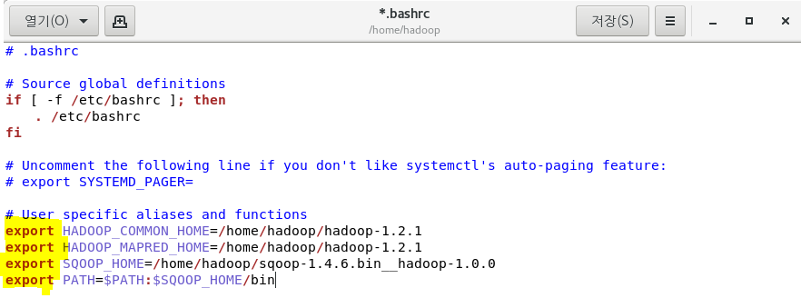
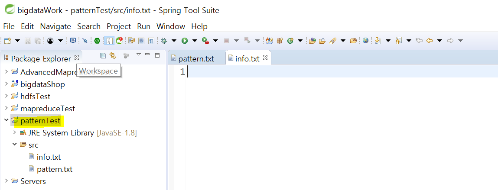
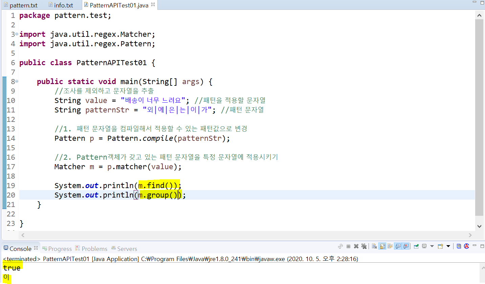
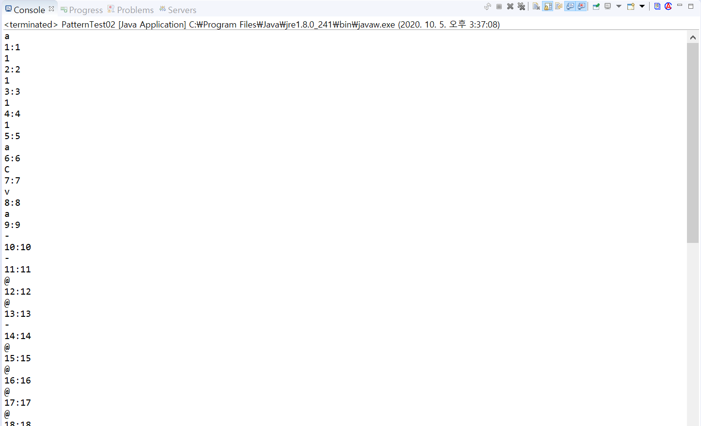
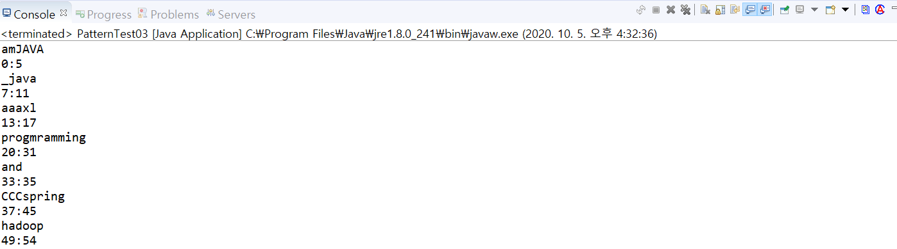

## 10/05(월)

#### sqoop 사용 RDBM 접속

--------

> sqoop

- sqoop은 Apache Hadoop과 RDBMS사이에 data를 효율적으로 이동할 수 있도록 지원되는 도구
- sql to hadoop의 약자


>sqoop 다운로드

- 하둡에서 apache.org 접속 - sqoop 선택 


- releases - sqoop1 - 1.4.6 클릭


- 오른쪽 버튼 - 링크주소 복사
  - http://archive.apache.org/dist/sqoop/1.4.6/


- 다운로드


- 압축풀기


> 환경설정

- 리눅스 설정파일
  - shell(bash)설정
    - /etc/profile : 리눅스가 부팅 시 적용되는 파일(root의 영역)
    - /home/사용자계정/.bash_profile : 사용자가 로그인을 할 때 로드되는 파일
    - /home/사용자계정/.bashrc : 이미 로그인한 상태에서 터미널을 열면 실행되는 파일


- .bashrc에 설정정보 추가(환경변수 추가)




- 설정파일 실행


> 오라클과 연동

- 스쿱이 사용하는 내부라이브러리에 오라클드라이버를 넣는다. - 연결
  - ojdbc6.jar copy


- lib폴더에 paste


- 오라클과 연결 확인
  - ip는 window의 ip로 넣기


- 조건절 추가 


> 오라클 데이터를 hdfs에 적재하기(import)

- 명령어: sqoop import  사용
- 옵션: 
  - connet: 오라클 연결 문자열
  - username: 접속계정
  - password: 접속 비밀번호
  - table: 테이블 명
  - columns: "컬럼명,컬럼명..."
  - target-dir: hdfs의 위치 
  - m: 실행할 mapreduce 개수
  - as-textfile: 텍스트파일 유형


- 실행 명령문  (줄바꿈할 때 ' \ '(원화)) => 데이터 조회할 때 테이블과 컬럼명을 명시

  - sqoop import \   

    ​		--connect  jdbc:oracle:thin:@192.168.22.63:1521:xe \

    ​		--username shop \

    ​		--password shop \

    ​		--table tb_product \

    ​		--columns "prd_no,prd_nm" \

    ​		--target-dir /sqoop/ \

    ​		--as-textfile --m 1


- 실행 명령문 => 데이터 조회할 때 sql문을 실행해서 결과를 조회

  - 쿼리를 사용하는 경우 'where $CONDITIONS'를 추가해야 한다. 

    - document : http://sqoop.apache.org/docs/1.4.6/SqoopUserGuide.html#_incremental_imports

  - sqoop import \   

    ​		--connect  jdbc:oracle:thin:@192.168.22.63:1521:xe \

    ​		--username shop \

    ​		--password shop \

    ​		--query "select * from tb_product where $CONDITIONS" \

    ​		--target-dir /sqoop/test1 \

    ​		--as-textfile --m 1

  - 에러 발생

  


- (해결)만약 double quotes를 사용하는 경우 \를 붙여줘야 한다.


- 실행


- 결과 확인


> hdfs에 저장된 데이터를 오라클로 이동 (export) 

- 명령어: sqoop export  사용
- 테이블이 미리 정의되어야 한다.
- 옵션: 
  - connet: 오라클 연결 문자열
  - username: 접속계정
  - password: 접속 비밀번호
  - table: 테이블 명
  - columns: "컬럼명,컬럼명..."
  - export-dif: hdfs의 경로(어떤 파일을?)


- test 테이블 생성
  - shop 계정


- 실행 명령문 => hdfs에 저장된 파일을 오라클 테이블로 이동
  - sqoop export \   

  ​		--connect  jdbc:oracle:thin:@192.168.22.63:1521:xe \

  ​		--username shop \

  ​		--password shop \

  ​		--table test \

  ​		--columns "prd_no,prd_nm" \

  ​		--export-dir /sqoop/part-m-00000 \       (/sqoop/에 생성해놓은 결과로 export)

  

  


-------------------

#### Pattern

-----------------

- java project로 patternTest 생성




> 정규표현식

- 텍스트를 검색하거나 치환하거나 텍스트 안에서 특정 문자열을 추출하려고 할 때 사용
- 특수문자나 기호로 만들어진 패턴이라고 생각


1. 자바 API

   - String 클래스의 matches메소드

     - 패턴 문자열과 일치하는지 true | false를 리턴

   - java.util.regex패키지의 클래스를 이용해서 작업

     1) pattern 클래스

     - 패턴문자열을 관리하고 패턴을 정의할 때 사용
     - matches메소드 : 정의한 패턴과 일치하는 문자열이 포함되었는지를 true|false로 리턴

     

     2) Matcher클래스

     - 패턴과 일치하는 문자열을 관리하기 위한 클래스

       - find() : 패턴이 만족하는지 확인(true | false)

       - group(): 일치하는 패턴문자열 리턴

       - start(): 매칭되는 패턴의 start 인덱스

       - end(): 매칭되는 패턴의 end index+1 인덱스를 리턴

         


- pattern.test 패키지 생성
  - 패키지 안에 PatternAPITest01 클래스 생성


> PatternAPITest01

###### <PatternAPITest01.java>

```java
package pattern.test;

import java.util.regex.Matcher;
import java.util.regex.Pattern;

public class PatternAPITest01 {

	public static void main(String[] args) {
		//조사를 제외하고 문자열을 추출
		String value = "배송이 너무 느려요 상품가 상품이 배송에"; //패턴을 적용할 문자열
		String patternStr = "외|에|은|는|이|가"; //패턴 문자열
		
		//1. 패턴 문자열을 컴파일해서 적용할 수 있는 패턴값으로 변경
		Pattern p = Pattern.compile(patternStr);
		
		//2. Pattern객체가 갖고 있는 패턴 문자열을 특정 문자열에 적용시키기 
		Matcher m = p.matcher(value);
		
		//System.out.println(m.find());
		//System.out.println(m.group());
		while(m.find()) { //패턴을 골라내는 작업
			String data = m.group();
			System.out.println(data);
		}
	}
}

```


- console에 찍히는 결과


> PatternTest01.java

- PatternTest01.java 클래스 생성


- 1) 정확하게 일치하는 문자열 찾기

###### <PatternTest01.java>

```java
package pattern.test;

import java.util.regex.Matcher;
import java.util.regex.Pattern;

public class PatternTest01 {
	public static void main(String[] args) {
		String str = "java, hi ~~~ java";
		String patternStr = "java"; //1.정확하게 일치 
		equalsPattern(str, patternStr);
	
	}
	
	public static void equalsPattern(String str, String patternStr) {
		Pattern pattern = Pattern.compile(patternStr);
		Matcher m = pattern.matcher(str);
		
		while(m.find()) {
			System.out.println(m.group());
			System.out.println(m.start()+":" +(m.end()-1));
		}
	}
}
```


- 결과


- 2) 대소문자 구분없이 문자열이 동일한 경우

###### <PatternTest01.java>

```java
package pattern.test;

import java.util.regex.Matcher;
import java.util.regex.Pattern;

public class PatternTest01 {
	public static void main(String[] args) {
		String str = "java, hi ~~~ java";
		//String patternStr = "Java"; //1.정확하게 일치 
		String patternStr = "Java"; //2. 대소문자 구분없이 문자열이 동일한 경우 찾기 위한
		equalsPattern(str, patternStr);
	
	}
	
	public static void equalsPattern(String str, String patternStr) {
		//Pattern pattern = Pattern.compile(patternStr); 1.정확하게 일치 
		Pattern pattern = Pattern.compile(patternStr,Pattern.CASE_INSENSITIVE); //2. 대소문자 구분없이 문자열이 동일한 경우 찾기 위한
		
		Matcher m = pattern.matcher(str);

		while(m.find()) {
			System.out.println(m.group());
			System.out.println(m.start()+":" +(m.end()-1));
		}
	}
}

```


- 결과


- 4) 특정문자열로 시작하는 경우

###### <PatternTest01.java>

```java
package pattern.test;

import java.util.regex.Matcher;
import java.util.regex.Pattern;

public class PatternTest01 {
	public static void main(String[] args) {
		String str = "java, hi ~~~ java";
		String patternStr ="^java"; //4. 특정문자열로 시작
		equalsPattern(str, patternStr);
	
	}
	
	public static void equalsPattern(String str, String patternStr) {
		//Pattern pattern = Pattern.compile(patternStr); 1.정확하게 일치 
		Pattern pattern = Pattern.compile(patternStr,Pattern.CASE_INSENSITIVE); //2. 대소문자 구분없이 문자열이 동일한 경우 찾기 위한
		
		Matcher m = pattern.matcher(str);

		while(m.find()) {
			System.out.println(m.group());
			System.out.println(m.start()+":" +(m.end()-1));
		}
	}
}
```


- 결과


- 5) 특정 문자열로 끝나는지 확인 

###### <PatternTest01.java>

```java
package pattern.test;

import java.util.regex.Matcher;
import java.util.regex.Pattern;

public class PatternTest01 {
	public static void main(String[] args) {
		String str = "java, hi ~~~ java";
		String patternStr ="java$"; //5. 특정문자열로 끝나는지 확인
		equalsPattern(str, patternStr);
	
	}
	
	public static void equalsPattern(String str, String patternStr) {
		//Pattern pattern = Pattern.compile(patternStr); 1.정확하게 일치 
		Pattern pattern = Pattern.compile(patternStr,Pattern.CASE_INSENSITIVE); //2. 대소문자 구분없이 문자열이 동일한 경우 찾기 위한
		
		Matcher m = pattern.matcher(str);

		while(m.find()) {
			System.out.println(m.group());
			System.out.println(m.start()+":" +(m.end()-1));
		}
	}
}
```


- 결과 


- 패턴에서 쓰는 기호를 패턴 문자열로 사용하고 싶은 경우
  - ' \ \ '와 함께 사용 


- 6) $로 시작하는 문자열

###### <PatternTest01.java>

```java
package pattern.test;

import java.util.regex.Matcher;
import java.util.regex.Pattern;

public class PatternTest01 {
	public static void main(String[] args) {
		//String str = "java, hi ~~~ java";
		String str = "$100. . 한. $20.0. ^^$";
		//String patternStr = "^$"; //6. 패턴에서 쓰는 기호를 패턴 문자열로 사용하고 싶은 경우 
									// 패턴기호를 실행시키기 때문에 불가능하다.
									// 일반 문자열로 인식시키기 위해서 \\와 함께 사용
									
		String patternStr = "^\\$"; //$로 시작하는 문자열
		equalsPattern(str, patternStr);
	
	}
	
	public static void equalsPattern(String str, String patternStr) {
		//Pattern pattern = Pattern.compile(patternStr); 1.정확하게 일치 
		Pattern pattern = Pattern.compile(patternStr,Pattern.CASE_INSENSITIVE); //2. 대소문자 구분없이 문자열이 동일한 경우 찾기 위한
		
		Matcher m = pattern.matcher(str);

		while(m.find()) {
			System.out.println(m.group());
			System.out.println(m.start()+":" +(m.end()-1));
		}
	}
}
```


- 결과


- 7) $로 끝나는 문자열

###### <PatternTest01.java>

```java
package pattern.test;

import java.util.regex.Matcher;
import java.util.regex.Pattern;

public class PatternTest01 {
	public static void main(String[] args) {
		//String str = "java, hi ~~~ java";
		String str = "$100. . 한. $20.0. ^^$";

		String patternStr = "\\$$"; //7. $로 끝나는 문자열 
		equalsPattern(str, patternStr);
	
	}
	
	public static void equalsPattern(String str, String patternStr) {
		//Pattern pattern = Pattern.compile(patternStr); 1.정확하게 일치 
		Pattern pattern = Pattern.compile(patternStr,Pattern.CASE_INSENSITIVE); //2. 대소문자 구분없이 문자열이 동일한 경우 찾기 위한
		
		Matcher m = pattern.matcher(str);

		while(m.find()) {
			System.out.println(m.group());
			System.out.println(m.start()+":" +(m.end()-1));
		}
	}
}

```


- 결과


- 8) . 사용

```java
package pattern.test;

import java.util.regex.Matcher;
import java.util.regex.Pattern;

public class PatternTest01 {
	public static void main(String[] args) {
		//String str = "java, hi ~~~ java";
		String str = "$100. . 한. $20.0. ^^$";
	
		String patternStr = "."; //8. .은 한 글자를 의미 - 모든 문자열이 한 문자에 해당하므로 한 문자씩 잘라서 리턴
		equalsPattern(str, patternStr);
	
	}
	
	public static void equalsPattern(String str, String patternStr) {
		//Pattern pattern = Pattern.compile(patternStr); 1.정확하게 일치 
		Pattern pattern = Pattern.compile(patternStr,Pattern.CASE_INSENSITIVE); //2. 대소문자 구분없이 문자열이 동일한 경우 찾기 위한
		
		Matcher m = pattern.matcher(str);

		while(m.find()) {
			System.out.println(m.group());
			System.out.println(m.start()+":" +(m.end()-1));
		}
	}
}

```


- 결과


- 10) '.'이 4개

```java
package pattern.test;

import java.util.regex.Matcher;
import java.util.regex.Pattern;

public class PatternTest01 {
	public static void main(String[] args) {

		String str = "$100. . 한. $20.0. ^^$";

		String patternStr ="...."; //10. .이 4개 - 4글자씩 잘라서 리턴
		
		equalsPattern(str, patternStr);
	
	}
	
	public static void equalsPattern(String str, String patternStr) {
		//Pattern pattern = Pattern.compile(patternStr); 1.정확하게 일치 
		Pattern pattern = Pattern.compile(patternStr,Pattern.CASE_INSENSITIVE); //2. 대소문자 구분없이 문자열이 동일한 경우 찾기 위한
		
		Matcher m = pattern.matcher(str);

		while(m.find()) {
			System.out.println(m.group());
			System.out.println(m.start()+":" +(m.end()-1));
		}
	}
}

```


- 10) 결과


- 11) .과 .사이의 한 글자가 있는 문자열을 추출

```java
package pattern.test;

import java.util.regex.Matcher;
import java.util.regex.Pattern;

public class PatternTest01 {
	public static void main(String[] args) {
		String str = "$100. . 한. $20.0. ^^$";
	
		String patternStr = "\\..\\."; //11. .과 .사이의 한 글자가 있는 문자열을 추출
		equalsPattern(str, patternStr);
	
	}
	
	public static void equalsPattern(String str, String patternStr) {
		//Pattern pattern = Pattern.compile(patternStr); 1.정확하게 일치 
		Pattern pattern = Pattern.compile(patternStr,Pattern.CASE_INSENSITIVE); //2. 대소문자 구분없이 문자열이 동일한 경우 찾기 위한
		
		Matcher m = pattern.matcher(str);

		while(m.find()) { //패턴과 일치하는 문자열이 존재하는 동안 반복작업
			System.out.println(m.group());
			System.out.println(m.start()+":" +(m.end()-1));
		}
	}
}

```


- 11) 결과
  - .과 . 사이의 공백이 있으므로 공백이 추출


> PatternTest02.java 클래스 생성


- 1) a이거나 m이거나 g인 문자열을 추출

```java
package pattern.test;

import java.util.regex.Matcher;
import java.util.regex.Pattern;

public class PatternTest02 {
	public static void main(String[] args) {

		//String str = "ja1111aCva--@@-@@@@- 한글 --@@@@-- progra44568EmgFmiJng";

		String str = "amJAVA _java aaaxl  programming and spring , hadoop";
		
		String patternStr = "a|m|g"; //1. |는 or을 의미 : a이거나 m이거나 g인 문자열을 추출

		equalsPattern(str, patternStr);
	}
    
	public static void equalsPattern(String str, String patternStr) {

		Pattern pattern = Pattern.compile(patternStr,Pattern.CASE_INSENSITIVE); 
		
		Matcher m = pattern.matcher(str);

		while(m.find()) { //패턴과 일치하는 문자열이 존재하는 동안 반복작업
			System.out.println(m.group());
			System.out.println(m.start()+":" +(m.end()-1));
		}
	}
}

```


- 1) 결과


- 2) []문자열의 집합이나 범위를 표현

```java
package pattern.test;

import java.util.regex.Matcher;
import java.util.regex.Pattern;

public class PatternTest02 {
	public static void main(String[] args) {

		//String str = "ja1111aCva--@@-@@@@- 한글 --@@@@-- progra44568EmgFmiJng";

		String str = "amJAVA _java aaaxl  programming and spring , hadoop";
		
		String patternStr = "[amg]"; //2. []문자열의 집합이나 범위를 표현
        							//문자와 문자 사이를 나타내려면 -을 사용
        							//[]안에서 ^는 부정의 의미로 해석

		equalsPattern(str, patternStr);
	
	}
	
	public static void equalsPattern(String str, String patternStr) {

		Pattern pattern = Pattern.compile(patternStr,Pattern.CASE_INSENSITIVE); 
		
		Matcher m = pattern.matcher(str);

		while(m.find()) { //패턴과 일치하는 문자열이 존재하는 동안 반복작업
			System.out.println(m.group());
			System.out.println(m.start()+":" +(m.end()-1));
		}
	}
}

```


- 2) 결과
  - 1)의 결과와 동일


- 3) 첫 글자가 a|m|g 이고 두 번째 글자가 m|a인 문자열 추출

```java
package pattern.test;

import java.util.regex.Matcher;
import java.util.regex.Pattern;

public class PatternTest02 {
	public static void main(String[] args) {

		//String str = "ja1111aCva--@@-@@@@- 한글 --@@@@-- progra44568EmgFmiJng";

		String str = "amJAVA _java aaaxl  programming and spring , hadoop";
		
		String patternStr = "[amg][ma]"; //3. 두 글자를 추출 - 첫 글자가 a|m|g 이고 두 번째 글자가 m|a인 문자열 추출
        								//ex) am, aa, mm, ma, gm, ga...

		equalsPattern(str, patternStr);
	
	}
	
	public static void equalsPattern(String str, String patternStr) {

		Pattern pattern = Pattern.compile(patternStr,Pattern.CASE_INSENSITIVE); 
		
		Matcher m = pattern.matcher(str);

		while(m.find()) { //패턴과 일치하는 문자열이 존재하는 동안 반복작업
			System.out.println(m.group());
			System.out.println(m.start()+":" +(m.end()-1));
		}
	}
}

```


- 3) 결과


- 4) 소문자 c에서 j사이의 해당하는 문자

```java
package pattern.test;

import java.util.regex.Matcher;
import java.util.regex.Pattern;

public class PatternTest02 {
	public static void main(String[] args) {

		//String str = "ja1111aCva--@@-@@@@- 한글 --@@@@-- progra44568EmgFmiJng";

		String str = "amJAVA _java aaaxl  progmramming and spring , hadoop";
		
		String patternStr = "[c-j]"; //4. 소문자 c에서 j사이의 해당하는 문자

		equalsPattern(str, patternStr);
	
	}
	
	public static void equalsPattern(String str, String patternStr) {

		Pattern pattern = Pattern.compile(patternStr); 
		
		Matcher m = pattern.matcher(str);

		while(m.find()) { //패턴과 일치하는 문자열이 존재하는 동안 반복작업
			System.out.println(m.group());
			System.out.println(m.start()+":" +(m.end()-1));
		}
	}
}

```


- 4) 결과


- 5) 대문자 C에서 J사이에 해당하는 문자

```java
package pattern.test;

import java.util.regex.Matcher;
import java.util.regex.Pattern;

public class PatternTest02 {
	public static void main(String[] args) {

		String str = "ja1111aCva--@@-@@@@- 한글 --@@@@-- progra44568EmgFmiJng";

		//String str = "amJAVA _java aaaxl  progmramming and CCCspring , hadoop";
		
		String patternStr = "[C-J]"; //5. 대문자 C에서 J사이에 해당하는 문자

		equalsPattern(str, patternStr);
	
	}
	
	public static void equalsPattern(String str, String patternStr) {

		Pattern pattern = Pattern.compile(patternStr); 
		
		Matcher m = pattern.matcher(str);

		while(m.find()) { //패턴과 일치하는 문자열이 존재하는 동안 반복작업
			System.out.println(m.group());
			System.out.println(m.start()+":" +(m.end()-1));
		}
	}
}
```


- 5) 결과


- 6) 대문자 소문자 모두 C에서 J사이의 문자 추출(Pattern.CASE_INSENSITIVE 없이)

```java
package pattern.test;

import java.util.regex.Matcher;
import java.util.regex.Pattern;

public class PatternTest02 {
	public static void main(String[] args) {

		String str = "ja1111aCva--@@-@@@@- 한글 --@@@@-- progra44568EmgFmiJng";

		//String str = "amJAVA _java aaaxl  progmramming and CCCspring , hadoop";
		
		String patternStr = "[c-jC-J]"; //6. 대문자 소문자 모두 C에서 J사이의 문자 추출
									//Pattern.CASE_INSENSITIVE 없이 

		equalsPattern(str, patternStr);
	
	}
	
	public static void equalsPattern(String str, String patternStr) {

		Pattern pattern = Pattern.compile(patternStr); 
		
		Matcher m = pattern.matcher(str);

		while(m.find()) { //패턴과 일치하는 문자열이 존재하는 동안 반복작업
			System.out.println(m.group());
			System.out.println(m.start()+":" +(m.end()-1));
		}
	}
}

```


- 6) 결과


- 7) 4-8사이의 숫자 추출

```java
package pattern.test;

import java.util.regex.Matcher;
import java.util.regex.Pattern;

public class PatternTest02 {
	public static void main(String[] args) {

		String str = "ja1111aCva--@@-@@@@- 한글 --@@@@-- progra44568EmgFmiJng";

		//String str = "amJAVA _java aaaxl  progmramming and CCCspring , hadoop";
		
		String patternStr = "[4-8]"; //7. 4-8사이의 숫자 추출

		equalsPattern(str, patternStr);
	
	}
	
	public static void equalsPattern(String str, String patternStr) {

		Pattern pattern = Pattern.compile(patternStr); 
		
		Matcher m = pattern.matcher(str);

		while(m.find()) { //패턴과 일치하는 문자열이 존재하는 동안 반복작업
			System.out.println(m.group());
			System.out.println(m.start()+":" +(m.end()-1));
		}
	}
}

```


- 7) 결과


- 8) 4-8사이의 숫자가 아닌 모든 문자

```java
package pattern.test;

import java.util.regex.Matcher;
import java.util.regex.Pattern;

public class PatternTest02 {
	public static void main(String[] args) {

		String str = "ja1111aCva--@@-@@@@- 한글 --@@@@-- progra44568EmgFmiJng";

		//String str = "amJAVA _java aaaxl  progmramming and CCCspring , hadoop";
		
		String patternStr = "[^4-8]"; //8. 4-8사이의 숫자가 아닌 모든 문자

		equalsPattern(str, patternStr);
	
	}
	
	public static void equalsPattern(String str, String patternStr) {

		Pattern pattern = Pattern.compile(patternStr); 
		
		Matcher m = pattern.matcher(str);

		while(m.find()) { //패턴과 일치하는 문자열이 존재하는 동안 반복작업
			System.out.println(m.group());
			System.out.println(m.start()+":" +(m.end()-1));
		}
	}
}

```


- 8) 결과


- 9) c에서 j사이의 문자열이 아닌 문자만 모두 추출

```java
package pattern.test;

import java.util.regex.Matcher;
import java.util.regex.Pattern;

public class PatternTest02 {
	public static void main(String[] args) {

		String str = "ja1111aCva--@@-@@@@- 한글 --@@@@-- progra44568EmgFmiJng";

		//String str = "amJAVA _java aaaxl  progmramming and CCCspring , hadoop";
		
		String patternStr = "[^c-j]"; //9. c에서 j사이의 문자열이 아닌 문자만 모두 추출

		equalsPattern(str, patternStr);
	
	}
	
	public static void equalsPattern(String str, String patternStr) {

		Pattern pattern = Pattern.compile(patternStr); 
		
		Matcher m = pattern.matcher(str);

		while(m.find()) { //패턴과 일치하는 문자열이 존재하는 동안 반복작업
			System.out.println(m.group());
			System.out.println(m.start()+":" +(m.end()-1));
		}
	}
}

```


- 9) 결과




- 10) 영문자와 숫자만 추출

```java
package pattern.test;

import java.util.regex.Matcher;
import java.util.regex.Pattern;

public class PatternTest02 {
	public static void main(String[] args) {

		String str = "ja1111aCva--@@-@@@@- 한글 --@@@@-- progra44568EmgFmiJng";

		//String str = "amJAVA _java aaaxl  progmramming and CCCspring , hadoop";
		
		String patternStr = "[A-Za-z0-9]"; //10. 영문자와 숫자만 추출

		equalsPattern(str, patternStr);
	
	}
	
	public static void equalsPattern(String str, String patternStr) {

		Pattern pattern = Pattern.compile(patternStr); 
		
		Matcher m = pattern.matcher(str);

		while(m.find()) { //패턴과 일치하는 문자열이 존재하는 동안 반복작업
			System.out.println(m.group());
			System.out.println(m.start()+":" +(m.end()-1));
		}
	}
}

```


- 10) 결과


- 11) 한글만 추출

```java
package pattern.test;

import java.util.regex.Matcher;
import java.util.regex.Pattern;

public class PatternTest02 {
	public static void main(String[] args) {

		String str = "ja1111aCva--@@-@@@@- 한글 --@@@@-- progra44568EmgFmiJng";

		//String str = "amJAVA _java aaaxl  progmramming and CCCspring , hadoop";
		
		String patternStr = "[가-힣]"; //11. 한글만 추출

		equalsPattern(str, patternStr);
	
	}
	
	public static void equalsPattern(String str, String patternStr) {

		Pattern pattern = Pattern.compile(patternStr); 
		
		Matcher m = pattern.matcher(str);

		while(m.find()) { //패턴과 일치하는 문자열이 존재하는 동안 반복작업
			System.out.println(m.group());
			System.out.println(m.start()+":" +(m.end()-1));
		}
	}
}

```


- 11) 결과


> PatternTest03.java class 생성

- 수량체크하기 위한 패턴 기호에 대한 test
  - *: *앞의 문자나 기호가 1개이거나 없거나(0) 여러 개이거나 모두 추출
  - +: +앞의 문자나 기호가 1개이거나 여러 개인 문자를 추출
  - ?: ?앞의 문자나 기호가 없거나 1개인 문자를 추출
  - {n}: n개 횟수 
  - {n,m}: n이상 m이하 
  - {n,}: n이상


###### <PatternTest03.java>

```java
package pattern.test;

import java.util.regex.Matcher;
import java.util.regex.Pattern;

//수량체크를 하기 위한 패턴 기호 
public class PatternTest03 {
	public static void main(String[] args) {

		String str = "ja1111aCva--@@-@@@@- 한글 --@@@@-- progra44568-@Emg-Fm-@i-Jng";

		//String str = "amJAVA _java aaaxl  progmramming and CCCspring , hadoop";
		
		String patternStr = "-@*-"; //1) *앞의 기호가 있거나 없거나 여러 개이거나 모두 추출
		String patternStr = "-@+-"; //2) +앞의 문자나 기호가 1개이거나 여러 개인 문자를 추출
        String patternStr = "-@?-"; //3) ?앞의 문자나 기호가 없거나 1개인 문자를 추출
        String patternStr = "[^ ]"; //4) 공백이 아닌 문자열을 모두 추출
		equalsPattern(str, patternStr);
	
	}
	
	public static void equalsPattern(String str, String patternStr) {
		Pattern pattern = Pattern.compile(patternStr); 
		Matcher m = pattern.matcher(str);
		while(m.find()) { //패턴과 일치하는 문자열이 존재하는 동안 반복작업
			System.out.println(m.group());
			System.out.println(m.start()+":" +(m.end()-1));
		}
	}
}

```


- 1) 결과


- 2) 결과


- 3) 결과


- 4) 결과


###### <PatternTest03.java>

```java
package pattern.test;

import java.util.regex.Matcher;
import java.util.regex.Pattern;

//수량체크를 하기 위한 패턴 기호 
public class PatternTest03 {
	public static void main(String[] args) {
		//String str = "ja1111aCva--@@-@@@@- 한글 --@@@@-- progra44568-@Emg-Fm-@i-Jng";
		String str = "amJAVA _java aaaxl  progmramming and CCCspring , hadoop";
		String patternStr = "[amv]{1,3}"; //5) amv에 해당하는 문자열 추출
										 //[amv], [amv][amv], [amv][amv][amv]
										 //ex) a,m,v,aa,am,av,ma,mm,mv...
										 //ex) aaa,aam,aav,....
        String patternStr = ".{5}"; //6) 5자리수로 끊어서 출력 
        							//.은 한 글자를 의미 : n번 5글자인 것을 추출 
        String patternStr = "[a-z]{3,}"; //7)a부터 z까지의(소문자) 3자리
        String patternStr = "[A-z]{3,}"; //8)A부터 z까지의 3자리(대소문자 모두)
        String patternStr = "\\w"; //9)(소문자 w)대소문자, 숫자 모두를 추출
        String patternStr = "\\W"; //10)(대문자 W) \\W의 반대 문자열 추출(기호 추출)
        String patternStr = "\\d"; //11) 숫자만 추출
        String patternStr = "\\D"; //12) 숫자를 제외하고 모두 추출
		equalsPattern(str, patternStr);
	
	}
	
	public static void equalsPattern(String str, String patternStr) {
		Pattern pattern = Pattern.compile(patternStr); 
		Matcher m = pattern.matcher(str);
		while(m.find()) { //패턴과 일치하는 문자열이 존재하는 동안 반복작업
			System.out.println(m.group());
			System.out.println(m.start()+":" +(m.end()-1));
		}
	}
}
```


- 5) 결과


- 6) 결과


- 7) 결과


- 8) 결과




- 9) 결과


- 10) 결과


- 11) 결과
  - 아무런 결과가 출력되지 않음 


> PatternAPITest02.java class 생성 

###### <PatternAPITest02.java>

```java
package pattern.test;

import java.util.regex.Pattern;

public class PatternAPITest02 {

	public static void main(String[] args) {
		System.out.println(Pattern.matches("[0-9]+", "1234java")); //숫자가 1개 이상인 것을 찾는 것
		System.out.println(Pattern.matches("[0-9]+", "java")); 
		System.out.println(Pattern.matches("[0-9]+", "1234"));
		System.out.println(Pattern.matches("[0-9]+", "1"));
		System.out.println(Pattern.matches("[0-9]+", ""));		
	}
}
```


- 결과


###### <PatternAPITest02.java>

```java
package pattern.test;

import java.util.regex.Pattern;

public class PatternAPITest02 {

	public static void main(String[] args) {
		System.out.println(Pattern.matches("[0-9A-z]+", "1234java")); //true
		System.out.println(Pattern.matches("[0-9A-z]+", "java")); //true
		System.out.println(Pattern.matches("[0-9A-z]+", "1234")); //true
		System.out.println(Pattern.matches("[0-9A-z]+", "1")); //true
		System.out.println(Pattern.matches("[0-9A-z]+", "")); //false	
	}
}
```


> pattern exam


- pattern.exam 패키지 생성 

###### <PatternChecker.java>

```java
package pattern.exam;

import java.util.regex.Pattern;
 
/** 문자열의 형식을 검사하는 기능을 갖는 클래스 */
public class PatternChecker {
     
    /** 숫자 모양에 대한 형식 검사 */
    public static boolean isNum(String str) {
    	return Pattern.matches("[0-9]+", str);
    }
     
   //** 영문으로만 구성되었는지에 대한 형식 검사 *//*
    public static boolean isEng(String str) {
    	return Pattern.matches("[A-z ]+", str);
    }
   //** 한글로만 구성되었는지에 대한 형식 검사 *//*
    public static boolean isKor(String str) {
    	return Pattern.matches("[ㄱ-ㅎ가-힣 ]+", str);
    }
     
    //** 영문과 숫자로만 구성되었는지에 대한 형식 검사 *//*
    public static boolean isEngNum(String str) {
    	return Pattern.matches("[A-z0-9 ]+", str);
    }
     
    //** 한글과 숫자로만 구성되었는지에 대한 형식 검사 *//*
    public static boolean isKorNum(String str) {
    	return Pattern.matches("[ㄱ-ㅎ가-힣0-9 ]+", str);
    }
     
   //** 이메일 형식인지에 대한 검사 --> "아이디@도메인"의 형식을 충족해야 한다. *//*
    public static boolean isEmail(String str) {
    	return Pattern.matches("[A-z0-9]+@[0-9A-z\\.]+", str);
    }
 
//    public static boolean isIP(String str) {
//    	return false;
//    }
//    public static boolean isEmail2(String str) {
//    	return false;
//    }

    public static void main(String[] args){
    	System.out.println(isNum("2345"));//true
    	System.out.println(isNum("2345한글"));//false
    	System.out.println(isNum("2345****"));//false
    	System.out.println(isEng("aasdfgasdf"));//true
    	System.out.println(isEng("aasdfgas df"));//true
    	System.out.println(isEng("aasdfgas**df"));//false
    	System.out.println(isEng("aasdfgas1221df"));//false
    	System.out.println(isEng("aasdfgas한글df"));//false
    	System.out.println("***********isKor테스트*************");
    	System.out.println(isKor("aasdfgas한글df"));//false
    	System.out.println(isKor(" 한글"));//true
    	System.out.println(isKor("한글 한긆 ㄴㅇㄻㅁㄹ"));//true
    	System.out.println(isKor("123한글"));//false
    	
    	System.out.println("***********isEngNum테스트*************");
    	System.out.println(isEngNum("aasdfgas한글df"));//false
    	System.out.println(isEngNum(" 한글"));//false
    	System.out.println(isEngNum("   111   asdfa"));//true
    	System.out.println(isEngNum("dfgad998"));//true
    	System.out.println("***********isKorNum테스트*************");
    	System.out.println(isKorNum("aasdfgas한글df"));//false
    	System.out.println(isKorNum(" 한글"));//true
    	System.out.println(isKorNum("   111   asdfa"));//false
    	System.out.println(isKorNum("한글998"));//true
    	System.out.println("***********isEmail테스트*************");
    	System.out.println(isEmail("heaves@ha.n.m.il.net"));//true
    	System.out.println(isEmail("heaveshanmail.net"));//false
    	
    	/*System.out.println(isCellPhone("010-718-8634"));//true
    	System.out.println(isCellPhone("011-222-8634"));//true
    	System.out.println(isTel("02-631-8634"));//true
    	System.out.println(isTel("03-33631-8634"));//false
    	System.out.println(isTel("0333-631-8634"));//false*/
//    	System.out.println("***********iptest테스트*************");
//    	System.out.println(isIP("127.0.0.1"));//true
//    	System.out.println(isIP("196.168.59.101"));//true
//    	System.out.println(isIP("250.0.8.9"));//true
//    	System.out.println(isIP("196.168.59"));//false
//    	System.out.println(isIP("300.168.59.101"));//false
//    	System.out.println(isIP("300.168.592332.101"));//false
//    	System.out.println(isIP("300.168.592.문자열"));//false
//    	
    }
}
```


