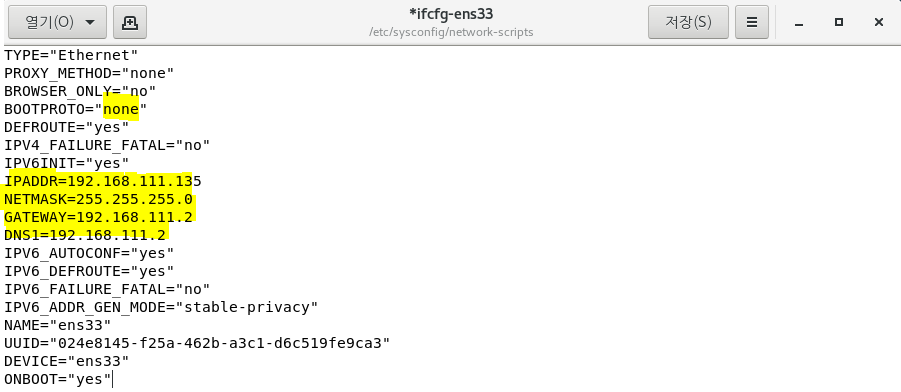

## 10/06(화)

#### Hadoop

--------

> 고정 ip 변경

- 머신4번(root 계정)에서 작업

- ifcfg-ens33을 텍스트 편집기로 열기


- ifcfg-ens33 설정 변경

  - BOOTPROTO를 dhcp에서 none으로 변경 

  - IPADDR=192.168.111.135 추가

  - NETMASK=255.255.255.0 추가

  - GATEWAY=192.168.111.2 추가

    - gateway 번호       

    

  - DNS1=

    - DNS확인

    

###### <ifcfg-ens33 파일>




- restart - 설정파일 다시 실행


- 기존 ip로 다시 변경 (고정 ip로 변경)


-------------

#### pattern

--------

> 이메일 패턴으로 확인

- EmailCheck.java
  - '^' : 시작 (영문자는 한 글자 이상 있어야 하므로)
  - '.' : '.'은 패턴이므로 \ \를 붙여줘야 한다. 
  - '.?' : '.'은 없어도 되고 1개 이상이 되면 안되므로 ?를 붙여줌
  - '[A-z]+(\\.[A-z]+){1,2}$' : @뒤에는 영문자 나오고 .이 1번 또는 2번이 나와야 한다.
  - '$' : '$' 앞의 특정 문자열로 끝나는지 확인해준다.

```java
package pattern.exam;


public class EmailCheck {
	public static void main(String[] args) {
		//x{n}=>x를 n번 반복한 문자를 찾는다는 의미로 해석
		//^ : 시작 (영문자는 한 글자 이상 있어야 하므로)
		//. : 
		String emailReg="^[A-z]+\\.?[A-z]+@[A-z]+(\\.[A-z]+){1,2}$"; 
		String[] user = {"heaves@hanmail,net","heaves@hanmail.net",
					"테스트heaves@hanmail.net","sc.com@hanmail.net",
					",heaves@hanmail.net","@hanmail.net"
					,"heaves@hanmail.co.kr"};
		//user에 입력된 email의 형식이 맞는지 true|false로 출력할 수 있도록 작업	
		//[결과] 아이디는 . 한 개, 도메인에는 . 2개
		//		아이디는 한글, 숫자, 특수문자로 시작할 수 없다.
		//		아이디는 한 글자 이상 있어야 한다
		/*heaves@hanmail,net => false
		 * heaves@hanmail.net => true
		 * 테스트heaves@hanmail.net => false
		 * sc.com@hanmail.net => true
		 * ,heaves@hanmail.net => false
		 * @hanmail.net => false
		 * heaves@hanmail.co.kr => true
		 */
		for (int i = 0; i < user.length; i++) {
			System.out.println(user[i]+"="+user[i].matches(emailReg));
		}
	}
}
```


- 결과


-----------

#### 댓글 분석하기

-----

**step1**

1. 오라클에 테이블 작성

   create table pro_comment(

   prd_no varchar2(20) ,

   mem_id varchar2(20) ,

   pro_comment varchar2(60),

   writedate date)

2. 상품 보기 화면 추가하기

   - 상품을 클릭하면 상품 상세화면이 보일 수 있도록

   - 요청 url /product/read.do

   - tile화면명 : product/read

   - jsp 파일명 : /WEB-INF/product/product_read.jsp

3. product_read.jsp에 상품평을 추가할 수 있도록 구현

   - 패키지명 : kr.encore.bigdataShop.product.comment

   - 클래스명 : ProductCommentController

   - ProductCommentService, ProductCommentServiceImpl

   - ProductCommentDAO, ProductCommentDAOImpl

   - ProductCommentDTO

   - mapper : productcomment.xml

   - 기능 : 상품 댓글 등록과 댓글 전체 보기 기능만 구현하기

**step2**

- 오라클에 저장된 pro_comment 테이블의 모든 데이터를 sqoop을 이용하여 하둡 HDFS의 /bigshop 아래 저장하세요. 댓글 샘플을 10개 상품에 10개씩 상품평을 임의로 입력해 놓고 작업한다.

**step3**

- Bigdata 프로젝트를 작성한 후 shop.bigdata.comment 패키지를 만들고 작업한다.

  하둡 HDFS의 /bigshop 아래 저장된 데이터를 이용하여 이번 달 댓글 데이터의 키워드로 wordcount를 작성하기

  [조건]

  의,에, 은,는, 이, 가 등의 조사를 빼고 wordcount를 적용(조사를 빼고 작업하는 부분은 mapper에서 우선 패턴을 적용하여 대략적 조사만 제외)

  CommentWordCountMapper.java

  CommentWordCountReducer.java

  CommentWordCountDriver.java

  

  

---------

#### flume

---------

> flume 설치

- 하둡 계정에서 하둡 실행 후 시작

- apache.org 사이트에서 Flume 클릭


- Download 클릭


- archive repository 클릭


- 1.6.0 버전 클릭


- 오른쪽버튼 클릭 후 링크 주소 복사


- 다운로드


- 압축 풀기


- 숨긴파일 보이기


- 설정파일 수정(.bashrc)
  - $ : 앞의 설정한 변수를 그대로 사용하겠다


- 실행


> flume

- Apache의 오픈소스 프로젝트로 대용량의 로그를 수집할 수 있도록 여러가지 기능을 제공하는 프로그램
- FlumeUserGuide : http://flume.apache.org/releases/content/1.9.0/FlumeUserGuide.html

1. 개요

   - 로그수집을 위한 프로그램
   - flume, chukwa, scribe, fluentd, splunk 등이 같은 종류의 프로그램
   - 여러 곳에 위치하는 로그를 하나로 모을 수 있다.
   - 로그를 배치로 한꺼번에 보내는 것이 아니라 스트리밍하게 지속적으로 보낸다.
   - 메모리가 확보
   - 비동기 방식
   - 로그수집 Thread와 로그를 전송하는 Thread가 별도로 실행된다.

2. flume의 구성요소

   - Agent가 관리
   - flume은 여러 가지 유형으로 Agent를 구성할 수 있다.
   - source와 sink, channel등의 구성요소는 반드시 설정 작업을 해야한다.
     - source : 데이터가 유입되는 지점, 다양한 시스템의 데이터를 수집할 수 있다.
       - avro : 네트워크 통신(노드에서 노드로 전송) - was에서 로그를 avro통신을 통해서 hdfs서버로 전송할 수 있다.
       - netcat : tcp통신으로 텍스트 전송
       - exec : command명령어(shell명령어)를 실행해서 내용을 수집
       - spooldir : 디렉토리에 저장된 파일
       - jms : 메시지
     - channel : 데이터가 이동하는 곳(source와 sink사이의 queue) - source와 sink를 연결해서 데이터를 버퍼링
       - memory : source로 부터 받은 데이터를 메모리에 가지고 있다가 sink로 전달 (유실 가능성은 있으나 빠르다.)
       - jdbc : jdbc로 저장(유실은 없지만 느리다.)
       - file : file로 저장(유실은 없지만 느리다.)
     - sink : 유입된 데이터의 목적지를 관리(수집한 정보를 채널로부터 전달받아서 목적지에 저장해준다.)
       - avro : 다른 노드(머신, 서버...)로 전달(네트워크를 통하여 전달)
       - logger : tcp로 전송되는 텍스트 데이터를 로깅
       - file_roll : local의 파일로 저장
       - hbase : hbase라는 nosql에 저장
       - hdfs : 하둡의 hdfs에 적재
       - elasticsearch : 엘라스틱서치에 적재

   

3. flume 실행 명령어

   - fiume-ng agent 명령어를 이용해서 실행(agent 명령어란? flume을 동작시키기 위한 agent 실행)
   - flume-ng agent 옵션
     - --conf(-c) : flume의 conf디렉토리를 정의(현재 위치를 기준으로)
     - --conf-file(-f) : flume이 인식해야하는 설정파일(ex. console.properties..)
     - --name(-n) : agent의 이름

4. telnet으로 입력받은 데이터를 flume로그 창에 출력하기

5. 폴더에 저장된 파일을 다른 폴더로 이동하는 작업

   - 설정파일 작성
   - input파일이 저장될 폴더 생성
   - output파일이 저장될 폴더 생성

   - source 

     - 폴더에 저장된 파일을 이동
     - type : spoolDir

     [속성]

     - spoolDir : flume source가 읽어올 파일이 저장된 디렉토리

   - sink

     - 다른 폴더에 저장하기
     - type : file_roll

     [속성]

     - sink.directory : flume sink가 파일을 저장할 디렉토리
     - sink.rollnterval - 기본값 30 (30초마다 파일이 rolling된다. 0으로 지정하면 파일 rolling이 일어나지 않아서 파일을 읽어서 저장하는 이벤트가 발생하는 경우 하나의 파일에 저장된다.)

6. 폴더에서 hdfs로 이동

   - source

     - type : spoolDir

   - sink

     - type : hdfs

     [속성]

     - hdfs.path = 저장할 hdfs의 경로 
       - hdfs://namenode정보/flume/output
       - namenode정보 : namenode의 host명이나 주소 또는 port정보 
       - /flume/output : hdfs상의 path
     - hdfs.fileType = DataStream
       - DataStream : 문자열 그대로 저장하기 위해서 사용
     - callTimeout=XXX (숫자값으로 대기시간)
     - hdfs.batchSize : 한 번에 처리할 이벤트
     - hdfs.useLocalTimeStamp = true
       - true : 현재 날짜를 변수처럼 사용 가능
       - ex) hdfs://hadoop01:9000/tomcat/log/%Y/%m/%d

7.  shell 실행 명령어를 이용해서 hdfs에 적재

   - source

     - type=exec

     [속성]

     - shell=shell종류명시
       - shell종류명시: /bin/bash -c
     - command=shell 명령어

8. was의 로그파일이 저장되는 위치에서 hadoop의 hdfs로 이동

   - 머신1에서 머신2로 가는 것

     - 머신1 : flume - was

     - 머신2 : flume -namenode

       - flume -> flume
       - was -> namenode

       - 각각의 머신마다 설정파일이 있어야 한다.


> flume setting

- flume-conf.properties.template copy
  - pwd : 현재 디렉토리 확인
  - scp: 머신 간 copy
  - cp: 로컬에서 copy
  - 파일 명: console.properties


- flume-env.sh.template copy 
  - 파일 명 : flume-env.sh


- flume-env.sh 열기


- flume-env.sh 수정
  - JAVA_HOME : jdk 설치 경로로 수정
  - HADOOP_HOME : 하둡 설치 경로


- flume 실행

  - flume의 home directory로 이동

    

    

  - 데몬이 뜨는지 확인

    

    

  - 에러 발생

    

    

  - (해결방법) 실행 성공

    


**4. telnet으로 입력받은 데이터를 flume로그 창에 출력하기**


- console.properties 설정
  - agent명: myConsole
  - source명 : mySrc
  - channel명 : myChannel
  - sink명 : mySink
  - myConsole.sources.mySrc.channels=myChannel : myConsole이라는 agent에 정의되어있는 source들 중에서 mySrc에 연결할 채널은 myChannel
  - bind : localhost에서 넘어옴


- flume 실행


- 실행한 상태로 새 터미널 띄우기


> telnet 설치

- flume의 실행 결과가 console에 나오는 것을 확인

- 루트 계정에서 설치
  - yum install telnet


- 텔넷 prompt로 이동(설치 확인) - 하둡 계정으로 이동


- 데이터 전송


- 데이터가 들어오는 것을 확인 가능(로컬호스트로 전송) - flume 빠져나오기


**5. 폴더에 저장된 파일을 다른 폴더로 이동하는 작업**


- console.properties 다음이름으로 저장 
  - myfolder.properties로 rename


- input, ouput 폴더 생성


- myfolder.properties 설정파일 수정


- 현재 디렉토리 변경


- flume 실행(myfolder.properties)


- readme.txt 파일을 input폴더에 복사


- output 폴더에도 똑같이 복사 되어있는 것을 확인


