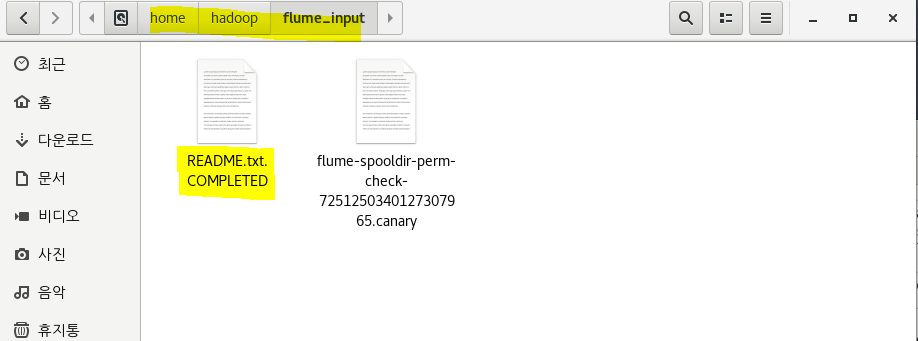
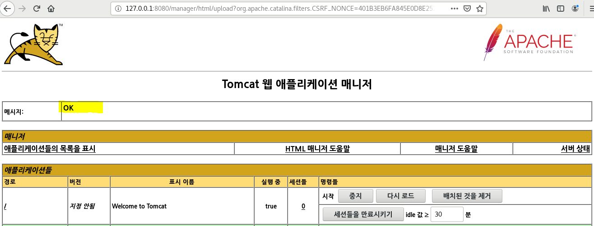

## 10/07(수)

#### flume

--------

4. 폴더에 저장된 파일을 다른 폴더로 이동하는 작업

- 설정파일 작성
- input파일이 저장될 폴더 생성
- output파일이 저장될 폴더 생성

- source 

  - 폴더에 저장된 파일을 이동
  - type : spoolDir

  [속성]

  - spoolDir : flume source가 읽어올 파일이 저장된 디렉토리

- sink

  - 다른 폴더에 저장하기
  - type : file_roll

  [속성]

  - sink.directory : flume sink가 파일을 저장할 디렉토리
  - sink.rollnterval - 기본값 30 (30초마다 파일이 rolling된다. 0으로 지정하면 파일 rolling이 일어나지 않아서 파일을 읽어서 저장하는 이벤트가 발생하는 경우 하나의 파일에 저장된다.)

5. 폴더에서 hdfs로 이동

- source

  - type : spoolDir

- sink

  - type : hdfs

  [속성]

  - hdfs.path = 저장할 hdfs의 경로 
    - hdfs://namenode정보/flume/output
    - namenode정보 : namenode의 host명이나 주소 또는 port정보 
    - /flume/output : hdfs상의 path
  - hdfs.fileType = DataStream
    - DataStream : 문자열 그대로 저장하기 위해서 사용
  - callTimeout=XXX (숫자값으로 대기시간)
  - hdfs.batchSize : 한 번에 처리할 이벤트
  - hdfs.useLocalTimeStamp = true
    - true : 현재 날짜를 변수처럼 사용 가능
    - ex) hdfs://hadoop01:9000/tomcat/log/%Y/%m/%d

6. shell 실행 명령어를 이용해서 hdfs에 적재

- source

  - type=exec

  [속성]

  - shell=shell종류명시
    - shell종류명시: /bin/bash -c
  - command=shell 명령어

7. was의 로그파일이 저장되는 위치에서 hadoop의 hdfs로 이동

- 머신1에서 머신2로 가는 것

  - 머신1 : flume - was

  - 머신2 : flume -namenode

    - flume -> flume
    - was -> namenode

    - 각각의 머신마다 설정파일이 있어야 한다.


**6. 폴더에서 hdfs로 이동**


- console.properties copy


- myhdfs.properties 설정 변경


- 실행


- readme.txt파일을 flume_input에 copy


- flume_input 폴더 copy 확인




- 결과


- 파일 복사


- myhdfs2.properties 수정


- flume 실행


- readme.txt파일을 flume_input에 copy


- 결과 


> input안에 있는 모든 txt파일을 for문을 사용하여 cat 명령어로 파일 보여주기

- myhdfs_command.properties 설정


* hadoop에 있는 모든 txt파일을 flume_input에 복사


- flume 실행


- 결과


> flume_input안에 있는 readme파일만 읽어서 flume_output2에 결과 출력 


- input에 있는 readme.txt만 사용 (input폴더에 이미 readme.txt가 있는 상태)


- 결과


> tomcat 설치 

- hadoop02의 hadoop 계정에서 수행

  - https://tomcat.apache.org/download-90.cgi 에서 링크 주소 복사

  


- 다운로드 


- 압축풀기

  - tar -zxvf 

  


- home-hadoop의 .bashrc 설정


- 설정파일 실행


- 톰캣 실행


- 톰캣이 8080을 사용
  - listen : 사용 중


- 톰캣 stop - 포트 사용 상태 확인


- 윈도우에서 쇼핑몰 만든 것 context.xml ip 주소로 수정


- 톰캣 다시 실행


- 하둡에서 ip주소:8080/manager 실행

  - admin/admin 입력해도 다시 입력창이 뜬다

  

  

  - 취소버튼 클릭시

  

  

- (문제해결)톰캣에 사용자 설정
  - 톰캣 쓰고 수정


- 톰캣 다시 실행한 후 사이트 다시 접속
  - http://127.0.0.1:8080/manager/ (앞에는 자신의 ip주소)


- 쇼핑몰 war파일 export


- finish


- remote에서 hadoop02 connection


- SSH Only


- hadoop02 머신 ip입력


- war파일을 my home에 copy


- war 파일 들어갔는지 확인 


- Browse 클릭


- war파일 선택 - 배치 버튼 클릭


- OK




- 윈도우에서 실행 (localhost에 hadoop02 머신의 ip 넣기)


**8. was의 로그파일이 저장되는 위치에서 hadoop의 hdfs로 이동**

- hadoop02에 flume 설치


- hadoop02 머신 avro.properties 설정


- hadoop01 머신 avro.properties 설정


- 결과


> 댓글 분석하기_sqoop활용


- 조사를 제외한 단어 추출

```java
package pattern.test;

import java.util.regex.Matcher;
import java.util.regex.Pattern;

public class PatternAPITest01 {

	public static void main(String[] args) {
		//조사를 제외하고 문자열을 추출
		String value = "배송이 너무 느려요 상품가 상품이 배송에"; //패턴을 적용할 문자열
		String patternStr = "외|에|은|는|이|가"; //패턴 문자열
		
		//1. 패턴 문자열을 컴파일해서 적용할 수 있는 패턴값으로 변경
		Pattern p = Pattern.compile(patternStr);
		
		//2. Pattern객체가 갖고 있는 패턴 문자열을 특정 문자열에 적용시키기 
		Matcher m = p.matcher(value);
		
		//System.out.println(m.find());
		//System.out.println(m.group());
		//조사를 제외한 단어를 저장할 stringbuffer(while문이 실행될 때마다 단어를 추가)
		
		StringBuffer sb = new StringBuffer();
		
		while(m.find()) { //패턴을 골라내는 작업
			String data = m.group(); //조사가 골라져서 나옴
			//System.out.println(data);
			m.appendReplacement(sb, "");
		}
		System.out.println(sb);
	}
}
```


**step2** https://blog.naver.com/heaves1/222102905292

오라클에 저장된 pro_comment 테이블의 모든 데이터를 sqoop을 이용하여 하둡 HDFS의 /bigshop 아래 저장하세요. 댓글 샘플을 10개 상품에 10개씩 상품평을 임의로 입력해 놓고 작업한다.


**step3** 

Bigdata 프로젝트를 작성한 후 shop.bigdata.comment 패키지를 만들고 작업한다.

하둡 HDFS의 /bigshop 아래 저장된 데이터를 이용하여 이번 달 댓글 데이터의 키워드로 wordcount를 작성하기

[조건]

의,에, 은,는, 이, 가 등의 조사를 빼고 wordcount를 적용해 보세요.

조사를 빼고 작업하는 부분은 mapper에서 우선 패턴을 적용하여 대략적 조사만

제외합니다.

CommentWordCountMapper.java

CommentWordCountReducer.java

CommentWordCountDriver.java


