## 10/08(목)

#### 댓글 분석하기

---------

> 댓글 분석하기

**step2** https://blog.naver.com/heaves1/222102905292

오라클에 저장된 pro_comment 테이블의 모든 데이터를 sqoop을 이용하여 하둡 HDFS의 /bigshop 아래 저장하세요. 댓글 샘플을 10개 상품에 10개씩 상품평을 임의로 입력해 놓고 작업한다.


- /bigshop에 저장
  - ip는 윈도우 ip주소

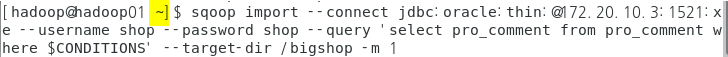


**step3** 

Bigdata 프로젝트를 작성한 후 shop.bigdata.comment 패키지를 만들고 작업한다.

하둡 HDFS의 /bigshop 아래 저장된 데이터를 이용하여 이번 달 댓글 데이터의 키워드로 wordcount를 작성하기

[조건]

의,에, 은,는, 이, 가 등의 조사를 빼고 wordcount를 적용해 보세요.

조사를 빼고 작업하는 부분은 mapper에서 우선 패턴을 적용하여 대략적 조사만

제외합니다.

CommentWordCountMapper.java

CommentWordCountReducer.java

CommentWordCountDriver.java


---------------

#### Cron

-----------------

> linux의 반복 예약

- 반복 예약
  - 내가 정의한 특정 시간에 예약된(미리 등록한) 명령어가 실행되도록
  - ex) 매주 금요일 새벽1시에 백업을 하는 경우, 일요일 새벽 4시에 was를 재부팅 작업, 매일 3시간마다 각 업무 담당자들에게 메일을 보내는 작업
  - 수행해야 할 일
    - 매일 오라클 댓글 테이블에 데이터가 sqoop hdfs에 저장
    - 저장된 데이터를 mapreduce를 적용(이때 기존 분석데이터가 필요없으면 mapreduce를 적용하기 전에 기존 파일을 제거)
    - mapreduce처리 결과를 sqoop을 이용해서 오라클 테이블에 저장되도록
  - 이런 작업을 할 수 있는 것이 리눅스 cron


> cron

- cron의 상태 확인
  - active이면 cron을 사용할 수 있는 상태이다.

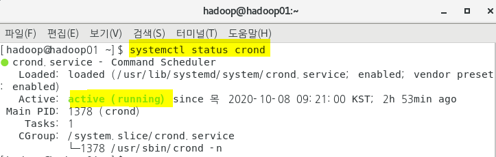


- 사용불가능일 경우 설치
  - (명령어) yum -y install cronie 


- 사용방법

  - crontab 명령어를 이용
  - crontab -e : crontab의 편집할 수 있는 에디터가 실행(에디터는 vi 편집기 형태이다.)
  - crontab -r : crontab에 등록된 모든 예약 작업을 삭제

  [명령어 등록]

  - sh 파일의 형태로 명령어를 등록해서 cron 설정파일에서는 sh파일만 정해진 시간마다 반복해서 실행되도록 설정

  - *(스페이스) *(스페이스) *(스페이스) *(스페이스) * : 반복해서 실행하고 싶은 명령어 정의(매분마다 실행)

    1) 분(0-59)

    2) 시(0-23)

    3) 일(1-31)

    4) 월(1-12 || 영문으로 월을 명시(ex.jan,feb,mar...))

    5) 요일(0-6) : 0-일요일, ..., 6-토요일

  - 조건을 만들 때 사용하는 기호

    - *(별표) : 범위에 해당하면 모두 실행
    - ,(콤마) : 여러 개를 나열
    - / : 지정한 숫자에 실행(ex.5분마다 /5)

  [조건 예]

  - 매주 일요일 오후 3시 30분에 작업을 수행
    - 30(스페이스)15(스페이스)* (스페이스)*(스페이스)0
  - 5분마다 실행
    - /5(스페이스) *(스페이스) *(스페이스) *(스페이스) *
  - 매주 토요일 오전 11시 30분, 50분에 작업 실행
    - 30,50(스페이스)11(스페이스)* (스페이스)* (스페이스)6


> cron example

- crontab 에디터로 이동


- i를 이용해서 insert가 가능하도록 함

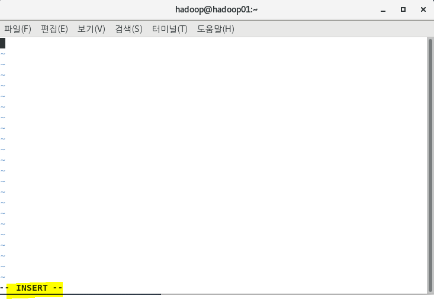


- .bashrc를 읽어서 crontab_test.txt 파일로 appand
  - '>>' : appand


- esc키 누르고 :wq 입력하면 저장하고 빠져나옴
  - 매분마다 실행

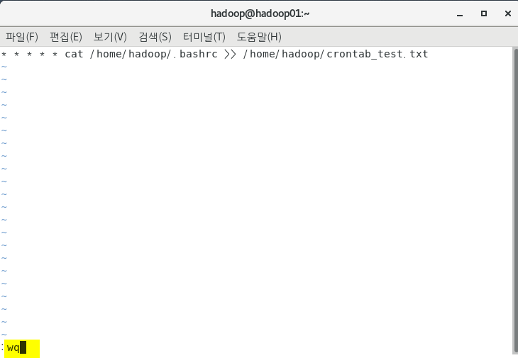


- 로그 읽기


- crontab_test.txt에 .bashrc의 내용이 들어가있는 것을 확인

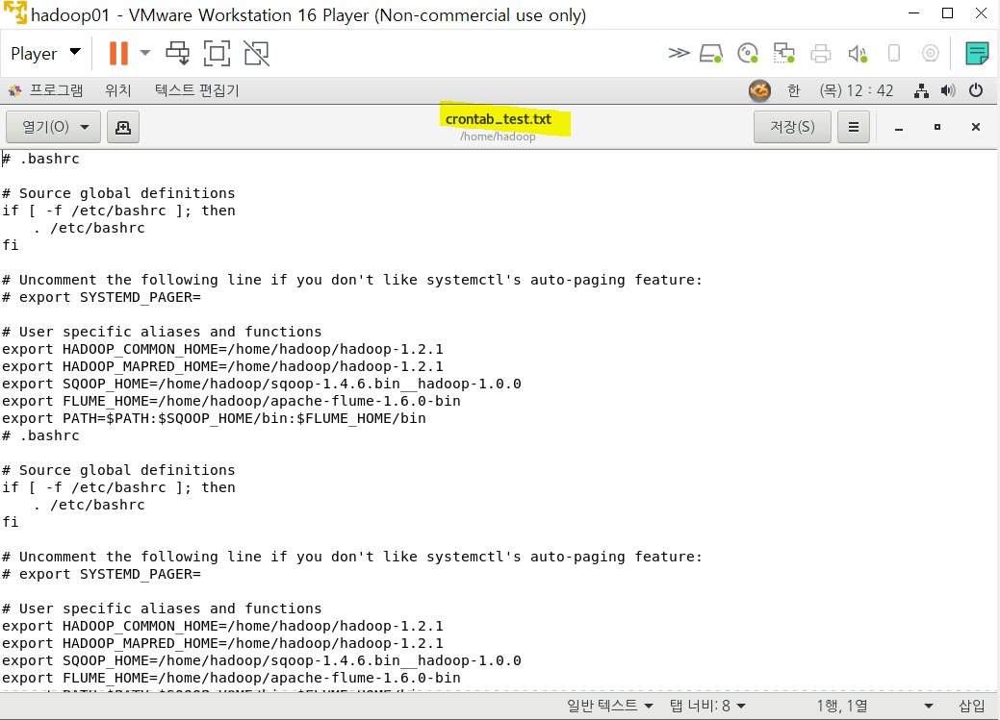


- 에디터 (파일도 생성됨)

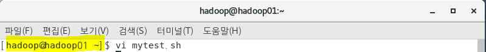


- 생성된 mytest.sh를 텍스트 파일로 열기 
  - readme.txt를 mytest.txt에 appand함


- mytest.sh 속성에 들어가서 파일을 프로그램으로 실행 허용 체크

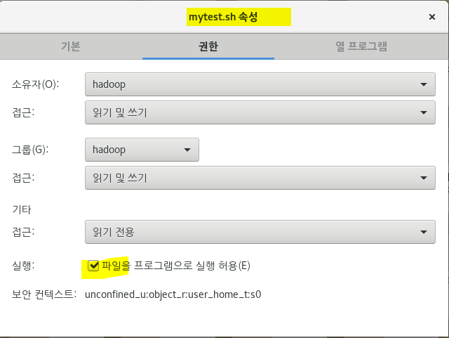


- mytest.sh 실행


- mytest.txt 생성

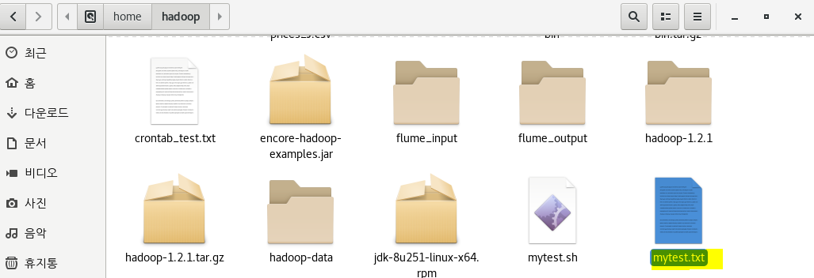


- cron 에디터 열기


- cron설정
  - 앞에 *는 붙여도 상관 없음

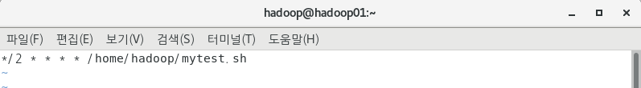


- 로그 읽기


- tomcat 파일 지우기

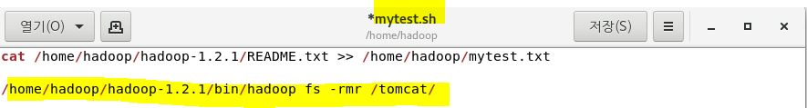


- cron 명령행 주석처리 하기


- https://dataverse.harvard.edu/dataset.xhtml?persistentId=doi:10.7910/DVN/HG7NV7 사이트 접속

  - 1988 다운

  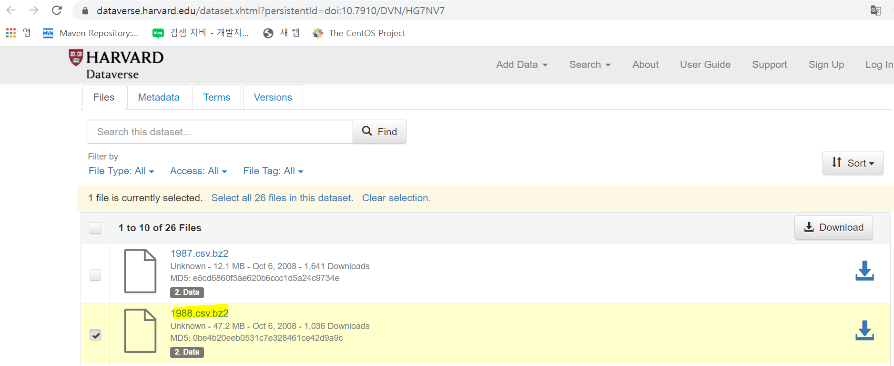


- copy

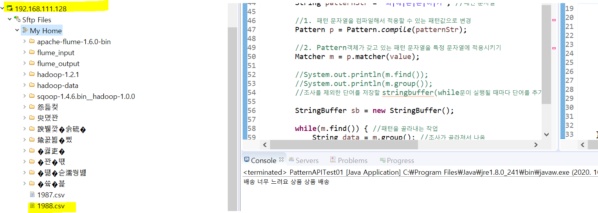


- 폴더 생성


- air에 모든 csv파일을 넣음


- advancedMapreduceTest 프로젝트에 mapred.exam.air 생성

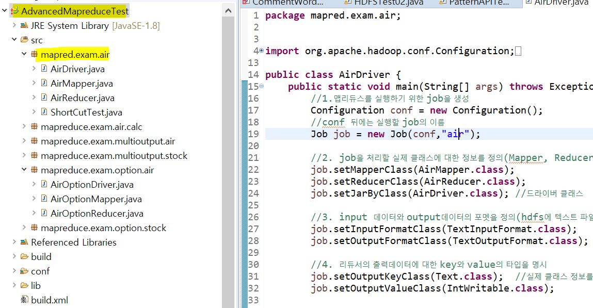


- export 선택

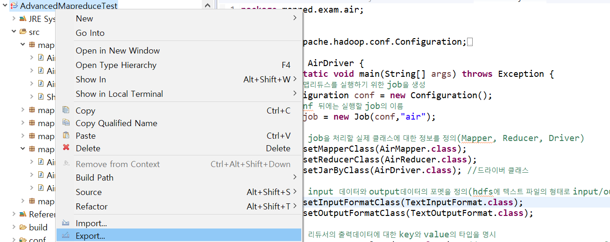


- jar파일 선택

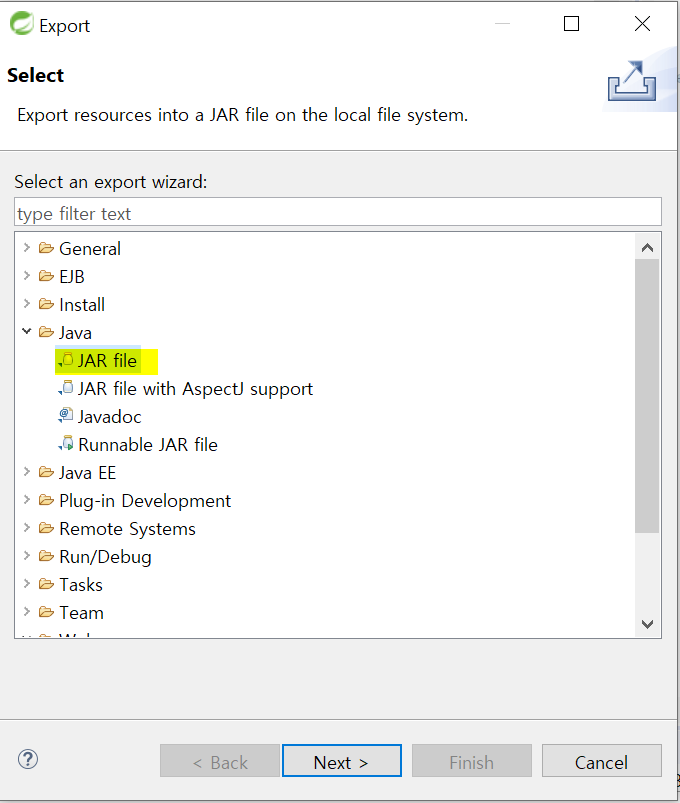


- jar export

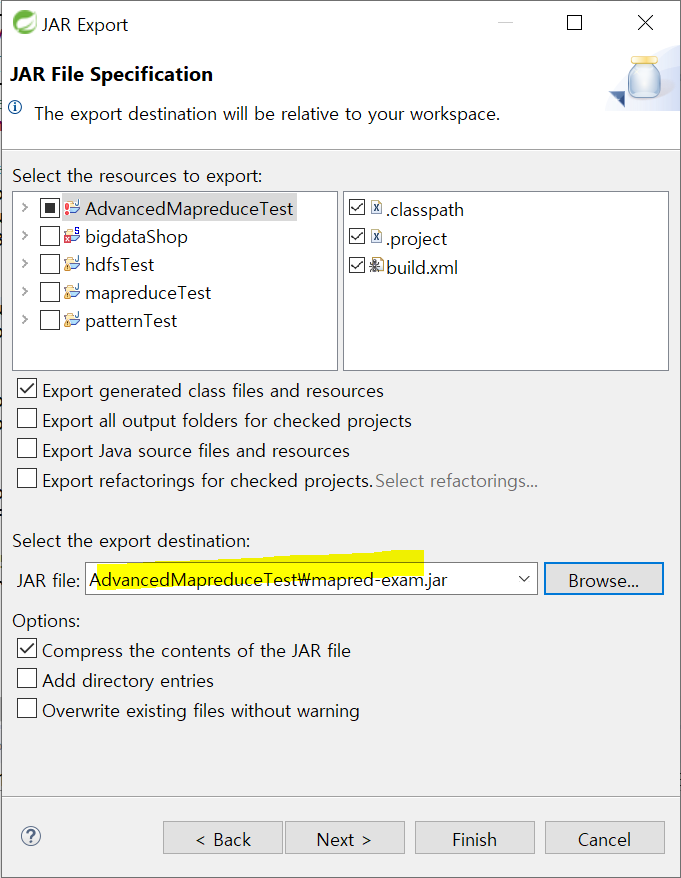


- build path

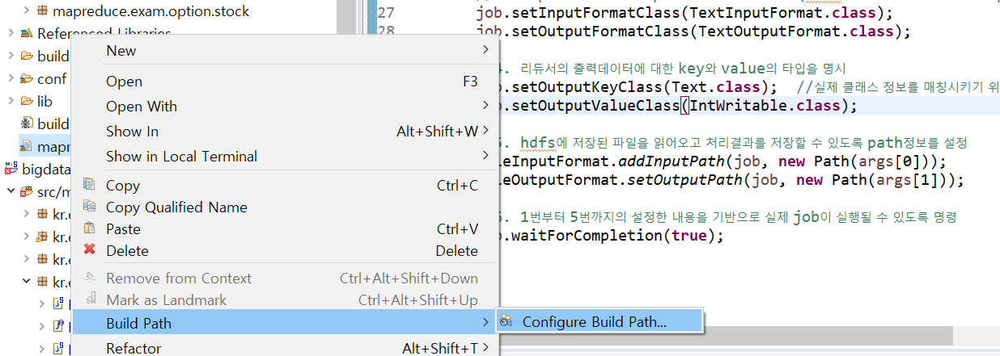


- add external jars - 생선된 jar파일 추가

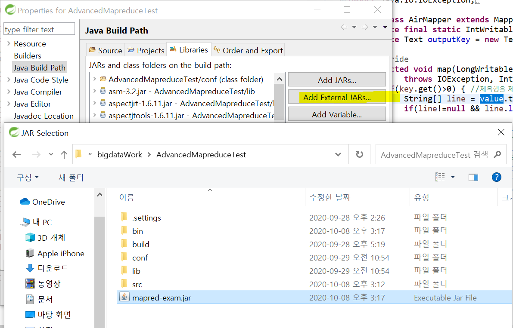


- run configurations

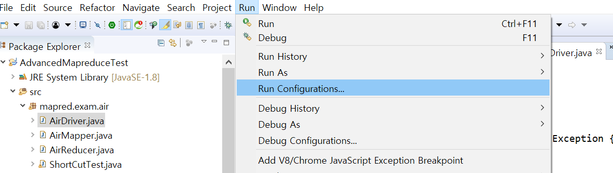


- argument - string_prompt 추가

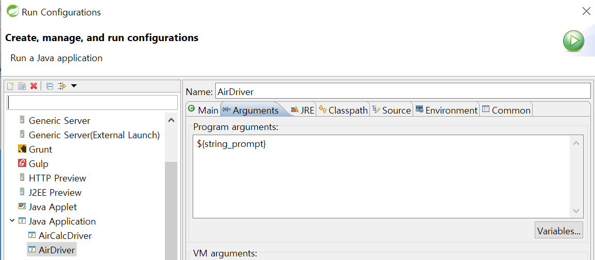


- run - OK

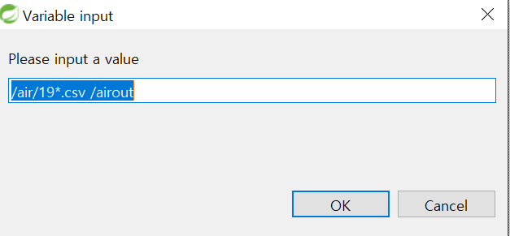


- 결과 확인

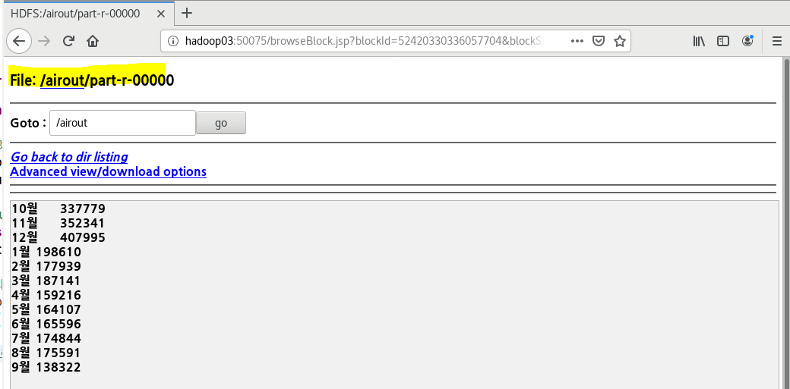


- output 연도 추가

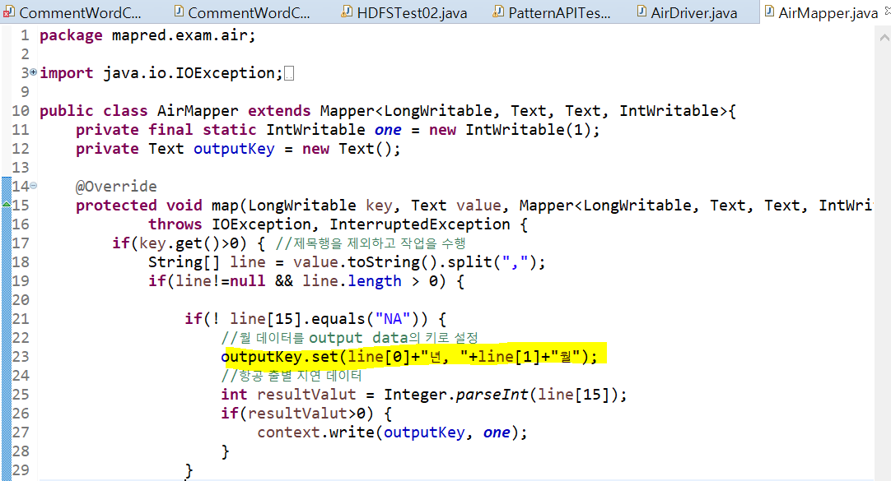


- 결과

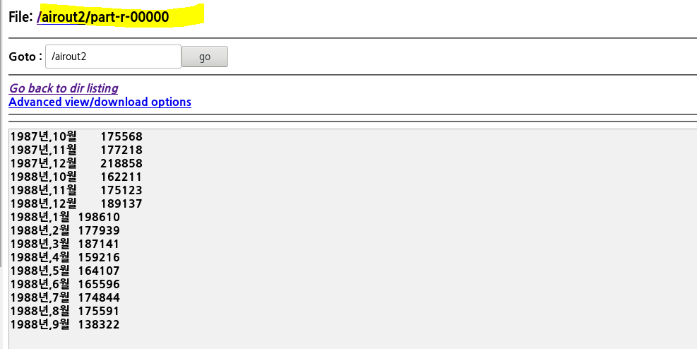


-----------

#### Combiner

--------

> Combiner

- 셔플할 데이터의 크리를 줄이기 위해 사용
- 맵태스크와 리듀스태스크  사이에 데이터를 전달하는 과정을 Shuffle이라 한다.
- 맵태스크의 출력데이터는 네트워크를 통해서 리듀스 태스크에 전달된다.
- 네트워크를 통해서 데이터가 전달되므로 데이터의 크기를 줄일 수 있어야 한다.
- 리듀서가 처리할 데이터들이 줄어든다.


- mapred.exam.air를 복사
  - mapred.exam.air.combiner

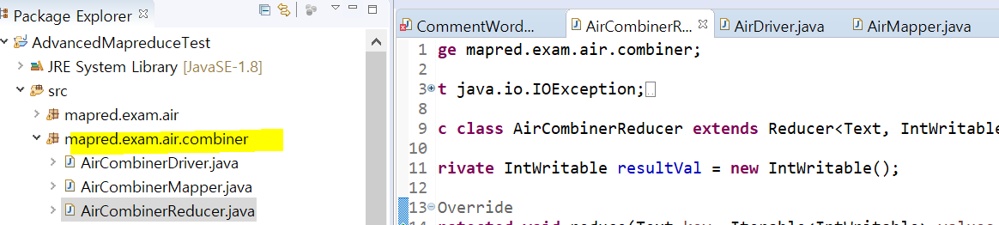


- AirCombinerReducer.java 수정

```java
package mapred.exam.air.combiner;

import java.io.IOException;

import org.apache.hadoop.io.IntWritable;
import org.apache.hadoop.io.Text;
import org.apache.hadoop.mapreduce.Reducer;

public class AirCombinerReducer extends Reducer<Text, IntWritable, Text, IntWritable>{
	
	private IntWritable resultVal = new IntWritable();
	
	@Override
	protected void reduce(Text key, Iterable<IntWritable> values,
			Reducer<Text, IntWritable, Text, IntWritable>.Context context) 
			throws IOException, InterruptedException {
		int sum = 0;
		
		//합산하는 작업
		for(IntWritable value : values) {
			sum = sum + value.get();
		}
		resultVal.set(sum); 
		context.write(key, resultVal);
		context.getCounter("myCounter","combiner_air").increment(1);
	}
}
```


- AirCombinerDriver.java

```java
package mapred.exam.air.combiner;


import org.apache.hadoop.conf.Configuration;
import org.apache.hadoop.fs.Path;
import org.apache.hadoop.io.IntWritable;
import org.apache.hadoop.io.Text;
import org.apache.hadoop.mapreduce.Job;
import org.apache.hadoop.mapreduce.lib.input.FileInputFormat;
import org.apache.hadoop.mapreduce.lib.input.TextInputFormat;
import org.apache.hadoop.mapreduce.lib.output.FileOutputFormat;
import org.apache.hadoop.mapreduce.lib.output.TextOutputFormat;

public class AirCombinerDriver {
	public static void main(String[] args) throws Exception {
		//1.맵리듀스를 실행하기 위한 job을 생성 
		Configuration conf = new Configuration();
		//conf 뒤에는 실행할 job의 이름 
		Job job = new Job(conf,"air_combiner");
		
		//2. job을 처리할 실제 클래스에 대한 정보를 정의(Mapper, Reducer, Driver)
		job.setMapperClass(AirCombinerMapper.class);
		job.setCombinerClass(AirCombinerReducer.class);
		job.setReducerClass(AirCombinerReducer.class);
		job.setJarByClass(AirCombinerDriver.class); //드라이버 클래스
		
		//3. input 데이터와 output데이터의 포멧을 정의(hdfs에 텍스트 파일의 형태로 input/output이 들어감)
		job.setInputFormatClass(TextInputFormat.class);
		job.setOutputFormatClass(TextOutputFormat.class);
		
		//4. 리듀서의 출력데이터에 대한 key와 value의 타입을 명시
		job.setOutputKeyClass(Text.class);  //실제 클래스 정보를 매칭시키기 위해 .class
		job.setOutputValueClass(IntWritable.class); 
		
		//5. hdfs에 저장된 파일을 읽어오고 처리결과를 저장할 수 있도록 path정보를 설정
		FileInputFormat.addInputPath(job, new Path(args[0]));
		FileOutputFormat.setOutputPath(job, new Path(args[1]));
		
		//6. 1번부터 5번까지의 설정한 내용을 기반으로 실제 job이 실행될 수 있도록 명령
		job.waitForCompletion(true);
		
	}
}
```


- jar파일 다시 복사해서 run 

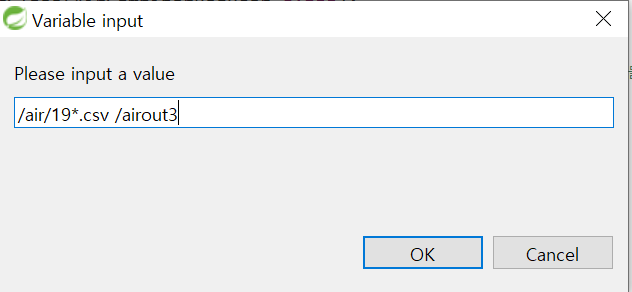


- combinder하여 수치가 줄어든 것을 확인할 수 있다.

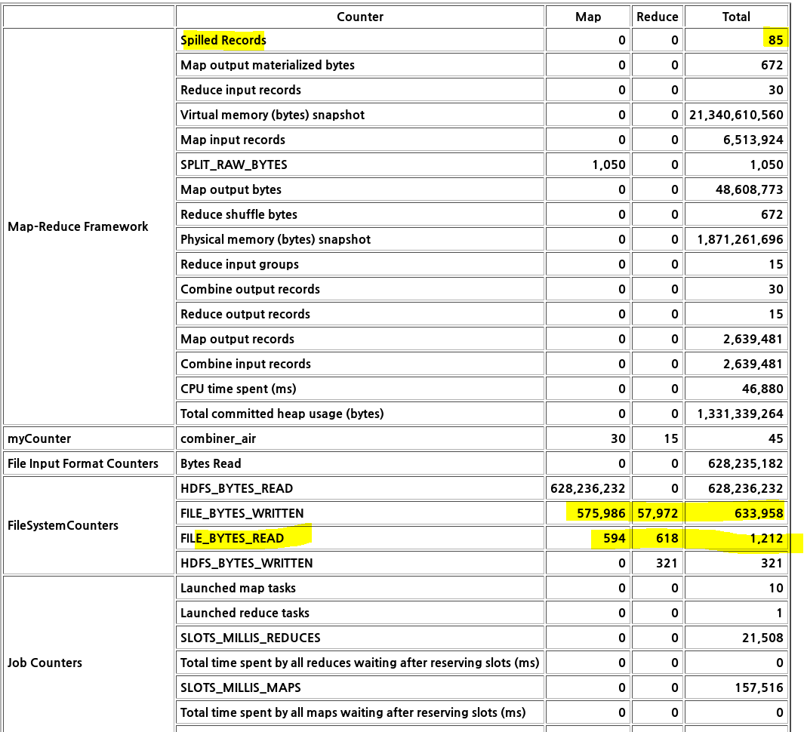 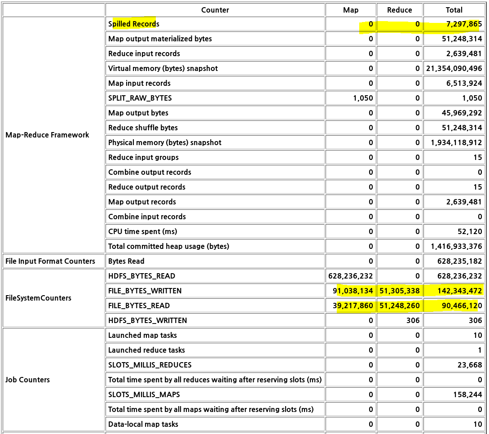


------------

#### 정렬

---------

> 정렬

- 정렬의 종류

  - 보조정렬
  - 부분정렬
  - 전체정렬

- 보조정렬

  - 기존의 맵리듀스에서 정렬되는 기본 키 방식과 다르게 정렬 기준을 추가해서 작업

    1) 복합키(사용자정의 키)

    - WritableComparable

    - 사용자가 정렬하고 싶은 기준 키를 정의

    2) 복합키 비교기

    - WritableComparator

    3) 파티셔너

    - Partitioner의 하위

    4) 파티셔너 그룹키 비교기

    - WritableComparator

    5) 매퍼

    - Mapeer

    6) 리듀서

    - Reducer

    7) 드라이버

    - 맵리듀스를 실행하기 위한 Application