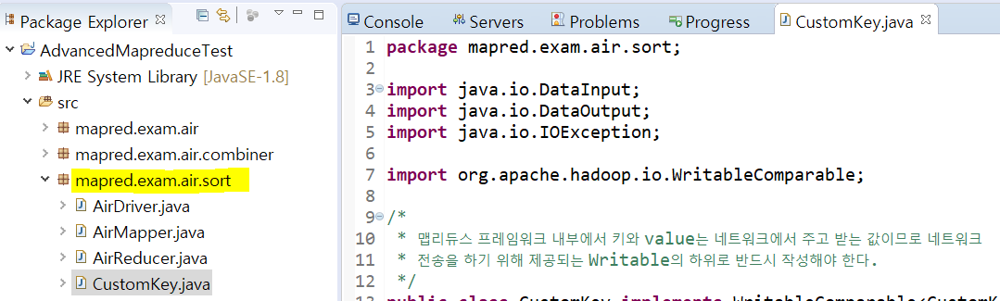
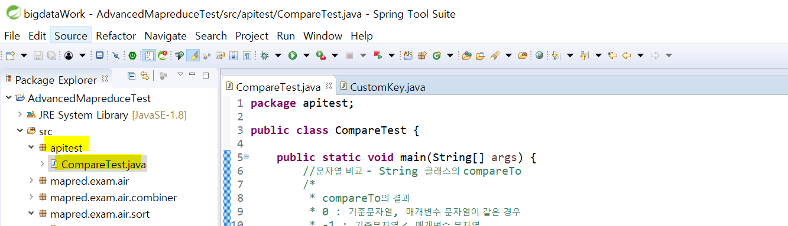
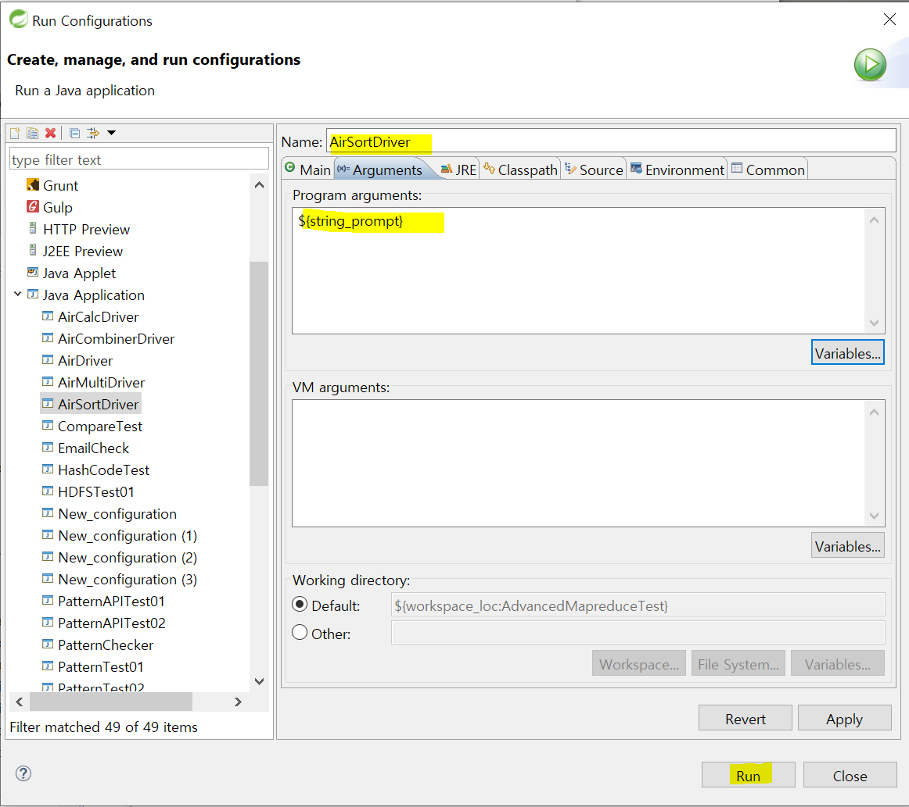
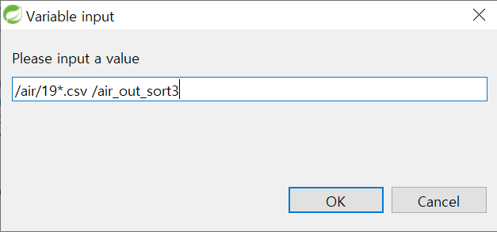
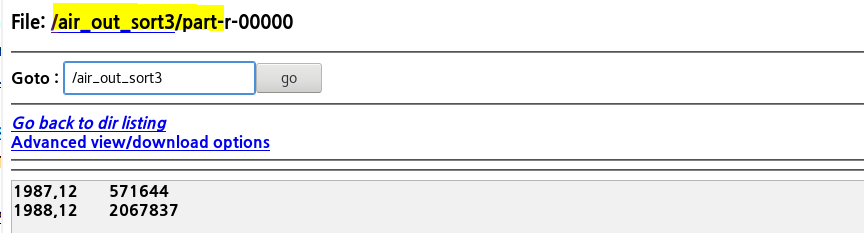
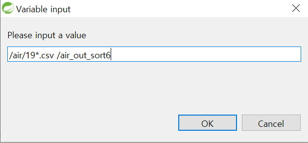
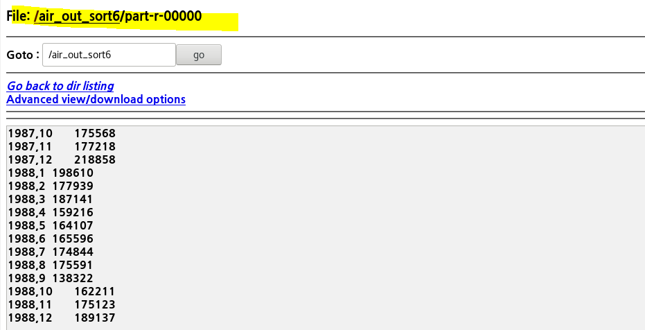

## 10/12(월)

#### Shuffle단을 수정

---------

- map과 reduce사이에 shuffl이라 부르는 처리가 자동으로 프레임워크에 의해 처리된다.
- 리듀스의 전처리 작업으로 사용자가 직접 정의하지 않지만 필요에 의해서(복잡합 input데이터 활용해서 조인하거나 사용자 정의 기준으로 정렬하거나...) 커스트마이징 할 수 있어야 한다.
- map작업 진행 ----> shuffle작업 ----> reduece작업
  -  map처리 후 데이터를 정렬해서 같은 키를 가진 데이터를 같은 장소에 모은다.
  - 이때 슬래이브 서버 간에 네트워크를 통한 전송이 발생
  - shuffle단에서 발생하는 이러한 작업을 프레임워크 내부에서 자동으로 처리
    - (shuffle단) : 네트워크를 통한 전송이 발생한다.(그래서 최적화하는 작업이 필요)


> 정렬

- 정렬의 종류

  - 보조정렬 
  - 부분정렬
  - 전체정렬

- 보조정렬

  - 기존의 맵리듀스에서 정렬되는 기본 키 방식과 다르게 정렬 기준을 추가해서 작업

    1) 복합키(사용자정의 키)

    - Writable or WritableComparable를 상속 받아야 한다.(보통은 WritableComparable)
      - WritableComparable: 내부에서 인식하는 키 클래스 (키를 비교하는 클래스)
    - hadoop 내부에서 인식하는 key나 value는 WritableComparable의 하위로 작성해서 인식하도록 해야 한다. 
    - 사용자가 정렬하고 싶은 기준 키를 정의
    - 상위 클래스가 갖고 있는 readFields, write, compareTo 메소드를 오버라이딩 해야한다.
    - readFields, write 메소드는 직렬화와 역직렬화를 위해 필요한 메소드이다.
    - 직렬화와 역직렬화는 어떤 객체를 네트워크를 통해서 전공해서 하드디스크에 저장될 수 있는 타입으로 변환해주는 과정
    - readFields는 역직렬화될때 호출되는 메소드
    - write는 직렬화될때 호출되는 메소드

    2) 복합키 비교기

    - WritableComparator

    3) 파티셔너

    - Partitioner의 하위
    - 파티셔너는 맵 태스크의 출력데이터를 어떤 리듀서태스크의 입력데이터로 보낼지 결정 이에대한 결정은 맵태스크의 출력데이터 키값에 따라서 결정이 되어 정렬된다. 우리가 작성할 파티셔너는 연도별로 그룹핑을 해서 파티셔닝을 수행한다. 

    4) 파티셔너 그룹키 비교기

    - WritableComparator

    5) 매퍼

    - Mapeer

    6) 리듀서

    - Reducer

    7) 드라이버

    - 맵리듀스를 실행하기 위한 Application

- 처리과정
  - 1.정렬하려고 하는 기준을 정의한 사용자 키 클래스 작성 - CustomKey
  - 2.Maaper클래스의 map메소드에서 사용자 정의키가 output로 출력될 수 있도록 정의
  - 3.reducer 태스크에 분배할 수 있도록 하기 위해서 Partitioner를 정의 
    - 같은 키를 갖고 있는 Mapper의 출력데이터를 같은 리듀서 태스크로 보내기 위해서 해시코드를 이용해서 계산
  - 4.Reducer 태스크로 보내기 전에 같은 그룹으로 그룹핑 할 수 있도록 객체를 정의 
    - 그룹키 비교기(GroupKeyComparator)라고 정의했다.
    - ex) air데이터에서는 같은 연도별로 데이터를 분류
  - 5.4번에서 같은 그룹으로 정의한 데이터들의 내부에서 두 번째 기준을 적용해서 비교할 수 있도록 객체를 정의
    - 사용자정의키 비교기(복합키비교기라고 부름 - CustomKeyComparator)
    - 1번에서 정의한 복합키를 기준으로 데이터를 비교해서 정렬하기 위해서
  - 6.그룹별로 같은 키를 가지고 있는 객체가 집계되도록 reducer를 수정
  - 7.드라이버에 shuffle단에서 실행될 클래스를 등록
    - CustomKey
    - AirSortPartitioner
    - GroupKeyComparator
    - CustomKeyComparator


- 패키지 mapred.exam.air.sort 생성
  - mapred.exam.air 복사




###### <CustomKey.java>

```java
package mapred.exam.air.sort;

import java.io.DataInput;
import java.io.DataOutput;
import java.io.IOException;

import org.apache.hadoop.io.WritableComparable;
import org.apache.hadoop.io.WritableUtils;

/*
 * 맵리듀스 프레임워크 내부에서 키와 value는 네트워크에서 주고 받는 값이므로 네트워크
 * 전송을 하기 위해 제공되는 Writable의 하위로 반드시 작성해야 한다.
 */
public class CustomKey implements WritableComparable<CustomKey>{
	//1. 비교할 키를 멤버변수로 정의
	private String year;
	private Integer month;
	public CustomKey() {
	
	}
	public CustomKey(String year, Integer month) {
		super();
		this.year = year;
		this.month = month;
	}
	public String getYear() {
		return year;
	}
	public void setYear(String year) {
		this.year = year;
	}
	public Integer getMonth() {
		return month;
	}
	public void setMonth(Integer month) {
		this.month = month;
	}
	@Override
	public String toString() {
		return (new StringBuffer()).append(year).append(",").append(month).toString();
	}
	
	//2. 데이터를 쓰고 읽는 작업을 처리
	//새로운 메소드를 작성하는 것이 아니라 hadoop프레임워크 내부에서 이런 작업을 
	//처리하기 위해 호출되는 메소드를 오버라이딩
	//직렬화 될 때 호출
	@Override
	public void write(DataOutput out) throws IOException {
		WritableUtils.writeString(out, year);
		out.write(month);
	}
	
	//역직렬화 될 때 호출
	@Override
	public void readFields(DataInput in) throws IOException {
		year = WritableUtils.readString(in);
		month = in.readInt();
	}
	
	//사용자가 만들어 놓은 키를 기준으로 정렬하기 위해서 비교하게 될 메소드를 구현
	//year로 비교 year가 같으면 month로 비교
	@Override
	public int compareTo(CustomKey keyObj) {
		int result = year.compareTo(keyObj.year); //year는 this가 앞에 생략된 것 ,keyObj.year는 새로운 key
		if(result == 0) { //year가 서로 같으면
			result = month.compareTo(keyObj.month);
		}
		return result;
	}
}
```


###### <AirSortMapper.java>

```java
package mapred.exam.air.sort;

import java.io.IOException;

import org.apache.hadoop.io.IntWritable;
import org.apache.hadoop.io.LongWritable;
import org.apache.hadoop.io.Text;
import org.apache.hadoop.mapreduce.Mapper;

public class AirSortMapper extends Mapper<LongWritable, Text, CustomKey, IntWritable>{
	private final static IntWritable one = new IntWritable(1);
	private CustomKey outputKey = new CustomKey(); //output key
	
	@Override
	protected void map(LongWritable key, Text value, Mapper<LongWritable, Text, CustomKey, IntWritable>.Context context)
			throws IOException, InterruptedException {
		if(key.get()>0) { //제목행을 제외하고 작업을 수행
			String[] line = value.toString().split(",");
			if(line!=null && line.length > 0) {

				if(! line[15].equals("NA")) {
					//월 데이터를 output data의 키로 설정
					outputKey.setYear(line[0]);
					outputKey.setMonth(Integer.parseInt(line[1]));
					//항공 출별 지연 데이터
					int resultValut = Integer.parseInt(line[15]);
					if(resultValut>0) {
						context.write(outputKey, one);
					}
				}
				
			}
		}
	}
}

```


- 패키지 생성




###### <CompareTest.java> : compare의 간단한 test

```java
package apitest;

public class CompareTest {

	public static void main(String[] args) {
		//문자열 비교 - String 클래스의 compareTo
		/*
		 * compareTo의 결과
		 * 0 : 기준문자열, 매개변수 문자열이 같은 경우
		 * -1 : 기준문자열 < 매개변수 문자열
		 * 1 : 기준문자열 > 매개변수 문자열
		 */
		String data1 = "a" ; 
		String data2 = "b" ;
		String data3 = "b" ;
		System.out.println((int)'a');
		System.out.println((int)'b');
		System.out.println(data1.compareTo(data2));
		System.out.println(data2.compareTo(data3));
		System.out.println(data2.compareTo(data1));
		
		Integer intdata1 = 9 ; 
		Integer intdata2 = 10 ;
		Integer intdata3 = 10 ;
		System.out.println((int)'a');
		System.out.println((int)'b');
		System.out.println(intdata1.compareTo(intdata2));
		System.out.println(intdata2.compareTo(intdata3));
		System.out.println(intdata2.compareTo(intdata1));
	}

}

```


###### <HashCodeTest.java> : HashCode의 간단한 test

```java
package apitest;

import mapred.exam.air.sort.CustomKey;

public class HashCodeTest {

	public static void main(String[] args) {
		//hashcode메소드
		//해시코드란 객체를 구분할 수 있는 정수값
		//=> 정수값은 객체가 할당된 주소를 가지고 계산을 해서 생성
		HashCodeTest obj1 = new HashCodeTest();
		HashCodeTest obj2 = new HashCodeTest();
		System.out.println(obj1);
		System.out.println(obj2);
		
		CustomKey key1 = new CustomKey();
		CustomKey key2 = new CustomKey();
		System.out.println(key1);
		System.out.println(key2);
		System.out.println(key1.hashCode());
		System.out.println(key2.hashCode());
		
		//문자열에서 호출하는 해시코드는 object의 hashcode메소드가 오버라이딩
		//되어 주소를 가지고 정수값을 만들지 않고 문자열을 이용해서 구분 정수를 생성
		//문자열이 같으면 hashcode가 같다.
		key1.setYear("1987");
		key2.setYear("1988");
		System.out.println(key1.getYear().hashCode());
		System.out.println(key2.getYear().hashCode());
		
		System.out.println(key1.getYear().hashCode()%2);
		System.out.println(key2.getYear().hashCode()%2);
	}
}
```


###### <AirSortPartitioner.java>

```java
package mapred.exam.air.sort;

import org.apache.hadoop.io.IntWritable;
import org.apache.hadoop.mapreduce.Partitioner;

//Partitioner 인터페이스를 상속하는 경우 Mapper에 전달되는 결과 key와 value의 타입을  
//generic으로 명시해야함
//year를 기준으로 해시코드를 구해서 같은 year를 갖고 있는 데이터를 같은 리듀서에서
//작업할 수 있도록 분배
//==> 같은 것끼리 메모리버퍼에 쌓았다가 한꺼번에 전송
public class AirSortPartitioner extends Partitioner<CustomKey, IntWritable>{
	//numPartition은 리듀스태스크의 개수
	public int getPartition(CustomKey key, IntWritable value, int numPartition) {

		return key.getYear().hashCode()%numPartition;
	}
	
}

```


###### <CustomKeyComparator.java>

```java
package mapred.exam.air.sort;

import org.apache.hadoop.io.WritableComparable;
import org.apache.hadoop.io.WritableComparator;

//사용자정의키 객체를 비교하는 비교기 - 키가 같은지 비교하는 역할
public class CustomKeyComparator extends WritableComparator{

	protected CustomKeyComparator() {
		super(CustomKey.class, true);
	}
	
	//WritableComparator의 타입이 정확하기 않기 때문에 warning발생
	//타입에 대한 부분을 무시하고 체크하지 않고 처리하겠다는 의미 
	@SuppressWarnings("rawtypes") 
	@Override
	public int compare(WritableComparable obj1, WritableComparable obj2) {
		CustomKey key1 = (CustomKey) obj1;
		CustomKey key2 = (CustomKey) obj2;
		return key1.compareTo(key2);
	}
	
}

```


###### <GroupKeyComparator.java>

```java
package mapred.exam.air.sort;

import org.apache.hadoop.io.WritableComparable;
import org.apache.hadoop.io.WritableComparator;

//데이터를 그룹핑하기 위해서 필요한 객체
//즉, 같은 연도끼리 데이터를 그룹화하기 위해서 필요한 객체 
public class GroupKeyComparator extends WritableComparator{

	protected GroupKeyComparator() {
		super(CustomKey.class,true);
	}
	
	@SuppressWarnings("rawtypes")
	@Override
	public int compare( WritableComparable obj1, WritableComparable obj2) {
		CustomKey key1 = (CustomKey) obj1;
		CustomKey key2 = (CustomKey) obj2;
		return key1.getYear().compareTo(key2.getYear());
	}
	
}

```


###### <AirSortReducer.java>

```java
package mapred.exam.air.sort;

import java.io.IOException;

import org.apache.hadoop.io.IntWritable;
import org.apache.hadoop.mapreduce.Reducer;

public class AirSortReducer extends Reducer<CustomKey, IntWritable, CustomKey, IntWritable>{
	
	private IntWritable resultVal = new IntWritable();
	CustomKey resultKey = new CustomKey();
	@Override
	protected void reduce(CustomKey key, Iterable<IntWritable> values,
			Reducer<CustomKey, IntWritable, CustomKey, IntWritable>.Context context) 
			throws IOException, InterruptedException {
		int sum = 0;
		
		//합산하는 작업
		for(IntWritable value : values) {
			sum = sum + value.get();
		}
		resultVal.set(sum); 
		resultKey.setYear(key.getYear());
		resultKey.setMonth(key.getMonth());
		
		//reduce의 실행결과를 context에 저장
		context.write(resultKey, resultVal);
	}	
}
```


###### <AirSortDriver.java>

```java
package mapred.exam.air.sort;


import org.apache.hadoop.conf.Configuration;
import org.apache.hadoop.fs.Path;
import org.apache.hadoop.io.IntWritable;
import org.apache.hadoop.io.Text;
import org.apache.hadoop.mapreduce.Job;
import org.apache.hadoop.mapreduce.lib.input.FileInputFormat;
import org.apache.hadoop.mapreduce.lib.input.TextInputFormat;
import org.apache.hadoop.mapreduce.lib.output.FileOutputFormat;
import org.apache.hadoop.mapreduce.lib.output.TextOutputFormat;

public class AirSortDriver {
	public static void main(String[] args) throws Exception {
		//1.맵리듀스를 실행하기 위한 job을 생성 
		Configuration conf = new Configuration();
		//conf 뒤에는 실행할 job의 이름 
		Job job = new Job(conf,"air");
		
		//2. job을 처리할 실제 클래스에 대한 정보를 정의(Mapper, Reducer, Driver)
		job.setMapperClass(AirSortMapper.class);
		job.setReducerClass(AirSortReducer.class);
		job.setJarByClass(AirSortDriver.class); //드라이버 클래스
		
		//shuffle단
		job.setPartitionerClass(AirSortPartitioner.class);
		job.setGroupingComparatorClass(GroupKeyComparator.class);
		job.setSortComparatorClass(CustomKeyComparator.class);
		job.setMapOutputKeyClass(CustomKey.class);
		job.setMapOutputValueClass(IntWritable.class);
		
		//3. input 데이터와 output데이터의 포멧을 정의(hdfs에 텍스트 파일의 형태로 input/output이 들어감)
		job.setInputFormatClass(TextInputFormat.class);
		job.setOutputFormatClass(TextOutputFormat.class);
		
		//4. 리듀서의 출력데이터에 대한 key와 value의 타입을 명시
		job.setOutputKeyClass(Text.class);  //실제 클래스 정보를 매칭시키기 위해 .class
		job.setOutputValueClass(IntWritable.class); 
		
		//5. hdfs에 저장된 파일을 읽어오고 처리결과를 저장할 수 있도록 path정보를 설정
		FileInputFormat.addInputPath(job, new Path(args[0]));
		FileOutputFormat.setOutputPath(job, new Path(args[1]));
		
		//6. 1번부터 5번까지의 설정한 내용을 기반으로 실제 job이 실행될 수 있도록 명령
		job.waitForCompletion(true);
		
	}
}
```


- run configurations




- run 




- 결과




###### <AirSortReducer.java> 수정

```java
package mapred.exam.air.sort;

import java.io.IOException;

import org.apache.hadoop.io.IntWritable;
import org.apache.hadoop.mapreduce.Reducer;

public class AirSortReducer extends Reducer<CustomKey, IntWritable, CustomKey, IntWritable>{
	
	private IntWritable resultVal = new IntWritable();
	CustomKey resultKey = new CustomKey();
	@Override
	protected void reduce(CustomKey key, Iterable<IntWritable> values,
			Reducer<CustomKey, IntWritable, CustomKey, IntWritable>.Context context) 
			throws IOException, InterruptedException {
		int sum = 0;
		Integer beforeMonth = key.getMonth();
		//String year = key.getYear();
		//System.out.println(year+",,,,,,"+beforeMonth+"::::::");
		int count = 0;
		//합산하는 작업
		for(IntWritable value : values) {
			if(count<20) {
				System.out.println("reduce =>"+key);
				count++;
			}
			//기존에 추출한 키의 month값이 다른 경우
			if(beforeMonth!=key.getMonth()) {
				resultKey.setYear(key.getYear());
				resultKey.setMonth(beforeMonth);
				resultVal.set(sum);
				context.write(resultKey, resultVal);
				sum=0;
			}
			sum = sum + value.get();
			beforeMonth = key.getMonth();
		}
		if(key.getMonth()==beforeMonth) {
			resultVal.set(sum); 
			resultKey.setYear(key.getYear());
			resultKey.setMonth(key.getMonth());
			//reduce의 실행결과를 context에 저장
			context.write(resultKey, resultVal);
		}

	}

	
}

```


- 결과




- 결과

