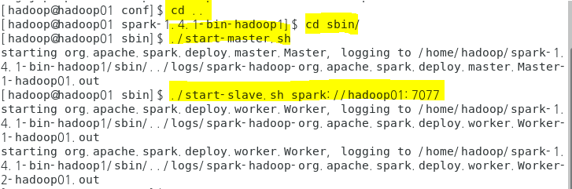
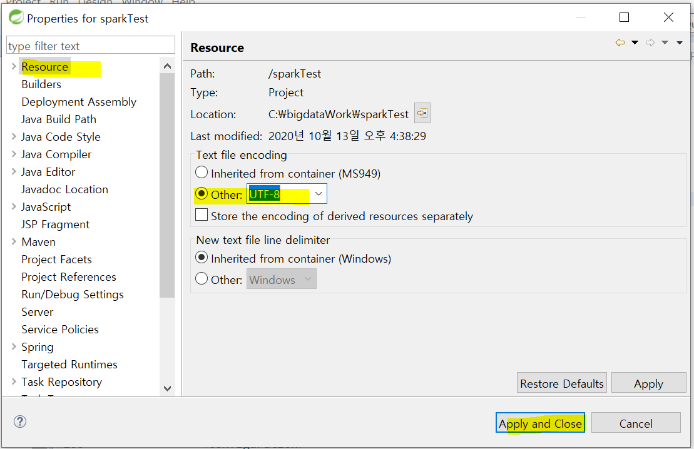
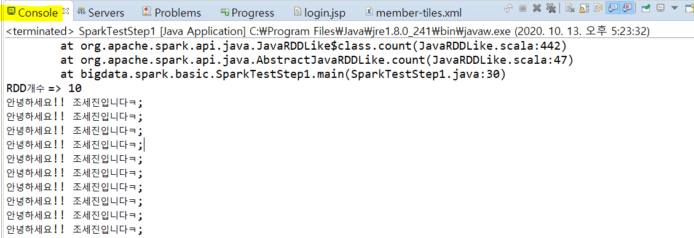

## 10/13(화)

#### Interceptor

---------

- bigdataShop에 Interceptor 패키지 추가
  - TimeCheckInterceptor 클래스 추가


- 두 메소드 오버라이드


###### <TimeCheckInterceptor .java>

```java
package kr.encore.bigdataShop.interceptor;

import javax.servlet.http.HttpServletRequest;
import javax.servlet.http.HttpServletResponse;

import org.springframework.web.servlet.ModelAndView;
import org.springframework.web.servlet.handler.HandlerInterceptorAdapter;

//컨트롤러가 실행되는 시간을 측정(접속자 ip)
public class TimeCheckInterceptor extends HandlerInterceptorAdapter{
	private long start;
	private long end;
	//컨트롤러 시작 전
	@Override
	public boolean preHandle(HttpServletRequest request, HttpServletResponse response, Object handler)
			throws Exception {
		System.out.println("======preHandler======");
		System.out.println("접속한 ip:"+request.getRemoteHost());
		start = System.nanoTime(); //실행 전 시간 측정
		return true; //다음 Interceptor나 컨트롤러를 실행하겠다는 의미
	}
	
	//컨트롤러 실행 후 (뷰가 만들어지기 전)
	@Override
	public void postHandle(HttpServletRequest request, HttpServletResponse response, Object handler,
			ModelAndView modelAndView) throws Exception {
		end = System.nanoTime(); //실행된 후의 시간 측정
		System.out.println("======postHandler======");
		String handlerClass = handler.getClass().getName();
		System.out.println(handlerClass+": 실행시간=>"+(end-start));		
	}
}
```


###### <spring-config.xml>

```xml
<!-- 인터셉터 등록 -->
<interceptors>
    <interceptor>
        <!-- 요청 path를 정의 path 속성에 정의하는 url로 요청하면 인터셉터를 실행 -->
        <mapping path="/**/"/>
        <beans:bean 																		class="kr.encore.bigdataShop.interceptor.TimeCheckInterceptor"/>
    </interceptor>
</interceptors>
```


> 로그인 체크

- LoginChectInterceptor 추가

###### <LoginChectInterceptor.java>

```
package kr.encore.bigdataShop.interceptor;

import javax.servlet.http.HttpServletRequest;
import javax.servlet.http.HttpServletResponse;
import javax.servlet.http.HttpSession;

import org.springframework.web.servlet.ModelAndView;
import org.springframework.web.servlet.handler.HandlerInterceptorAdapter;

import kr.encore.bigdataShop.member.MemberDTO;

public class LoginChectInterceptor extends HandlerInterceptorAdapter{

	@Override
	public boolean preHandle(HttpServletRequest request, HttpServletResponse response, Object handler)
			throws Exception {
		//로그인 유무를 체크
		HttpSession session = request.getSession(false);
		
		if(session != null) {
			//로그인 사용자 정보 찾기 
			MemberDTO user = (MemberDTO) session.getAttribute("loginUser");
			if(user==null) {
				response.sendRedirect("/bigdataShop/member/login.do");
				return false;
			}
		}
		return true;
	}

	@Override
	public void postHandle(HttpServletRequest request, HttpServletResponse response, Object handler,
			ModelAndView modelAndView) throws Exception {

		
	}
}
```


###### <spring-config.xml>

- exclude-mapping: 다음의 경로는 제외

```xml
<interceptors>
    <interceptor>
        <mapping path="/board/**"/>
        <mapping path="/member/**"/>
        <exclude-mapping path="/member/login.do"/>
        <exclude-mapping path="/board/ajax_boardlist.do"/>
        <beans:bean 																		class="kr.encore.bigdataShop.interceptor.LoginChectInterceptor"/>
    </interceptor>
</interceptors>
```


---------

#### Log

--------

- 로그기록(logback이용)

  - log4j를 기반으로 사용하는 로그 프레임워크
  - logger, Appender, Encoder

  1) Logger : 로깅 담당

  2) Appender : 로그가 출력될 대상 관리

  3) Encoder : 특정 형식으로 로그 메시지를 변환하는 역할


- 로그 레벌
  - ERROR : 일반적인 에러가 발생하는 상황
  - WARN : 경고(에러아님 - 그러나 주의 필요)
  - INFO : 일반 정보
  - DEBUG : 일반 정보를 좀 더 상세히 표현
  - TRACE : 경로 추적
- 작성 방법
  - API 추가
  - 설정파일 작성(파일명 : logback.xml)
  - 적절한 곳에서 로그를 기록할 수 있도록 추가


###### <pom.xml> : 로깅 프레임워크 추가

```xml
<!-- 로깅 프레임워크 -->
<dependency>
    <groupId>ch.qos.logback</groupId>
    <artifactId>logback-classic</artifactId>
    <version>1.1.3</version>
</dependency>
<dependency>
    <groupId>ch.qos.logback</groupId>
    <artifactId>logback-core</artifactId>
    <version>1.1.3</version>
</dependency>
```


- logback.xml 추가


###### <logback.xml>

- property: 변수 정의
- appender: 실제 로깅
  - ConsoleAppender : 콘솔에 기록하기 위함
  - PatternLayout : 콘솔에 출력되는 로그의 포맷을 정의 
  - RollingFileAppender : 로그 파일로 기록

```xml
<?xml version="1.0" encoding="UTF-8"?>

<!DOCTYPE configuration>
<configuration debug="true">
	<!-- property : 변수정의 -->
	<property name="LOG_DIR" value="/log"/>
	 <property name="LOG_PATH_NAME" value="${LOG_DIR}/data.log" />
	<!-- 콘솔에 정의 -->
	<appender name="CONSOLE" 
	class="ch.qos.logback.core.ConsoleAppender">
		<!-- 콘솔에 출력되는 로그의 포맷을 정의 -->
		<layout class="ch.qos.logback.classic.PatternLayout">
			<pattern>%d{HH:mm:ss.SSS} [%thread] %-4level [%logger.%method:%line]-%msg %n</pattern>
		</layout>
	</appender>
	<!-- 로그 파일로 기록 -->
	<appender name="LOGFILE"
		class="ch.qos.logback.core.rolling.RollingFileAppender">
		<!-- 기록될 파일명 -->
		<file>${LOG_PATH_NAME}</file>
		<!-- <file>/home/hadoop/logs/my-web.log</file> -->
		<rollingPolicy 
		class="ch.qos.logback.core.rolling.TimeBasedRollingPolicy">
			<fileNamePattern>my-web.%d{yyyy-MM-dd}.log</fileNamePattern>
			<!-- 30일 지난 파일은 삭제 -->
			<maxHistory>30</maxHistory>
		</rollingPolicy>
		<encoder>
	 			<pattern>%d{yyyy-MM-dd HH:mm:ss.SSS} %-4level [%logger.%method:%line]- %msg %n</pattern>
		</encoder>
	</appender>
<!-- 	<logger name="org.springframework" level="INFO" />
	<logger
		name="org.springframework.web.servlet.mvc.method.annotation.RequestResponseBodyMethodProcessor"
		level="DEBUG" />
	<logger
		name="org.springframework.web.servlet.mvc.method.annotation.RequestMappingHandlerMapping"
		level="WARN" />  -->

	<logger name="myweb" additivity="false">
		<level value="INFO" />
		<appender-ref ref="LOGFILE" />
		<appender-ref ref="CONSOLE" />
	</logger>
	<!-- <root level="DEBUG">
		<appender-ref ref="CONSOLE" />
	</root> -->
</configuration>
```


###### <로그를 남길 Controller> : 상품이 클릭될 때 

```java
import org.slf4j.Logger;
import org.slf4j.LoggerFactory;

//로그 기록을 담당하는 객체 
//myweb: 설정파일에 저장한 이름
protected static Logger logger = LoggerFactory.getLogger("myweb");

@RequestMapping("/product/read.do")
public ModelAndView read(String prd_no, Model model, HttpServletRequest req) {
    ModelAndView mav = new ModelAndView();
    ProductVO product = service.read(prd_no);
    logger.info("상품페이지에 접속함: "+ prd_no +", 접속한 IP: "+req.getRemoteAddr()+", 접속시간: "
                + new Date().toString()+", 요청구분:A요청, path:요청path분석하고 싶은 path나 각종 데이터");
    mav.addObject("product", product);
    mav.setViewName("product/read");
    return mav;
}
```


--------------

#### Spark

-------

> 스파크 설치 

- 머신 안에서 http://spark.apache.org 접속


- 다운로드 클릭


- spark release crchives 선택


- spark-1.4.1


- spark-1.4.1-bin-hadoop1.tgz   


- 압축풀기
  - 하둡 계정
  - wget 링크 주소


- 압축풀기


- 디렉토리 변경하여 쉘 실행


- 실행 성공


- .bashrc 수정


- bashrc 실행


- 디렉토리 이동 
  - ls : 쉘 명령어들을 확인 가능


- 마스터 실행
  - 하둡을 실행한 후 실행해야함


- jps : master 확인


- Master가 쓰는 포트 8080


- 워커노드 실행 


- 실행 에러 발생 

  - 마스터의 경로를 설정해야한다(아직 설정을 하지 않아서) url을 명시해야함

  


- url 명시 후 재실행


- jps
  - default worker 1개


- stop


- 디렉토리 변경


- 파일 복사 : 설정 변경


- spark worker의 수 설정 


- master, slave 재실행




- worker 2개 확인


- 이클립스에 프로젝트 생성


- project setting


- utf-8로 변경




- pom.xml dependency추가 

```xml
<!-- Spark dependency -->
<dependency>
    <groupId>org.apache.spark</groupId>
    <artifactId>spark-core_2.10</artifactId>
    <version>1.4.1</version>
</dependency>
```


- data 패키지 생성 후 그 안에 txt 파일 생성


- bigdata.spark.basic, bigdata.modernjava.test 패키지 생성

 


- bigdata.spark.basic 패키지 안에 SparkTestStep1.java 생성


###### <SparkTestStep1.java>

```java
package bigdata.spark.basic;

import org.apache.spark.SparkConf;
import org.apache.spark.api.java.JavaRDD;
import org.apache.spark.api.java.JavaSparkContext;

public class SparkTestStep1 {

	public static void main(String[] args) {
		//1.spark설정정보를 갖고 있는 객체를 생성
		SparkConf conf = new SparkConf();
		conf.setAppName("firstProgramming");
		
		//2. Master 세팅
		//	=> stark에게 어떤 식으로 클러스터에 접속할지 알려준다
		//	=> local은 한 개의 쓰레드나 단일 로컬 머신에서 실행할 때 접속할 필요가 없다는 것을 알려주는 특수값
		conf.setMaster("local");
		
		//3. SparkContext이 spark와 연동되기 위해 SparkContext를 작성해야 한다.
		JavaSparkContext sparkContext = new JavaSparkContext(conf);
		
		//4. RDD를 생성
		//	=>spark내부에서 사용되는 핵심데이터 모델
		//	=>spark내부에서 test.txt를 처리하기 위해서 test.txt로 RDD를 생성 
		JavaRDD<String> textRDD = sparkContext.textFile("src/main/java/data/test.txt");
		
		//5. RDD를 구성하는 구성요소를 출력
		//1) 구성요소의 개수를 출력
		//2) RDD처리 - 원하는 데이터 선택, mapreduce적용....
		long data = textRDD.count();
		System.out.println("RDD개수 => "+data);
		textRDD.foreach(line -> System.out.println(line));
	}
}
```


> *에러 발생시*


- 1.8로 변경


- 1.8로 변경


- 실행


- 결과




