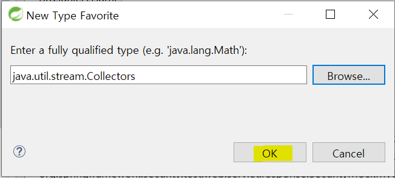
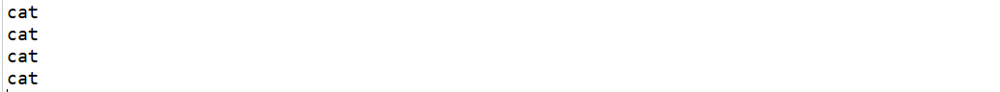

## 10/14(수)

#### ModernJava

-------------

> Lambda표현식

1. 개요 및 특징
   - 익명 inner클래스의 표현
   - 함수를 간결하게 표현한 방법
   - 함수나 메소드를 정의하지 않고 한 줄로 표현
   - 람다 표현식을 적용할 수 있는 인터페이스는 추상 메소드가 1개인 인터페이스만 가능(추상메소드가 1개인 인터페이스를 modern자바(8버전 이후)에서는 함수형 인터페이스라 한다.)
2. 사용방법
   - (매개변수1, 매개변수2, ... ) -> {실행명령문}
   - 매개변수가 1이거나 실행명령문이 1줄이면 ()나 {}는 생략가능


- bigdata.modernjava.test 패키지

 


- 익명 inner 클래스 사용

```java
package bigdata.modernjava.test;

import java.awt.FlowLayout;
import java.awt.event.ActionEvent;
import java.awt.event.ActionListener;

import javax.swing.JButton;
import javax.swing.JFrame;

public class JButtonTest {
	public static void main(String[] args) {
		JFrame f = new JFrame();
		f.setLayout(new FlowLayout());
		JButton btnOk = new JButton("확인");
		JButton btnCancel = new JButton("취소");
		f.add(btnOk);
		f.add(btnCancel);
		f.setSize(300,200);
		f.setVisible(true);
		
		// 익명 inner 클래스를 정의해서 이벤트 처리
		// ActionListener는 인터페이스로 직접 new로 생성하지 못한다.
		// 의미는 이름이 없는 ActionListeneer의 하위클래스 정의하고 바로 생성해서
		// 사용 - 재사용이 불가능
		btnOk.addActionListener(new ActionListener() {
			@Override
			public void actionPerformed(ActionEvent e) {
				System.out.println("확인");
			}
		});
		
		btnCancel.addActionListener(new ActionListener() {
			@Override
			public void actionPerformed(ActionEvent e) {
				System.out.println("취소");
			}
		});
		f.setDefaultCloseOperation(JFrame.EXIT_ON_CLOSE);
		
	}

}

```

- 실행


- 람다식 사용

```java
package bigdata.modernjava.test;

import java.awt.FlowLayout;

import javax.swing.JButton;
import javax.swing.JFrame;

public class JButtonLambdaTest {
	public static void main(String[] args) {
		JFrame f = new JFrame();
		f.setLayout(new FlowLayout());
		JButton btnOk = new JButton("확인");
		JButton btnCancel = new JButton("취소");
		f.add(btnOk);
		f.add(btnCancel);
		f.setSize(300,200);
		f.setVisible(true);
		// 1단계 - 어차피 ActionListener타입이므로 new ActionListener를 지운다.
		// 2단계 - ActionListener메소드는 actionPerformed하나 이므로 지운다.
		// 3단계 - 매개변수의 타입이 ActionEvent타입이므로 지운다.
		// 4단계 - 람다표현식의 기호인 -> 를 정의하고 매개변수가 하나이므로 ()괄호를 지운다.
		// 5단계 - 명령문이 한 줄이라면 {}를 지울 수 있다.
		btnOk.addActionListener(e -> System.out.println("확인"));
		btnCancel.addActionListener(e -> System.out.println("취소"));

		f.setDefaultCloseOperation(JFrame.EXIT_ON_CLOSE);
		
	}
}

```

- 실행


> Stream

- 컬렉션 빌더

- 병렬처리를 위한 작업

- 람다를 활용

- Array, List, Map, Set등을 스트림으로 변환할 수 있다.

- Stream을 List등으로 변환할 수 있다.

- 여러 데이터를 이용해서 Stream을 생성하고 지원되는 다양한 메소드를 적용할 수 있는데 원하는 작업을 바로 처리하지 않고 결과를 요청하면 바로 처리된다. 

- 메소드의 종류

  - 두 가지 유형의 메소드를 지원

    1) Intermediate operation메소드 (중간연산)

    - 중간단계에 해당하는 메소드
    - 이 메소드는 Stream을 리턴하기 때문에 method chaining을 통해 어떤 작업을 처리할지 스트림에게 지시할 수 있다.
    - 리턴타입이 Stream인 메소드 
    - map, filter, limit, distinct, sorted...

    2) Terminal operation메소드 (최종연산) 

    - 작업을 끝내는 메소드 
    - collect, forEach, count


###### <Java8Concept.java>

```java
package bigdata.modernjava.test;

import java.util.Arrays;
import java.util.List;
import java.util.stream.Collectors;

public class Java8Concept {
	public static void main(String[] args) {
		// 1:2:3:...:10 을 출력
		
		// 1. 클래식 자바
		List<Integer> numbers = Arrays.asList(1, 2, 3, 4, 5, 6, 7, 8, 9, 10);
		StringBuffer sb = new StringBuffer();
		int size = numbers.size();
		for(int i=0; i<size; i++) {
			sb.append(numbers.get(i));
			if(i!=size-1) {
				sb.append(":");
			}
		}
		System.out.println(sb);
		
		// 2. modern자바 (stream과 lambda)
		// => 모던자바를 적용하게 되면 주로 사용하는 것이 lambda와 stream이다.
		// => 코드가 읽기 편하고 병렬프로그램을 하기가 쉬워진다.
		String result = numbers.stream() //스트림으로 변환
						.map(String::valueOf) //하나의 타입을 다른 타입으로 매핑한다는 의미
											//numbers에 저장된 값이 Integer이다.
											//이 int값을 :과 연결해야 하므로 String으로 
											//처리하기 위해서 String result에 저장
											//타입이 다르면 stream내부에서 오류가 발생하므로
											//String클래스의 valueOf메소드를 호출해서
											//값을 String으로 변환하겠다는 의미
						.collect(Collectors.joining(":")); //map메소드를 적용하여
											//만들어진 결과에 ":"을 조인하여 작업하라는 의미
		System.out.println(result);
	}
}

```


- 결과


- stream 패키지 생성

 


- Collections를 자주 자용하므로 static import

  - preferences

  

  

  - java - editor - content assist - favorites

  

  

  - browse 클릭

  

  

  - type selection - collectors 선택

  

  

  - ok

  

  

  - apply and close

  

  

  - import static 적용

  

  

###### <StreamTest01.java>

```java
package stream;

import static java.util.stream.Collectors.joining;
import static java.util.stream.Collectors.toList;
import static java.util.stream.Collectors.toSet;

import java.util.List;
import java.util.Set;
import java.util.stream.Stream;

public class StreamTest01 {

	public static void main(String[] args) {
													//람다식이 들어가도 됨
		List<String> list = Stream.of(1,3,3,5,5).filter(i -> i>2) //필터를 적용 - i가 2보다 큰 값 고르기
							.map(i->i*2) //변환
							.map(i->i+"")
							.collect(toList());
		System.out.println(list);
		
		
		//set은 중복제거
		Set<String> set = Stream.of(1,3,3,5,5).filter(i -> i>2) //필터를 적용 - i가 2보다 큰 값 고르기
				.map(i->i*2) //변환
				.map(i->i+"")
				.collect(toSet());
		System.out.println(set);
		
		
		String result = Stream.of(1,3,3,5,5).filter(i -> i>2) //필터를 적용 - i가 2보다 큰 값 고르기
				.map(i->i*2) //변환
				.map(i->i+"")
				.collect(joining());
		System.out.println("String=>"+result);
		
		
		String result2 = Stream.of(1,3,3,5,5).filter(i -> i>2) //필터를 적용 - i가 2보다 큰 값 고르기
				.map(i->i*2) //변환
				.map(i->i+"")
				.collect(joining(" , "));
		System.out.println("String=>"+result2);
		
		
		String result3 = Stream.of(1,3,3,5,5).filter(i -> i>2) //필터를 적용 - i가 2보다 큰 값 고르기
				.map(i->i*2) //변환
				.map(i->i+"")
				.distinct()	//중복 제거
				.collect(joining(" , "));
		System.out.println("String=>"+result3);
		
		
		List<String> list2 = Stream.of(1,3,3,5,5).filter(i -> i>2) //필터를 적용 - i가 2보다 큰 값 고르기
				.map(i->i*2) //변환
				.map(i->i+"")
				.distinct() //중복 제거
				.collect(toList());
		System.out.println(list2);
	}

}

```


- 결과


- stream 패키지에 StreamTest02 클래스 생성


###### <StreamTest02.java>

```java
package stream;

import java.util.stream.Stream;

public class StreamTest02 {

	public static void main(String[] args) {
		int result = Stream.of(1,2,3,4,128)
					.filter(i -> i==128)
					.findFirst();
	}

}
```


- 에러 발생
  - Type mismatch: cannot convert from Optional<Integer> to int


- int를 다음과 같이 수정

```java
Optional<Integer> result = Stream.of(1,2,3,4,128)
					.filter(i -> i==128)
					.findFirst();
```


###### <StreamTest02.java>

```java
package stream;

import java.util.Optional;
import java.util.stream.Stream;

public class StreamTest02 {

	public static void main(String[] args) {
		Optional<Integer> result = Stream.of(1,2,3,4,128)
					.filter(i -> i==128)
					.findFirst();
		System.out.println(result);
		
		System.out.println(Stream.of(1,2,3,4,128)
				.filter(i -> i==128)
				.findFirst());
		
		System.out.println(Stream.of(1,2,3,4,128)
				.filter(i -> i>=4)
				.count());
		
		Stream.of(1,2,3,4,5).forEach(i->System.out.println(i+" "));
	}
}
```


- 결과


----------

#### Spark

-----------

> spark

- spark
  - 분석엔진
  - 하둡보다 100배이상 빠름
  - spark를 개발할 수 있는 언어는 scale, java, python, R
  - spark라이브러리는 spark core, spark sql, spark streaming, MLlib(머신러닝) Graphx
  - spark는 대규모 데이터의 처리를 위한 통합 분석엔진


- spark의 구성요소

  1. SparkContext(JavaSparkContext) : spark가 동작하기 위해서 필요한 기본 정보를 갖고 있는 객체로 spark가 제공하는 다양한 서비스와 기능을 직접 사용할 수 있는 기본 클래스

  2. RDD(Resilient Distributed DataSet) 

     - 스파크에서 사용하는 기본 데이터 구조
     - 스파크에서는 내부적으로 사용하고 처리하는 모든 데이터를 RDD타입으로 처리
     - RDD를 만들어서 메모리에 적재시켜놓고 작업하는데 변경할 수 없다.
     - RDD는 java의 Stream과 비슷하지만 다른 객체
       - RDD -> Stream으로 변환 가능
       - Stream -> RDD로 변환 불가
     - RDD는 SparkContext에 의해서 생성
     - RDD는 파티션으로 나누어서 관리가 된다.  
     - RDD를 처음 생성할 때 HDFS에서 데이터를 가져와서 만들고 메모리에서 처리를 하고 결과를 HDFS에 저장한다.

     1) RDD연산 

     - 변환(Transformations) : RDD에서 새로운 RDD가 생성되는 경우
       - filter, map, flatMap, mapPartitions, distinct, groupByKey, reduceByKey, sortByKey, join...
     - 액션(Actions) : RDD에서 다른 데이터 타입으로 변환되거나 완료되는 경우
       - count, first, collect, foreach... 
       - Actions분류의 메소드가 호출이 되어야 결과를 볼 수 있다. 

     2) RDD분산

     - RDD는 크기가 크기때문에 파티션으로 잘라서 분산시켜서 처리


> test

- bigdata.spark.basic에 SparkWordTest01 생성

 


###### <SparkWordTest01.java>

```java
package bigdata.spark.basic;

import org.apache.spark.SparkConf;
import org.apache.spark.api.java.JavaRDD;
import org.apache.spark.api.java.JavaSparkContext;

public class SparkWordTest01 {

	public static void main(String[] args) {
		SparkConf sparkConf = new SparkConf().setAppName("simpleTest01")
											.setMaster("local");
		JavaSparkContext sparkContext = new JavaSparkContext(sparkConf);
		
		//word로 만든 RDD
		JavaRDD<String> wordRDD = sparkContext.textFile("src/main/java/data/simple-words.txt"); 
		wordRDD.foreach(word -> System.out.println(word));
	}
}
```


- 결과


###### <SparkWordTest01.java>

```java
package bigdata.spark.basic;

import org.apache.spark.SparkConf;
import org.apache.spark.api.java.JavaRDD;
import org.apache.spark.api.java.JavaSparkContext;

public class SparkWordTest01 {

	public static void main(String[] args) {
		SparkConf sparkConf = new SparkConf().setAppName("simpleTest01")
											.setMaster("local");
		JavaSparkContext sparkContext = new JavaSparkContext(sparkConf);
		
		//word로 만든 RDD
		//JavaRDD<String> wordRDD = sparkContext.textFile("src/main/java/data/simple-words.txt"); 
		//wordRDD.foreach(word -> System.out.println(word));
		
        //4글자 이상의 단어만 필터링 됨
		sparkContext.textFile("src/main/java/data/simple-words.txt")
					.filter(word->word.length()>=4)
					.foreach(word -> System.out.println(word));
		sparkContext.close();
	}
}
```


- 결과


###### <SparkWordTest01.java>

```java
package bigdata.spark.basic;

import org.apache.spark.SparkConf;
import org.apache.spark.api.java.JavaRDD;
import org.apache.spark.api.java.JavaSparkContext;

public class SparkWordTest01 {

	public static void main(String[] args) {
		SparkConf sparkConf = new SparkConf().setAppName("simpleTest01")
											.setMaster("local");
		JavaSparkContext sparkContext = new JavaSparkContext(sparkConf);
		
		/*word로 만든 RDD
		JavaRDD<String> wordRDD = sparkContext.textFile("src/main/java/data/simple-words.txt"); 
		wordRDD.foreach(word -> System.out.println(word)); */
		
		/*sparkContext.textFile("src/main/java/data/simple-words.txt")
					.filter(word->word.length()>=4)
					.foreach(word -> System.out.println(word));
		sparkContext.close(); */
		
		//숫자와 특수문자 제거
		sparkContext.textFile("src/main/java/data/simple-words.txt")
					.filter(word->word.matches("([A-z가-힣]+)"))
					.foreach(word->System.out.println(word));
	}
}
```


- 결과


###### <SparkWordTest01.java>

```java
package bigdata.spark.basic;

import org.apache.spark.SparkConf;
import org.apache.spark.api.java.JavaRDD;
import org.apache.spark.api.java.JavaSparkContext;

public class SparkWordTest01 {

	public static void main(String[] args) {
		SparkConf sparkConf = new SparkConf().setAppName("simpleTest01")
											.setMaster("local");
		JavaSparkContext sparkContext = new JavaSparkContext(sparkConf);
		
		/*word로 만든 RDD
		JavaRDD<String> wordRDD = sparkContext.textFile("src/main/java/data/simple-words.txt"); 
		wordRDD.foreach(word -> System.out.println(word)); */
		
		/*sparkContext.textFile("src/main/java/data/simple-words.txt")
					.filter(word->word.length()>=4)
					.foreach(word -> System.out.println(word));
		sparkContext.close(); */
		
		/*특수문자, 숫자 제거
		sparkContext.textFile("src/main/java/data/simple-words.txt")
					.filter(word->word.matches("([A-z가-힣]+)"))
					.foreach(word->System.out.println(word)); */
		
		//특수문자, 숫자 제거 & cat만 골라내기(대소문자 구분 안 함)
		sparkContext.textFile("src/main/java/data/simple-words.txt")
					.filter(word->word.matches("([A-z가-힣]+)"))
					.filter(word->word.equalsIgnoreCase("cat"))
					.foreach(word->System.out.println(word));
	}
}
```


- 결과




###### <SparkWordTest01.java>

```java
package bigdata.spark.basic;

import org.apache.spark.SparkConf;
import org.apache.spark.api.java.JavaRDD;
import org.apache.spark.api.java.JavaSparkContext;

public class SparkWordTest01 {

	public static void main(String[] args) {
		SparkConf sparkConf = new SparkConf().setAppName("simpleTest01")
											.setMaster("local");
		JavaSparkContext sparkContext = new JavaSparkContext(sparkConf);
		
		/*word로 만든 RDD
		JavaRDD<String> wordRDD = sparkContext.textFile("src/main/java/data/simple-words.txt"); 
		wordRDD.foreach(word -> System.out.println(word)); */
		
		/*sparkContext.textFile("src/main/java/data/simple-words.txt")
					.filter(word->word.length()>=4)
					.foreach(word -> System.out.println(word));
		sparkContext.close(); */
		
		/*특수문자, 숫자 제거
		sparkContext.textFile("src/main/java/data/simple-words.txt")
					.filter(word->word.matches("([A-z가-힣]+)"))
					.foreach(word->System.out.println(word)); */
		
		/*특수문자, 숫자 제거 & cat만 골라내기(대소문자 구분 안 함)
		sparkContext.textFile("src/main/java/data/simple-words.txt")
					.filter(word->word.matches("([A-z가-힣]+)"))
					.filter(word->word.equalsIgnoreCase("cat"))
					.foreach(word->System.out.println(word)); */
		
		//모든 단어가 영문자로 구성되면서 영문자 c로 시작하는 문자를 고르고 고두 대문자로 변환해서 출력하기 
		sparkContext.textFile("src/main/java/data/simple-words.txt")
					.filter(word->word.matches("([A-z]+)"))
					.filter(word-> word.startsWith("c"))
					.map(word->word.toUpperCase())
					.foreach(word->System.out.println(word));
		
		sparkContext.close();
	}
}
```


- 결과


- 위와 같은 결과가 나오는 코드

```java
sparkContext.textFile("src/main/java/data/simple-words.txt")
					.filter(word->word.matches("([A-z]+)"))
					.filter(word-> word.startsWith("c"))
					.map(String :: toUpperCase)
					.collect()
					.forEach(word->System.out.println(word));
```


