> FlatMap

###### < FlatMapTest.java >

```java
package stream;

import java.util.Arrays;
import java.util.List;

public class FlatMapTest {
	public static void main(String[] args) {
		List<String> subjectlist = Arrays.asList(
				"java, favaFx",
				"jdbc, html, css, javascript",
				"servlet, jsp, jquery, spring",
				"hadoop, hive, flume, sqoop, spark, mahout"
				);
		subjectlist.stream()
					.map(data -> data.split(","))
					.forEach(data -> System.out.print(data + " "));
		
		System.out.println();
		System.out.println();
		
		subjectlist.stream()
					.flatMap(data -> (Arrays.asList(data.split(","))).stream())
					.forEach(data -> System.out.print(data + " "));
	}
}
```

- 결과

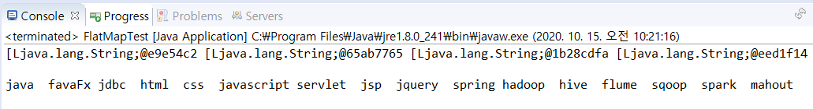


#### word count 

> Simple WordCount

- Scala의 Tuple자료형을 사용 

- 테스트 데이터

```
cat
dog
.org
cat
cat
&&
tiger
dog
100
tiger
cat
```

###### < javaPairRDDTest.java >

```java
package bigdata.spark.basic;

import org.apache.spark.SparkConf;
import org.apache.spark.api.java.JavaRDD;
import org.apache.spark.api.java.JavaSparkContext;

import scala.Tuple2;

public class JavaPairRDDTest {
	public static void main(String[] args) {
		SparkConf sparkConf = new SparkConf().setAppName("simpleTest01")
											.setMaster("local");
		JavaSparkContext sparkContext = new JavaSparkContext(sparkConf);
		
		JavaRDD rdd = 
				sparkContext.textFile("src/main/java/data/simple-words.txt");
		// Scala의 Tuple자료형을 사용 
		// Tuple은 여러가지 타입의 데이터를 저장할 수 있는 자료형, 저장할 수 있는 갯수에 따라서
		// Tuple1부터 Tuple19까지 제공
		
		Tuple2<String, Integer> mytuple = 
				new Tuple2<String, Integer>("top", 100000);
		/*JavaPairRDD<String, Integer> pairRdd = 
				rdd.mapToPair(word -> new Tuple2<String,Integer>(word, 1));*/
		sparkContext.textFile("src/main/java/data/simple-words.txt")
					.mapToPair(word -> new Tuple2<>(word, 1))
					.reduceByKey((amount, value) -> amount + value)
					.foreach(tuple -> System.out.println(tuple));
		sparkContext.close();
	}
}
```

- 결과

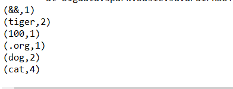


- 테스트 데이터

###### < README.md >

```
# Apache Spark

Spark is a fast and general cluster computing system for Big Data. It provides
high-level APIs in Scala, Java, and Python, and an optimized engine that
supports general computation graphs for data analysis. It also supports a
rich set of higher-level tools including Spark SQL for SQL and DataFrames,
MLlib for machine learning, GraphX for graph processing,
and Spark Streaming for stream processing.

<http://spark.apache.org/>


## Online Documentation

You can find the latest Spark documentation, including a programming
guide, on the [project web page](http://spark.apache.org/documentation.html)
and [project wiki](https://cwiki.apache.org/confluence/display/SPARK).
This README file only contains basic setup instructions.

## Building Spark

Spark is built using [Apache Maven](http://maven.apache.org/).
To build Spark and its example programs, run:

    build/mvn -DskipTests clean package

(You do not need to do this if you downloaded a pre-built package.)
More detailed documentation is available from the project site, at
["Building Spark"](http://spark.apache.org/docs/latest/building-spark.html).

## Interactive Scala Shell

The easiest way to start using Spark is through the Scala shell:

    ./bin/spark-shell

Try the following command, which should return 1000:

    scala> sc.parallelize(1 to 1000).count()

## Interactive Python Shell

Alternatively, if you prefer Python, you can use the Python shell:

    ./bin/pyspark

And run the following command, which should also return 1000:

    >>> sc.parallelize(range(1000)).count()

## Example Programs

Spark also comes with several sample programs in the `examples` directory.
To run one of them, use `./bin/run-example <class> [params]`. For example:

    ./bin/run-example SparkPi

will run the Pi example locally.

You can set the MASTER environment variable when running examples to submit
examples to a cluster. This can be a mesos:// or spark:// URL,
"yarn-cluster" or "yarn-client" to run on YARN, and "local" to run
locally with one thread, or "local[N]" to run locally with N threads. You
can also use an abbreviated class name if the class is in the `examples`
package. For instance:

    MASTER=spark://host:7077 ./bin/run-example SparkPi

Many of the example programs print usage help if no params are given.

## Running Tests

Testing first requires [building Spark](#building-spark). Once Spark is built, tests
can be run using:

    ./dev/run-tests

Please see the guidance on how to
[run tests for a module, or individual tests](https://cwiki.apache.org/confluence/display/SPARK/Useful+Developer+Tools).

## A Note About Hadoop Versions

Spark uses the Hadoop core library to talk to HDFS and other Hadoop-supported
storage systems. Because the protocols have changed in different versions of
Hadoop, you must build Spark against the same version that your cluster runs.

Please refer to the build documentation at
["Specifying the Hadoop Version"](http://spark.apache.org/docs/latest/building-spark.html#specifying-the-hadoop-version)
for detailed guidance on building for a particular distribution of Hadoop, including
building for particular Hive and Hive Thriftserver distributions. See also
["Third Party Hadoop Distributions"](http://spark.apache.org/docs/latest/hadoop-third-party-distributions.html)
for guidance on building a Spark application that works with a particular
distribution.

## Configuration

Please refer to the [Configuration guide](http://spark.apache.org/docs/latest/configuration.html)
in the online documentation for an overview on how to configure Spark.
```

- 조건
  - spacebar , . 기준으로 분리
  - 소문자로 변경, 단어길이0이상

###### < WordCount.java >

```java
package bigdata.spark.basic;

import java.util.Arrays;

import org.apache.spark.SparkConf;
import org.apache.spark.api.java.JavaSparkContext;

import scala.Tuple2;

public class WordCount {
	public static void main(String[] args) {
		// README.md 파일을 wordcount로 출력
		// spacebar , . 기준으로 분리(flatMap메소드를 써서 분리 후 작업
		// 소문자로 변경, 단어길이0이상
		SparkConf sparkConf = new SparkConf().setAppName("wordCount")
											.setMaster("local");
		JavaSparkContext sparkContext = new JavaSparkContext(sparkConf);
		
		
		
		sparkContext.textFile("src/main/java/data/README.md")
					.flatMap(word -> Arrays.asList(word.split("[ ,.]")))
					.filter(word -> word.length()>0)
					.map(word -> word.toLowerCase().trim())
					.mapToPair(word -> new Tuple2<>(word, 1))
					.reduceByKey((amount, value) -> amount + value)
					.foreach(word -> {
						System.out.println(word);
					});
		
		sparkContext.close();
					
	}
}
```

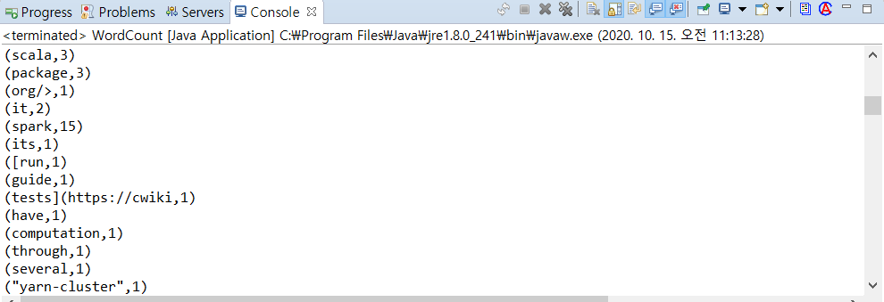


> Join 

- 테스트 데이터

###### < product.csv >

```
0,송편(6개),12000
1,가래떡(3개),16000
2,연양갱,5000
3,호박엿(6개),16000
4,전병(20장),4000
5,별사탕,3200
6,백설기,3500
7,약과(5개),8300
8,강정(10개),15000
9,시루떡,6500
10,무지개떡,4300
11,깨강정(5개),14000
12,수정과(6컵),19000
13,절편(10개),15000
14,팥떡(8개),20000
15,생과자(10개),17000
16,식혜(2캔),21000
17,약식,4000
18,수수팥떡(6개),28000
19,팥죽(4개),16000
20,인절미(4개),10000
```

###### < sales-october.csv >

- 주문번호|주문날짜|상품번호|주문수량

```
5830,2014-10-02 10:20:38,16,28
5831,2014-10-02 15:13:04,15,22
5832,2014-10-02 15:21:53,2,10
5833,2014-10-02 16:22:05,18,13
5834,2014-10-06 12:04:28,19,18
5835,2014-10-06 12:54:13,10,18
5836,2014-10-06 15:43:54,1,8
5837,2014-10-06 17:33:19,10,22
5838,2014-10-11 10:28:00,20,19
5839,2014-10-11 15:00:32,15,3
5840,2014-10-11 15:06:04,15,14
5841,2014-10-11 15:45:38,18,1
5842,2014-10-11 16:12:56,4,5
5843,2014-10-13 10:13:53,3,12
5844,2014-10-13 15:02:23,15,19
5845,2014-10-13 15:12:08,6,6
5846,2014-10-13 17:17:20,10,9
5847,2014-10-18 11:08:11,15,22
5848,2014-10-18 12:01:47,3,8
5849,2014-10-18 14:25:25,6,10
5850,2014-10-18 15:18:50,10,16
5851,2014-10-20 13:06:00,11,21
5852,2014-10-20 16:07:04,13,29
5853,2014-10-20 17:29:24,5,4
5854,2014-10-20 17:47:39,8,17
5855,2014-10-23 10:02:10,2,24
5836,2014-10-23 11:22:53,8,19
5857,2014-10-23 12:29:16,7,7
5858,2014-10-23 14:01:56,12,26
5859,2014-10-23 16:09:39,8,13
5860,2014-10-23 17:26:46,8,19
```

###### < sales-november.csv >

```
5861,2014-11-01 10:47:52,15,22
5863,2014-11-01 11:44:54,8,26
5864,2014-11-01 14:29:51,18,10
5865,2014-11-01 17:50:00,6,17
5867,2014-11-04 10:03:57,15,16
5868,2014-11-04 11:22:55,15,13
5869,2014-11-04 16:32:09,19,6
5870,2014-11-10 11:12:30,17,27
5871,2014-11-10 13:32:53,17,13
5872,2014-11-10 15:31:21,4,15
5873,2014-11-10 16:03:01,6,5
5874,2014-11-10 17:52:20,12,28
5875,2014-11-15 11:36:39,3,5
5876,2014-11-15 14:08:26,9,7
5877,2014-11-15 15:05:21,10,0
5878,2014-11-18 11:17:09,7,16
5879,2014-11-18 14:50:37,9,3
5880,2014-11-18 16:23:39,4,20
5881,2014-11-18 17:28:31,18,25
5882,2014-11-22 10:50:24,7,26
5883,2014-11-22 11:43:31,3,3
5884,2014-11-22 12:57:22,4,12
5885,2014-11-22 15:20:17,19,25
5886,2014-11-25 16:42:07,10,27
5887,2014-11-25 17:38:03,14,0
5888,2014-11-25 18:30:36,10,8
5889,2014-11-25 18:41:57,11,10
5890,2014-11-30 14:30:08,11,17
5862,2014-11-30 14:57:47,8,22
5866,2014-11-30 15:17:29,8,24
```

- 조건

- 두달 연속해서 50개 이상 판매된 상품을 찾기

  step1. -  각 파일에서 50개 이상 판매된 상품을 찾아서 출력하기

  sales-november.csv를 읽어서 50개 이상인 상품을 찾기

  sales-october.csv를 읽어서 50개 이상인 상품을 찾기

###### < SalesTest01.java >

```java
public class SalesTest01 {
	public static void main(String[] args) {
		// 두달 연속해서 50개 이상 판매된 상품을 찾기
		// step1. 각 파일에서 50개 이상 판매된 상품을 찾아서 출력하기
		// sales-november.csv를 읽어서 50개 이상인 상품을 찾기
		// sales-october.csv를 읽어서 50개 이상인 상품을 찾기
		// 주문번호|주문날짜|상품번호|주문수량
		SparkConf sparkConf = new SparkConf().setAppName("joinWordCount")
											.setMaster("local");
		JavaSparkContext sparkContext = new JavaSparkContext(sparkConf);
		
		System.out.println("=============10월 데이터===============");
		// 10월 데이터
		JavaPairRDD<String, Integer> october = 
				sparkContext.textFile("src/main/java/data/sales-october.csv")
				.mapToPair(row -> {
					String[] lines = row.split(",");
					return new Tuple2<>(lines[2], Integer.parseInt(lines[3]));
				})
				.reduceByKey((amount, value) -> amount + value)
				.filter(tuple -> tuple._2>=50);
		october.foreach(tuple -> System.out.println(tuple));
		System.out.println("=============11월 데이터===============");
		// 11월 데이터
		JavaPairRDD<String, Integer> november = 
				sparkContext.textFile("src/main/java/data/sales-november.csv")
				.mapToPair(row -> {
					String[] lines = row.split(",");
					return new Tuple2<>(lines[2], Integer.parseInt(lines[3]));
				})
				.reduceByKey((amount, value) -> amount + value)
				.filter(tuple -> tuple._2>=50);
		november.foreach(tuple -> System.out.println(tuple));
}
```

- 결과

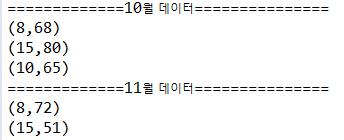

- Step2. 두 데이터 조인 : (상품번호, (판매수량, 판매수량, ... )

```java
System.out.println("=============join데이터===============");
// (상품번호, (판매수량, 판매수량, ... )
JavaPairRDD<String, Tuple2<Integer, Integer>> joindata =
    october.join(november);
joindata.foreach(tuple -> System.out.println(tuple));
```

- 결과

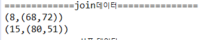

- Step3.  (상품번호, ((상품명, 단가), (수량1, 수량2)) 의 형태로 출력
- Step2의 조인 결과와 상품 데이터를 조인

```java
System.out.println("==============상품 데이터==============");
JavaPairRDD<String, Tuple2<String, Integer>> product = 
    sparkContext.textFile("src/main/java/data/products.csv")
    .mapToPair(row -> {
        String[] lines = row.split(",");
        return new Tuple2<>(lines[0], new Tuple2<>(lines[1], Integer.parseInt(lines[2])));
    });
product.foreach(tuple -> System.out.println(tuple));
System.out.println("===================================");
product.join(joindata)
    .foreach(tuple -> System.out.println(tuple));
```

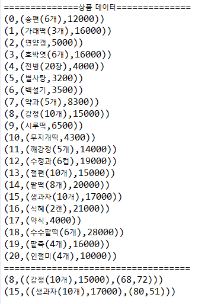

- Step4.  제품명, 판매량(10월 수량 + 11월 수량), 매출액(단가 * 판매량) 형태로 출력
-  ex (강정(10개), 140, 2100000)

```java
System.out.println("=================결과===============");
product.join(joindata)
    .map(tuple -> {
        //상품명
        String prdname = tuple._2._1._1;
        //총판매량
        int total = tuple._2._2._1 + tuple._2._2._2;
        //총매출액
        int totalPrice = tuple._2._1._2 * total;
        //세 개의 데이터를 이용해서 tuple을 만들어서 return
        return new Tuple3<>(prdname, total, totalPrice);
    })
    .foreach(tuple -> System.out.println(tuple));
```

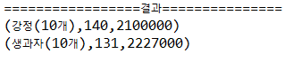


> hdfs의 데이터를 spark로 실행해서 hdfs에 적재

- 테스트 데이터

###### < test.txt >

```
안녕하세요!! 스파크 입니다
안녕하세요!! 스파크 입니다
안녕하세요!! 스파크 입니다
안녕하세요!! 스파크 입니다
안녕하세요!! 스파크 입니다
안녕하세요!! 스파크 입니다
안녕하세요!! 스파크 입니다
안녕하세요!! 스파크 입니다
안녕하세요!! 스파크 입니다
안녕하세요!! 스파크 입니다
```

###### < SparkTestStep2.java >

```java
package bigdata.spark.basic;

import org.apache.spark.SparkConf;
import org.apache.spark.api.java.JavaRDD;
import org.apache.spark.api.java.JavaSparkContext;

public class SparkTestStep2 {
	public static void main(String[] args) {
		SparkConf conf = new SparkConf();
		conf.setAppName("firstProgramming");
		conf.setMaster("local");
		JavaSparkContext sparkContext = new JavaSparkContext(conf);
		
		// 1. hdfs에서 파일 읽기
		JavaRDD<String> textRDD 
			= sparkContext.textFile("hdfs://192.168.111.129:9000/spark/test.txt");
		
		// 2. 파일 데이터를 처리 - 내부에서 메모리에 적재하고 처리
		textRDD.foreach(line -> System.out.println(line));
		
		// 3. 결과를 hdfs에 저장하기
		textRDD.saveAsTextFile("hdfs://192.168.11.129:9000/spark/result1");
	}
}

```

- jar 파일 export

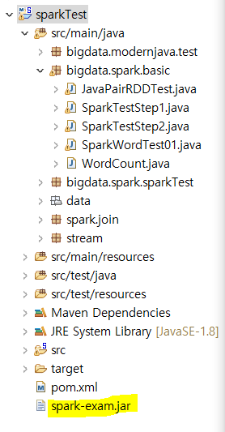

- jar파일과 test.txt파일을 hadoop01머신으로 복사

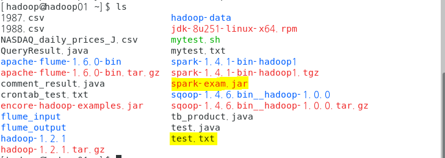

- 하둡, 스파크 실행

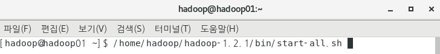

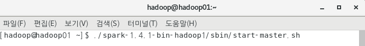

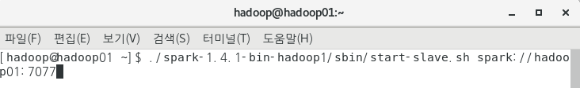

- 확인

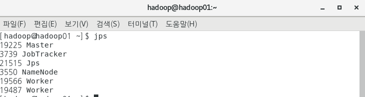


- HDFS에 test.txt 파일 넣기 

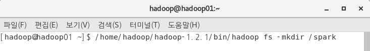


- 스파크 실행


- 결과


