## 7/28(화)  

### Linux

-----------

#### 1. 기본 명령어 

- touch a.txt : 파일이 없을 경우 빈 파일을 생성(파일이 있는 경우 최종 수정 시각을 현재 시각으로 변경)

- rm a.txt : 내부적으로 rm -f로 연결 (a.txt 파일을 삭제) 

  / rm -f a.txt : 확인하지 않고 바로 삭제 

- mv abc 

- cp -r : 폴더 복사  /  cp: 파일 복사

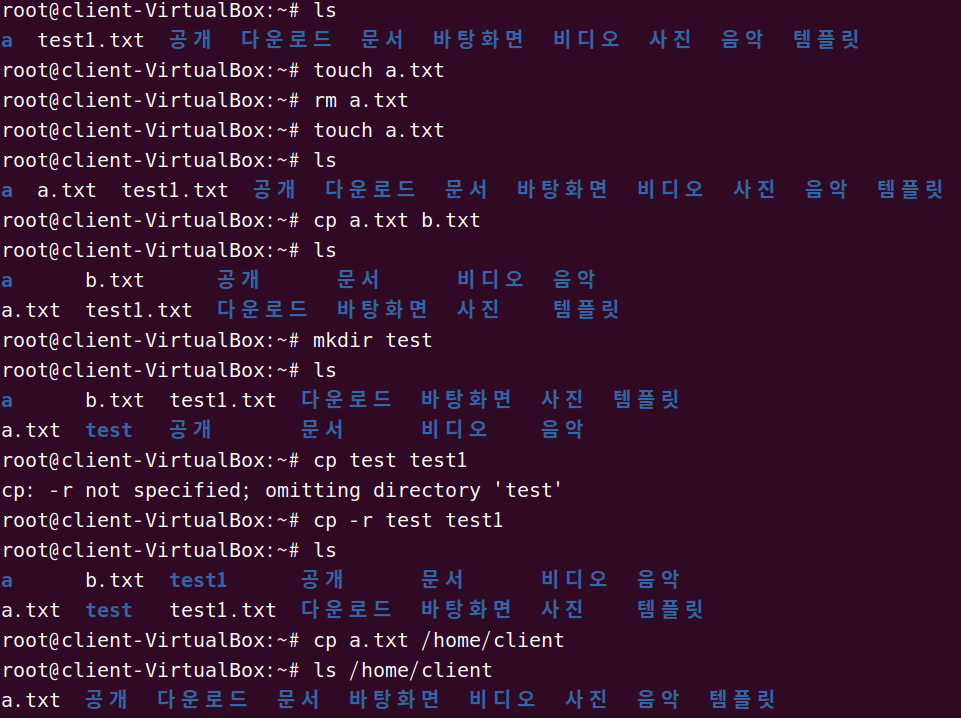

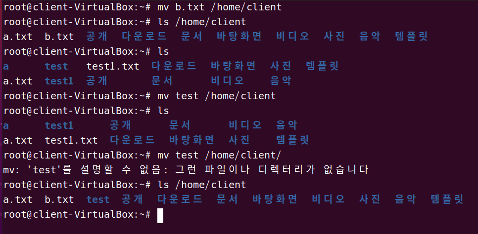

- mv가 이름 바꾸는 역할도 수행

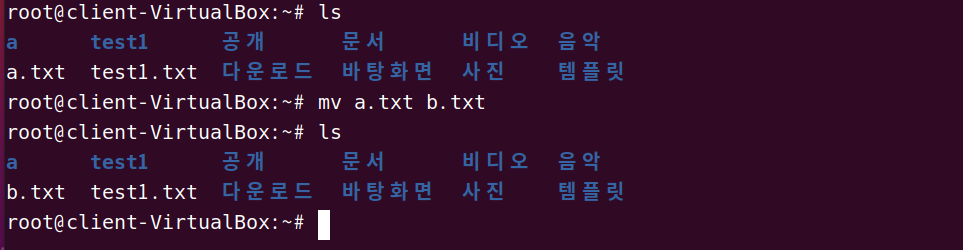

- cat a.txt b.txt : a.txt와 b.txt를 연결해서 내용을 보여준다.
- head -3/etc/systemd/bootchart.con : 해당 파일의 앞 3행을 출력
- more +10 /etc/systemd/system.conf : 10행부터 페이지 단위로 출력
- less .bachrc 
- clear : ctrl + L (화면 지우기)
- grep : 명령어를 붙여서 사용할 때 많이 사용 (단독으로 쓰이기 보단 파이프와 함께 사용 됨)

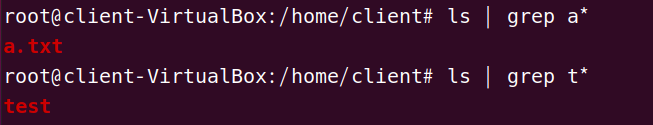

​    /grep 'a...e' 파일명 : a로 시작하고 e로 끝나는 5자리 파일을 찾는다.

   /grep [a-b] 파일명 : a,b,c,d로 시작하는 파일명을 모두 찾는다.

   /grep [aA]pple 파일명 파일에서 apple or Apple로 시작하는 단어를 모두 찾는다.

- ls -l  > ls.txt : ls.txt에 ls -l의 내용을 저장

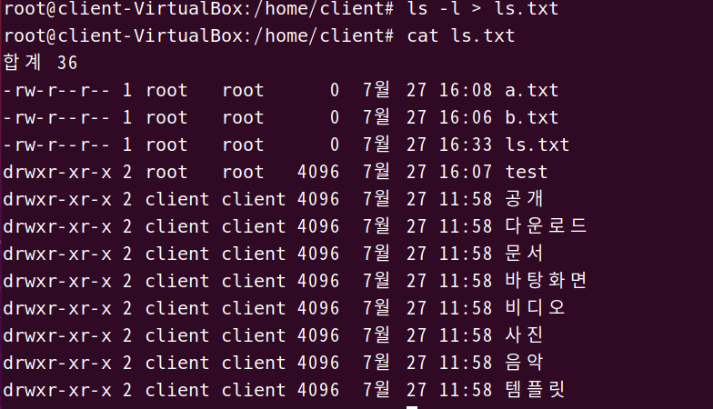

- ls -a >>ls.txt : ls.txt 파일에 내용 추가
- profile의 10줄을 out.txt로 만듦 

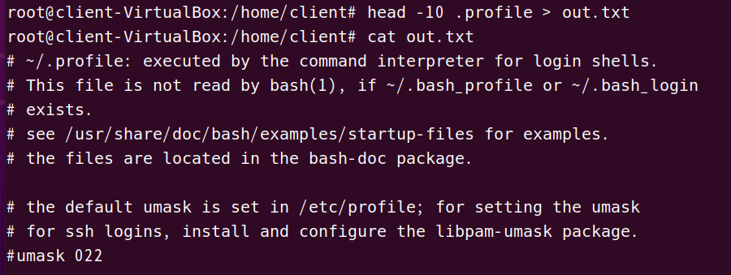

- sort < out.txt : out.txt 파일을 정렬해서 출력

------------------------

#### 2. 파일 속성 

> 사용자 정보

- cat /etc/passwd 
- cat /etc/shadow : 암호가 저장되어 있는 곳 
  	- login name : 사용자 계정
  	- Encrypted : 패스워드를 암호화 시킨 값
  	- Last Changed : 1970년부터 1월 1일부터 패스워드가 수정된 날짜의 일수를 계산
  	- Minumum : 패스워드가 변경되기 전 최소사용기간(일수)
  	- Maximum : 패스워드 변경 전 최대사용기간(일수)
  	- Inactive : 로그인 접속차단 일 수 
  	- Expire : 로그인 사용을 금지하는 일 수 (월/일/연도)
  	- Reserved : 사용되지 않음

- adduser encore(유저 네임) : 유저 추가
- su encore : encore 계정으로 들어가기 

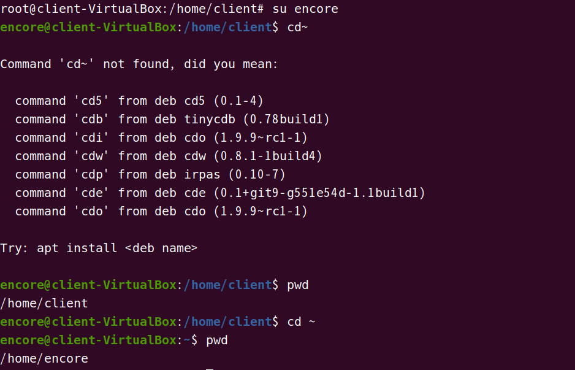

- usermod encore --home /home/home : 홈디렉토리 변경하기 
- tail -5 /etc/passwd : 확인 

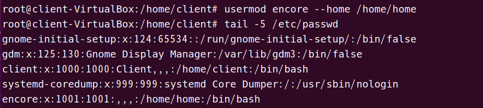

- userdel -r client : client : 계정 삭제 

> group

- tail -5 /etc/group : 그룹 확인

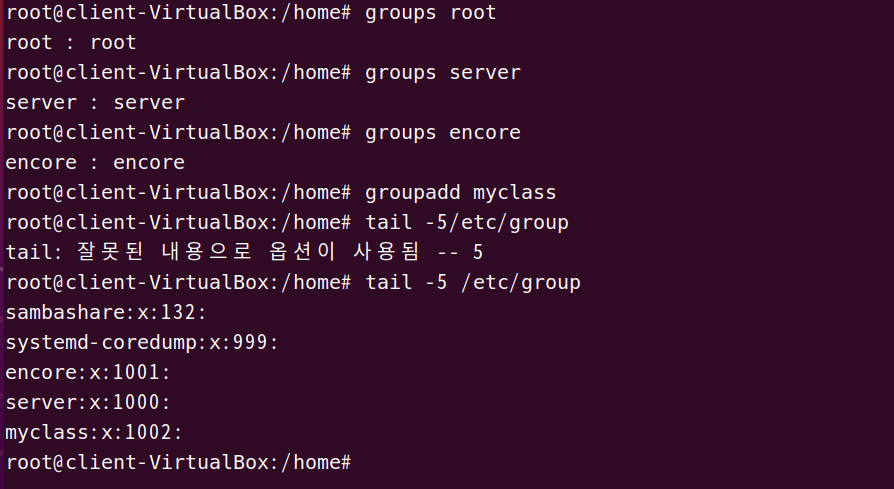

- 그룹 추가

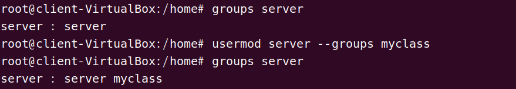

> gpasswd

- mygroup을 추가 
- mygroup에 server, encore 추가 

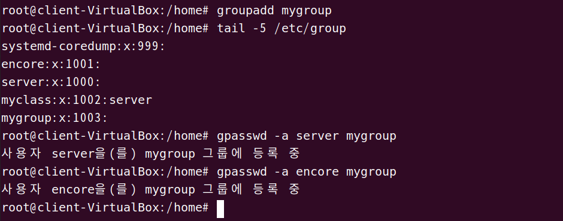

- encore를 mygroup에서 제거

> 파일유형

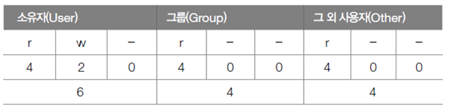

- rwx rwx rwx 세 개씩 끊어 읽는다.

  / 읽기 쓰기 실행하기(접근권한)로 구분한다.

  /소유가 그룹 외 사용자로 구분한다.

- chmod u-x aaa.txt : 사용자의 실행 권한 제거
- chmod u+x aaa.txt : 사용자에게 실행 권한 부여
- chmod g-rw aaa.txt : 그룹의 읽기 쓰기 권한 제거
- chmod_o-rws aaa.txt : 그 외 사용자의 읽기 쓰기 실행 권한 제거
- 특수 권한 : ls -al /usr/bin/passwd

​         -> passwd 명령어는 사용자 입장에서는 본인의 암호를 변경해야하기 때문에 허용되어야 한다.

​		하지만 SetUID 권한을 가진 파일이 주요 침입의 대상이 되므로 대개 4750으로 설정한다.

- SetUID : 사용자가 사용할 때만 소유자 권한 부여
- SetGID : 사용자가 사용할 때만 그룹 권한 부여
- chmod 4644 test.txt : SetUID 부여
- chmod 2644 test.txt : SetGID 부여 
- chmod 1777 디렉토리명 (drwxrwxrwt)  : 파일 생성은 누구나 가능하지만 삭제는 소유자만 가능하다.

- Sticky Bit : 설정된 디렉토리는 누구든 접근이 가능하지만 삭제 시에는 소유자와 관리자만 가능

> 파일 소유권

- chown server a.txt : 파일의 소유권을 server로 변경
- chown server.server a.txt : 파일의 그룹도 server로 변경
- chown .server a.txt : 파일의 그룹만 server로 변경 
- chgrp server a.txt : 파일의 그룹을 server로 변경 

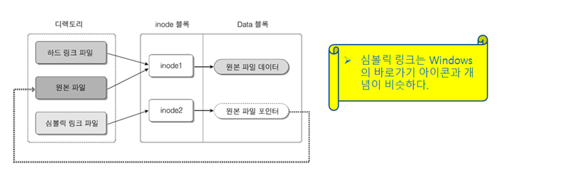

-------------

#### 3. 관리자 명령어 

> dpkg

- dpkg -L 패키지명 : 설치한 패키지의 파일 목록 확인
- dpkg -l 패키지명 : 패키지 정보 확인
- dpkg는 의존성을 처리할 수 없다. apt-get을 사용한다.

> apt-get

- http://kr.archive.ubuntu.com/ubuntu/pool/ 

  ->universe -> g -> galculator -> galculator_2.1.4-1_amd64.deb 다운로드

  ->universe -> m -> mysql-default -> default-mysql-client_1.0.4_all.deb다운로드 

- 다운로드 폴더에서 밖으로 꺼내놓기

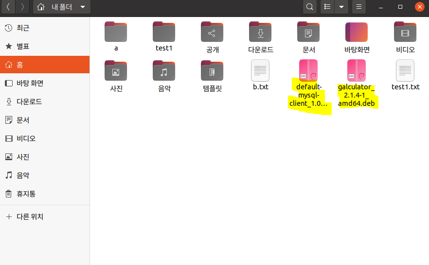

- 패키지 설치 확인

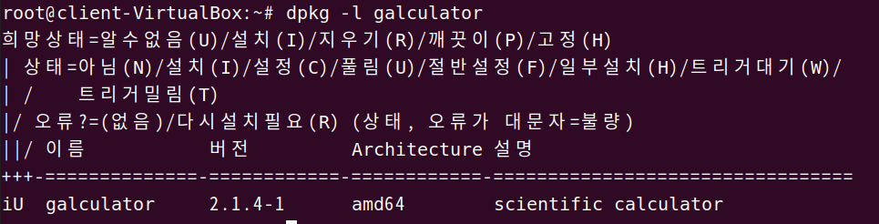

- 설치 : dpkg -i galculator_2.1.4-1_amd64.deb

- dpkg -L galculator | more (more에서는 space가 페이지 넘어가는 것 / 이전으로 가는 것은 b)
- dpkg -r galculator : 삭제

- dpkg -L galculator : 확인

- dpkg --info default-mysql-* : mysql 패키지의 설치 정보를 보여줌 

  

