> root계정 설정

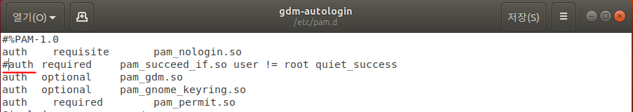

>  root 계정 자동 로그인 설정

- root 계정 로그인 제한 해제

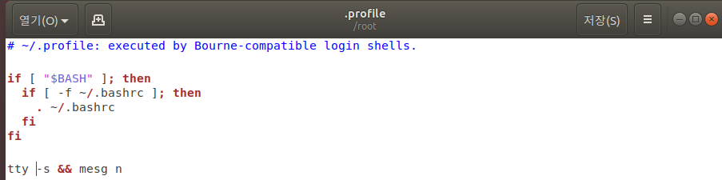

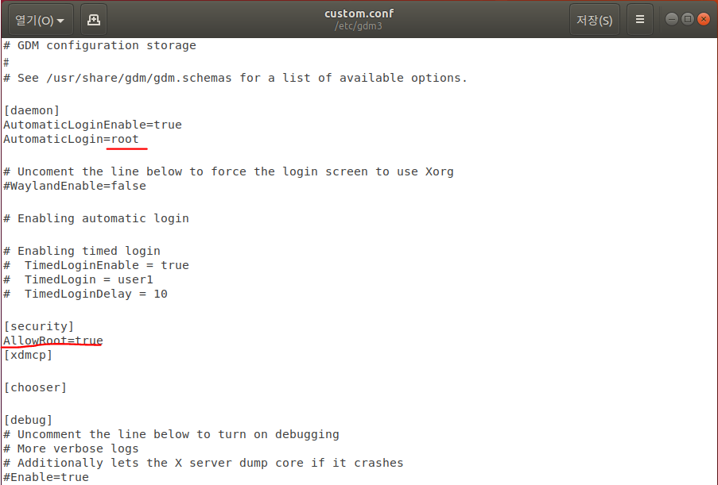

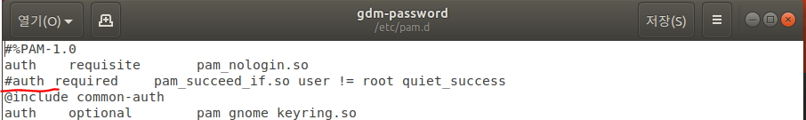

- 경고 메시지 지우기

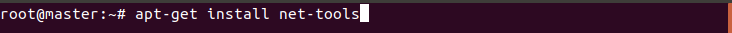

> 네트워크 툴 설치

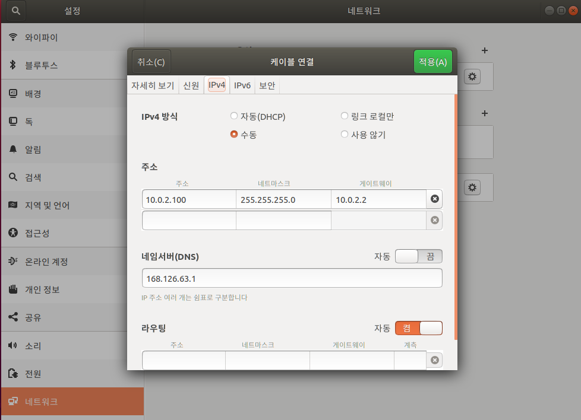

 

> 네트워크 설정

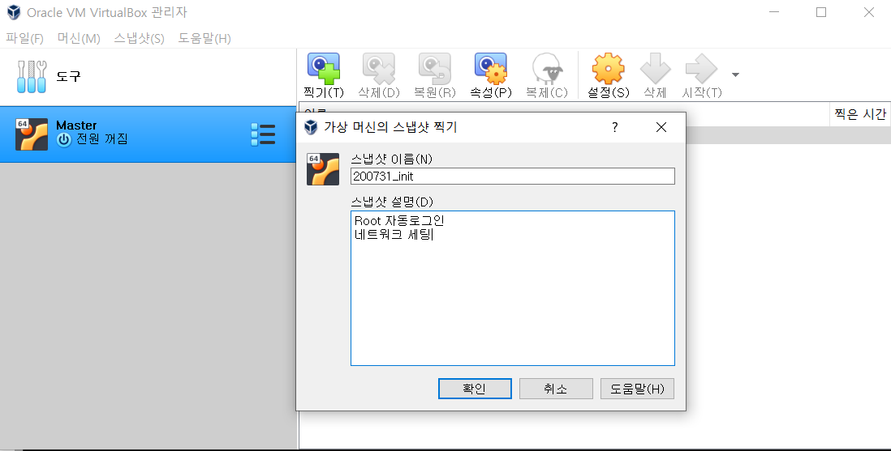

- 고정 아이피 사용

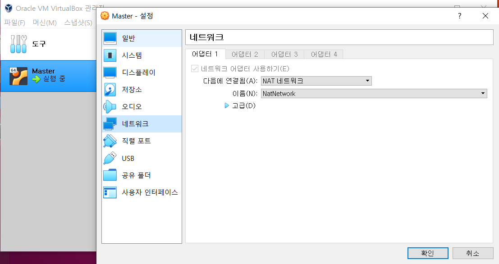

> 스냅샷

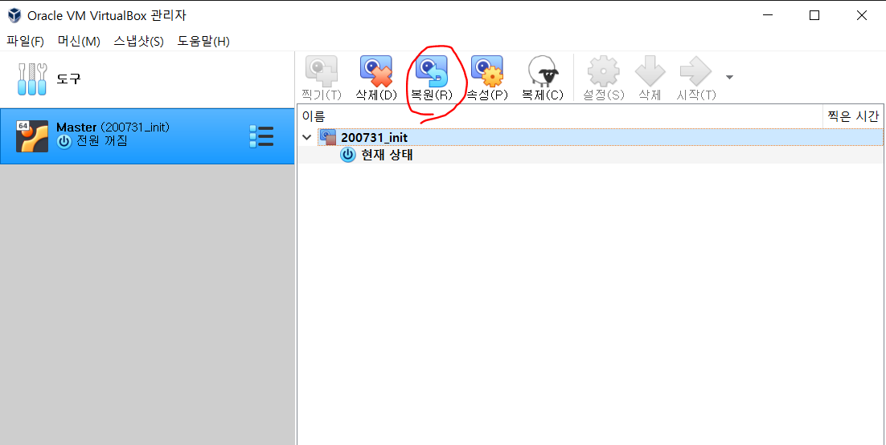

- 스냅샷 상태로 되돌리려면 복원 누르고 실행

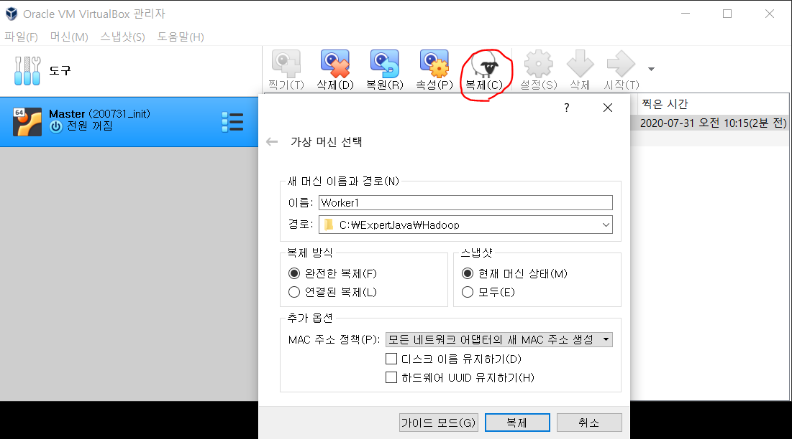

> 컴퓨터 복제하기 (Worker1)

- 메모리 2048MB

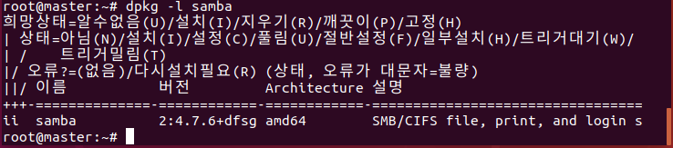

> samba 서버 설치

- samba는 리눅스, 윈도우 운영체제 폴더 공유
- Master 컴퓨터에 설치

- apt-get -y install samba

- 설치 확인

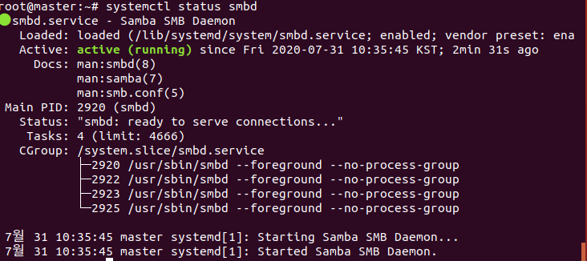

- 동작 확인

- samba서버 계정 설정

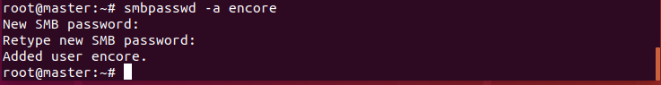

- samba 서버 설정

- 읽기 전용이면 윈도우에서 넣은 파일을 쓸 수 없다

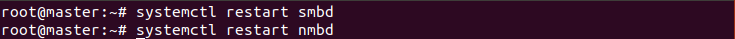

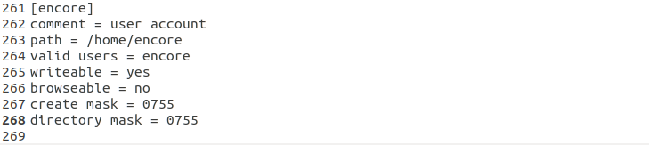

- 설정 변경 후 서버 restart

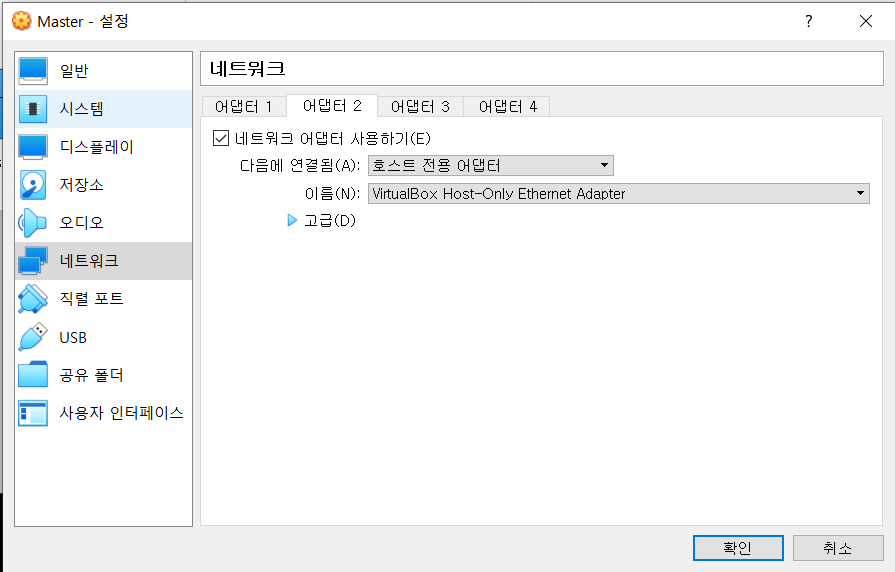

- 외부 네트워크 연결을 위해 랜카드 추가

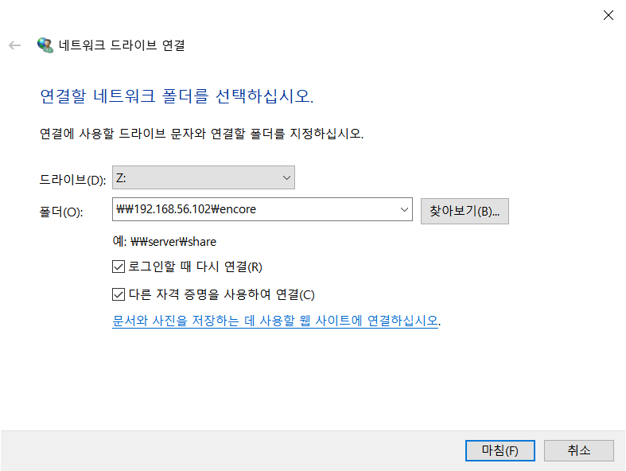

- 네트워크 폴더 설정
- 내 PC -> 네트워크 드라이브 연결

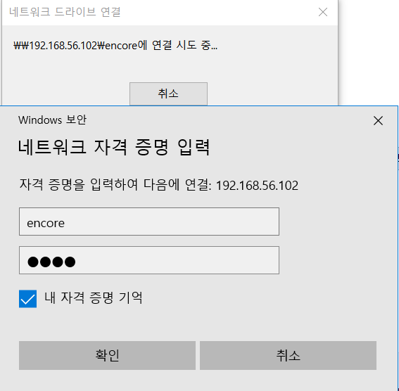

> NFS 서버 설정

###### < master 컴퓨터 >

- 리눅스 끼리 폴더 공유

- 서버 설정

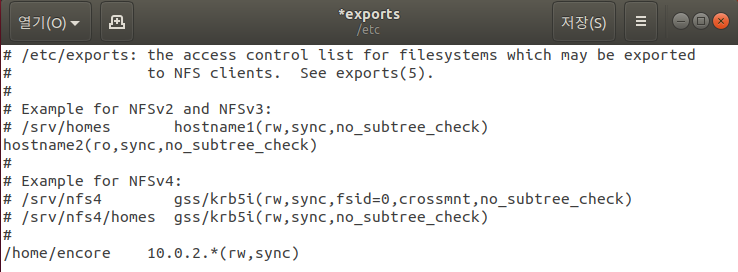

- sync는 쓰기 작업할 때마다 동기화

  async는 빠르지만 동기화 하지 않는다.

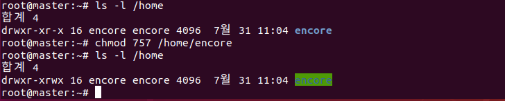

- 권한 설정

###### < worker1 컴퓨터 >

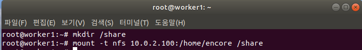

- 마운트

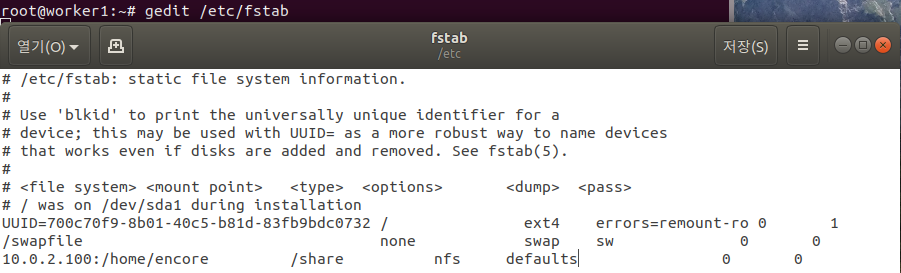

- 컴퓨터를 껐다 키면 사라지므로 자동 마운트 설정

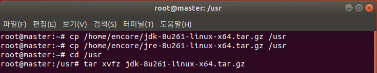

> 자바 설치

- http://java.oracle.com -> 1.8 버전
- 압축 풀기

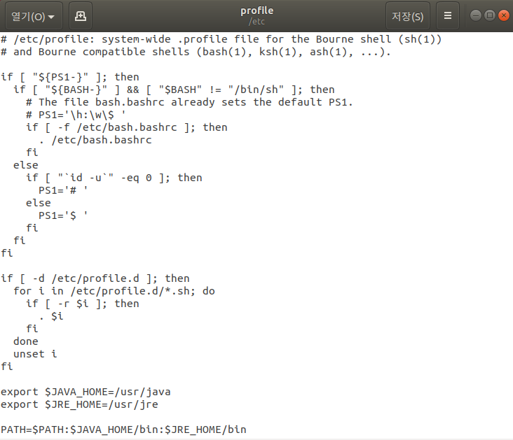

- 폴더 이름 바꾸기

- 환경변수 설정

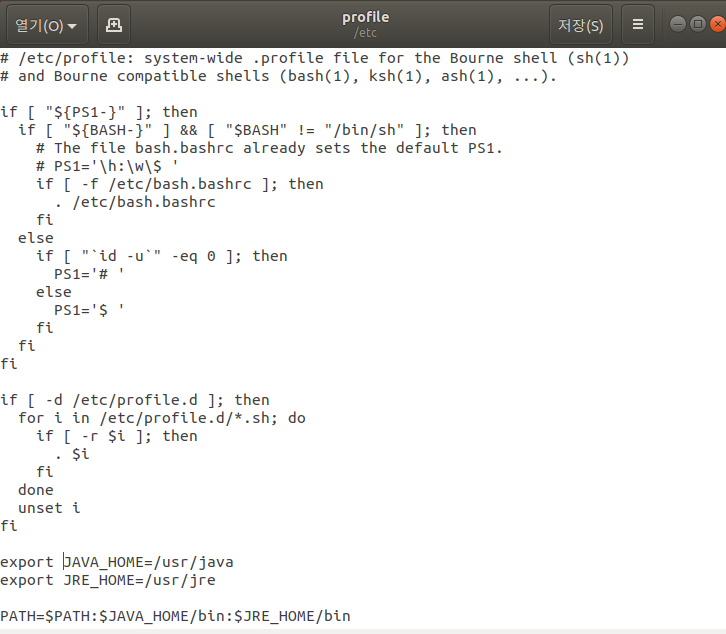

> worKer2 컴퓨터 생성

- 메모리 1024MB

> 톰캣 설치

- www.apache2.tomcat.com

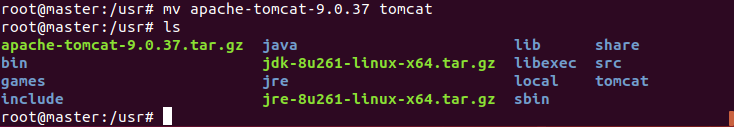

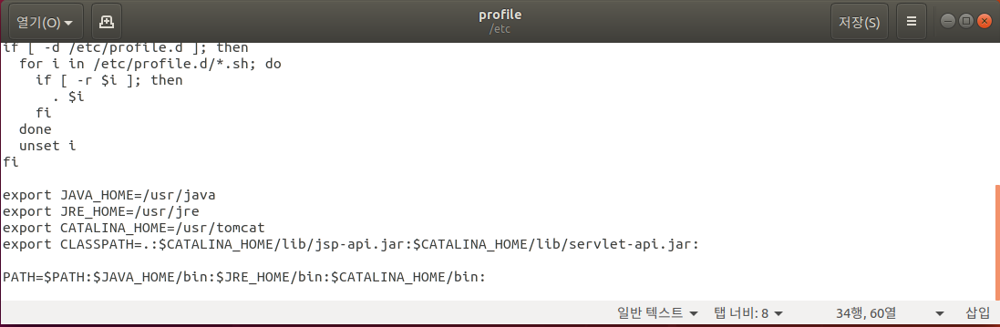

- 설정

- 설정확인 

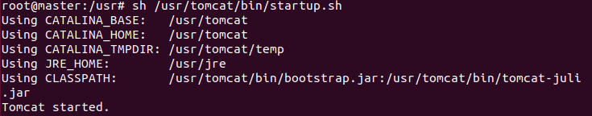

- 실행 확인

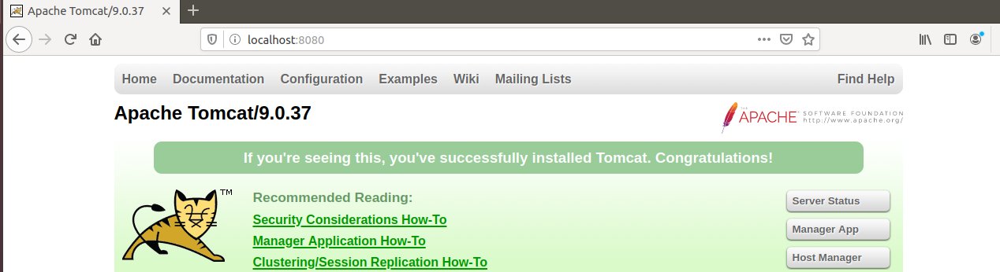

- 톰캣은  컴퓨터 끄면 서버가 꺼진다.

> 오라클 설치

- 오라클은 rpm 파일만 있으므로 deb파일로 바꿔야 리눅스에서 실행가능하다.
- 변환 프로그램 설치

- 압축풀기

- Disk1로 이동 : cd Disk1
- 변환

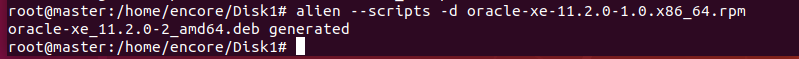

- 오라클 설치

- 8080포트는 톰캣이 사용중이므로 9000번 포트로 바꿈

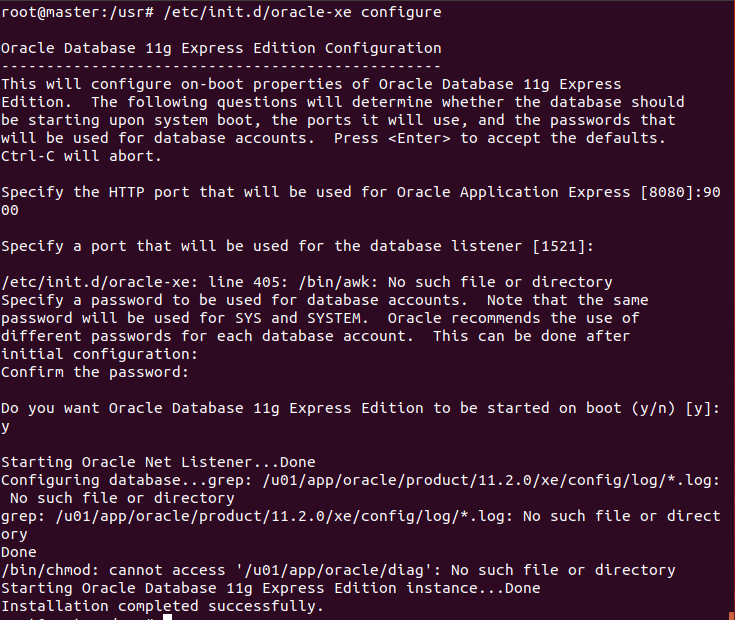

- 환경설정 자동 실행 설정
- 맨밑 추가

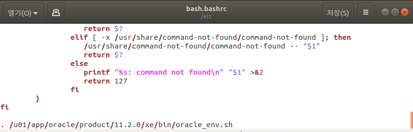

