> 오라클 설치

- 오라클 설치 후에는 hostname을 변경하면 동작 안함
- deb 파일로 변경 후 설치

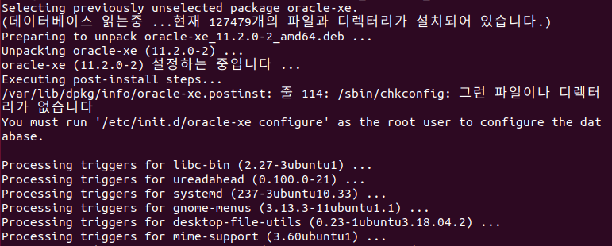

- 초기 설정

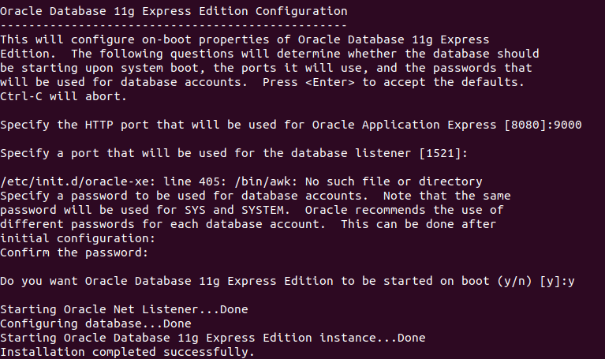

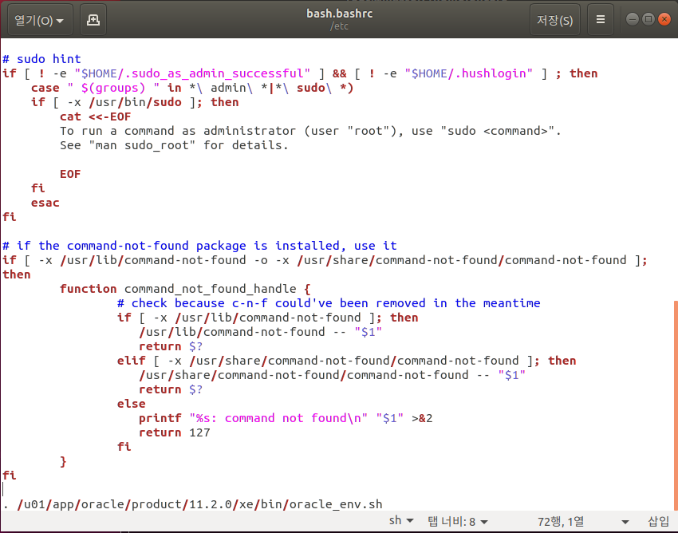

- 실행 확인

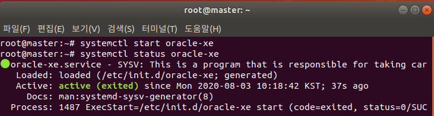

- 계정 생성 하기

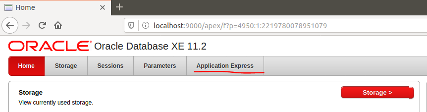

- 관리자 계정 로그인

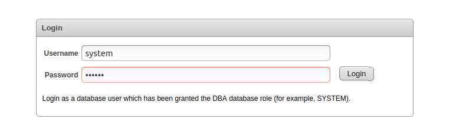

- 계정 생성

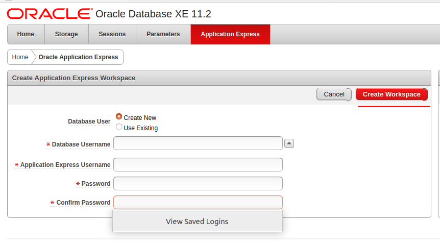

- 로그인 

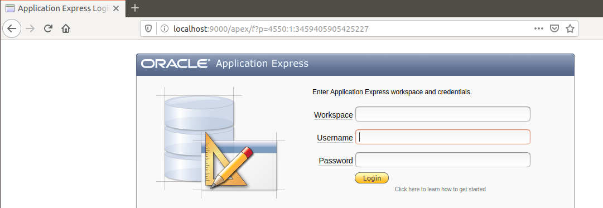

- db 테스트

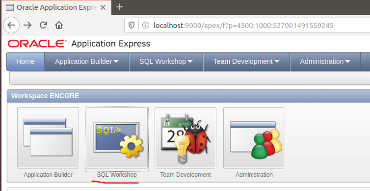

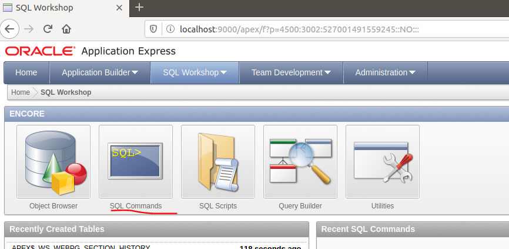

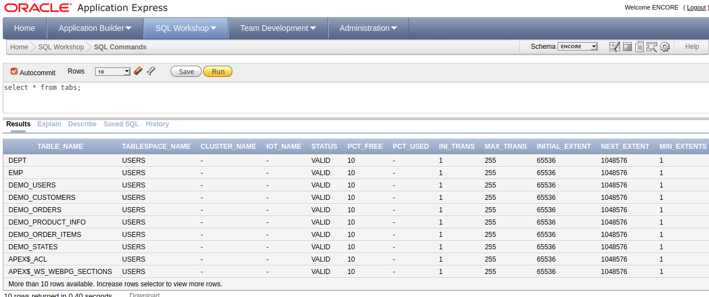

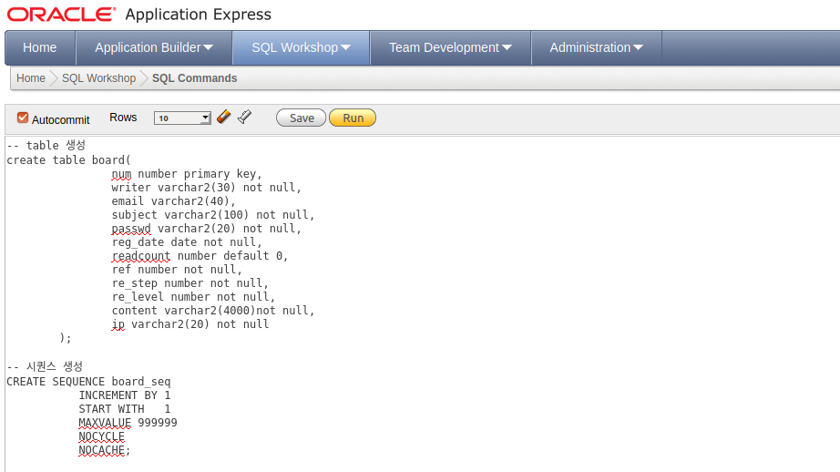

- 톰캣 실행

- 윈도우에서 했던 이전 프로젝트 실행하기

- war 파일은 samba 공유폴더에 복사

- tomcat / webapps 폴더에 복사

- tomcat restart

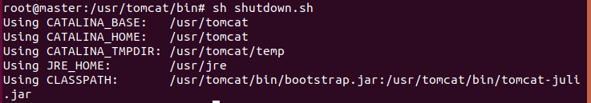

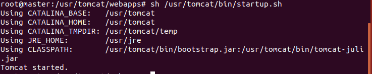

- 실행

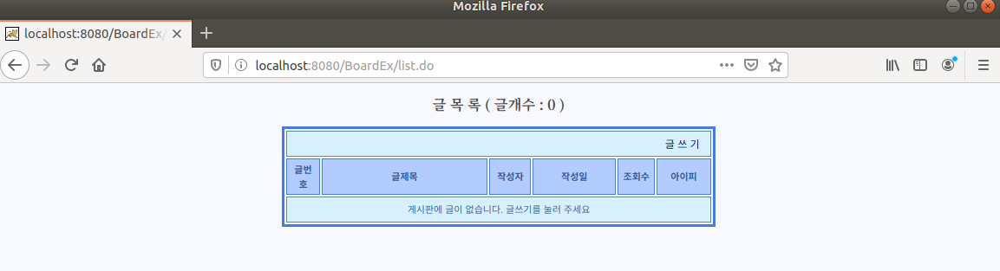

#### 7. Crond

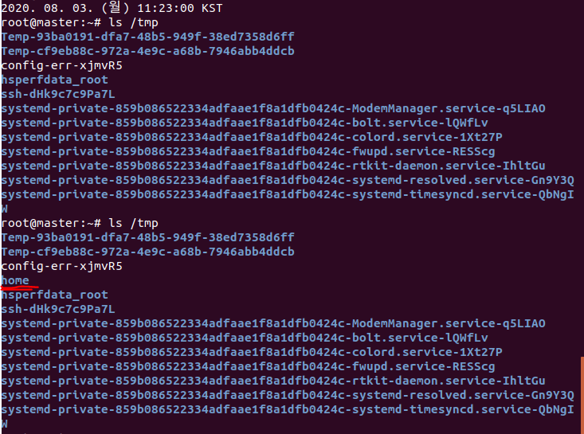

#### 8. Hadoop

- 하둡에 붙여서 쓰는 것 : 에코 시스템

- Single Node : Hadoop
- Single Node Cluster : NameNode, DataNode를 1대로 
- Multi Node Cluster : NameNode 1대, DataNode 3대
  - 짝수로 써야함

>Hadoop 설치

- https://hadoop.apache.org/releases.html

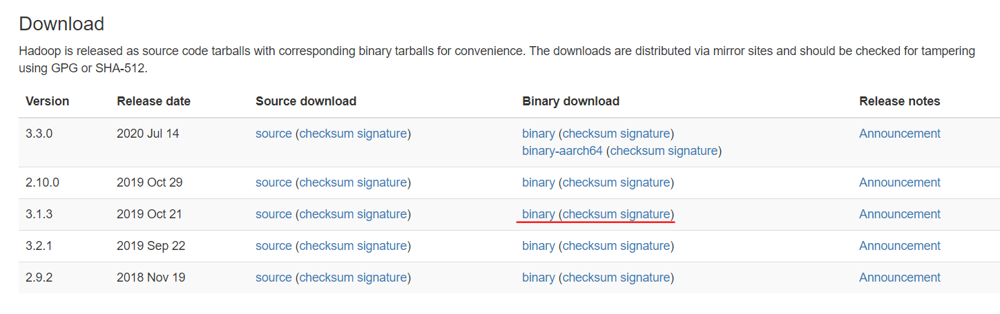

- 세팅 추가

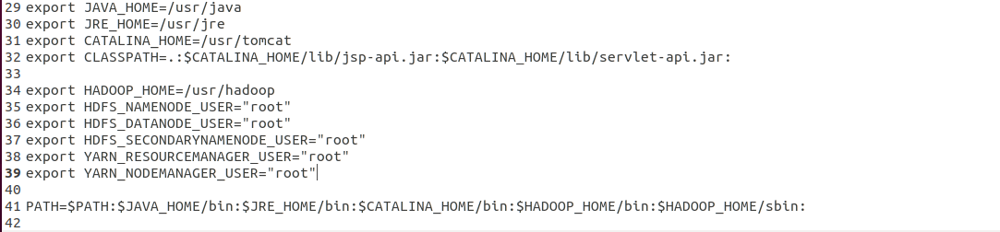

- 설치 확인

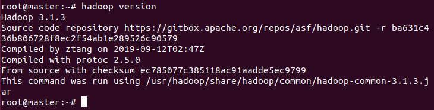

> Single Node 단독모드

- mapreduce

- wordcount 사용하기
- 단어 횟수 분석 

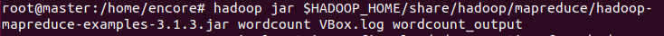

- 성공하면 _SUCCESS가 뜸

- 결과
- 결과 디렉터리가 있으면 에러가 나므로 같은 디렉토리를 쓰려면 삭제해야한다

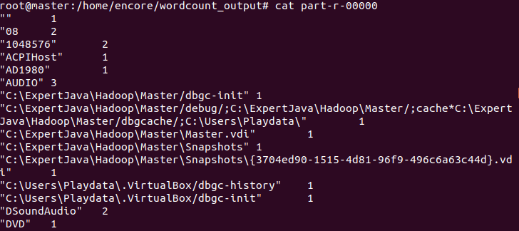

> Single Node Cluster 의사 분산 모드

- openssh 패키지 설치

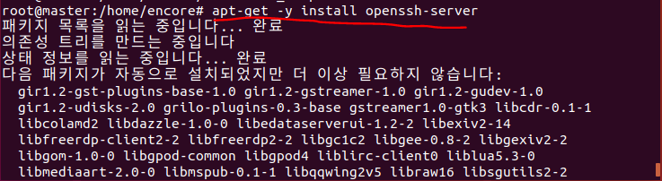

- key 생성

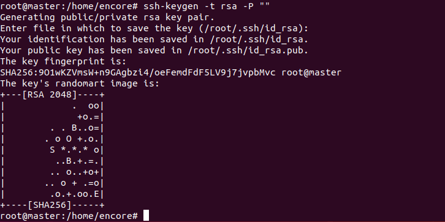

- 공개키를 ssh 인증키로 등록

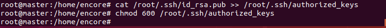

- 접속

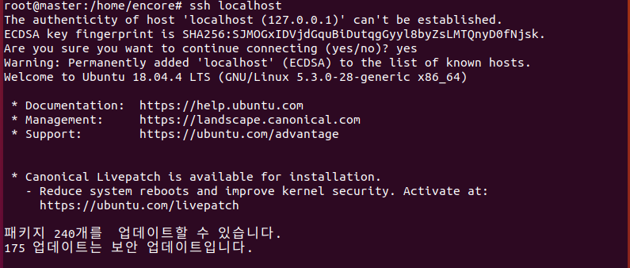

- 로그아웃(현재 세션을 나가야 작업 가능)

- 환경설정
- JAVA_HOME을 인식하지 못해서 써줘야 함

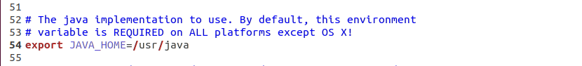

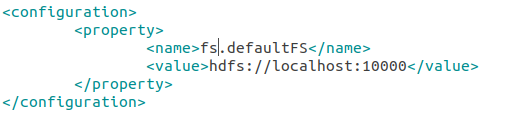

- 복제옵션
- 많으면 느려진다

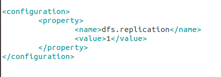

- 설정 변경 시 format 

- 실행 

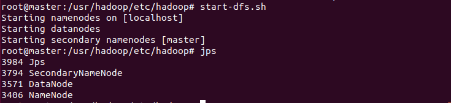

- 모니터링 (하둡 켠 상태로 실행)
- http://localhost:9870

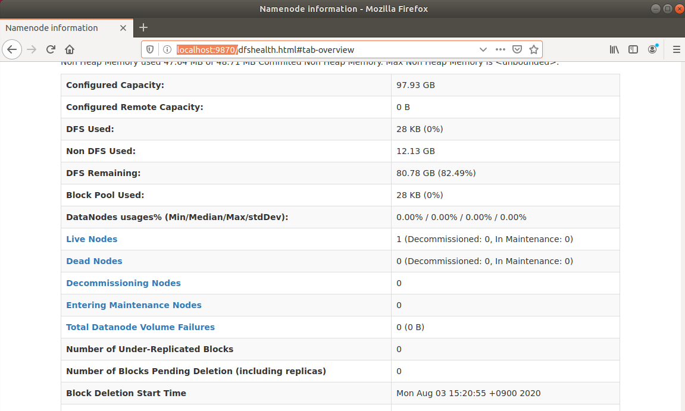

> Yarn 분산 환경 관리

- 실행

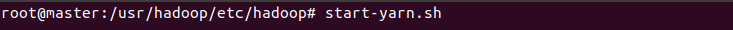

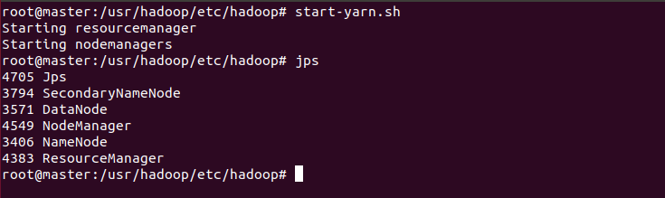

> 하둡 저장소

- 하둡 저장소에 분석 파일 넣음

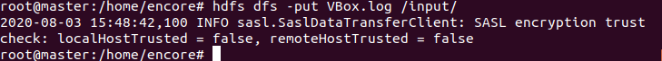

- 분석

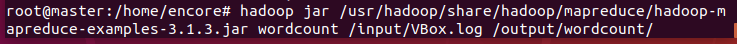

- 결과 확인

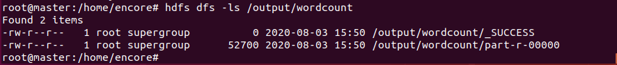

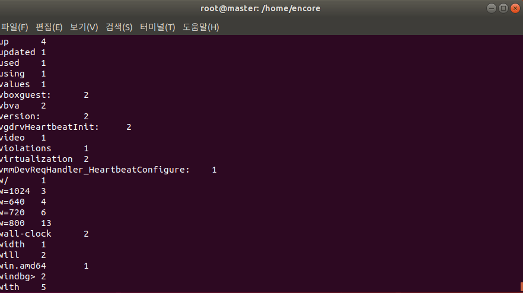

