## 0804(화)

#### Hadoop 설치

-------

> 완전 분산 모드 Multi Node Cluster 

- ping 보내기(안 될 경우 NAT 네트워크 확인)
  - master: ping -c 5 10.0.2.201 / ping -c 5 10.0.2.202
  - worker1: ping -c 5 10.0.2.100 / ping -c 5 10.0.2.202
  - worker2: ping -c 5 10.0.2.100 / ping -c 5 10.0.2.201

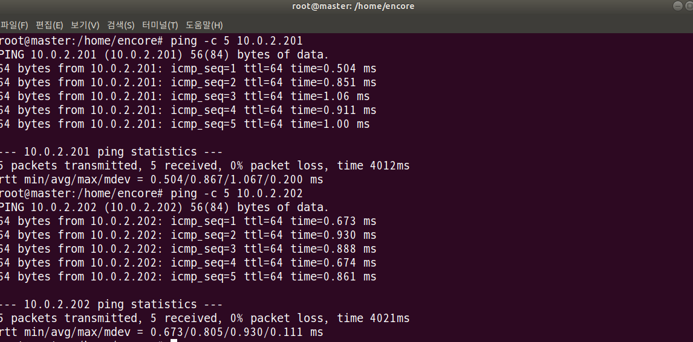

> 도메인 설정

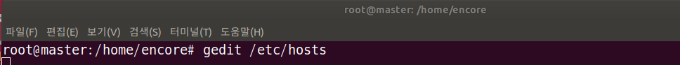

- master / worker1 / worker2 모두 적어줌(IP 직접 설정)

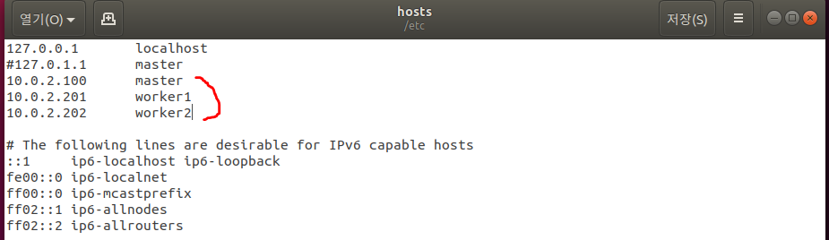

- 호스트 네임 설정

- 실행

- 호스트 네임 확인

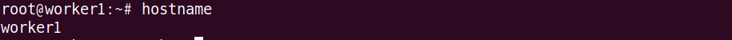

- reboot 후 한 번더 

- ping 확인

  - master: ping -c worker1 / ping -c 5 worker2
  - worker1: ping -c 5 master / ping -c 5 worker12
  - worker2: ping -c 5 master / ping -c 5 worker1

  

> NFS 재설정

<master>

- 추가

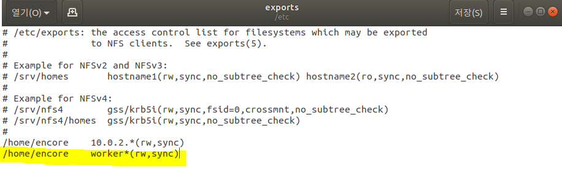

- 실행

<worker1>

- 파일 시스템 mount

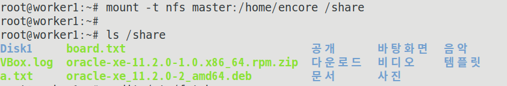

- 위의 내용을 영구적으로 저장

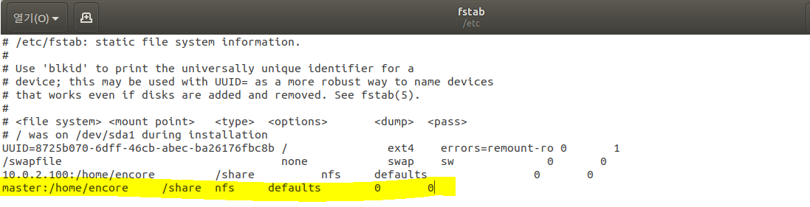

- reboot 실행 -> ls /share로 확인 

<worker2>

- worker1에서 수행한 것 똑같이 실행

> SSH 설정

<master> - > 모든 노드에서 실행 

- 수정

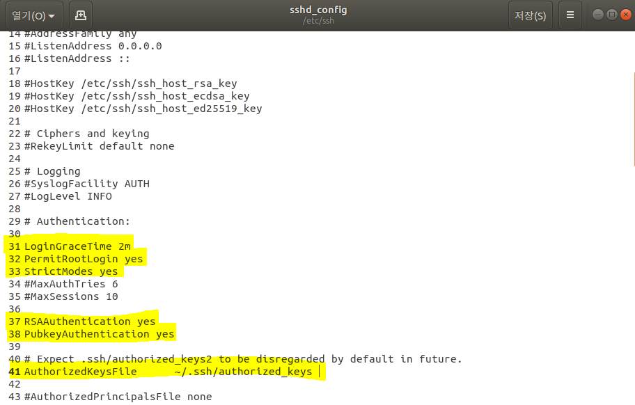

- 시스템 변경으로 restart

- 확인

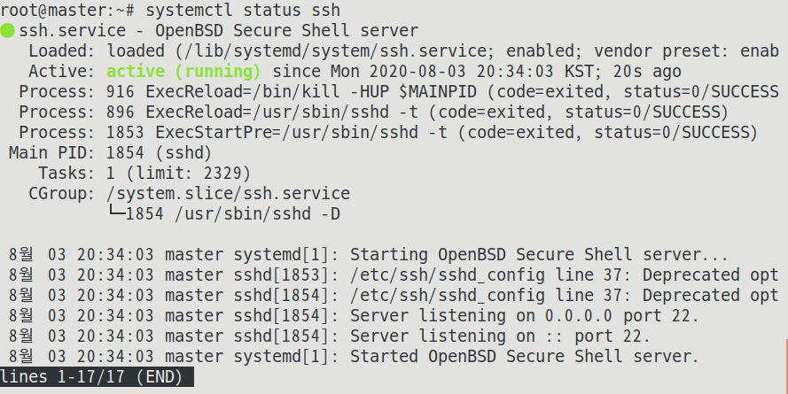

- 암호 설정(1234로 설정)

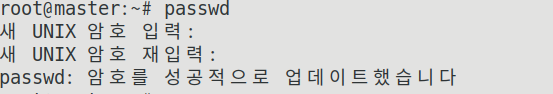

- 공유키 생성

 ->엔터 -> y 

- 공유키 읽기

- authorized key를 600으로 변경 

<worker1> & <worker2>

- SSH설치

- 위의 설정 반복

- authorized_keys 파일을 생성한 후 서로의 키를 복사한다

<master>

<worker1>

<worker2>

- SSH 추가 (모든 노드에서 실행)

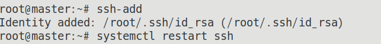

- SSH 로그인 확인 (모든 노드에서 실행 / 각각 접속 가능)
  - ssh master  / ssh worker1 / ssh worker2 
  - exit 로 나와야함

> 하둡 설정 

<master>

- 

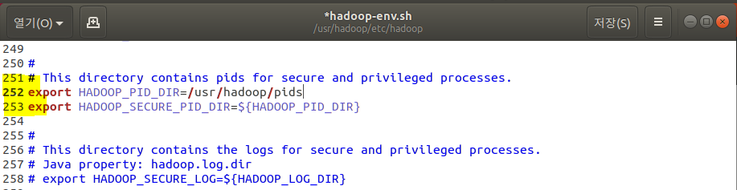

- xml 파일 localhost를 master로 수정 

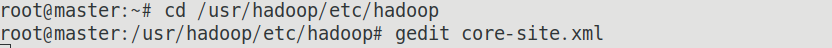

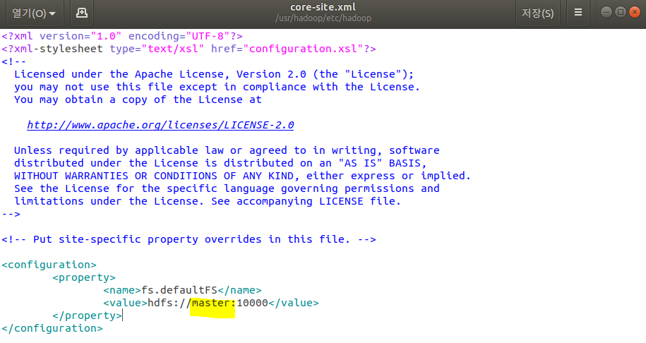

<worker1> & <worker2>

- Hadoop 설치(드라이브에 hadoop파일)

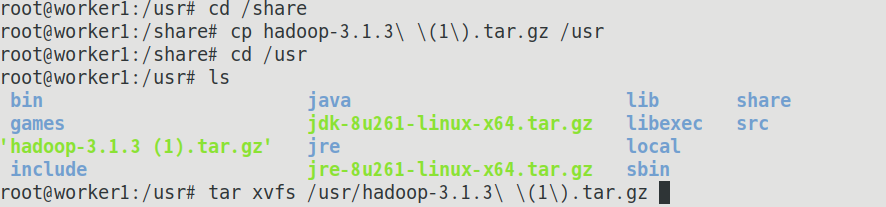

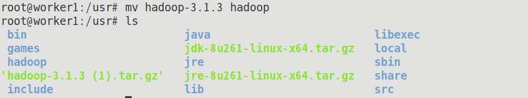

- 

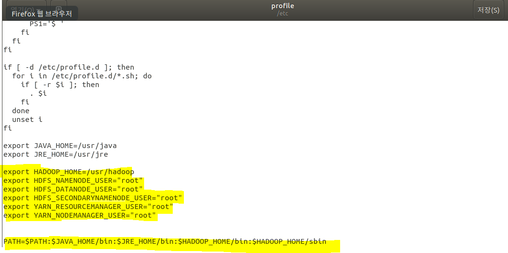

- 

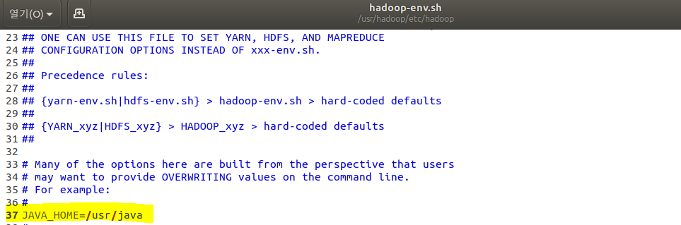

- 

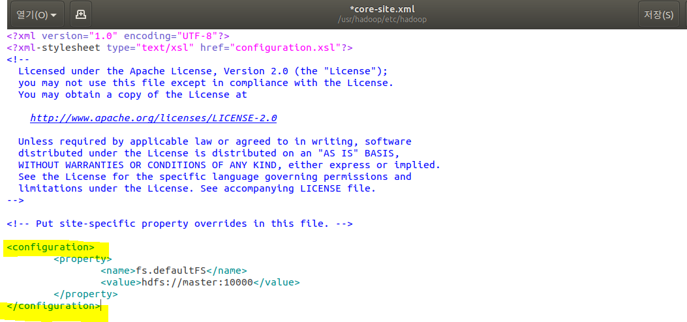

- reboot
- 설치 확인(하둡 버전 확인)

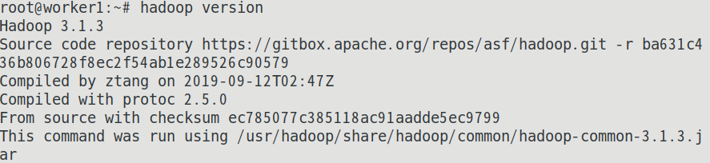

- 마스터 노드는 datanode는 안 만드는 것이 부하가 적게 걸린다.

<master>

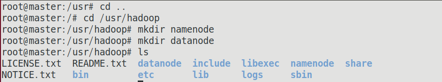

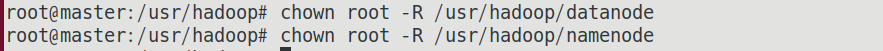

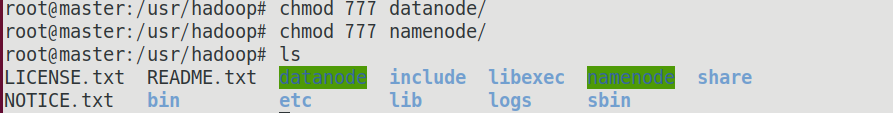

<worker1> & <worker2>

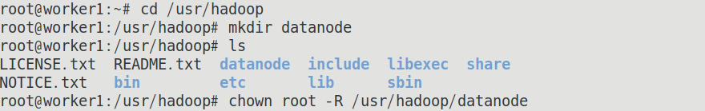

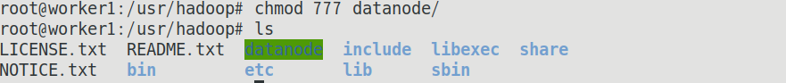

- 

<master>

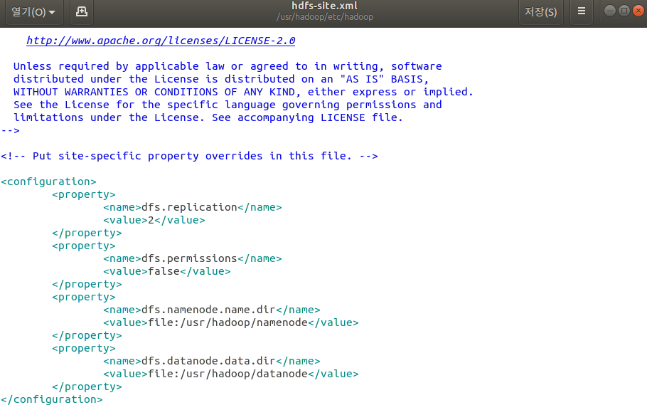

<worker1> & <worker2>

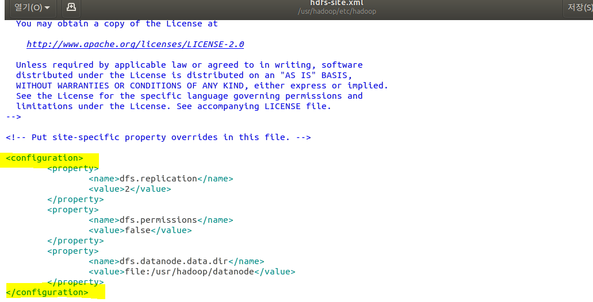

- 모든 노드에 실행 

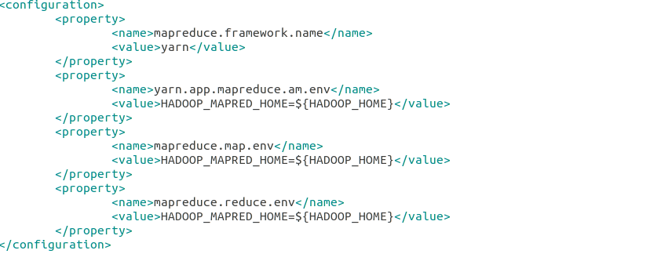

- 모든 노드에 실행

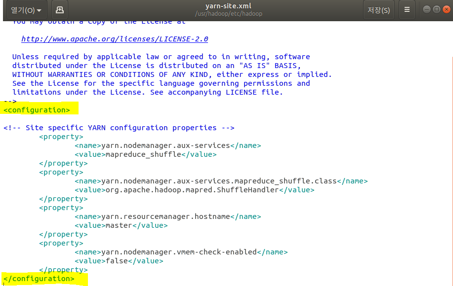

- 모든 노드에 master, worker1,2 노드 이름 설정

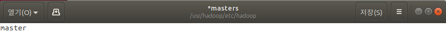

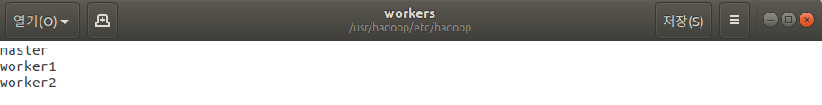

- 권한 설정(모든 노드)

- 포맷 전에 하둡을 stop

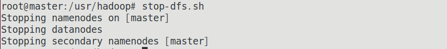

- 만약 DataNode가 올라오지 않을 경우

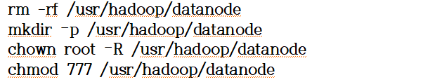

- 포맷 

- 확인

<master>

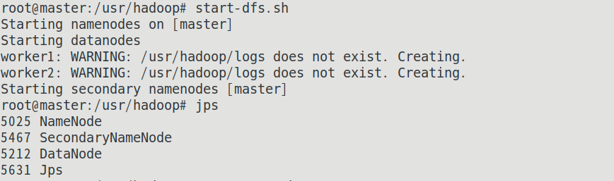

<worker1> & <worker2>

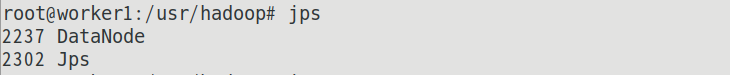

2)

<master>

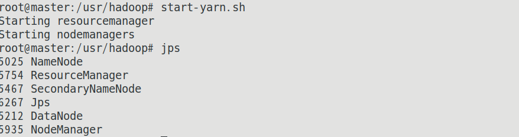

<worker1> & <worker2>

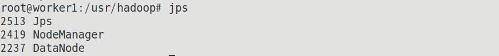