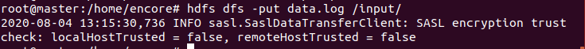

## 0805(수) 

- 분석 예제

- 하둡 안에 input , output 폴더 생성

- 분석 데이터 input에 올림
- 하둡은 대량의 데이터 분석에 적합, 소량의 데이터 분석은 오히려 느릴 수 있다.

- 확인

- wordcount 분석

- 결과 확인

- 폴더로 결과 복사
- 같은 폴더 이름이 있으면 분석하지 않고 종료 하므로 결과파일을 복사하고 하둡의 output/wordcount 폴더는 지운다

- 에러 발생 시

- start-yarn.sh 로 실행하면 오류발생
- yarn을 다음과 같이 실행하면 해결

#### YARN

-------

> Yet Another Resource Negotiator

- 하둡2에서 처음 도입된 클러스터 자원 관리 시스템
- 맵리듀스뿐만이 아닌 다른 분산 컴퓨팅 도구도 지원한다.

-------------

#### Hadoop IO (23p)

-----------

>Writable 구현 클래스

- 문자열 관리 : text 
- char는 IntWritable로 대체 가능하다.

> Writable 컬렉션

------------------

#### 맵리듀스

--------

- 대용량 데이터 처리를 위한 분산 프로그래밍 모델
- 타고난 병행성(병렬 처리 지원)을 내포
- 흩어져 있는 데이터를 수직화하여, 그 데이터를 각각의 종류 별로 모으고(Map), Fultering과 Sorting을 거쳐 데이터를 뽑아내는(Reduce) 분산처리 기술과 관련 프레임 워크를 의미

> 장점과 단점

> MapReduce 실행과정

> Host Eclipse에 jar 파일 추가

- 이클립스를 Hadoop 폴더에 이동
- workspace : Hadoop
- file - new - other - java project - 이름: HadoopEx 
- 폴더 추가 : libs
- master에서

- jar 파일 eclipse에 추가

- libs에 jar 파일 12개 붙여넣기 

HadoopEx 오른쪽 마우스 -> Properties -> build path -> libraries -> add external JARs... ->libs 폴더의 모든 jar파일 선택

- 참조하는 라이브러리 생성이 됨 

- src 폴더에 class, package 추가

- MyMapper.java 

- MyReducer.java

- WordCount.java

- 

- jar파일 이동

<master>

- jar파일 존재 확인

- wordcount 삭제 (폴더가 존재하면 분석이 안 됨)

- 분석

- 분석 결과 확인

--------

#### NCDC 기상 데이터 분석

--------

- 데이터 가져오기
- combine.sh

- 하둡 내 noaa 폴더 생성 & 확인

- 수만 개의 기상관측소의 데이터는 작은 파일로 대량이다.
- 다수의 파일을 연도를 기준으로 하나의 파일로 병합

- 확인

